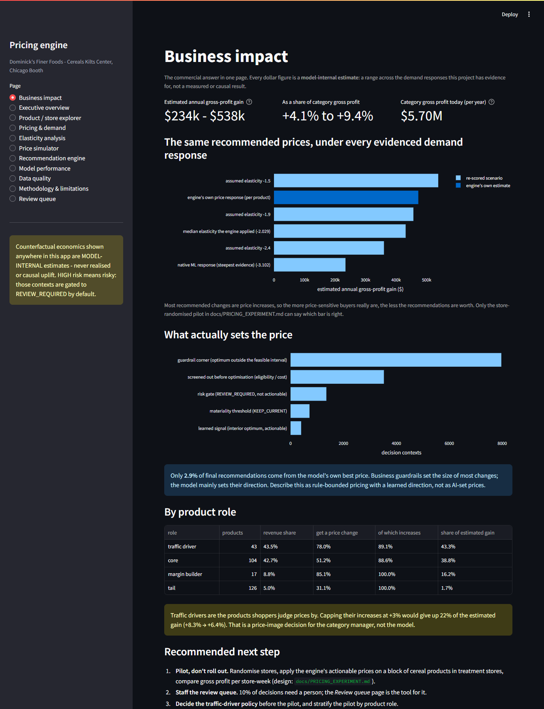
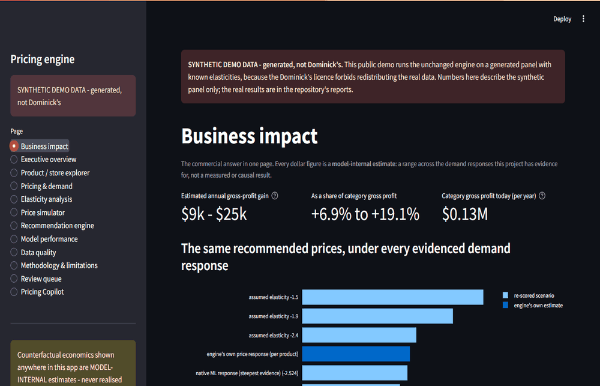

# AI Pricing & Revenue Optimization Engine

[](https://github.com/iliass-Ait-Ali/pricing-engine/actions/workflows/ci.yml)

**What price should a grocer charge for each product, in each store, this week,
to earn more gross profit without taking risks it cannot defend?** This project
answers that end to end on **real retail scanner data**: the Dominick's Finer
Foods cereal panel (93 stores, 489 products, 1989-1997, Kilts Center, Chicago
Booth).



## In two minutes

* **The answer.** Applying the engine's recommendations is plausibly worth
  **+4.1% to +9.4%** of category gross profit (**$234k to $538k a year**
  across 93 stores). That is a *model-internal estimate*: the range spans every
  demand response the data supports, and only a store-randomised pilot can
  narrow it. [`reports/23_BUSINESS_VALUE.md`](reports/23_BUSINESS_VALUE.md)
* **The finding.** Business guardrails, not the model, set the size of most
  price changes: only **2.9%** of final recommendations come from the model's
  own best price. This is **rule-bounded pricing with a learned direction**,
  and it is described that way everywhere.
  [`reports/11_CONSTRAINT_ATTRIBUTION.md`](reports/11_CONSTRAINT_ATTRIBUTION.md)
* **The decision for a category manager.** Traffic-driver products (43.5% of
  revenue) get the most price increases. Capping them at +3% gives up 22% of
  the estimated gain. [`reports/24_PRODUCT_ROLES.md`](reports/24_PRODUCT_ROLES.md)
* **The check you can't do on real data.** On synthetic panels with known
  elasticities, the unchanged engine recovers the truth when the data are
  clean. It cannot remove unrecorded promotions or pricing on unseen demand
  shocks, which is why the next step is a pilot.
  [`reports/25_GROUND_TRUTH_STUDY.md`](reports/25_GROUND_TRUTH_STUDY.md)
* **A GenAI layer that cannot invent a number.** An OpenAI tool-calling
  copilot answers questions by calling the engine; a deterministic guard
  rejects any figure the engine did not return.
  [`docs/COPILOT_CARD.md`](docs/COPILOT_CARD.md)
* **Why trust it.** Strict chronological validation, leakage tests, robust
  standard errors, out-of-time checks on 154,899 unseen price changes, a claim
  audit that fails the build on any unsupported claim, and an explicit list of
  what the data cannot prove ([`KNOWN_LIMITATIONS.md`](KNOWN_LIMITATIONS.md)).

| for | start here |
| --- | --- |
| a business reader | [`docs/EXECUTIVE_SUMMARY.md`](docs/EXECUTIVE_SUMMARY.md) |
| a data scientist | section 2 below, then [`docs/PRICING_SCIENCE.md`](docs/PRICING_SCIENCE.md) and `reports/11`-`reports/20` |
| an engineer | [`docs/TECHNICAL_DESIGN.md`](docs/TECHNICAL_DESIGN.md) and the demo below |

### Try it: public demo on synthetic data

The Dominick's licence forbids redistributing the data, so the public demo runs
the **same code** on a generated panel with known elasticities, clearly
labelled as synthetic everywhere:

```bash
docker build -f Dockerfile.demo -t pricing-engine-demo .
docker run --rm -p 7860:7860 pricing-engine-demo
# dashboard: http://localhost:7860    API docs: http://localhost:7860/api/docs
```

or without Docker: `python scripts/make_demo.py`, then
`PRICING_ENGINE_CONFIG=configs/demo.yaml streamlit run dashboard/app.py`.



*The synthetic demo: business impact, one recommendation, the price simulator,
the review queue and the copilot page.*

Every number in this README was produced by running the pipeline on the real
data. Nothing is hardcoded, and every counterfactual figure is labelled a
**model-internal estimate**: demand at prices that were never charged was never
observed, and the same fitted price-response model both proposes and scores
candidate prices.

---

## 1. What it does

```text
official Kilts Center files
  -> validated canonical panel (4,707,776 UPC x store x week rows)
  -> pricing EDA + price-variation eligibility screen
  -> observational elasticity analysis (naive vs fixed effects)
  -> demand models on a strict chronological split
  -> price-response validation (does the model actually respond to price?)
  -> vectorised counterfactual price simulation (cost held fixed)
  -> constrained optimization with reason codes and a risk layer
  -> offline policy backtest
  -> FastAPI service + 12-page Streamlit dashboard
  -> hybrid elasticity price response + risk gating (Phase L)
  -> tests, lint, Docker image, CI (counts in section 2)
```

## 2. Headline results (generated, not hand-copied)

Every number in the block below is written by
`python scripts/update_readme_metrics.py` directly from the generated
artifacts, and `tests/test_readme_metrics.py` fails if the block and the
artifacts ever disagree. The source-of-truth file is named above each table.

<!-- BEGIN GENERATED METRICS -->

<!-- Written by scripts/update_readme_metrics.py from the generated
     artifacts. Do not edit by hand: tests/test_readme_metrics.py fails
     when this block and the artifacts disagree. -->

**Data** — source of truth: `artifacts/metrics/build_audit.json`, `artifacts/metrics/dataset_fingerprint.json`, `artifacts/metrics/eda_summary.json`, `artifacts/metrics/data_validation.json`

| metric | value |
| --- | --- |
| raw rows → canonical rows | 6,602,582 → 4,707,776 |
| excluded | `ok_flag_zero`: 141,285 (2.14%); `non_positive_price`: 1,753,521 (26.56%) |
| coverage | 489 UPCs × 93 stores × 366 weeks, 1989-09-14 .. 1997-05-01 |
| observed revenue / gross profit | $262,008,582 / $40,091,143 (15.30%) |
| formula + structural checks | 15 / 15 pass |
| dataset SHA-256 (parquet) | `51f9148bd3955129…` |

**Demand model** — source of truth: `artifacts/metrics/model_metrics.json + evaluation.json`

| metric | value |
| --- | --- |
| selected model | **M1 ridge log-log** (`ridge_loglog-20260818-132847`) |
| chronological split | train 2-257, validation 258-342, test 343-399 |
| validation WAPE | **0.4135** |
| test WAPE | **0.4565** (MAE 8.503, RMSE 72.064) |

| model | validation WAPE | test WAPE |
| --- | --- | --- |
| M0a last-week naive | 0.8007 | 0.7735 |
| M0b rolling-mean(4) naive | 0.7471 | 0.7326 |
| M0c series historical mean | 0.7607 | 0.7441 |
| M0d seasonal naive (52w) | 0.7920 | 0.8207 |
| **M1 ridge log-log (selected)** | **0.4135** | **0.4565** |
| M2 HGB poisson | 0.4226 |  |

Native ML price-response validation on 300 decision contexts (`artifacts/metrics/price_response.json`): 100% monotone decreasing demand curves, 0% flat, 0% negative predictions, median implied elasticity **-3.10** - steeper than the controlled econometric estimate, which is why the optimizer is deliberately conservative.

**Price response** — source of truth: `artifacts/metrics/elasticity_estimation.json`, `artifacts/metrics/elasticity_funnel.json`, `artifacts/metrics/out_of_time_price_response.json`

| specification (`artifacts/metrics/elasticity.json`) | elasticity |
| --- | --- |
| naive pooled | **-0.348** |
| + UPC fixed effects | **-2.289** |
| + UPC x store fixed effects | **-2.419** |
| + promo + seasonality + trend | **-1.909** |

| metric | value |
| --- | --- |
| pooled controlled elasticity (training weeks only) | **-2.029** |
| two-way clustered (UPC, week) 95% CI | [-2.236, -1.821] |
| UPC × store fixed-effects specification | -2.222 |
| products with a usable own estimate | 239 of 372 (489 UPCs entered the funnel) |
| empirical-Bayes τ² (REML) | 0.766 |
| mean shrinkage weight | 0.78 |
| out-of-time price-change episodes (weeks 258-399) | 154,899 |
| observed implied elasticity out of time (all / no recorded promotion) | -2.45 / -1.86 |
| WAPE on those episodes: null / pooled / shrunk / native ML | 0.8086 / 0.6249 / 0.5853 / 0.6042 |

**Recommendations** — source of truth: `artifacts/metrics/recommendations.json` (decision week 399, `standard` profile, `shrunk` price response, 3,000 contexts)

| metric | value |
| --- | --- |
| `RECOMMEND_CHANGE` (actionable) | **58.9%** |
| `REVIEW_REQUIRED` (escalated to a human) | 10.4% |
| `KEEP_CURRENT` | 30.8% |
| median absolute price change (actionable) | 8.4% |
| HIGH-risk contexts that auto-changed a price | **0** of 1,039 |
| elasticity provenance | shrunk_product 1,904, pooled_fallback 1,096 |

**What actually decides the price** — source of truth: `artifacts/metrics/constraint_attribution.json` (all 13,964 contexts of week 399)

| metric | value |
| --- | --- |
| final recommendations set by an interior learned optimum | **2.9%** (400 contexts) |
| set by a guardrail corner | 57.1% |
| screened out before optimisation | 25.3% |
| risk-gated / below materiality | 9.7% / 5.1% |
| unconstrained optimum inside the feasible bounds | 6.9% |
| most frequently first-binding constraint | `MAX_PRICE_CHANGE` (44.6% of contexts) |

**Offline policy backtest** — source of truth: `artifacts/metrics/backtest.json` (weeks 390-399, `standard` profile)

| metric | value |
| --- | --- |
| mean weekly WAPE | 0.4777 |
| ElasticityBaselinePolicy: model-internal estimated gross profit vs historical pricing | +13.68% (prices unchanged 6.4%) |
| MLPricingPolicy: model-internal estimated gross profit vs historical pricing | +10.45% (prices unchanged 36.9%) |
| SimpleMarginPolicy: model-internal estimated gross profit vs historical pricing | +2.30% (prices unchanged 0.0%) |

**Engineering** — source of truth: `artifacts/metrics/test_suite.json`, `artifacts/metrics/batch_performance.json`

| metric | value |
| --- | --- |
| tests collected | **626** |
| batch scoring, 3,000 contexts | per-context loop 122.0s → vectorised **2.4s** (50× on this machine) |
| batch equivalence (discrete fields exact, floats ≤ 1e-09) | PASS on 3,000 recommendations |

<!-- END GENERATED METRICS -->

### What those numbers mean

Per-UPC elasticity estimates are noisy and sometimes wrong-signed: 5.1% of UPCs
show a *significant positive* price coefficient - evidence of endogeneity, not
of upward-sloping demand. That is why per-product estimates are screened and
shrunk toward the pooled estimate rather than used raw
(`reports/18_ELASTICITY_ELIGIBILITY_FUNNEL.md`).

Phase M replaced the HC1 standard errors used in Phase L with panel-robust
(store/week-clustered) ones. That widened the pooled interval by a factor of 16
and moved the mean shrinkage weight from 0.95 to 0.78. See
`reports/14_SHRINKAGE_AUDIT.md` and `reports/15_ELASTICITY_INFERENCE_AUDIT.md`.

The attribution table above is the project's central scientific finding: this
is a **rule-bounded pricing system with a learned price-response direction**,
not an autonomous ML pricing system. It is described that way throughout, and
the rule-only benchmark policies are reported next to the ML policy rather than
hidden (`reports/12_MODEL_VALUE_ABLATION.md`).

Every uplift figure above is a **model-internal estimate**: the same fitted
price-response model both proposes and scores candidate prices, so it is an
offline simulation, never a realised or causal gain.

## 3. Example recommendation (real context, from `make demo`)

```text
product      : CAPN CRUNCH JUMBO CR (3000006560), store 86, week 399 (1997-05-01)
current price: $3.35     decision-time unit cost (lagged AAC): $2.56
price support: $1.50 .. $3.79 over 359 weeks, 56 distinct prices
price response: shrunk | elasticity -2.940 (shrunk_product; raw -3.018, EB weight 0.921)
feasible range (standard profile): $3.02 .. $3.69
proposed     : $3.66  (+9.25%)   decision state: RECOMMEND_CHANGE (actionable)
predicted units      : 25.56 -> 19.71
expected revenue     : $85.64 -> $72.13
expected gross profit: $20.27 -> $21.74
MODEL-INTERNAL estimated profit uplift: +7.23%  (internal simulation; not realised, not causal)
risk level   : LOW   (HIGH = risky, and HIGH is gated by default)
reason codes : PRICE_CHANGE_LIMIT, PROFIT_UPLIFT_POSITIVE
```

## 4. The equations

```text
effective_unit_price = price / qty
revenue              = effective_unit_price * move
gross_margin_rate    = profit / 100
estimated_unit_aac   = effective_unit_price * (1 - gross_margin_rate)
gross_profit         = revenue * gross_margin_rate

demand        Q = f(P, X)
revenue       R(P) = P * Q(P)
gross profit  GP(P) = (P - C) * Q(P)
elasticity    E = dlogQ / dlogP

analytical optima for Q = a - b P:
  profit  P* = (a + b C) / (2 b)      revenue  P* = a / (2 b)

price response used for counterfactuals (Phase L hybrid):
  Q(p) = Q_hat(p0) * (p / p0) ** epsilon
```

`estimated_unit_aac` is an **Average Acquisition Cost** implied by the
accounting margin - not necessarily the economically relevant replacement cost.
It is never renamed to a generic "true cost".

## 5. Architecture

```text
src/pricing_engine/
  config.py     configs/config.yaml is the single source of every threshold
  data/         schema, loader, cleaning, validator
  economics/    revenue/margin primitives, arc + log-log elasticity
  features/     decision-time feature contract, one price-feature implementation
  models/       baselines, ridge log-log, HGB Poisson, metrics
  simulation/   price grid, counterfactual scoring, curve diagnostics
  optimization/ objective, constraints, risk, optimizer, policies
  monitoring/   schema / drift / prediction / performance checks
  audit.py      append-only recommendation log with lifecycle states
api/            FastAPI (health, model info, predict, simulate, recommend)
dashboard/      Streamlit, 12 pages
scripts/        one CLI per pipeline stage
tests/          the test suite (count in section 2)
```

See `docs/TECHNICAL_DESIGN.md`.

## 6. Guardrails and reason codes

Constraints are intersected into one feasible interval: absolute price bounds,
price >= cost (unless loss-leading is explicitly enabled), minimum gross
margin, maximum change from the current price, and an extrapolation guardrail
keeping candidates inside the series' observed price support (expanded by a
configured tolerance). Below the materiality threshold the engine returns
`KEEP_CURRENT`.

Decision states: **RECOMMEND_CHANGE** (actionable), **KEEP_CURRENT**,
**REVIEW_REQUIRED** (a proposal a human must approve). A HIGH-risk context is
never actionable under the default profiles; only the explicitly labelled DEMO
`aggressive` profile can override that.

Reason codes: `KEEP_CURRENT_OPTIMAL`, `LOW_CONFIDENCE`, `INSUFFICIENT_HISTORY`,
`INSUFFICIENT_PRICE_VARIATION`, `OUTSIDE_EXTRAPOLATION_RANGE`,
`COST_UNAVAILABLE`, `MARGIN_CONSTRAINT`, `PRICE_CHANGE_LIMIT`,
`PROFIT_UPLIFT_POSITIVE`, `REVENUE_UPLIFT_POSITIVE`, `NO_FEASIBLE_PRICE`,
`NON_MATERIAL_UPLIFT`, `DEMAND_CURVE_NOT_DECREASING`,
`HIGH_RISK_REVIEW_REQUIRED`, `HIGH_RISK_KEEP_CURRENT`,
`MEDIUM_RISK_CONSERVATIVE`, `POOLED_ELASTICITY_FALLBACK`.

## 7. Getting the data (official sources only)

The Dominick's data are provided by the **Kilts Center for Marketing,
University of Chicago Booth School of Business** for **academic research**, and
users are asked to acknowledge the Kilts Center in publications. Raw and
processed data are git-ignored and never redistributed here.

```bash
python scripts/download_dominicks.py     # official chicagobooth.edu URLs only
```

Downloads `upccer.csv` and `wcer.zip`, extracts the movement CSV safely
(zip-slip guarded), and writes `SOURCE.json` with URLs, sizes, SHA-256 hashes
and timestamps. If the network blocks it, the script prints exact manual
instructions and marks acquisition **BLOCKED** - it never substitutes synthetic
or mirrored data. See `docs/DATA_SOURCE.md`.

## 8. Install and run

```bash
python -m pip install -e ".[api,dashboard,dev]"     # Python 3.11+

make data            # download + build canonical parquet + data audit
make validate        # 15 formula / structural checks
make features        # modelling table with decision-time guarantees
make eda             # reports/02 + figures
make elasticity      # reports/03
make train           # model comparison, saves artifacts/models/demand_model.joblib
make evaluate        # re-score the saved artifact on the test window
make price-response  # reports/05 - native ML price-response validation
make estimate-elasticity  # fit the pricing elasticity table (training weeks only)
make compare-response     # reports/08 - ml vs pooled vs shrunk + sensitivity
make optimize        # batch recommendations + audit log
make backtest        # reports/06 policy comparison
make monitor         # drift / schema / performance
make audit-zero-price     # reports/09 - the price = 0 exclusion, evidenced
make audit-cost           # reports/10 - decision-time cost leakage proof
make audit                # reports/11-20 - the full Phase M scientific audit
make demo            # end-to-end on one real UPC x store
make test lint       # pytest + ruff (counts in section 2)
make api             # http://127.0.0.1:8000/docs
make dashboard       # Streamlit
```

Or `make all` for the whole pipeline.

### API

```bash
curl -X POST localhost:8000/recommend-price \
  -H "content-type: application/json" \
  -d '{"upc": 1600062680, "store": 2, "objective": "gross_profit", "policy_profile": "standard"}'
```

Endpoints: `GET /health`, `GET /model/info`, `POST /predict-demand`,
`POST /simulate-prices`, `POST /recommend-price`. The model is loaded once at
startup.

### Dashboard

Twelve pages: business impact, executive overview, product/store explorer,
pricing & demand, elasticity, price simulator, recommendation engine, model
performance, data quality, methodology & limitations, review queue, and the
Pricing Copilot (needs an OpenAI key; see `docs/COPILOT_CARD.md`).

## 9. Tests

```bash
pytest                                        # test count in section 2
ruff check .                                  # All checks passed
python scripts/update_readme_metrics.py --check   # README metrics are current
```

Coverage of the decision-critical paths: formula identities, exclusion rules,
metadata join, week decoding, downloader zip-slip safety, git-ignore of
licensed data, lag alignment and leakage (including a poisoning test),
price-feature recomputation, cost held fixed across the grid, analytical
optimizer optima, every constraint, materiality, rounding, missing cost, risk
levels, API contract and validation, drift metrics, and a full
raw -> processed -> features -> model -> simulation -> optimization integration
test on synthetic fixtures.

## 10. Limitations (read these)

* **No causal claim.** Prices were not randomised; all price effects are
  observational. `docs/CAUSAL_LIMITATIONS.md`.
* Uplift figures are **model-internal estimates**: the same fitted price
  response both proposes and scores the price - an internal simulation, not an
  unbiased policy value.
* The **native ML** implied elasticity (-3.10) is steeper than the controlled
  estimate (-1.91 to -2.42). Phase L made an elasticity hybrid the default and
  kept the native response as a benchmark (`reports/08`).
* Recommendations **depend on the price-response assumption**: ml vs pooled
  agree on the decision state only 79.7% of the time.
* The backtest is **circular**: the same model chooses and scores prices. Only
  demand accuracy is verifiable against outcomes.
* Promotion coding is incomplete; cross-price/substitution effects are not
  modelled; the data are from 1989-1997.
* Not production ready. The Docker image builds and serves `/health`,
  `/model/info` and a real recommendation locally (see
  `reports/21_FINAL_ENGINEERING_CLOSURE.md`); it is not hardened,
  load-tested or deployed anywhere.

Full list: `KNOWN_LIMITATIONS.md`. Experiment design that would settle the
causal question: `docs/PRICING_EXPERIMENT.md`.

## 11. Documentation map

| document | contents |
| --- | --- |
| `ROADMAP.md` / `STATUS.md` | phases, acceptance gates, current status + evidence |
| `DECISIONS.md` | 52 recorded decisions with alternatives and rationale |
| `KNOWN_LIMITATIONS.md` | scientific, modelling and engineering limits |
| `docs/DATA_SOURCE.md`, `docs/DATA_DICTIONARY.md` | provenance, licence, every column |
| `docs/PRICING_SCIENCE.md` | the economics, with worked consequences |
| `docs/FEATURE_AVAILABILITY.md`, `docs/DATA_LEAKAGE_AUDIT.md` | decision-time contract, 10 leakage channels + tests |
| `docs/CAUSAL_LIMITATIONS.md` | why nothing here is causal |
| `docs/MODEL_CARD.md`, `docs/METRICS.md` | model card, metric definitions |
| `docs/TECHNICAL_DESIGN.md` | architecture and design decisions |
| `docs/BUSINESS_CASE.md`, `docs/INTERVIEW_GUIDE.md` | business framing, 20 interview questions |
| `docs/INTERVIEW_RED_TEAM.md` | the 20 hardest questions, with what NOT to claim in each answer |
| `docs/RESPONSIBLE_PRICING.md`, `docs/PRICING_EXPERIMENT.md` | ethics, A/B design |
| `docs/USING_YOUR_OWN_DATA.md` | porting the engine to another panel |
| `reports/01..07`, `reports/MONITORING_DESIGN.md`, `reports/VALIDATION_SUMMARY.md` | generated analysis, all real numbers |
| `reports/08_PRICE_RESPONSE_COMPARISON.md` | ml vs pooled vs shrunk price response + elasticity sensitivity |
| `reports/09_ZERO_PRICE_AUDIT.md` | the price = 0 exclusion, investigated with evidence |
| `reports/10_COST_LEAKAGE_AUDIT.md` | proof that recommendations use only pre-decision cost |
| `reports/11_CONSTRAINT_ATTRIBUTION.md` | which constraint decides each recommendation, per context |
| `reports/12_MODEL_VALUE_ABLATION.md` | learned price response vs five rule-only policies |
| `reports/13_GUARDRAIL_ABLATION.md` | at what policy layer the pricing signal stops mattering |
| `reports/14_SHRINKAGE_AUDIT.md` | the empirical-Bayes estimator re-derived and corrected |
| `reports/15_ELASTICITY_INFERENCE_AUDIT.md` | conventional vs robust vs clustered standard errors |
| `reports/16_OUT_OF_TIME_PRICE_RESPONSE.md` | 154,899 unseen price-change episodes (naturalistic, not causal) |
| `reports/17_ELASTICITY_STABILITY.md` | elasticity across five historical windows |
| `reports/18_ELASTICITY_ELIGIBILITY_FUNNEL.md` | 489 UPCs -> 239 usable, every transition counted |
| `reports/19_DECISION_STATE_AUDIT.md` | decision-state invariants over every real context |
| `reports/20_CLAIM_AUDIT.md` | every claim in the repository, classified |
| `docs/EXECUTIVE_SUMMARY.md` | one page for a business reader: answer, value range, risks, next steps |
| `reports/23_BUSINESS_VALUE.md` | annual gross-profit value range across every evidenced elasticity |
| `reports/24_PRODUCT_ROLES.md` | traffic drivers, core, margin builders, tail: what the engine does to each |
| `reports/25_GROUND_TRUTH_STUDY.md` | the unchanged engine on synthetic panels with known elasticities: which confounders it removes |
| `reports/26_RISK_CALIBRATION.md` | do the risk bands track out-of-time prediction error? (weakly; extrapolation matters most) |
| `docs/COPILOT_CARD.md` | the LLM copilot: tools, the guard that rejects ungrounded numbers, known limits, evaluation |
| `docs/INTERVIEW_PITCH.md` | 30-second and 2-minute pitch, STAR stories, a mock case, CV lines |
| `reports/22_POST_FREEZE_ENGINEERING.md` | post-freeze (Phase O) engineering: review/approval workflow, monitoring history + local alerts, batch scale sweep - no science changed |

## 12. Attribution

Data: **Dominick's Finer Foods** store-level scanner data, provided by the
**Kilts Center for Marketing, University of Chicago Booth School of Business**
(<https://www.chicagobooth.edu/research/kilts/research-data/dominicks>). Used
for academic research; not redistributed in this repository.
