# AI Pricing & Revenue Optimization Engine — Full Technical Report

**Dominick's Finer Foods Cereals scanner panel · Kilts Center, University of Chicago Booth**

| | |
| --- | --- |
| Report version | 1.0 |
| Report generated | 2026-08-19 |
| Repository state at report time | `master`, **no commits yet** (working tree only — see §81) |
| Pipeline artifacts dated | 2026-08-18 (full `make all` run) |
| Verification re-run for this report | test suite, lint, `run_demo.py`, live FastAPI service, live Streamlit dashboard, all report figures — 2026-08-19 |
| Environment | Windows 11 (10.0.26200), Python 3.13.0, pandas 2.2.3, numpy 2.0.2, scikit-learn 1.8.0, statsmodels 0.14.6 |
| Post-freeze engineering addendum | Phase O (review/approval workflow, monitoring history + local alerting, batch scale harness) added **Thursday, 2026-08-27** — no change to the scientific findings above; see §120 and `reports/22_POST_FREEZE_ENGINEERING.md` |
| Companion audit trail | [`reports/AI_PRICING_REVENUE_OPTIMIZATION_REPORT_SOURCES.md`](AI_PRICING_REVENUE_OPTIMIZATION_REPORT_SOURCES.md) |
| Companion QA record | [`reports/REPORT_QA.md`](REPORT_QA.md) |

---

## How to read this report

Three rules are enforced throughout, and they are the difference between this
document and a marketing deck.

1. **Every number comes from an artifact this repository produced.** Nothing is
   estimated by the author, rounded upward, or carried over from memory. The
   companion sources file maps each figure to the file, script and command that
   generated it.
2. **Four categories of number are never mixed.**

   | Category | Meaning | Example in this report |
   | --- | --- | --- |
   | **Observed historical** | measured in the data as it happened | $262,008,582 observed revenue over the panel |
   | **Predicted** | model output at a price that *was* charged, scored against the realised outcome | test WAPE 0.4565 |
   | **Model-internal counterfactual estimate** | model output at a price that was **never** charged, scored by the same model that proposed it | +8.30% portfolio gross-profit uplift |
   | **Causal** | the effect of *setting* a price | **nothing in this project is in this category** |

3. **Where the repository's own prose disagrees with the current artifacts, the
   artifacts win**, and the discrepancy is recorded (§ "Documentation drift",
   and in full in the sources file).

Terminology is fixed for the whole document: *effective unit price*,
*estimated AAC*, *decision-time unit cost*, *observed historical gross profit*,
*predicted demand*, *candidate price*, *proposed candidate price*, *final
recommended price*, *model-internal estimated counterfactual uplift*,
*observational elasticity estimate*, *REVIEW_REQUIRED*.

---

## Table of contents

**Part I — Executive and business context** — §1 Executive summary · §2 Business problem · §3 Why pricing is a hard data-science problem
**Part II — Data** — §4 Dataset selection · §5 Raw acquisition · §6 Dominick's data model · §7 Price and quantity semantics · §8 Gross margin and AAC · §9 Data-quality audit · §10 Zero-price investigation · §11 Promotion coding · §12 Canonical processed dataset
**Part III — Exploratory pricing analysis** — §13 Overall retail performance · §14 Product concentration · §15 Historical price variation · §16 Cross-store pricing variation · §17 Cost/AAC stability · §18 Demand, time and promotions
**Part IV — Feature engineering and leakage** — §19 Prediction target · §20 Feature-availability framework · §21 Temporal features · §22 Lag and rolling features · §23 Leakage tests
**Part V — Price elasticity** — §24 Economic definition · §25 Arc elasticity · §26 Log-log regression · §27 Naive elasticity result · §28 Fixed-effects specifications · §29 Robust/clustered inference · §30 Product-level elasticities · §31 Empirical-Bayes shrinkage · §32 Elasticity stability · §33 Causal limitations
**Part VI — Demand forecasting** — §34 Modelling objective · §35 Temporal split · §36 Baselines · §37 Ridge log-log · §38 Gradient boosting · §39 Model comparison · §40 Why Ridge won · §41 Error analysis
**Part VII — Hybrid price response** — §42 Why forecasting and price response were separated · §43 Hybrid formulation · §44 Native ML vs pooled vs shrunk · §45 Out-of-time price-change validation
**Part VIII — Price simulation** — §46 Candidate price generation · §47 Counterfactual feature construction · §48 Cost treatment during simulation
**Part IX — Optimization** — §49 Revenue objective · §50 Gross-profit objective · §51 Why grid optimization · §52 Analytical optimizer validation · §53 Constraints · §54 Constraint attribution · §55 Guardrail ablation · §56 Rule-only benchmark
**Part X — Risk and decision policy** — §57 Risk layer · §58 Decision states · §59 High-risk gating · §60 Reason codes
**Part XI — Backtesting and policy evaluation** — §61 Design · §62 Demand forecast evaluation · §63 Pricing policy evaluation · §64 The circularity problem · §65 What can actually be verified offline
**Part XII — System architecture** — §66 End-to-end architecture · §67 Repository architecture · §68 Training pipeline · §69 Recommendation pipeline
**Part XIII — FastAPI** — §70 API architecture · §71 Endpoints · §72 Example API recommendation
**Part XIV — Streamlit dashboard** — §73 Design · §74 Each page · §75 Screenshots
**Part XV — Testing and software quality** — §76 Testing strategy · §77 Important tests · §78 Final test results
**Part XVI — Reproducibility and MLOps** — §79 Reproducible workflow · §80 Configuration · §81 Model versioning · §82 Monitoring · §83 Docker and CI
**Part XVII — Scientific audit** — §84 Final scientific audit · §85 What the model actually contributes · §86 Weakest component · §87 Strongest component
**Part XVIII — Limitations** — §88 Data · §89 Modelling · §90 Econometric · §91 Optimization · §92 Business/deployment · §93 External validity
**Part XIX — Responsible pricing** — §94 Ethics and safety · §95 Human approval
**Part XX — Production deployment** — §96 What a real system would look like · §97 Scaling
**Part XXI — Experimentation** — §98 Pricing A/B test · §99 How real uplift would be established
**Part XXII — Future work** — §100 Cross-price elasticity · §101 Cannibalisation · §102 Dynamic pricing · §103 Better causal identification
**Part XXIII — Business case** — §104 Business interpretation · §105 Example end-to-end decision · §106 Portfolio-level summary
**Part XXIV — Project evolution** — §107 How the project changed
**Part XXV — Interview preparation** — §108 Thirty questions · §109 Five-minute explanation · §110 One-minute · §111 Thirty seconds
**Part XXVI — Claims** — §112 Fully supported · §113 Require qualification · §114 Must not be made
**Part XXVII — CV / GitHub positioning** — §115 CV bullets · §116 Repository description · §117 Skills demonstrated
**Part XXVIII — Conclusion** — §118 Final assessment · §119 Final lessons
**Part XXIX — Post-freeze engineering** — §120 Phase O addendum (review/approval workflow, monitoring history + local alerting, batch scale harness)
**Appendices** — A Data dictionary · B Formula reference · C Hyperparameters · D Configuration profiles · E API schemas · F Reason codes · G Test inventory · H Repository tree · I Reproduction commands · J Consolidated metrics table · K Limitations register · L Glossary

---
---

# PART I — EXECUTIVE AND BUSINESS CONTEXT

## 1. Executive summary

### 1.1 The business problem in one sentence

Given a product, a store, a week, the commercial context of that store-week and
a feasible price range, **what unit price should a grocery retailer charge next
week in order to maximise expected gross profit, without taking risks the
evidence cannot support?**

### 1.2 Why this matters

Price is the only lever in retail that moves the top line and the bottom line
at the same time, instantly, at zero marginal cost, and reversibly. To size the
category - and only to size it - two arithmetic illustrations on the observed
Cereals panel:

* a **1% relative** increase in the historical gross-profit total would
  correspond to roughly **$0.4 million** over the eight years observed
  (`0.01 x $40,091,143 = $400,911`);
* a **+1 percentage-point** increase in the realised gross-margin *rate*,
  applied to the same **$262,008,582** of observed revenue, would correspond to
  roughly **$2.6 million** (`0.01 x $262,008,582 = $2,620,086`).

These two statements differ by a factor of 6.5, which is exactly why the units
have to be stated. Both are arithmetic illustrations of the category's scale,
**not** an estimated pricing uplift, **not** a realised gain, and **not**
something this system has been shown to deliver: nothing in this report
identifies a causal price effect (§13, §54, Appendix G). No promotional
campaign, assortment change or supply-chain project has that combination of
leverage and speed.

Price is also the fastest way to destroy value. Cereal is a heavily promoted,
heavily substituted category: the controlled elasticity estimates in this
project put the category around **-2.0**, meaning a naive 10% price rise would
be expected to cost roughly 20% of unit volume. That is why the interesting
engineering problem is not "predict demand" but "decide *when the evidence is
strong enough to act*".

### 1.3 What was built

An end-to-end, auditable price-recommendation system:

```
official Kilts Center files
  → validated canonical panel (4,707,776 UPC × store × week rows)
  → pricing EDA + price-variation eligibility screen
  → observational elasticity analysis (naive → fixed effects → panel-robust inference)
  → demand models on a strict chronological split
  → native-ML price-response validation (does the model respond to price at all?)
  → separately estimated elasticity table (training weeks only, empirical-Bayes shrunk)
  → hybrid price response  Q(p) = Q̂(p₀)·(p/p₀)^ε
  → vectorised counterfactual price simulation (unit cost held fixed)
  → constrained grid optimization with reason codes
  → heuristic risk layer + decision gate (RECOMMEND_CHANGE / KEEP_CURRENT / REVIEW_REQUIRED)
  → append-only recommendation audit log
  → FastAPI service (5 endpoints) + 9-page Streamlit dashboard
  → 519 tests, ruff clean, Dockerfile + CI workflow
  → a twelve-report scientific audit that measures how much of the answer the model actually supplies
```

### 1.4 Data

| | |
| --- | --- |
| Source | Dominick's Finer Foods store-level scanner data, **Cereals** category, Kilts Center for Marketing, University of Chicago Booth |
| Files | `upccer.csv` (UPC metadata, 25,932 B) and `wcer.zip` → `wcer.csv` (movement, 458,400,475 B) |
| Raw movement rows | **6,602,582** |
| Canonical rows after documented exclusions | **4,707,776** (71.30% retained) |
| Grain | one UPC × store × week observation, uniqueness asserted |
| Coverage | **489 UPCs × 93 stores × 366 observed weeks**, 1989-09-14 … 1997-05-01 |
| Observed historical revenue | **$262,008,582** |
| Observed historical gross profit | **$40,091,143** (15.30% blended margin) |
| Structural + formula checks | **15 / 15 pass** |

### 1.5 Modelling approach

* **Target**: `move`, weekly units sold. Revenue and gross profit are functions
  of the target and are therefore never inputs — money is derived *after*
  prediction, which is what makes the counterfactual coherent.
* **Split**: strictly chronological by Dominick's week index — train weeks
  **2–257**, validation **258–342**, test **343–399**. No shuffling anywhere.
* **Models compared**: four naive baselines, a ridge log-log regression and a
  HistGradientBoosting Poisson regressor.
* **Selected**: **M1 ridge log-log**, on a selection rule fixed in advance
  (lowest validation WAPE among *price-aware* models). Validation WAPE
  **0.4135**, test WAPE **0.4565** (MAE 8.503, RMSE 72.064, bias −3.883 units
  over 749,040 test rows).

### 1.6 Elasticity approach

The forecaster's *own* implied price response is far steeper than any
controlled econometric estimate, so the two jobs were separated:

| specification | elasticity |
| --- | ---: |
| naive pooled log-log | **−0.348** |
| + UPC fixed effects | **−2.289** |
| + UPC × store fixed effects | **−2.419** |
| + promotion, seasonality, trend | **−1.909** |
| pricing pooled, **training weeks only** (the number the engine uses) | **−2.029** — two-way clustered (UPC, week) 95% CI **[−2.236, −1.821]** |
| pricing UPC × store FE, training weeks only | **−2.222** |
| shrunk per-UPC (median / p10 / p90) | **−2.029 / −2.790 / −1.169** |
| native ML implied (finite difference, 300 contexts) | **−3.102** |

Per-product elasticities are estimated with panel-robust standard errors and
shrunk toward the pooled estimate by empirical Bayes:
`w_i = τ² / (τ² + se_i²)`, with `τ² = 0.766` (REML) and a mean weight of
**0.780** across the **239 of 372** products that survive the eligibility
screen.

### 1.7 Optimization method

A **discrete grid** ($0.05 candidate step, $0.01 rounding) over the feasible
interval produced by intersecting six guardrails: absolute bounds, cost floor,
minimum gross margin, maximum change from the current price, an extrapolation
guardrail keeping candidates inside the series' observed price support, and a
materiality threshold. The optimizer is validated against closed-form optima
for linear demand: profit `p* = (a + bc)/(2b)`, revenue `p* = a/(2b)`.

### 1.8 API, dashboard and audit

A FastAPI service (`/health`, `/model/info`, `/predict-demand`,
`/simulate-prices`, `/recommend-price`) loads the pricing model once at startup
and serves the most recent 8 weeks (112,763 decision contexts). A nine-page
Streamlit dashboard renders only artifacts the pipeline produced. Every
recommendation is appended to `artifacts/recommendation_log.csv` with its
inputs, constraints, model version, risk level and reason codes.

### 1.9 Validation strategy

| layer | what it establishes | verifiable against outcomes? |
| --- | --- | --- |
| 15 formula/structural checks | the canonical table obeys its own definitions | yes |
| 12 leakage channels + poisoning tests | no future information reaches a decision | yes |
| chronological split, test scored once | forecasting skill at *observed* prices | **yes** |
| analytical optimizer fixtures | the optimizer finds the true optimum | yes (closed form) |
| decision-state invariants over 13,964 contexts | the policy layer cannot contradict itself | yes |
| out-of-time price-change episodes (154,899) | which price-response method best predicts what followed a *real* price move | partially — predictive, **not causal** |
| constraint attribution, guardrail and rule ablations | how much of the recommendation the model actually supplies | yes (decisions, not profits) |
| backtest policy economics | **model-internal only** — circular by construction | **no** |

### 1.10 Key metrics

| metric | value | category |
| --- | ---: | --- |
| Canonical rows | 4,707,776 | observed |
| Observed revenue / gross profit | $262.0M / $40.1M (15.30%) | observed |
| Selected model test WAPE | **0.4565** | predicted |
| Selected model validation WAPE | 0.4135 | predicted |
| Best naive baseline (rolling mean 4) test WAPE | 0.7326 | predicted |
| Pooled pricing elasticity | **−2.029** [−2.236, −1.821] | observational estimate |
| Products with a usable own elasticity | 239 / 372 (64.2% of decision contexts) | observed count |
| Out-of-time WAPE, non-promotion episodes: shrunk / ML / pooled / null | **0.560** / 0.588 / 0.594 / 0.715 | predicted |
| Batch recommendations (3,000 contexts, week 399) | 58.9% actionable, 30.8% keep, 10.4% review | policy output |
| HIGH-risk contexts that auto-changed a price | **0 of 1,039** | policy output |
| Portfolio gross-profit uplift | **+8.30%** | **model-internal counterfactual estimate** |
| Share of final recommendations set by an interior model optimum | **2.9%** | audit result |
| A no-model rule matching the engine within one 5¢ step | **82.5%** | audit result |
| Tests / lint | **519 passed, 0 failed** / ruff clean | verified at Phase N, 2026-08-19 |

### 1.11 The most important findings

1. **This is a rule-bounded pricing system with a learned direction, not an ML
   pricing system.** Over all 13,964 decision contexts of week 399 under the
   default policy, only **2.9%** of final recommendations come from an interior
   optimum of the estimated price response. **57.1%** sit on a guardrail
   corner, 25.3% are screened out before optimisation ever runs, 9.7% are
   risk-gated and 5.1% fail materiality. The constraint that binds first is the
   ±10% price-change cap, in **44.6%** of contexts.
2. **A rule that never looks at demand reproduces most of the engine's
   decisions.** "Always take the maximum allowed increase" lands within one
   5-cent grid step of the engine's final price in **82.5%** of contexts and
   agrees on the decision state in **90.0%**.
3. **The demand forecast does not choose the price at all.** Under the hybrid
   response, `Q̂(p₀)` is a positive constant across candidate prices and
   therefore cancels out of `argmax (p − c)·Q(p)`. The chosen price is a
   function of `(p₀, c, ε)` and the guardrails; the forecast sets the predicted
   *volume* and the dollar amounts. Verified numerically: scaling the base
   model by 10× leaves every recommended price unchanged
   (`tests/test_attribution.py`).
4. **Naive elasticity is off by a factor of seven.** −0.348 pooled versus
   −2.419 with UPC × store fixed effects. That single comparison is the
   clearest demonstration in the project that association is not causation.
5. **Conventional standard errors were too small by a factor of 16.** Two-way
   clustering (UPC, week) widens the pooled elasticity standard error from
   0.0065 to 0.1058, and the share of products significant at 5% falls from
   90.1% to 75.2%. That correction alone moved the mean empirical-Bayes
   shrinkage weight from 0.954 to **0.780**.
6. **Category elasticity is stable across time; product-level elasticity is
   not.** The largest pairwise z-statistic between disjoint training windows is
   1.36 (not significant), but the median rank correlation of *product*
   elasticities between disjoint windows is only **+0.19**.
7. **The elasticity assumption matters enormously in research mode and almost
   not at all in production mode.** The candidate profit-maximising price moves
   a median of **79.8%** across the four sensitivity elasticities when only a
   cost floor applies, **6.6%** once the historical-support band is added, and
   **0.0%** once the ±10% change cap is added.

### 1.12 The strongest limitation

**No causal identification.** Dominick's prices were set by the retailer in
response to demand conditions, not randomised. The engine estimates
`P(Q | price, X)`; the pricing decision needs `P(Q | do(price))`. Every price
effect in this project is observational, every counterfactual uplift is a
model-internal estimate produced by the same fitted response that proposed the
price, and no number here may be described as a realised or causal business
impact. The experiment that would settle it is designed in
`docs/PRICING_EXPERIMENT.md` and was **not run**.

### 1.13 System diagram

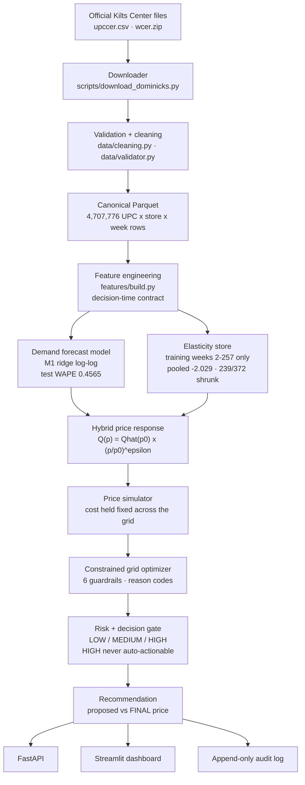
```mermaid
flowchart TD
    A["Official Kilts Center files<br/>upccer.csv · wcer.zip"] --> B["Downloader<br/>scripts/download_dominicks.py"]
    B --> C["Validation + cleaning<br/>data/cleaning.py · data/validator.py"]
    C --> D["Canonical Parquet<br/>4,707,776 UPC x store x week rows"]
    D --> E["Feature engineering<br/>features/build.py<br/>decision-time contract"]
    E --> F["Demand forecast model<br/>M1 ridge log-log<br/>test WAPE 0.4565"]
    E --> G["Elasticity store<br/>training weeks 2-257 only<br/>pooled -2.029 · 239/372 shrunk"]
    F --> H["Hybrid price response<br/>Q(p) = Qhat(p0) x (p/p0)^epsilon"]
    G --> H
    H --> I["Price simulator<br/>cost held fixed across the grid"]
    I --> J["Constrained grid optimizer<br/>6 guardrails · reason codes"]
    J --> K["Risk + decision gate<br/>LOW / MEDIUM / HIGH<br/>HIGH never auto-actionable"]
    K --> L["Recommendation<br/>proposed vs FINAL price"]
    L --> M["FastAPI"]
    L --> N["Streamlit dashboard"]
    L --> O["Append-only audit log"]
```

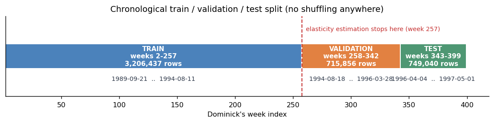

*Figure 1 — Chronological train / validation / test split. Elasticity
estimation is additionally restricted to weeks 2–257, so no elasticity used to
price week 399 ever saw a validation or test outcome. Source:
`artifacts/metrics/feature_build.json`.*

---

## 2. Business problem

### 2.1 The retailer's decision

A category manager at a 93-store grocery chain sets, every week, a shelf price
for each of ~489 cereal UPCs in each store. That is up to 45,477 price
decisions per week. Each decision trades volume against margin, and each is
made before the week's demand is observed.

Formally, let

* `p` — the effective unit price charged,
* `X` — the commercial context: product identity, store, week of year, planned
  promotion, recent demand history, recent price history, decision-time unit
  cost,
* `Q(p, X)` — units sold,
* `c` — the unit cost the retailer pays.

Then:

$$Q = Q(p,\,X)$$

$$R(p) = p \cdot Q(p, X)$$

$$GP(p) = (p - c) \cdot Q(p, X)$$

### 2.2 Revenue and gross profit are maximised at different prices

This is the single most common confusion in pricing conversations, so it is
worth deriving rather than asserting.

For **linear demand** `Q(p) = a − bp` with `a, b > 0`:

$$R(p) = p(a - bp) = ap - bp^2 \;\Rightarrow\; \frac{dR}{dp} = a - 2bp = 0 \;\Rightarrow\; p_R^* = \frac{a}{2b}$$

$$GP(p) = (p-c)(a - bp) \;\Rightarrow\; \frac{dGP}{dp} = a + bc - 2bp = 0 \;\Rightarrow\; p_{GP}^* = \frac{a + bc}{2b}$$

so

$$p_{GP}^* - p_R^* = \frac{c}{2} > 0 \quad\text{whenever } c > 0 .$$

**The profit-maximising price is always strictly above the revenue-maximising
price when cost is positive**, and the gap is exactly half the unit cost.

For **constant-elasticity demand** `Q(p) = k·p^ε` the same fact appears
differently. Revenue `R(p) = k·p^{1+ε}` is maximised where `ε = −1` (unit
elastic). Gross profit has the closed form

$$p_{GP}^* = c \cdot \frac{\varepsilon}{1 + \varepsilon}, \qquad \varepsilon < -1$$

and is **unbounded above** for `−1 < ε < 0`: if demand is inelastic, raising
the price always pays in this model, and the optimum is set entirely by
constraints, not by the demand curve. `tests/test_optimizer.py::test_constant_elasticity_fixture_pushes_price_to_the_upper_bound`
encodes exactly that behaviour.

### 2.3 A worked numerical example from this project

Take the real decision context used throughout this report — **CAPN CRUNCH
JUMBO CR** (UPC 3000006560) at **store 86**, decision week **399**
(1997-05-01):

* current effective unit price `p₀ = $3.35`
* decision-time unit cost `c = $2.5571` (lagged, forward-filled AAC)
* applied elasticity `ε = −2.9401` (shrunk product estimate)
* baseline predicted demand at `p₀`: `Q̂(p₀) = 25.56` units

Under the hybrid response `Q(p) = Q̂(p₀)·(p/p₀)^ε`:

| candidate price | predicted units | expected revenue | expected gross profit |
| ---: | ---: | ---: | ---: |
| $2.51 | 59.74 | **$149.94** | −$2.81 |
| $2.91 | 38.68 | $112.54 | $13.65 |
| $3.35 (current) | 25.56 | $85.64 | $20.27 |
| $3.66 (**recommended**) | 19.71 | $72.13 | $21.74 |
| $3.88 (unconstrained optimum) | ≈16.9 | ≈$65.6 | **≈$22.0** |
| $4.11 | 14.01 | $57.60 | $21.76 |

Revenue falls monotonically across this whole range — because `|ε| > 1`, every
price rise loses more volume proportionally than it gains in price. Gross
profit rises to a peak at the closed-form optimum

$$p^* = c\cdot\frac{\varepsilon}{1+\varepsilon} = 2.5571 \times \frac{-2.9401}{-1.9401} = \$3.875$$

and then falls. **Maximising revenue here would mean cutting the price to the
floor and destroying most of the gross profit.** That is why this project
optimises gross profit.

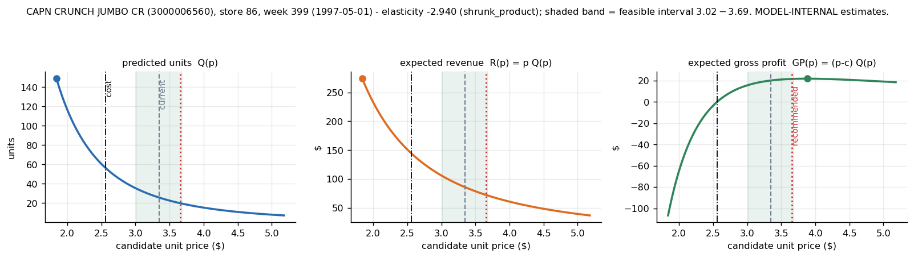

*Figure 2 — The three objective curves for CAPN CRUNCH JUMBO CR at store 86,
week 399. Black dash-dot = decision-time unit cost $2.56; grey dashed =
current price $3.35; red dotted = final recommended price $3.66; shaded band =
the feasible interval $3.02–$3.69 the guardrails allow. The gross-profit
optimum ($3.88) lies **outside** the feasible band, so the recommendation is
the upper guardrail corner — the single most important structural fact about
this engine. All values are model-internal estimates. Source:
`scripts/make_report_figures.py`, live pipeline call.*

### 2.4 What this project actually optimises

The shipped objective is **expected gross profit**:

$$\max_{p \in \mathcal{F}} \; (p - c)\cdot \hat{Q}(p)$$

where

* `𝓕` is the feasible set produced by the guardrails (§53),
* `c` is a **decision-time** cost estimate, held **fixed** across the candidate
  grid (§48),
* `Q̂(p)` is the hybrid price response (§43).

Expected revenue is supported as a secondary objective
(`optimization.objective: revenue`) because volume or share mandates are a real
business reality, and both objectives use the *same* predicted demand so the
only difference between them is the economics applied on top.

Two things the engine deliberately does **not** optimise: long-run customer
equity (unobservable in scanner data) and category-level profit across
substitutes (not modelled — see §101).

---

## 3. Why pricing is a difficult data-science problem

A model with excellent forecasting accuracy can still produce dangerous prices.
This section explains why, with the evidence from this project attached to each
mechanism.

### 3.1 The price–demand relationship is not observed; it is inferred

The retailer observes `(p_t, Q_t)` pairs. It never observes `Q` at a price it
did not charge. Every counterfactual — the entire content of a price
recommendation — is an extrapolation from a model fitted to prices that *were*
charged. In this panel, the median UPC × store series has **8 distinct prices**
across a median of 78 observations; there is genuine variation, but it is
sparse, clustered, and not randomly assigned.

### 3.2 Elasticity is a slope, and slopes are fragile

Own-price elasticity `ε = d log Q / d log p` is a *derivative*, and derivatives
are far harder to estimate than levels. In this project the same panel yields
elasticities from **−0.348** to **−3.102** depending only on the
specification. Conclusions that depend on the third decimal place of an
elasticity should be treated as decoration.

### 3.3 Seasonality

Cereal demand has annual structure (back-to-school, holidays) and the panel
spans eight years of secular drift. Without time controls, price and demand
co-move for reasons that have nothing to do with the price. Adding
`sin52`, `cos52` and a trend to the fixed-effects specification moves the
estimate from **−2.419** to **−1.909**.

### 3.4 Promotion effects are bundled with price

A Bonus Buy is not a price cut. It is a price cut *plus* a feature ad, *plus*
display space, *plus* an end-cap, *plus* a shopper-marketing budget — of which
this data records only the price and a single-character code. Estimated
separately on this panel, promotion weeks give **−2.662** and non-promotion
weeks **−1.830** (`artifacts/metrics/elasticity.json`). The gap is the size of
the bundling problem.

Its effect on the forecaster is equally visible: on the test window the
selected model's WAPE is **0.374** on the 691,836 rows with no recorded
promotion and **0.656** on the 57,204 rows with one, with a bias of −37.2 units
per row on promotion weeks against −1.1 elsewhere.

### 3.5 Retailer anticipatory pricing (reverse causality)

Prices are cut *because* a demand surge is expected. Low price and high demand
then coincide for a reason unrelated to the price, and the estimated elasticity
is biased in a direction that cannot be signed a priori.

### 3.6 Endogeneity, stated formally

Write `log Q_it = α_i + ε·log p_it + u_it`. OLS is consistent only if
`E[u_it · log p_it] = 0`. That fails the moment the retailer conditions its
price on anything in `u` — expected demand, competitor activity, inventory
position, trade-deal timing. It certainly does. The **factor-of-seven** move
from −0.348 to −2.419 produced purely by adding fixed effects is direct
evidence of exactly this contamination.

### 3.7 Confounding by unobserved marketing

Feature ads, display, competitor prices, local events, weather and shopper
traffic are all unobserved here. Anything correlated with both price and demand
loads onto the price coefficient.

### 3.8 Product heterogeneity

The per-UPC elasticity distribution in this panel runs from p10 = **−4.094** to
p90 = **−0.240**, and **5.1%** of UPCs have a *statistically significant
positive* price coefficient. Positive coefficients are not bad data; they are
evidence that for those series, price moves *with* unobserved demand. A single
category elasticity is a useful prior and a poor description.

### 3.9 Store heterogeneity

Dominick's priced by zone. Store-level elasticities in this panel run from
−0.947 to **+0.297**, and the median cross-store price spread for a given UPC
is **13.6%** (p90 27.5%). Cross-store price differences reflect local demand
and competition, not exogenous variation — which is exactly why store fixed
effects move the estimate.

### 3.10 Time effects

Eight years is long enough for category dynamics, competition and the price
level itself to change. The monitoring artifact shows `series_reference_price`
drifting from a reference-window mean of $2.886 to $3.247 in the test window
(PSI 0.36, "large shift"). A model trained on 1989–1994 is scoring a materially
different price regime in 1996–1997.

### 3.11 Cost uncertainty

The only cost available is an **Average Acquisition Cost** implied by an
accounting margin (§8). AAC lags replacement cost, moves with inventory ageing
and forward buying, and is itself volatile: the median within-series AAC
coefficient of variation is **0.088** (p90 0.153). Since the gross-profit
optimum is proportional to `c` under constant elasticity, a 10% error in `c` is
a 10% error in the recommended price.

### 3.12 Extrapolation

A demand model asked for `Q` at a price the series has never carried is
extrapolating, and log-linear models extrapolate confidently and wrongly. The
project's response is the extrapolation guardrail (§53.6), which keeps
candidates inside the series' observed price support expanded by a configured
tolerance. It is the *first binding constraint* in 13.4% of contexts and binds
at the optimum in 2,103 of 13,964.

### 3.13 Price support

Only **54.08%** of the 36,443 UPC × store series pass the eligibility screen
(≥40 observations, ≥5 distinct prices, price CV ≥ 0.05). The rest carry no
usable information about price response no matter how good the model is, and
always receive keep-current.

### 3.14 Substitution and cannibalisation

Cereal buyers substitute heavily between brands and sizes. This engine prices
each UPC × store **independently**, so the category effect of re-pricing many
products at once is **not** the sum of the per-product effects. This is
arguably the largest missing mechanism in the project (§101).

### 3.15 Stock-outs

Unavailability and demand collapse are indistinguishable in scanner data. A
zero or suppressed sales week caused by an empty shelf is read by the model as
weak demand. This project cannot separate the two.

### 3.16 Offline evaluation is fundamentally limited

The decisive point. Suppose the demand model is excellent. To evaluate a
*pricing policy* offline you must score the prices it proposes — prices that
were never charged — and the only thing available to score them with is the
same model that proposed them. That is **circular**, and no amount of
cross-validation fixes it. In this project the consequence is stated in the
metric name itself: `model_internal_estimated_profit_uplift_pct`.

**Therefore: good forecasting performance is necessary but nowhere near
sufficient for safe pricing.** A model can achieve any WAPE you like while
having the price coefficient badly wrong, because at observed prices the lag
and context features carry most of the signal. This project's own evidence:
the selected model's implied elasticity is **−3.102**, materially steeper than
every controlled econometric estimate (−1.909 to −2.419), and it was
nonetheless the best forecaster in the comparison. That discrepancy is what
motivated the entire hybrid architecture (§42).

---
---
# PART II — DATA

## 4. Dataset selection

### 4.1 Why Dominick's Finer Foods

The dataset is the **Dominick's Finer Foods store-level scanner panel**,
category **Cereals**, distributed by the **Kilts Center for Marketing,
University of Chicago Booth School of Business**
(<https://www.chicagobooth.edu/research/kilts/research-data/dominicks>).

Dominick's was a Chicago-area grocery chain; the Kilts Center release covers
roughly nine years of weekly store-level movement across ~29 categories. It is
one of the very few **publicly documented** retail scanner panels that carries
all four things a pricing project needs simultaneously:

| requirement | present in Dominick's? | why it matters here |
| --- | --- | --- |
| store-level **weekly price** | yes (`price`, `qty`) | the decision variable |
| **unit movement** | yes (`move`) | the target |
| **promotion coding** | partially (`sale`: B/C/S) | lets promotion be controlled for *and* lets its incompleteness be measured |
| **margin / cost** | yes (`profit`, a gross-margin % on AAC) | without a cost there is no gross-profit objective at all |

### 4.2 Academic research context

The panel underpins a large empirical-marketing and empirical-IO literature —
work on promotion dynamics, category management, zone pricing and retail
competition. That matters for a portfolio project in a specific way: the
dataset's quirks (the `ok` flag, zero prices, bundle quantities, AAC-based
margins) are *documented and discussed in public*, so decisions about them can
be justified rather than invented.

### 4.3 Why the Cereals category

Cereals is a good stress test for a pricing engine:

* **Heavy promotion.** 7.35% of canonical rows carry a recorded promotion code,
  and promotion weeks average 54.5 units against 16.5 on non-promotion weeks —
  so the promotion-bundling problem is visible rather than hypothetical.
* **Genuine price variation.** Median 51 distinct prices per UPC, median
  within-series price CV 0.079, and 13.8% of consecutive-week pairs carry a
  price change.
* **High substitution.** Which makes the *absence* of cross-price modelling an
  honest, measurable limitation rather than a footnote.
* **Manageable scale.** 6.6M raw rows is large enough to be real and small
  enough to run end to end on a workstation.

### 4.4 Why this beats a generic sales dataset

A typical "retail sales" Kaggle-style dataset gives quantity and revenue with
no cost, no promotion flag, no store dimension and often no genuine price
variation. On such data you can build a demand forecaster, but you **cannot**:

* compute a gross-profit objective (no cost),
* control for promotion (no flag),
* exploit or even discuss zone pricing (no store),
* identify a price coefficient at all (no price movement),
* demonstrate the endogeneity problem (no controls to add).

### 4.5 Why the cost/margin field is the decisive feature

`profit` is a **gross-margin percentage**. Combined with the effective unit
price it yields an implied unit cost, which is what turns the whole exercise
from *revenue* optimization (a soluble but usually wrong objective) into
*gross-profit* optimization (the business objective). Section 2.2 shows the two
give different answers by exactly `c/2` under linear demand — so without a cost
field, the project could not have asked the right question.

---

## 5. Raw data acquisition

### 5.1 Official sources only

`scripts/download_dominicks.py` contacts **only** `chicagobooth.edu` URLs.
There is no Kaggle fallback, no mirror, and no synthetic substitution.
`tests/test_repo_and_downloader.py` asserts the URL host.

| asset | file | recorded size | SHA-256 (first 16 hex) |
| --- | --- | ---: | --- |
| UPC metadata | `upc_csv-files/upccer.csv` | 25,932 B | `affa589f080ab18a…` |
| Movement archive | `movement_csv-files/wcer.zip` | 42,402,094 B | `2d4a59f88e4b9725…` |
| Movement CSV (extracted) | `wcer.csv` | 458,400,475 B | `a204106f6dff8a6c…` |
| Manual / codebook | `dominicks-manual-and-codebook_kiltscenter.pdf` | 10,182,109 B | `d8dc133bfe402a21…` |

Full hashes, source URLs, the usage restriction and the download timestamp
(`2026-08-18T08:05:01Z`) are written to
`data/raw/dominicks/cereals/SOURCE.json` and reproduced in
`reports/01_DATA_AUDIT.md`. That file is present locally and git-ignored; the
raw data are never redistributed.

### 5.2 Downloader behaviour

The script:

1. creates the target directories,
2. streams downloads with explicit timeouts,
3. validates the HTTP status **and** a non-zero content length,
4. writes to a temporary file and renames **atomically**, so a partial download
   can never be mistaken for a complete one,
5. extracts the archive with **zip-slip and absolute-path guards**,
6. normalises the extracted movement CSV to `wcer.csv` while recording the
   original archive member name,
7. writes `SOURCE.json` with URLs, sizes, SHA-256 hashes and timestamps.

### 5.3 Failure behaviour

If the network or the site blocks automated retrieval, the script prints exact
manual download instructions and marks acquisition **BLOCKED**. It never
fabricates or substitutes data. This actually happened during the original
build: the first automated attempt failed mid-download with a connection reset,
and a resumable retry completed it (`STATUS.md`, row 1).

### 5.4 Raw-data Git policy and attribution

The Kilts Center makes the Dominick's data available **for academic research
purposes** and asks users to acknowledge the Kilts Center in publications.
Enforced consequences:

* `data/raw/`, `data/interim/` and `data/processed/` are **git-ignored** and
  never committed. `tests/test_repo_and_downloader.py` asserts the ignore
  rules.
* CI runs on small synthetic fixtures only and never downloads the licensed
  dataset on a public build service (`.github/workflows/ci.yml`).
* The Docker image contains **code only**; artifacts and processed data are
  mounted read-only at run time (`Dockerfile`, `docker-compose.yml`).

### 5.5 Reproducible download workflow

```bash
python scripts/download_dominicks.py          # official URLs only
python scripts/download_dominicks.py --force  # re-download
make data                                     # download + build + audit
```

---

## 6. Dominick's data model

### 6.1 Movement file fields

| column | dtype loaded | meaning (per the Kilts manual) |
| --- | --- | --- |
| `upc` | int64 | Universal Product Code of the item |
| `store` | int32 | Dominick's store number |
| `week` | int32 | Dominick's week index; week 1 begins 1989-09-14 |
| `move` | float64 | number of **individual units** sold in that store-week |
| `price` | float64 | price of the **bundle** actually scanned (may cover several units) |
| `qty` | float64 | number of items in the bundle |
| `sale` | string | promotion code: `B` Bonus Buy, `C` Coupon, `S` simple price reduction (undocumented `G` and `L` also observed) |
| `profit` | float64 | gross-margin **percentage**, computed on Average Acquisition Cost |
| `ok` | int8 | 1 = valid, 0 = suspect / "trash" per the manual |

Two raw columns are deliberately **not** loaded: `PRICE_HEX` and `PROFIT_HEX`,
which are redundant binary encodings of `price` and `profit`.

### 6.2 UPC metadata file (`upccer.csv`)

| column | meaning |
| --- | --- |
| `com_code` | commodity code (Cereals) |
| `descrip` | product description, e.g. `CAPN CRUNCH JUMBO CR` |
| `size` | package size string, e.g. `12 OZ` |
| `case` | units per case |
| `nitem` | internal item number |

490 rows, **0 duplicate UPCs**, **0 nulls in any column**
(`artifacts/metrics/raw_audit.json`).

### 6.3 The natural grain

$$\text{UPC} \times \text{Store} \times \text{Week}$$

This is not an arbitrary choice; it is what the data *is*, and it matters for
three reasons.

1. **It is the decision grain.** Dominick's set prices by store zone, so the
   thing a category manager actually chooses is a price for one UPC in one
   store for one week. Modelling at UPC × week (pooling stores) would model a
   decision nobody makes.
2. **It is where the price variation lives.** The observed median cross-store
   price spread for a given UPC is **13.6%** — real, exploitable, and invisible
   at a coarser grain.
3. **It defines what a "series" is.** All lags, rolling windows, reference
   prices, eligibility screens, price support and risk assessments are computed
   *within* a UPC × store series. There are **36,443** such series.

Grain uniqueness is asserted, not assumed: `raw_duplicate_grain_rows = 0` in
the raw file, and `grain_unique` is one of the 15 validation checks (0
duplicated UPC × store × week rows in the canonical table).

### 6.4 Time decoding

The manual anchors week 1 to **1989-09-14** (a Thursday); Dominick's store
weeks run Thursday → Wednesday. So:

$$\text{week\_start\_date} = \text{1989-09-14} + (\text{week} - 1)\times 7\ \text{days}$$

This is implemented in `pricing_engine.data.cleaning.decode_week` and validated
two ways: `week_date_mapping_unique` (each week index maps to exactly one
calendar date) and `date_range_plausible` (the decoded range is
**1989-09-14 … 1997-05-01**, matching the documented coverage). Decoding also
buys real calendar seasonality — `year`, `month`, `quarter`, `week_of_year` —
which a bare integer week index cannot provide.

---

## 7. Price and quantity semantics

### 7.1 The problem

`price` is a **bundle** price, and `qty` is how many individual items that
bundle contains. `move` counts **individual units**, not bundles. So `price`
and `move` are denominated differently, and multiplying them is wrong whenever
`qty > 1`.

### 7.2 The corrections

$$\text{effective\_unit\_price} = \frac{\text{price}}{\text{qty}}$$

$$\text{revenue} = \text{effective\_unit\_price} \times \text{move} = \frac{\text{price} \times \text{move}}{\text{qty}}$$

Implementation (`src/pricing_engine/data/cleaning.py`):

```python
qty = out["qty"].where(out["qty"] > 0)        # never divide by zero silently
out["effective_unit_price"] = out["price"] / qty
out["revenue"] = out["effective_unit_price"] * out["move"]
```

The `.where(qty > 0)` produces `NaN` rather than `inf` for a non-positive
quantity, and a dedicated validation check (`no_infinite_unit_price`) asserts
that `effective_unit_price` is finite everywhere in the canonical table — i.e.
that no silent divide-by-zero survived.

### 7.3 How much does this actually matter?

| `qty` | rows | share |
| ---: | ---: | ---: |
| 1 | 4,702,830 | 99.8949% |
| 2 | 3,241 | 0.0688% |
| 3 | 568 | 0.0121% |
| 4 | 1,137 | 0.0242% |
| **> 1 (total)** | **4,946** | **0.1051%** |

Only about one row in a thousand is a multi-unit bundle. But for those rows,
using `price` directly would overstate the unit price by a factor of **2 to
4**, and a 4× price error propagates into the elasticity, the implied AAC, the
gross-profit calculation, the feasible price interval and the recommendation.
The correction costs one division and removes an entire class of silent error.

Its size is verified rather than assumed: `formula_effective_unit_price` and
`formula_revenue` are validation checks with maximum absolute deviations of
`0.000e+00` and `1.421e-14` respectively (floating-point noise).

### 7.4 Distributional consequence

The raw `price` field has mean 2.2412 (heavily dragged down by the 1,851,380
zero-price rows). After exclusion and unit conversion, the canonical
`effective_unit_price` has **mean $3.1157, median $3.15, minimum $0.05,
maximum $26.02**. The maximum is a genuine artefact worth naming: it belongs to
`TONY THE TIGER T-SHIRT`, a non-cereal item that appears in the Cereals
commodity file. Rows with a unit price above $10 are 6.4 × 10⁻⁷ of the table —
three rows.

---

## 8. Gross margin and AAC

### 8.1 What `profit` represents

`profit` is a **gross-margin percentage** computed by Dominick's accounting
system on **Average Acquisition Cost (AAC)** — an inventory-accounting measure
of what the retailer paid, on average, for the stock currently on hand.

### 8.2 The derivations

$$\text{gross\_margin\_rate} = \frac{\text{profit}}{100}$$

$$\text{estimated\_unit\_aac} = \text{effective\_unit\_price} \times (1 - \text{gross\_margin\_rate})$$

$$\text{gross\_profit} = \text{revenue} \times \text{gross\_margin\_rate} = (p - \text{aac}) \times \text{move}$$

The second identity is the definition of a gross-margin rate rearranged:
if `m = (p − c)/p` then `c = p(1 − m)`. The third follows immediately:
`revenue × m = p·Q·(p − c)/p = (p − c)·Q`.

All three are validation checks with maximum absolute deviation `0.000e+00`.

### 8.3 Why the name `estimated_unit_aac` and never `true_unit_cost`

This naming decision (DECISIONS #4) is one of the more consequential small
choices in the project. AAC is **not** necessarily the economically relevant
cost at the moment of a pricing decision, for at least four reasons:

1. **Forward buying.** Retailers buy ahead of trade-deal expiry, so on-hand
   stock can be much cheaper than replacement stock.
2. **Inventory ageing.** AAC is a weighted average over stock of different
   vintages; it lags the current wholesale price by an unknown amount.
3. **Trade funds.** Off-invoice allowances, bill-backs and scan-downs may or
   may not be reflected in AAC depending on accounting treatment.
4. **The relevant cost for a marginal decision is replacement cost**, not
   average historical cost — a standard result in managerial economics.

Empirically, the AAC in this panel is not stable: the **median within-series
AAC coefficient of variation is 0.088** with a p90 of 0.153
(`artifacts/metrics/eda_summary.json`). And it moves *with price*: on price
cuts, the mean AAC change is **−9.16%** — consistent with promotions being
funded by trade deals, and a direct warning against treating cost as
independent of the pricing decision.

So the column is called `estimated_unit_aac` everywhere, and
`docs/DATA_DICTIONARY.md` states the caveat inline. Renaming it to a generic
"cost" would have made every downstream gross-profit number sound more
authoritative than the evidence supports.

### 8.4 Consequence for the optimizer

Under constant elasticity the optimum is `p* = c·ε/(1+ε)`, i.e. **linear in
cost**. A 10% error in `c` produces a 10% error in the recommended price. This
is the reason the project (a) uses a *lagged, decision-time* cost rather than
the contemporaneous accounting margin (§48), (b) holds cost **fixed** across
the candidate grid, and (c) lists AAC accuracy as an open limitation rather
than claiming the gross-profit figures are exact.

### 8.5 Sanity of the margin field

| statistic | raw `profit` |
| --- | ---: |
| mean | 12.522 |
| median | 13.740 |
| p01 / p99 | 0.00 / 46.21 |
| min / max | −99.69 / 99.99 |
| negative values | 53,057 |
| zero values | 1,852,626 |

Negative margins are real (loss-leading, clearance, promotional deals funded
after the fact) and are **not** deleted. Instead the canonical table carries a
`margin_implausible_flag` for `|gross_margin_rate| ≥ 1` and an
`aac_nonpositive_flag` for implied AAC ≤ 0. In the final canonical table both
flags fire on **0.0%** of rows, because the rows carrying them were removed by
the zero-price rule for independent reasons.

---

## 9. Data quality audit

### 9.1 Raw table

| quantity | value |
| --- | ---: |
| rows | **6,602,582** |
| columns | 9 |
| exact duplicate rows | **0** |
| duplicate UPC × store × week rows | **0** |
| distinct UPCs | 490 |
| distinct stores | 93 |
| distinct weeks | 367 (index range 1 … 399) |
| nulls in `store`,`upc`,`week`,`move`,`qty`,`price`,`profit`,`ok` | **0** |
| nulls in `sale` | 6,242,568 (94.55% — no promotion code recorded) |

That there are **zero** exact duplicates and **zero** grain collisions in a
6.6M-row raw file is itself a finding worth stating: the movement file is
already at its natural grain, so no de-duplication judgement was needed.

### 9.2 The exclusion ledger

Every rule is applied in order to the frame that survived the previous rules,
so the counts are "additional rows removed by this rule" and can be summed.

| # | rule | rows removed | % of raw | rationale |
| --- | --- | ---: | ---: | --- |
| 1 | `missing_key` | 0 | 0.00% | UPC / store / week must be present to identify an observation |
| 2 | `missing_core_measure` | 0 | 0.00% | price, move, qty, profit are required for pricing economics |
| 3 | `ok_flag_zero` | **141,285** | **2.1398%** | the manual marks `ok = 0` rows as suspect / trash |
| 4 | `non_positive_price` | **1,753,521** | **26.5581%** | a bundle price below $0.01 cannot yield a unit price |
| 5 | `non_positive_qty` | 0 | 0.00% | needed to compute a unit price |
| 6 | `negative_move` | 0 | 0.00% | negative movement is not interpretable as demand |
| 7 | `metadata_unmatched_kept` | 0 | 0.00% | unmatched rows would be kept and flagged, not dropped — none occurred |
| | **total removed** | **1,894,806** | **28.6980%** | |
| | **canonical rows** | **4,707,776** | **71.3020%** | |

Note the interaction: 1,851,380 raw rows carry `price = 0`, but only 1,753,521
are removed by rule 4 — because 97,859 of them were already removed by rule 3
(`ok = 0`). The ledger is order-dependent by design and the order is recorded.

### 9.3 Metadata join

| quantity | value |
| --- | ---: |
| metadata rows | 490 |
| duplicate UPCs in metadata | 0 |
| UPCs present in movement | 489 |
| UPCs in metadata with no movement | 1 |
| UPCs in movement with no metadata | **0** |
| rows with no metadata after the join | **0 (0.00%)** |

The join is executed with `validate="many_to_one"` and the row count is
asserted before and after:

```python
merged = movement.merge(meta[keep_cols], on="upc", how="left", validate="many_to_one")
if len(merged) != n_before:
    raise AssertionError(f"UPC metadata join changed the row count: {n_before} -> {len(merged)}.")
```

A silent fan-out on a join is one of the classic ways a pipeline gains rows it
cannot account for. Here it is impossible by construction.

### 9.4 Canonical table dimensions

| quantity | value |
| --- | ---: |
| rows | **4,707,776** |
| UPCs | **489** |
| stores | **93** |
| weeks | **366** (index 1 … 399) |
| date range | **1989-09-14 … 1997-05-01** |
| duplicated grain rows | **0** |
| rows with `ok ≠ 1` | **0** |
| observed total units | 90,766,941 |
| observed total revenue | $262,008,582.295 |
| observed total gross profit | $40,091,143.487 |

366 observed weeks within an index range of 399 means **33 week indices carry
no rows at all** after exclusion — real gaps in the panel, not an error.

### 9.5 The 15 validation checks

`scripts/validate_data.py` re-loads the persisted Parquet and re-derives every
identity from scratch. All 15 pass.

| # | check | result |
| --- | --- | --- |
| 1 | `non_empty` | pass — 4,707,776 rows |
| 2 | `grain_unique` | pass — 0 duplicated UPC × store × week rows |
| 3 | `only_ok_rows` | pass — 0 rows with `ok ≠ 1` |
| 4 | `formula_effective_unit_price` | pass — max abs deviation 0.000e+00 |
| 5 | `formula_revenue` | pass — max abs deviation 1.421e-14 |
| 6 | `formula_gross_margin_rate` | pass — 0.000e+00 |
| 7 | `formula_estimated_unit_aac` | pass — 0.000e+00 |
| 8 | `formula_gross_profit` | pass — 0.000e+00 |
| 9 | `positive_price` | pass — all bundle prices strictly positive |
| 10 | `positive_qty` | pass — all bundle quantities strictly positive |
| 11 | `non_negative_move` | pass — no negative unit movement |
| 12 | `no_infinite_unit_price` | pass — finite everywhere (no silent divide-by-zero) |
| 13 | `week_date_mapping_unique` | pass — each week index maps to exactly one date |
| 14 | `date_range_plausible` | pass — 1989-09-14 … 1997-05-01 |
| 15 | `promotion_flag_binary` | pass — recorded promotion share 0.0735 |

### 9.6 Suspicious distributions that were kept, flagged, not deleted

There is **no arbitrary outlier trimming anywhere in this project**
(DECISIONS #7). Extremes are surfaced and bounded downstream by the
extrapolation guardrail instead of being deleted to make plots tidy.

| observation | magnitude | treatment |
| --- | ---: | --- |
| week-over-week price jumps > ±50% | **10.07%** of price-change events (77,152) | kept; real promotion behaviour mixed with possible recording artefacts; bounded by the extrapolation guardrail |
| maximum observed unit price | $26.02 (`TONY THE TIGER T-SHIRT`) | kept; a non-cereal item in the Cereals commodity file |
| UPCs with negative total observed gross profit | 6 | kept; loss-leading is real |
| negative raw `profit` values | 53,057 | kept in raw; flagged via `margin_implausible_flag` |
| maximum weekly `move` | 18,688 units | kept; the model applies a prediction cap instead (§37.6) |

### 9.7 Quality flags carried on every canonical row

| flag | definition | share in canonical table |
| --- | --- | ---: |
| `margin_implausible_flag` | `gross_margin_rate` outside (−1, 1) or NaN | 0.0% |
| `aac_nonpositive_flag` | implied unit AAC ≤ 0 | 0.0% |
| `zero_move_flag` | zero units sold that week | 0.0% |
| `bundle_flag` | `qty > 1` | 0.1051% |
| `has_metadata_flag` | UPC matched the metadata file | 100% |

`zero_move_flag = 0.0%` deserves a comment: after the zero-price exclusion,
**no canonical row has zero sales** (`n_upc_store_weeks_with_zero_sales = 0`).
That is a direct, mechanical consequence of the exclusion rule — zero-price and
zero-move rows are essentially the same rows (§10) — and it is the main reason
the zero-price decision needed its own investigation.

---

## 10. Zero-price investigation

This exclusion removes **26.56% of the raw file**. It is by far the largest
single judgement in the data pipeline, so it was given a dedicated audit
(`scripts/audit_zero_price.py` → `reports/09_ZERO_PRICE_AUDIT.md`).

### 10.1 Scale

| quantity | value |
| --- | ---: |
| raw rows with `price = 0` | **1,851,380** |
| share of the raw file | **28.0402%** |
| of which `move > 0` (recorded any sales) | **677** |
| of which `move = 0` | 1,850,703 |
| rows with `price > 0` **and** `move = 0` | **0** |
| zero-price rows with non-zero `profit` | **0** |
| zero-price rows with `qty > 1` | **0** |

The single most informative number here is **677**. Of 1.85 million zero-price
rows, only 677 — **0.037%** — recorded any sales at all. A zero-price row in
this file is overwhelmingly a week in which the item was **not offered**, not a
week in which it was given away.

The second most informative number is the **0** in row 5: there is no such
thing as a positively priced week with no sales. Price and movement are zero
together. That is the signature of a "no offer this week" record, not of a
demand event.

### 10.2 Interaction with the `ok` flag

| | `ok = 1` | `ok = 0` |
| --- | ---: | ---: |
| zero-price rows | 1,753,521 | 97,859 |
| all rows | 6,461,297 | 141,285 |

**69.3% of all `ok = 0` rows are also zero-price rows.** The two quality
signals largely agree, which is mild independent evidence that the zero-price
rows are indeed junk rather than information.

### 10.3 Distribution across time

| statistic | value |
| --- | ---: |
| weeks covered | 367 |
| minimum weekly zero share | 19.98% |
| maximum weekly zero share | 100.00% |
| mean weekly zero share | 27.95% |
| standard deviation | 6.90% |
| first week's zero share | 42.34% |
| last week's zero share | 28.21% |
| weeks above 50% zero | **1** |

The phenomenon is **stationary**, not a data-collection failure confined to one
era. One week is entirely unpriced.

### 10.4 Distribution across products

| statistic | value |
| --- | ---: |
| UPCs | 490 |
| median zero share per UPC | **40.69%** |
| p10 / p90 | 4.75% / 93.03% |
| UPCs above 80% zero | **112** |
| UPCs below 5% zero | 57 |

The top-10 most affected UPCs are almost entirely seasonal, promotional or
short-lived items — `QUAKER CLUB PACK CAP` (100.0% zero), `~KELL COMPLETE BRAN`
(99.98%), `RICE KRISPIES HOLIDA` (98.57%), `SPIDERMAN CEREAL` (98.21%). These
read as items that were carried briefly or in a few stores, exactly as a "not
offered" interpretation predicts.

### 10.5 Distribution across stores

| statistic | value |
| --- | ---: |
| stores | 93 |
| median zero share | 26.68% |
| min / max | 8.09% / 43.01% |
| standard deviation | 5.85% |

Stores differ by a factor of five, consistent with genuinely different
assortments — but no store is anywhere near 0% or 100%, so this is not a
per-store recording failure.

### 10.6 Position within the series — the decisive evidence

Each zero-price row was classified by where it sits in its UPC × store series.

| position | rows | share of zero-price rows |
| --- | ---: | ---: |
| **leading** run, before the series' first priced week | 291,284 | **15.73%** |
| **trailing** run, after the series' last priced week | 1,068,024 | **57.69%** |
| **interior** gap between priced weeks | 485,204 | **26.21%** |
| series **never** priced at all | 6,868 series | 0.37% of rows |
| interior-gap rows that *did* record sales | **660** | — |

**73.4% of zero-price rows are leading or trailing runs** — the item was not
yet carried, or had been delisted. This is the interpretation the audit
supports and it is not a guess: it is a positional fact about 1.36 million
rows.

The remaining 26.2% are interior gaps — temporary de-listings, out-of-stocks or
seasonal absences. Of those, only 660 recorded any sales.

### 10.7 What the manual says

**Nothing.** The official Kilts Center manual and codebook are silent on zero
or missing prices (`KNOWN_LIMITATIONS.md` #32). The interpretation above is
therefore **inferred from the data, not documented by the provider** — a
distinction the project states explicitly rather than papering over.

### 10.8 Why the exclusion was retained

Four reasons, in order of weight:

1. **No unit price can be derived from a zero bundle price**, so the decision
   variable of the entire project is undefined for these rows.
2. **Imputing a price would fabricate the optimised variable.** Whatever value
   were imputed would flow into `effective_unit_price`, `estimated_unit_aac`,
   the elasticity regressions and the objective function. That is inventing
   data to feed a pricing model.
3. **99.96% of them carry no sales anyway**, so the information loss on the
   target is minimal.
4. **Keeping them with `NaN` price** would either propagate NaN through every
   downstream computation or force silent imputation at each step.

### 10.9 The selection bias this creates — measured, not asserted

Excluding these rows tilts the analysed sample toward continuously stocked,
higher-volume series. The audit quantifies the tilt with a direct probe:

| series group | n series | mean effective unit price | mean weekly units |
| --- | ---: | ---: | ---: |
| zero-share > 50% ("intermittent") | 12,529 | $2.717 | **3.05** |
| zero-share ≤ 10% ("continuously stocked") | 11,139 | $3.228 | **21.00** |

The continuously stocked series sell **6.9× more units per week** and carry
**19% higher prices**. So:

* the elasticity estimates, the demand model and the recommendations are all
  fitted on and applied to the **high-volume, continuously stocked core** of the
  category;
* nothing in this project should be read as characterising intermittent,
  seasonal or short-lived items;
* because zero-move weeks are eliminated entirely, the demand model **never
  learns to predict a zero week**, and the whole intermittent-demand problem
  (Croston-style methods, zero-inflated models) is out of scope by construction.

That is the honest description of the sample this engine actually serves.

---

## 11. Promotion coding

### 11.1 The codes

| code | meaning (manual) | raw rows |
| --- | --- | ---: |
| *(absent)* | no code recorded | 6,242,568 (94.55%) |
| `B` | Bonus Buy | 254,261 |
| `S` | simple price reduction | 91,259 |
| `G` | **undocumented** | 11,075 |
| `C` | Coupon | 3,418 |
| `L` | **undocumented** | 1 |

### 11.2 How the project encodes them

```python
out["recorded_promotion_flag"] = code.isin(list(PROMOTION_CODES)).astype("int8")
out["recorded_promotion_type"] = code.map(PROMOTION_CODES).fillna("NONE_RECORDED")
unknown = code.notna() & ~code.isin(list(PROMOTION_CODES))
out.loc[unknown, "recorded_promotion_type"] = "UNKNOWN_CODE"
```

Three deliberate choices:

1. The flag is called **`recorded_promotion_flag`**, not `is_promo`. The value
   `0` means *no code was recorded*, not *no promotion happened*.
2. The type is `NONE_RECORDED`, not `NO_PROMOTION`.
3. The undocumented `G` and `L` codes are surfaced as **`UNKNOWN_CODE`**, never
   silently mapped to a documented meaning or to "no promotion". 11,076 rows
   carry a code nobody can interpret, and the pipeline says so.

In the canonical table, `recorded_promotion_flag = 1` on **7.35%** of rows —
one of the 15 validation checks (`promotion_flag_binary`, recorded promotion
share 0.0735).

### 11.3 Why absence of a code does not prove absence of a promotion

The Kilts documentation states the promotion coding is incomplete. Concretely:

* in-store **display** and **feature advertising** are not in this file at all,
  and both move volume without necessarily carrying a `sale` code;
* the codes are captured operationally, so coverage varies by store, era and
  operator;
* two codes (`G`, `L`) exist that the manual does not describe, so the mapping
  itself is incomplete;
* 94.55% of rows carry no code, which is implausible as a literal statement
  that 94.55% of store-weeks had no promotional activity of any kind in a
  category as promoted as cereal.

### 11.4 Consequences for causal interpretation

This is the mechanism that most directly undermines any causal reading of the
price coefficient.

1. **The "controlled for promotion" specifications are only partially
   controlled.** `recorded_promotion_flag` captures the coded subset; the
   uncoded remainder loads onto the price coefficient.
2. **The "clean" non-promotion subsample is not clean.** Splitting the panel by
   the recorded flag gives −2.662 on promotion weeks and −1.830 on
   non-promotion weeks, but the second group certainly contains uncoded
   promotions, so −1.830 is itself contaminated toward the promotion value.
3. **Any estimated "price effect" partly measures the marketing bundle.** A
   Bonus Buy is a price cut *and* a feature *and* a display. The data can only
   see the price.
4. **The out-of-time validation inherits the problem.** 73.3% of the 154,899
   observed price-change episodes carry a recorded promotion code in at least
   one of the two weeks (§45), so even the naturalistic validation is dominated
   by bundled events. This is precisely why that report splits its results by
   promotion state.

### 11.5 The decision-time assumption

`recorded_promotion_flag` is used as a **model input for week `t`**, i.e.
treated as known when the price is set. Strictly, the `sale` code is *observed*
in the movement record — after the fact.

The assumption is: *a retailer setting next week's price already knows whether
that item is scheduled for a Bonus Buy, coupon or price reduction that week.*
Promotion calendars are agreed weeks in advance, so this is realistic — but it
is an assumption, it is documented as leakage channel #13 in
`docs/DATA_LEAKAGE_AUDIT.md`, and its impact is bounded and reported: it
affects 7.35% of rows, and `reports/04_MODEL_COMPARISON.md` reports error
separately by promotion state so the dependence is visible rather than hidden.

---

## 12. Canonical processed dataset

### 12.1 Storage and reproducibility

| | |
| --- | --- |
| path | `data/processed/dominicks_cereals.parquet` |
| format | Apache Parquet (via pyarrow ≥ 14) |
| rows | 4,707,776 |
| columns | 31 |
| Parquet SHA-256 | `51f9148bd3955129a2d7e86953d487a4707296e7ec1b306d1ced5089799761a9` |
| DataFrame fingerprint (content hash, storage-independent) | `e9d26f2c0eda9f7e9d8dbb508053e56a932608668e16d8b5aeec0032373722d0` |
| built | 2026-08-18T08:05:28Z |
| environment | Python 3.13.0, numpy 2.0.2, pandas 2.2.3, scikit-learn 1.8.0, Windows-11-10.0.26200 |

Two hashes are recorded because they answer different questions. The **Parquet
SHA-256** answers "is this the same file?"; the **DataFrame fingerprint**
answers "is this the same *data*?", surviving a re-write with different
compression or row-group settings. The trained model artifact records the
DataFrame fingerprint (`data_fingerprint` in
`artifacts/models/demand_model_metadata.json`), so a model can always be tied
to the exact dataset content it was fitted on.

### 12.2 Row grain and ordering

One row per `(upc, store, week)`, sorted by `upc, store, week`, with grain
uniqueness asserted. Column order is fixed by the `CANONICAL_COLUMNS` constant
in `src/pricing_engine/data/schema.py` so the schema is stable across runs.

### 12.3 Schema

| group | columns |
| --- | --- |
| **keys** | `upc`, `store`, `week` |
| **calendar** | `week_start_date`, `year`, `month`, `quarter`, `week_of_year` |
| **raw measures** | `move`, `price`, `qty`, `profit`, `sale`, `ok` |
| **derived economics** | `effective_unit_price`, `gross_margin_rate`, `estimated_unit_aac`, `revenue`, `gross_profit` |
| **promotion** | `recorded_promotion_flag`, `recorded_promotion_type` |
| **product metadata** | `com_code`, `descrip`, `size`, `case`, `nitem` |
| **quality flags** | `margin_implausible_flag`, `aac_nonpositive_flag`, `zero_move_flag`, `bundle_flag`, `has_metadata_flag` |

The full data dictionary with per-column definitions is in **Appendix A** and
in `docs/DATA_DICTIONARY.md`.

### 12.4 What is *not* in the canonical table

Modelling features (lags, rolling windows, decision-time cost, relative price
features) are deliberately **not** here. They live in a separate table,
`data/processed/dominicks_cereals_features.parquet`, built by
`scripts/build_features.py`. The separation matters: the canonical table is a
faithful, auditable representation of *what happened*, and the feature table is
a modelling artefact governed by a decision-time availability contract (§20).
Mixing the two is how outcome columns end up as predictors.

---
---
# PART III — EXPLORATORY PRICING ANALYSIS

All numbers in this part come from `scripts/run_eda.py` →
`artifacts/metrics/eda_summary.json` and `reports/02_PRICING_EDA.md`. Every
figure named `eda_*.png` lives in `artifacts/figures/`.

## 13. Overall retail performance

### 13.1 Observed historical scale

| metric | value | how it is computed |
| --- | ---: | --- |
| rows analysed | 4,707,776 | canonical table |
| UPCs × stores × weeks | 489 × 93 × 366 | distinct counts |
| date range | 1989-09-14 … 1997-05-01 | decoded week start dates |
| **observed total units** | **90,766,941** | `Σ move` |
| **observed total revenue** | **$262,008,582** | `Σ (effective_unit_price × move)` |
| **observed total gross profit** | **$40,091,143** | `Σ (revenue × gross_margin_rate)` |
| **blended gross margin** | **15.30%** | `Σ gross_profit / Σ revenue` |
| mean gross-margin *rate* per row | 17.42% | `mean(gross_margin_rate)` |
| mean effective unit price | $3.1157 | `mean(effective_unit_price)` |
| median effective unit price | $3.15 | `median(effective_unit_price)` |
| share of rows with a recorded promotion | 7.35% | `mean(recorded_promotion_flag)` |
| share of bundle rows (`qty > 1`) | 0.1051% | `mean(bundle_flag)` |
| share of zero-sales rows | **0.00%** | consequence of the zero-price exclusion (§10) |

### 13.2 Why the two margin numbers differ

The **blended margin (15.30%)** is revenue-weighted:
`Σ gross_profit / Σ revenue`. The **mean margin rate (17.42%)** is the
unweighted average of the per-row rate. The blended number is lower, which says
that **high-revenue store-weeks carry systematically lower margins** — exactly
what you expect when volume is driven by promotions, and a useful sanity check
that the derived economics behave the way retail economics should.

For anything portfolio-level, the blended figure is the correct one, and it is
the number quoted throughout this report.

### 13.3 Weekly time series

`artifacts/figures/eda_weekly_revenue_profit.png` and
`eda_weekly_units.png` (both visible in the dashboard screenshot, §75) show
weekly totals across all stores. Two features are worth naming:

* **Gross profit is far noisier than revenue in relative terms**, and dips
  below zero in some weeks around 1993–1994 — deep promotional periods where
  the accounting margin went negative across enough of the category to swamp
  the rest.
* A visible **gap around 1995** in both series corresponds to the week indices
  with no surviving rows (§9.4).

---

## 14. Product concentration

| metric | value |
| --- | ---: |
| UPCs in the canonical table | 489 |
| **UPCs generating 80% of observed revenue** | **121** |
| top-10 UPCs' share of observed revenue | 14.15% |
| top-10 UPCs' share of observed gross profit | 12.68% |
| UPCs with **negative** total observed gross profit | **6** |

### 14.1 Reading the concentration curve

121 of 489 UPCs (**24.7%**) produce 80% of revenue. That is concentrated, but
far less concentrated than the Pareto folklore would suggest — cereal is a long
tail of brand × size × variant combinations, and the tail is not negligible.

The top-10 share of gross profit (12.68%) is **lower** than the top-10 share of
revenue (14.15%), confirming at the product level what §13.2 showed at the row
level: the biggest sellers are the most heavily promoted and carry thinner
margins.

### 14.2 Implications actually taken in this project

1. **Business prioritisation.** A pricing team working this category would get
   most of the value from ~121 UPCs. Nothing in the engine hard-codes that, but
   it is the right way to stage a rollout.
2. **Modelling.** A single global model is defensible here precisely because
   revenue is *not* dominated by a handful of items — 121 products with real
   volume is enough for pooling to be informative without a few giants
   dominating the loss.
3. **The six negative-gross-profit UPCs are retained.** They are real
   loss-leaders (or accounting artefacts), and deleting them would remove the
   evidence that loss-leading exists in this data. The optimizer's cost floor
   (`p ≥ c` unless `allow_below_cost` is explicitly set) means the engine will
   never *propose* a loss-leader under any default profile.

---

## 15. Historical price variation

Price variation is the **identifying variation** for everything downstream. A
series whose price never moves carries zero information about price response,
however good the demand model is.

### 15.1 At the UPC level (pooling stores)

| metric | value |
| --- | ---: |
| median distinct prices per UPC | **51** |
| median price coefficient of variation | 0.0807 |
| median price range as % of mean price | 60.61% |
| share of UPCs with price CV below 5% | 28.02% |

### 15.2 At the UPC × store series level — the decision grain

| metric | value |
| --- | ---: |
| number of series | **36,443** |
| median observations per series | 78 |
| median distinct prices per series | **8** |
| median price coefficient of variation | 0.0791 |
| median price-change rate (share of weeks with a change) | **13.80%** |
| **series passing the eligibility screen** | **19,707** |
| **share eligible** | **54.08%** |

Eligibility criteria (`configs/config.yaml → eligibility`):

$$n_{obs} \ge 40 \quad\wedge\quad n_{distinct\ prices} \ge 5 \quad\wedge\quad CV_{price} \ge 0.05$$

### 15.3 The gap between the two levels is the whole story

A UPC has a median of **51** distinct prices; a UPC × store series has a median
of **8**. The difference is cross-store price-level variation, not within-store
price movement. If you estimate elasticity from pooled UPC-level data you are
substantially identifying it from *where a store is*, not from *when a price
moved* — and store location correlates with local demand and competition.

This is exactly why the elasticity specifications in §28 absorb store fixed
effects, and why the estimate moves when they do.

### 15.4 Why the ineligible 45.92% matter

16,736 series fail the screen. They are not discarded from the data — they
appear in the panel, the demand model scores them, and the API will answer for
them. What happens instead is that the optimizer's eligibility screen fires
first and returns `KEEP_CURRENT` with reason codes `INSUFFICIENT_HISTORY`
and/or `INSUFFICIENT_PRICE_VARIATION`. In the full week-399 run those two codes
account for 567 and 668 occurrences respectively in the 3,000-context batch,
and **3,349 of 13,964** contexts in the full week are "screened out by the
eligibility rules (never reaches the optimizer)".

**An engine that returns "I don't know" for 25% of its inputs is behaving
correctly.** An engine that returned a confident price for all of them would be
the problem.


*Figure 3 — Distribution of the within-series price coefficient of variation
across all 36,443 UPC × store series, with the eligibility threshold
(CV ≥ 0.05) marked. Source: `scripts/run_eda.py`.*

---

## 16. Cross-store pricing variation

| metric | value |
| --- | ---: |
| **median cross-store price spread per UPC** | **13.63%** |
| p90 cross-store price spread | 27.45% |
| median cross-store coefficient of variation | 0.0307 |

### 16.1 What this establishes

Dominick's genuinely priced by store zone. For a typical cereal UPC, the
highest-priced store charges about **14% more** than the lowest-priced store in
the same week, and for the top decile of products that gap reaches **27%**.

### 16.2 Why UPC × store is the right modelling grain

1. **It is the decision grain** — the chain set prices per store zone, so a
   recommendation must be per store.
2. **Ignoring it would bias the elasticity.** Cross-store price differences
   reflect local demand and competition, not exogenous variation. Pooling
   stores lets a "high-price store also has different demand" pattern
   masquerade as a price effect. Adding store fixed effects on top of UPC fixed
   effects moves the estimate from −2.289 to **−2.419**.
3. **Price support is store-specific.** The extrapolation guardrail asks "has
   *this store* ever charged near this price for *this item*?" — a materially
   tighter and more defensible question than asking it of the chain.
4. **Store-level heterogeneity is large.** Store-level elasticity estimates in
   this panel run from **−0.947 to +0.297** — a range that includes the wrong
   sign, which is itself evidence that a store-level "elasticity" is mostly
   picking up composition.

### 16.3 The ethical flag this raises

Store identity is a proxy for place, and place correlates with demographics.
`docs/RESPONSIBLE_PRICING.md` states plainly that zone pricing is precisely
where "price by location" can shade into "charge more where a protected group
shops", and lists what a real deployment would require: an explicit review of
cross-store price differences against demographic data, a cap on cross-store
dispersion for essential goods, and jurisdiction-by-jurisdiction legal sign-off.
This project uses store as a decision dimension because the retailer did, and
says so rather than treating it as a neutral feature.

---

## 17. Cost / AAC stability

| metric | value |
| --- | ---: |
| series with computable AAC | 28,970 |
| **median within-series AAC coefficient of variation** | **0.0884** |
| p90 within-series AAC CV | 0.1528 |
| share of rows with non-positive AAC | 0.00% |
| share of rows with implausible margin | 0.00% |

### 17.1 Cost moves, and it moves *with price*

| statistic | value |
| --- | ---: |
| correlation between price and gross-margin rate | **−0.0143** |
| price-change events observed | 766,384 |
| share of price changes that are cuts | 42.59% |
| mean **margin-rate** change on a price cut | **−0.0811** |
| mean **AAC** change on a price cut | **−9.16%** |

Two facts here matter enormously for the optimizer.

**Fact 1 — the margin rate is not constant across prices.** On a price cut, the
gross-margin *rate* falls by 8.1 percentage points on average. So you cannot
hold the margin percentage fixed and re-price: doing so would mechanically
manufacture profit at every candidate price. This is exactly the error the
project's cost-handling rule exists to prevent (§48), and it is enforced by
`tests/test_simulation.py::test_cost_is_held_fixed_across_price_grid`.

**Fact 2 — AAC itself falls 9.2% on price cuts.** Promotions in this era were
substantially trade-funded: the retailer's acquisition cost dropped at the same
time as the shelf price. That means the *contemporaneous* AAC of the week being
priced is not merely an outcome in the temporal sense (§20) — it is an outcome
that is **causally entangled with the pricing decision itself**.

### 17.2 Why contemporaneous AAC must not be used at recommendation time

Suppose the optimizer used week-`t` AAC when recommending week-`t` price. Then:

* it would be using information that does not exist at decision time (temporal
  leakage), **and**
* the cost it used would already reflect the promotion that the price change is
  supposed to represent — a circular dependency where a price cut looks cheap
  because the data already knows a trade deal accompanied it.

### 17.3 The leakage-safe design that follows

$$\text{decision\_time\_unit\_cost}(u, s, t) = \text{estimated\_unit\_aac}(u, s, t-1),\ \text{forward-filled within the series}$$

```python
d["_lag_aac"] = g["estimated_unit_aac"].shift(1)
d["decision_time_unit_cost"] = d.groupby(SERIES_KEYS, observed=True, sort=False)["_lag_aac"].ffill()
```

The analyst knows what the item cost last week; they do not know what the
accounting system will report for the week being priced. If no prior AAC
exists, the optimizer **refuses** to optimise gross profit and returns the
`COST_UNAVAILABLE` reason code rather than inventing a cost.

That this rule actually holds on the real data is proven, not assumed, by three
independent checks in `reports/10_COST_LEAKAGE_AUDIT.md` (§23.4): 4,671,333
rows compared with **0 mismatches**; a future-cost poisoning test that changed
nothing at or before the poisoned week and did change the following week; and
19 real recommendations of which **0** changed when future costs were poisoned.

A useful diagnostic from that audit: the decision-time cost happens to equal
the same week's AAC in **55.44%** of rows. That is not leakage — it is just how
often AAC did not move week over week. The remaining 44.56% is where the
distinction bites, and it is why the poisoning test (which forces a difference)
is the check with teeth.

---

## 18. Demand, time and promotions

### 18.1 Demand distribution

| statistic | raw `move` |
| --- | ---: |
| mean | 14.08 units |
| median | 8 units |
| p25 / p75 | 0 / 17 |
| p99 | 103 |
| **max** | **18,688** |
| standard deviation | 50.59 |

Weekly unit demand is **extremely heavy-tailed**: the mean is 14 and the
maximum is 18,688, a ratio of 1,327. This shape drives several design
decisions:

* **WAPE** rather than MAPE as the headline metric — MAPE is undefined at zero
  and explodes on small denominators (Appendix L).
* **`log1p` transforms** on the lagged-demand features for the linear model
  (`LOG1P_FEATURES` in `demand_model.py`), because a multiplicative demand
  specification implies working in logs anyway.
* **A prediction cap** at 5× the maximum training demand, because exponentiating
  a linear prediction can explode on extreme inputs (§37.6).
* **Poisson loss** for the boosted model, which is the right likelihood for
  weekly counts and guarantees non-negative predictions.

### 18.2 Temporal patterns

The weekly aggregate series (`eda_weekly_units.png`) shows annual seasonality
plus a mild upward drift over eight years. The engine captures this through
`week_of_year`, `month`, `quarter`, an explicit `time_index`, and — for the
elasticity regressions and the ridge model — the trigonometric pair

$$\sin\!\left(\frac{2\pi\,w}{52}\right),\qquad \cos\!\left(\frac{2\pi\,w}{52}\right)$$

which encodes annual periodicity in two smooth features rather than 52 dummies.

The monitoring artifact quantifies the drift between the training reference
window (weeks 2–257) and the test window (343–399):

| feature | PSI | band | reference mean → current mean |
| --- | ---: | --- | --- |
| `time_index` | 12.412 | large shift | 133.6 → 371.4 |
| `series_age_weeks` | 1.004 | large shift | 96.1 → 191.5 |
| `price_vs_series_reference` | 0.536 | large shift | 0.0486 → 0.0039 |
| `series_reference_price` | 0.363 | large shift | $2.886 → $3.247 |
| `roll_mean_price_4` | 0.149 | moderate | $3.018 → $3.231 |
| `log_price` | 0.107 | moderate | 1.068 → 1.145 |
| `decision_time_unit_cost` | 0.090 | stable | $2.545 → $2.538 |
| `recorded_promotion_flag` | 0.000 | stable | 0.0699 → 0.0764 |

The two "large shift" features at the top are **expected by construction** —
`time_index` and `series_age_weeks` are monotone in time, so any chronological
split guarantees a large PSI. Reporting them anyway is deliberate: a drift
monitor that suppresses its own trivially-true alarms is a monitor nobody
audits. The interesting rows are the price ones: the **reference price level
rose about 12.5%** between the two windows, which is real regime drift and is
the single best argument for periodic retraining.

`time_index` being a large, unbounded, monotone drifter is also exactly why it
is **excluded from the linear model** (`LINEAR_EXCLUDED_FEATURES`) — see
§37.5.

### 18.3 Promotional periods

| statistic | recorded promotion | no recorded promotion |
| --- | ---: | ---: |
| mean weekly units | **54.46** | 16.49 |
| mean effective unit price | $2.544 | $3.161 |

Promotion weeks sell **3.3× the units** at **80% of the price**. Note what this
comparison is and is not: a naive elasticity computed from these two numbers
would give roughly

$$\frac{\ln(54.46/16.49)}{\ln(2.544/3.161)} = \frac{1.195}{-0.217} \approx -5.5$$

which is far steeper than any controlled estimate in this project. That gap is
the promotion-bundling problem in a single line: the 3.3× volume lift is a
price cut *plus* a feature ad *plus* display, and attributing all of it to
price would overstate price sensitivity by roughly a factor of three.

**This report makes no causal claim from the table above.** It is an
association between two subsamples that differ in many unobserved ways.

### 18.4 Store and product heterogeneity

| dimension | median | p10 / min | p90 / max |
| --- | ---: | ---: | ---: |
| per-UPC elasticity (355 UPCs, Phase D) | −2.358 | −4.094 | −0.240 |
| per-store elasticity (93 stores) | −0.385 | −0.947 | +0.297 |
| within-series price CV (36,443 series) | 0.0791 | — | — |
| within-series AAC CV (28,970 series) | 0.0884 | — | 0.1528 (p90) |
| cross-store price spread per UPC | 13.63% | — | 27.45% (p90) |

Product heterogeneity is large and meaningful. Store "elasticities" are
centred near −0.39 and include positive values, which is a strong hint that a
store-level own-price elasticity is largely composition: a store is a mix of
products, and its aggregate price index moves with assortment as much as with
pricing.

### 18.5 Major outliers, named rather than removed

| observation | value | disposition |
| --- | ---: | --- |
| max weekly units | 18,688 | kept; prediction cap applies at 5× max training demand |
| max effective unit price | $26.02 (`TONY THE TIGER T-SHIRT`) | kept; a non-cereal item in the Cereals file |
| min effective unit price | $0.05 | kept |
| WoW price jumps > ±50% | 77,152 events (10.07%) | kept; bounded downstream by the extrapolation guardrail |
| UPCs with negative total gross profit | 6 | kept |

The demo context used throughout this report contains a textbook example: in
week 395, CAPN CRUNCH JUMBO CR at store 86 sold **17,824 units at $1.50** —
against 11 to 25 units in the surrounding weeks at $3.35 — producing an
observed gross profit of **−$18,769**. That single store-week is a deep
promotional event with negative accounting margin, it is retained in the data,
and it is precisely the kind of observation that makes robust inference
(§29) and a materiality threshold (§53.9) necessary rather than decorative.

### 18.6 No causal claims from this part

Everything in Part III is descriptive. The price-versus-demand scatter
(`eda_price_vs_demand.png`) is an association between two jointly determined
variables, and the dashboard labels it as such in-line: *"The scatter above is
an association, not a demand curve: price and demand are jointly determined by
promotions, seasonality and retailer decisions."*

---
---
# PART IV — FEATURE ENGINEERING AND LEAKAGE

The rule enforced throughout `src/pricing_engine/features/build.py`:

> A feature may only use information that a pricing analyst would already have
> when setting next week's price for a given UPC in a given store.

The decision being modelled is precise: **at the end of week `t−1`, choose the
price for UPC `u` in store `s` for week `t`.**

## 19. Prediction target

$$y = \texttt{move} \quad\text{(units sold in week } t\text{)}$$

### 19.1 Why units and not money

Revenue and gross profit are **mechanical functions of the target**:

$$\text{revenue} = p \cdot \texttt{move}, \qquad \text{gross\_profit} = (p - c)\cdot \texttt{move}$$

Using either as a predictor is direct target leakage — a model given `revenue`
would recover `move` exactly by dividing by the price it was also given. This
is leakage channel #1 in `docs/DATA_LEAKAGE_AUDIT.md` and is enforced
structurally: `FEATURE_COLUMNS` is a module-level constant that simply does not
contain them, and `tests/test_features.py::test_no_outcome_columns_are_features`
asserts it.

### 19.2 Why deriving money afterwards is what makes the counterfactual coherent

This is the deeper reason and it is worth stating carefully. The engine
predicts *units* at a candidate price and then computes money from the
candidate price and a fixed decision-time cost:

$$\hat{R}(p) = p \cdot \hat{Q}(p), \qquad \widehat{GP}(p) = (p - c)\cdot\hat{Q}(p)$$

If instead the model predicted *revenue* directly at a candidate price, the
price would appear on both sides of the relationship in a way the model could
not disentangle, and the counterfactual would be incoherent: a "revenue model"
asked what revenue would be at a 10% higher price has no principled way to
separate the mechanical price effect from the behavioural volume effect.

Predicting units keeps exactly one behavioural quantity in the model and puts
all the arithmetic outside it, where it is auditable.

### 19.3 The same logic applied to margin

The week-`t` accounting margin `gross_margin_rate` is also an outcome, and it
is *mechanically tied to that week's price*. Using it would let the model
recover the price and would also fix the margin percentage during simulation —
manufacturing profit at any candidate price. It is excluded, and replaced at
decision time by `decision_time_unit_cost` (§17.3, §48).

---

## 20. Feature availability framework

Every column is classified into one of four availability classes.

| class | definition |
| --- | --- |
| **KNOWN BEFORE DECISION** | fully determined by weeks ≤ `t−1` |
| **KNOWN AT DECISION TIME** | part of the decision itself, or planned in advance |
| **KNOWN ONLY AFTER OUTCOME** | realised during week `t` — never an input |
| **REQUIRES ASSUMPTION** | available only under a stated assumption |

### 20.1 The classification (from `docs/FEATURE_AVAILABILITY.md`)

| feature | class | justification |
| --- | --- | --- |
| `effective_unit_price` | KNOWN AT DECISION TIME | it *is* the decision variable |
| `log_price` | KNOWN AT DECISION TIME | transform of the decision variable |
| `price_vs_last_week` | KNOWN AT DECISION TIME | candidate price vs `lag_price_1` |
| `price_vs_series_reference` | KNOWN AT DECISION TIME | candidate price vs expanding median of past prices |
| `price_vs_recent_mean` | KNOWN AT DECISION TIME | candidate price vs mean of previous 4 weeks |
| `recorded_promotion_flag` | **REQUIRES ASSUMPTION** | promotion calendars are agreed in advance; the *code* is observed after the fact |
| `lag_move_1..4`, `roll_mean_move_4/8/13`, `roll_std_move_4` | KNOWN BEFORE DECISION | shifted by ≥ 1 week by construction |
| `lag_price_1`, `lag_price_2`, `roll_mean_price_4`, `series_reference_price` | KNOWN BEFORE DECISION | past prices only |
| `lag_promotion_1` | KNOWN BEFORE DECISION | last week's promotion code |
| `decision_time_unit_cost` | **REQUIRES ASSUMPTION** | latest known implied AAC, lagged one week and forward-filled |
| `store`, `upc`, `com_code`, `package_size_oz` | KNOWN BEFORE DECISION | static identity / metadata |
| `week_of_year`, `month`, `quarter`, `time_index` | KNOWN BEFORE DECISION | calendar |
| `series_age_weeks` | KNOWN BEFORE DECISION | count of prior observations in the series |

### 20.2 Explicitly excluded

| column | class | why excluded |
| --- | --- | --- |
| `revenue`, `gross_profit` | AFTER OUTCOME | mechanical functions of `move` |
| `profit`, `gross_margin_rate` (week `t`) | AFTER OUTCOME | realised accounting margin, also tied to that week's price |
| `estimated_unit_aac` (week `t`) | AFTER OUTCOME | derived from week `t` margin; replaced by `decision_time_unit_cost` |
| `sale` / `recorded_promotion_type` raw code of week `t` | partially AFTER OUTCOME | only the binary planned flag is used, under a documented assumption |
| `ok` | AFTER OUTCOME | a data-quality verdict; used for filtering only |
| `qty`, `price` (bundle form) | superseded | replaced by `effective_unit_price = price / qty` |

### 20.3 Why the classification matters more here than in ordinary forecasting

In a pure forecasting project, leakage inflates a metric. In a *pricing*
project it does something worse: it produces **confidently wrong prices**. A
model that has already seen how the week's accounting margin turned out will
happily recommend a price that "works" only because the answer was in the
input. Since nobody ever
observes the counterfactual, that error is invisible offline forever. The only
defence is a contract enforced at build time and tested.

### 20.4 The two assumptions, stated as assumptions

1. **The promotion calendar is known in advance.** Realistic (calendars are
   agreed weeks ahead) but not derivable from this data. Impact bounded: 7.35%
   of rows, with error reported separately by promotion state.
2. **Last week's AAC is a usable proxy for this week's decision-time cost.**
   Temporally safe by construction and proven so (§23.4). Economically it is a
   proxy: AAC lags replacement cost (§8.3).

Neither is hidden; both are listed in `docs/DATA_LEAKAGE_AUDIT.md` and in the
limitations register (Appendix K).

---

## 21. Temporal features

| feature | construction | purpose |
| --- | --- | --- |
| `week_of_year` | ISO week from `week_start_date` | annual seasonality (tree model) |
| `month`, `quarter` | from `week_start_date` | coarse seasonality |
| `sin52`, `cos52` | `sin(2πw/52)`, `cos(2πw/52)` | smooth annual periodicity in two features instead of 52 dummies |
| `time_index` | the raw Dominick's week index as int32 | secular trend (**tree model only**) |
| `series_age_weeks` | `groupby(upc, store).cumcount()` | how established this series is |

### 21.1 Why the raw week index is never used bare

The integer `week` is decoded to a calendar date before anything else, so
seasonality is real calendar seasonality rather than an arbitrary modulus. And
`time_index` is **excluded from the linear model** entirely
(`LINEAR_EXCLUDED_FEATURES = ("time_index",)`), because a standardised
unbounded trend extrapolated into a future window explodes once the log-target
prediction is exponentiated. That is not a hypothetical: the observed WAPE
before the fix was **27.9** (DECISIONS #16). Trees saturate at the edge of
their training range instead, so the boosted model keeps it.

### 21.2 Why `sin52`/`cos52` and not week-of-year dummies

52 dummies would cost 52 parameters, would treat weeks 52 and 1 as unrelated,
and would be estimated from ~7 observations per week per series. The
trigonometric pair costs two parameters, is continuous across the year
boundary, and is the standard encoding for a single dominant annual harmonic.
The same pair is used in the elasticity control set, so the seasonality control
is identical in both places.

---

## 22. Lag and rolling features

### 22.1 The features

| feature | formula | note |
| --- | --- | --- |
| `lag_move_k`, k ∈ {1,2,3,4} | yₜ₋ₖ within `(upc, store)` | recent demand level |
| `roll_mean_move_w`, w ∈ {4,8,13} | 1/wΣⱼ₌₁^w yₜ₋ⱼ, `min_periods=2` | smoothed demand level at three horizons |
| `roll_std_move_4` | sd(yₜ₋₁,…,yₜ₋₄), `min_periods=2` | recent demand volatility |
| `lag_price_1`, `lag_price_2` | pₜ₋₁, pₜ₋₂ | recent price level |
| `roll_mean_price_4` | 1/4Σⱼ₌₁⁴ pₜ₋ⱼ, `min_periods=1` | recent price level, smoothed |
| `series_reference_price` | expanding **median** of pₜ₋₁, pₜ₋₂,… | the series' "normal" price |
| `lag_promotion_1` | promotion flag at t−1 | promotion carry-over / stock-piling |
| `decision_time_unit_cost` | aacₜ₋₁, forward-filled | §17.3 |

Relative-price features, all computed **from the candidate price** and the
fixed context:

| feature | formula |
| --- | --- |
| `price_vs_last_week` | p / pₜ₋₁ - 1 |
| `price_vs_series_reference` | p / series_reference_price - 1 |
| `price_vs_recent_mean` | p / roll_mean_price_4 - 1 |

### 22.2 Shifting: the correct and the leaking implementation

The classic error is to compute a rolling window on the raw target:

```python
# WRONG — the window includes week t itself
d["roll_mean_move_4"] = g["move"].rolling(4).mean()
```

At week `t` that window covers `{y_t, y_{t-1}, y_{t-2}, y_{t-3}}`. It contains
the answer. A model given this feature can achieve a spectacular WAPE and is
useless.

The implementation used here shifts **first**, then rolls:

```python
shifted_move = g[TARGET].shift(1)
d["_shifted_move"] = shifted_move
gs = d.groupby(SERIES_KEYS, observed=True, sort=False)["_shifted_move"]
for w in windows:
    d[f"roll_mean_move_{w}"] = gs.transform(lambda s, w=w: s.rolling(w, min_periods=2).mean())
d["roll_std_move_4"] = gs.transform(lambda s: s.rolling(4, min_periods=2).std())
```

At week `t` the window now covers `{y_{t-1}, …, y_{t-4}}`. Week `t` never sees
its own value.

### 22.3 A worked example

Take a series with weekly units `[10, 20, 30, 40, 50]` for weeks 1–5.

| week | units | **leaking** `rolling(4).mean()` | **correct** `shift(1).rolling(4).mean()` |
| ---: | ---: | ---: | ---: |
| 1 | 10 | — | — |
| 2 | 20 | — | 10.0 |
| 3 | 30 | — | 15.0 |
| 4 | 40 | 25.0 = mean(10,20,30,40) | 20.0 = mean(10,20,30) |
| 5 | 50 | 35.0 = mean(20,30,40,50) | 25.0 = mean(10,20,30,40) |

At week 5 the leaking version already contains 50 — the value being predicted.
`tests/test_features.py::test_rolling_windows_are_shifted` and
`test_lag_features_never_use_the_current_week` assert this numerically on
synthetic fixtures where the answer is known in closed form.

### 22.4 The expanding reference price

`series_reference_price` is an **expanding median of shifted prices**:

```python
d["_shifted_price"] = g["effective_unit_price"].shift(1)
gp = d.groupby(SERIES_KEYS, observed=True, sort=False)["_shifted_price"]
d["series_reference_price"] = gp.transform(lambda s: s.expanding(min_periods=1).median())
```

Two design points. **The shift** stops the candidate price from being embedded
in its own reference (leakage channel #4). **The median** rather than the mean
makes the reference robust to exactly the deep-promotion weeks documented in
§18.5 — a single $1.50 week in a $3.35 series barely moves the median and would
drag a mean noticeably.

### 22.5 Rows dropped for insufficient history

| quantity | value |
| --- | ---: |
| rows in the feature table | 4,707,776 |
| **rows usable for training** | **4,671,333** |
| rows dropped for no history | **36,443** |
| features built | 29 |
| build time | 73.4 s |

The 36,443 dropped rows are exactly the **first observation of each of the
36,443 UPC × store series** — the one row per series that has no `lag_move_1`
and no `lag_price_1`. `training_frame()` requires both:

```python
if require_lags:
    d = d[d["lag_move_1"].notna() & d["lag_price_1"].notna()]
```

Keeping them would mean imputing lag values, and the imputer's statistics are
computed over the whole training set — which is a subtle, real leakage channel
(#6). Dropping 0.77% of rows is the cheaper fix.

### 22.6 Missing-value structure in the surviving features

| feature | missing share |
| --- | ---: |
| `lag_move_1`, `lag_price_1`, `price_vs_*`, `roll_mean_price_4`, `series_reference_price`, `decision_time_unit_cost`, `lag_promotion_1` | 0.774% |
| `lag_move_2`, `roll_mean_move_4/8/13`, `roll_std_move_4`, `lag_price_2` | 1.536% |
| `lag_move_3` | 2.282% |
| `lag_move_4` | 3.017% |
| `package_size_oz` | 0.705% |

The pattern is exactly what a lag structure predicts — the deeper the lag, the
more series-openings it misses. `package_size_oz` is missing where the metadata
`size` string does not parse to a number.

The linear model imputes with the **median** and then standardises
(`SimpleImputer(strategy="median")` → `StandardScaler`); the boosted model
handles missing values natively. Neither imputer sees the target.

### 22.7 The single shared price-feature implementation

This is the most important engineering decision in the feature layer.
`recompute_price_features(frame, candidate_price)` is the **only** place
price-dependent features are computed, and it is called by:

* the training-table build,
* the counterfactual simulator (`simulate_price_grid`, `simulate_many`),
* the optimizer (before scoring the current price),
* the hybrid model (when evaluating the baseline at `p₀`),
* the API `/predict-demand` and `/simulate-prices` endpoints,
* the dashboard price simulator.

If the simulator had its own copy, a candidate price could be scored with a
stale `log_price` or a stale `price_vs_last_week` — the model would see a new
price in one feature and the old price in three others. That is leakage channel
#7, and the single-implementation rule makes it structurally impossible.

The function also refuses bad input rather than coercing it:

```python
if np.any(price <= 0):
    raise FeatureError("candidate prices must be strictly positive")
```

---

## 23. Leakage tests

Documentation asserting that a pipeline is leak-free is worth very little.
Tests that would *fail* if it were not are worth a great deal. This project has
both.

### 23.1 The twelve enumerated channels

| # | channel | control | enforcing test |
| --- | --- | --- | --- |
| 1 | target-derived features (`revenue`, `gross_profit`) | never in `FEATURE_COLUMNS` (module constant) | `test_no_outcome_columns_are_features` |
| 2 | contemporaneous accounting margin / AAC | replaced by lagged, forward-filled `decision_time_unit_cost` | `test_decision_time_cost_is_lagged_not_contemporaneous` |
| 3 | unshifted rolling windows | all windows computed on the already-shifted series | `test_rolling_windows_are_shifted`, `test_lag_features_never_use_the_current_week` |
| 4 | expanding reference price including today | expanding median of **shifted** prices | `test_series_reference_price_uses_only_past_prices` |
| 5 | random train/test split on a time-indexed panel | chronological split by week index; no shuffling anywhere | `test_temporal_split_is_chronological_and_disjoint` |
| 6 | series with no history entering training | `training_frame` requires `lag_move_1` and `lag_price_1`; 36,443 rows dropped | `test_training_frame_drops_rows_without_history` |
| 7 | price-feature staleness in simulation | one shared `recompute_price_features` | `test_recompute_price_features_changes_only_price_features`, `test_price_features_recomputed_for_each_candidate` |
| 8 | cost moving with the candidate price | cost held fixed across the grid | `test_cost_is_held_fixed_across_price_grid` |
| 9 | model selection on the test period | selection on validation only; test scored once | training log in `artifacts/metrics/model_metrics.json` records both |
| 10 | backtest using a full-sample model | backtest scores only weeks after the loaded model's training window | windows stated in `reports/06_BACKTEST.md` |
| 11 | **elasticity fitted on evaluation outcomes** | estimation restricted to training weeks 2–257; window stored in the table metadata; the script aborts if any input row exceeds it | `test_build_elasticity_table_marks_sources_and_records_the_window` |
| 12 | **future cost information** | lagged, forward-filled AAC, verified three ways on the real data | `reports/10_COST_LEAKAGE_AUDIT.md`, `tests/test_cost_leakage.py` (5 tests) |

Channel 11 deserves emphasis. It is the leakage channel that a project which
"separates forecasting from price response" is most likely to introduce
accidentally: the elasticity is *also* a fitted quantity, and fitting it on the
full panel would smuggle validation and test outcomes into every recommendation
scored there. The guard is not just a convention — the script raises rather than
run, and the approved window is written into the elasticity table's metadata
(`meta_training_weeks_low = 2`, `meta_training_weeks_high = 257`).

### 23.2 Poisoning tests — why they are stronger than assertions

A test that checks "the lag column equals the previous row" verifies the
implementation you wrote. A **poisoning** test verifies something better: it
corrupts a *future* value and asserts that nothing at or before the decision
point changes. If any hidden path reads the future, the test fails — including
paths you did not think of.

The feature-level poisoning test lives in `tests/test_features.py`; the
cost-level one is run on the **real 4.7M-row panel**, not on a fixture.

### 23.3 Cost-leakage audit — three independent checks on real data

`scripts/audit_cost_leakage.py` → `artifacts/metrics/cost_leakage_audit.json`,
`reports/10_COST_LEAKAGE_AUDIT.md`.

| check | design | result |
| --- | --- | --- |
| **1. Identity** | for every usable row, assert `decision_time_unit_cost` equals the series' most recent prior `estimated_unit_aac` | **4,671,333 rows compared, 0 mismatches** — pass |
| **2. Future poisoning** | overwrite the AAC of 25 real series from week 398 onward with corrupted values; rebuild features | decision-time cost **unchanged at or before** the poisoned week over 5,537 compared rows; **did change** the following week (so the test has teeth) — pass |
| **3. Recommendation-level** | regenerate real recommendations for week 397 for 19 series with poisoned future costs | **0 of 19 recommendations changed** — pass |
| | | **all_passed: true** |

Check 2's second half is the part that makes the audit credible. A poisoning
test that finds no change *anywhere* has not proven safety — it has proven the
poison never landed. This one confirms the poison landed in week 399 and did
not propagate backwards.

### 23.4 What the audit does and does not prove

It proves **temporal availability**: no future information reaches a decision.

It does **not** prove **economic correctness**: the lagged AAC may still be a
poor proxy for the true replacement cost at decision time (§8.3). The report
states this distinction explicitly rather than letting "cost audit passed" be
read as "the cost is right".

### 23.5 What no leakage control can buy

From `docs/DATA_LEAKAGE_AUDIT.md`, verbatim:

> No leakage control turns an observational panel into an experiment. Even a
> perfectly leak-free model estimates `P(units | price, context)`, not
> `P(units | do(price))`.

That sentence is the boundary between Part IV and Part V.

---
---
# PART V — PRICE ELASTICITY

## 24. Economic definition

Own-price elasticity of demand is the ratio of proportional responses:

$$E \;=\; \frac{\%\Delta Q}{\%\Delta P} \;=\; \frac{\partial \log Q}{\partial \log P}$$

The logarithmic form is the useful one: it is unit-free, scale-free, and it is
exactly the coefficient of a log-log regression.

| regime | condition | a 1% price increase … | revenue | gross profit |
| --- | --- | --- | --- | --- |
| **elastic** | \|E\| > 1 | loses more than 1% of volume | falls | may still rise (depends on margin) |
| **unit elastic** | \|E\| = 1 | loses exactly 1% of volume | unchanged | rises whenever `c > 0` |
| **inelastic** | \|E\| < 1 | loses less than 1% of volume | rises | rises without bound in the CE model |

### 24.1 Why the inelastic case is dangerous rather than convenient

For constant-elasticity demand `Q = k p^E`, gross profit is
`(p − c)·k·p^E`. Setting the derivative to zero gives

$$p^* = c\cdot\frac{E}{1+E}$$

which is only defined and positive for `E < −1`. For `−1 < E < 0` the
derivative never vanishes: **profit increases monotonically in price**, and the
model's answer is "charge infinity". Any engine built on a constant-elasticity
response must therefore have a constraint layer, not as a nicety but as the
only thing standing between an inelastic estimate and a nonsensical
recommendation.

This project encodes exactly that behaviour and tests it:
`tests/test_optimizer.py::test_constant_elasticity_fixture_pushes_price_to_the_upper_bound`
asserts that an inelastic fixture recommends the feasible upper bound and
raises the `PRICE_CHANGE_LIMIT` reason code.

It also matters empirically here: **p90 of the shrunk product elasticity
distribution is −1.169**, and the raw per-product distribution reaches −0.331
at the least elastic end. Products near or above −1 exist in this catalogue,
and for them the guardrails *are* the answer.

### 24.2 The clip band

`configs/config.yaml → pricing_response` clips `|ε|` into **[0.2, 6.0]** before
use. In the shipped table **0 products were clipped**, so the band is currently
a safety net rather than an active transformation — but it means a pathological
estimate can never produce `p* = c·ε/(1+ε)` with `ε` arbitrarily close to −1
and an explosive optimum.

---

## 25. Arc elasticity

### 25.1 The midpoint formula

For two observations `(P₁, Q₁)` and `(P₂, Q₂)`:

$$E_{arc} \;=\; \frac{(Q_2-Q_1)\big/\frac{Q_1+Q_2}{2}}{(P_2-P_1)\big/\frac{P_1+P_2}{2}}$$

The midpoint denominators make the estimate symmetric: going from $3.00 to
$3.30 and back gives the same magnitude, which the naive percentage form does
not.

### 25.2 Applied to consecutive weeks of this panel

| statistic | value |
| --- | ---: |
| consecutive week pairs available | 4,509,599 |
| **usable pairs** (both price and quantity move) | **716,858** |
| pairs where the formula is undefined | **84.10%** |
| median arc elasticity | **−2.822** |
| trimmed mean (1st–99th percentile) | −4.679 |
| p25 / p75 | −8.506 / **+0.256** |
| share negative | 70.28% |
| share below −1 (elastic) | 67.72% |

### 25.3 What this tells us, and what it cannot

**Useful:** the median (−2.82) is negative and elastic, and 67.7% of usable
pairs are elastic. The sign and rough magnitude are consistent with the
controlled regressions.

**Not useful for pricing**, for four reasons:

1. **84.1% of pairs are undefined** — the price did not move, or quantity did
   not, so the ratio has a zero denominator or numerator. Restricting to weeks
   where the price moved is already a selected sample (§45).
2. **The interquartile range spans the sign.** p25 = −8.51 and p75 = **+0.26**.
   Any statistic with an IQR that wide is dominated by noise in the
   denominators.
3. **It controls for nothing.** No seasonality, no promotion, no trend, no
   product or store effects. Every confounder in Part III's list is loose.
4. **It is a two-point estimate.** A single week-to-week comparison has no
   ability to separate the price effect from whatever else changed that week.

The arc elasticity's real job in this project is as a **reference point**: it
is the crudest possible estimator, it is reported honestly, and the fact that
the controlled estimates land in the same neighbourhood (−1.9 to −2.4) is mild
reassurance that the log-log machinery is not producing nonsense.

---

## 26. Log-log regression

### 26.1 Derivation

Assume a multiplicative demand system:

$$Q = A \cdot P^{\beta_1} \cdot \prod_k X_k^{\gamma_k} \cdot e^{u}$$

Take logs:

$$\log Q = \beta_0 + \beta_1 \log P + \sum_k \gamma_k \log X_k + u, \qquad \beta_0 = \log A$$

Then, directly from the definition of elasticity:

$$\frac{\partial \log Q}{\partial \log P} = \beta_1$$

So **`β₁` *is* the elasticity**, provided the functional form is right and the
error is orthogonal to `log P`.

### 26.2 The assumptions being bought

| assumption | what breaks if it fails |
| --- | --- |
| constant elasticity over the price range | the estimate is a local average; extrapolation misleads |
| `E[u · log P] = 0` (exogeneity) | the coefficient is not the price effect at all (§33) |
| additivity of the log-controls | omitted interactions load onto `β₁` |
| `Q > 0` | `log Q` undefined at zero |
| independent errors | inference is wrong even if the point estimate is fine (§29) |

The first is the reason the extrapolation guardrail exists. The second is the
subject of §33. The fifth is the subject of §29.

### 26.3 Zero handling in this project

`prepare_loglog_frame(..., zero_handling="drop")` drops zero-sales rows. In this
panel that removes **0 rows (0.00%)** — because the zero-price exclusion already
removed every zero-sales row (§9.7). The handling is therefore inert here, but
it is recorded in every fit's `zero_handling` field so the choice is visible:
`"drop (dropped 0 zero-sales rows (0.00%); fitted on a random subsample of
1,200,000 rows (seed=42))"`.

### 26.4 Subsampling

The pooled specifications are fitted on a **seeded random subsample of
1,200,000 rows** for tractability. This is recorded in every fit's metadata and
listed as limitation #22. The one specification that was run on the **full
3,206,437-row training sample** (specification C in the inference audit) gives
**−2.0443** against **−2.0289** on the subsample — a difference of 0.015, far
inside any of the standard errors. The subsampling is not driving the result.

---

## 27. Naive elasticity result

### 27.1 The number

$$\log Q = \beta_0 + \beta_1 \log P + u, \qquad \text{no controls}$$

| | |
| --- | ---: |
| **estimate** | **−0.348** |
| standard error | 0.00321 |
| 95% CI | [−0.3543, −0.3417] |
| R² | **0.0126** |
| n | 1,200,000 |

### 27.2 Why this number is wrong, mechanism by mechanism

Taken literally, −0.348 says cereal demand is **inelastic** — a 10% price rise
costs only 3.5% of volume — which would imply the retailer should raise prices
essentially everywhere without bound. Every controlled specification says the
opposite. Four mechanisms explain the gap.

**(a) Composition across products (the dominant one).** Different cereals sit
at different price *levels* for reasons that have nothing to do with elasticity
— brand equity, package size, ingredient cost. A premium $4.50 granola sells
fewer units than a $2.50 store-brand corn flake. Pooling them, the regression
sees "high price, low volume" and reads a negative slope — but it is reading
*between-product* differences, not the response of any product to its own price
change. Adding UPC fixed effects moves the estimate from **−0.348 to −2.289**,
a factor of 6.6. That single step is the entire story.

**(b) Composition across stores.** High-price zones are systematically
different places. Adding store fixed effects on top moves it further, to
**−2.419**.

**(c) Omitted promotion.** Promotion weeks combine low prices with high volume
for bundled reasons. Uncontrolled, this *steepens* the apparent response.
Controlling for it (plus seasonality and trend) pulls the estimate back to
**−1.909** — the opposite direction from (a) and (b), which is exactly what you
expect: composition biases toward zero, promotion bundling biases away from it.

**(d) Simultaneity.** Price and quantity are jointly determined. Without an
instrument, OLS estimates a mixture of the demand and supply relations.

### 27.3 The R² is the tell

**R² = 0.0126.** Log price alone explains **1.3%** of the variance in log
demand. Adding UPC fixed effects takes it to 0.132; adding store effects to
0.197; adding controls to 0.227. Almost all the explanatory power in this panel
is *who and where and when*, not *what price*. Any elasticity read off a model
with an R² of 0.013 is a slope fitted through a cloud.

### 27.4 The general lesson

This is the cleanest demonstration in the whole project that **association is
not causation**, and it is worth carrying into any interview: a seven-fold
change in a headline coefficient, produced purely by adding controls that
nobody could argue against, on real data, with no simulation and no
storytelling.

---

## 28. Fixed-effects specifications

### 28.1 The ladder

`scripts/run_elasticity.py` → `artifacts/metrics/elasticity.json`. All on the
same seeded 1.2M-row subsample.

| # | specification | elasticity | SE | 95% CI | R² | Δ vs previous |
| --- | --- | ---: | ---: | --- | ---: | ---: |
| M1 | naive pooled | **−0.348** | 0.0032 | [−0.354, −0.342] | 0.0126 | — |
| M2 | + UPC fixed effects | **−2.289** | 0.0072 | [−2.304, −2.275] | 0.1315 | −1.941 |
| M3 | + UPC × store fixed effects | **−2.419** | 0.0711 | [−2.558, −2.279] | 0.1966 | −0.129 |
| M4 | + promotion, seasonality, trend | **−1.909** | 0.0690 | [−2.045, −1.774] | 0.2268 | **+0.510** |

*(Standard errors in this table are the clustered-by-UPC ones produced by
`fit_loglog`; §29 replaces them with a full covariance audit.)*

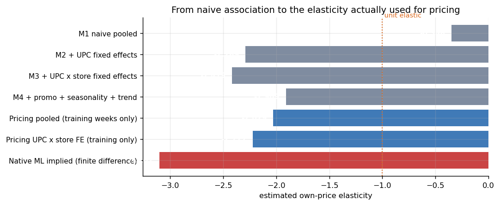

*Figure 4 — Every elasticity estimate in this project on one axis. Grey =
Phase D analysis specifications; blue = the pricing estimates fitted on
training weeks only (the numbers the engine uses); red = the forecaster's own
implied price response. Source: `artifacts/metrics/elasticity.json`,
`elasticity_estimation.json`, `price_response.json`.*

### 28.2 What each step absorbs

**UPC fixed effects (M2).** A separate intercept per product absorbs every
time-invariant product characteristic — brand, format, base demand level, base
price level. The coefficient is now identified from *within-product* price
movement.

Mechanically, the within transformation subtracts product means:

$$\log Q_{it} - \overline{\log Q_i} = \beta_1\left(\log P_{it} - \overline{\log P_i}\right) + \tilde{u}_{it}$$

**UPC × store fixed effects (M3).** Absorbs the store dimension as well, so the
estimate uses only within-store, within-product variation. The move is small
(−2.289 → −2.419) but the *standard error grows 10×* (0.0072 → 0.0711), which
is the honest cost of throwing away between-store variation.

In the per-product estimator the same idea is implemented explicitly by
demeaning within store codes before the regression:

```python
store_codes = pd.factorize(sub["store"])[0]
if n_stores > 1:
    X = _demean(X, store_codes)
    y = _demean(y.reshape(-1, 1), store_codes).ravel()
```

**Promotion + seasonality + trend (M4).** Adds `recorded_promotion_flag`,
`sin52`, `cos52` and a linear `trend = week/100`. This moves the estimate
**back toward zero**, from −2.419 to −1.909.

### 28.3 Why M4 moves in the opposite direction, and why that is reassuring

Steps M2 and M3 remove *composition* bias, which pushed the naive estimate
toward zero. Step M4 removes *promotion-bundling* bias, which pushed it away
from zero. The two biases have opposite signs, and both corrections behave as
theory predicts. If M4 had steepened the estimate further, something would have
been wrong with the story.

### 28.4 The promotion split

Estimated separately with UPC × store fixed effects:

| subsample | elasticity | SE | n | R² |
| --- | ---: | ---: | ---: | ---: |
| recorded promotion | **−2.662** | 0.0074 | 345,945 | 0.2999 |
| no recorded promotion | **−1.830** | 0.0078 | 1,200,000 | 0.0987 |

The 0.83 gap is the bundling problem quantified. Note the caveat from §11.4:
the "no recorded promotion" group certainly contains *uncoded* promotions, so
−1.830 is itself biased toward the promotion value. The true clean-price
elasticity is probably weaker than −1.830, not stronger.

### 28.5 The specification the engine actually uses

The Phase D ladder above is *analysis*. The number that drives recommendations
is fitted separately, on **training weeks 2–257 only**, by
`scripts/estimate_elasticity.py`:

| specification | elasticity | n |
| --- | ---: | ---: |
| **pooled controlled** (UPC × store FE + promo/season/trend) | **−2.0289** | 1,200,000 |
| UPC × store FE only | −2.2217 | 1,200,000 |
| pooled controlled, full training sample | −2.0443 | 3,206,437 |

The pooled controlled figure **−2.029** is the project's headline price
sensitivity, the prior for the empirical-Bayes shrinkage, and the fallback for
every product without a usable own estimate.

Why it differs slightly from M4's −1.909: M4 is fitted on the *whole panel*,
the pricing estimate on the *training window only*. The difference (0.12) is
smaller than the two-way clustered standard error (0.106 → 95% half-width
0.21), so the two are statistically indistinguishable — but they are not the
same number and this report never uses them interchangeably.

---

## 29. Robust and clustered inference

`scripts/audit_elasticity_inference.py` →
`artifacts/metrics/elasticity_inference.json`,
`reports/15_ELASTICITY_INFERENCE_AUDIT.md`.

### 29.1 Why the conventional standard error is wrong here

OLS standard errors assume errors are independent and homoskedastic. In this
panel neither holds, for structural reasons that are easy to name:

* **Within-store persistence.** A store's local demand shock (a new competitor,
  a road closure, a demographic shift) persists for months across all products.
* **Category-wide weekly shocks.** Holidays, weather, the chain's promotion
  calendar and national manufacturer advertising hit *every* product in the
  same week.
* **Within-product persistence.** A brand's national marketing cycle correlates
  its residuals across stores and weeks.

Every one of these means the effective number of independent observations is
far smaller than the 1.2 million rows.

### 29.2 The full covariance audit

Specification A: pooled controlled (UPC × store FE + promo/season/trend),
1.2M subsample. Point estimate **−2.0289** in every row — only the precision
changes.

| covariance assumption | SE | ratio to classical | 95% CI | clusters |
| --- | ---: | ---: | --- | ---: |
| classical (OLS) | 0.00652 | 1.00× | [−2.042, −2.016] | — |
| HC1 (heteroskedasticity-robust) | 0.01161 | **1.78×** | [−2.052, −2.006] | — |
| clustered by UPC × store panel | 0.01533 | 2.35× | [−2.059, −1.999] | 26,413 |
| clustered by store | 0.03045 | 4.67× | [−2.089, −1.969] | 86 |
| clustered by week | 0.08121 | **12.46×** | [−2.188, −1.870] | 255 |
| clustered by UPC | 0.08369 | **12.84×** | [−2.193, −1.865] | 369 |
| **two-way (UPC, week)** | **0.10585** | **16.24×** | **[−2.236, −1.821]** | — |

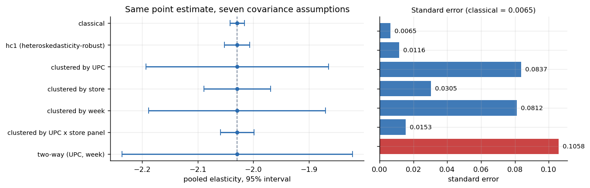

*Figure 5 — The pooled elasticity under classical, HC1 and five clustering
schemes. The point estimate never moves; the interval widens by a factor of
16. Source: `artifacts/metrics/elasticity_inference.json`.*

### 29.3 Reading the ladder

The ordering is itself informative. Clustering at the **UPC × store panel**
level (26,413 clusters) barely helps — 2.35× — because it only captures
persistence within a single series. Clustering by **week** (12.46×) and by
**UPC** (12.84×) each capture a genuinely large correlated dimension.
Two-way (UPC, week) captures both and gives **16.24×**.

Concretely, the published 95% interval goes from **[−2.042, −2.016]** — a
width of 0.026, which would let you claim you know the category elasticity to
the second decimal — to **[−2.236, −1.821]**, a width of 0.415. The second
interval is the honest one, and it comfortably contains M4's −1.909 and the
full-sample −2.044, while **excluding** −2.42 and −3.10.

### 29.4 Per-product inference

| statistic | value |
| --- | ---: |
| products with per-UPC inference | 262 |
| median HC1 standard error | 0.1071 |
| median store-clustered SE | 0.1445 |
| median week-clustered SE | **0.3832** |
| median inflation ratio (robust vs HC1) | **3.38×** |
| p90 inflation ratio | 6.83× |
| share significant at 5% under HC1 | **90.1%** |
| share significant at 5% under robust SE | **75.2%** |

**One product in six that looked significant was not.** Week clustering is
where the damage is: category-wide weekly shocks are the dominant correlated
dimension inside a single product's panel.

### 29.5 The estimator used in production

```python
se = float(np.nanmax([se_store, se_week, se_hc1]))
```

The per-product standard error is the **maximum of the store-clustered,
week-clustered and HC1** estimates — the conservative reading of the available
one-way estimators. Two-way clustering is used at the **pooled** level, where
there are enough clusters in both dimensions for the Cameron-Gelbach-Miller
subtraction to be stable, and deliberately **not** inside a single product,
where it is not (DECISIONS #44). `std_error_hc1` is retained in the output
alongside it, and the ratio between them is what drives the shrinkage weights
(§31).

### 29.6 Validation of the estimators themselves

The covariance estimators in `src/pricing_engine/economics/inference.py` were
**validated against statsmodels to machine precision**
(`reports/15_ELASTICITY_INFERENCE_AUDIT.md`). This matters: hand-rolled
clustered covariance code is a classic source of silent factor-of-two errors,
and "we checked it against a reference implementation" is a different claim
from "we wrote it carefully".

### 29.7 Why this correction was the most consequential in the project

Understated standard errors do not just produce over-confident intervals. In
this architecture they **silently disable the empirical-Bayes shrinkage**,
because the weight `w_i = τ²/(τ² + se_i²)` is pushed toward 1 from both
directions at once when `se_i` is too small (§31.7). Fixing the inference moved
the mean shrinkage weight from **0.954 to 0.780**. An inference bug became a
modelling bug.

---

## 30. Product-level elasticities

### 30.1 Why per-product estimates at all

The category elasticity is a good prior and a poor description. The per-UPC
distribution runs from p10 = −4.094 to p90 = −0.240, and `τ² = 0.766` says
there is genuine between-product variance in *true* elasticities well above
sampling noise. Pricing every product at −2.029 would systematically
under-price the elastic tail and over-price the inelastic tail.

### 30.2 Estimation design

For each UPC, `estimate_per_upc` fits

$$\log Q_{st} = \alpha_s + \beta\,\log P_{st} + \gamma' X_{st} + u_{st}$$

with **store fixed effects absorbed within the product** (so the coefficient
comes from within-store price movement, not cross-store price levels), controls
`recorded_promotion_flag`, `sin52`, `cos52`, `trend`, and panel-robust standard
errors (§29.5). Columns that do not vary within a product are dropped before
inversion (`keep_independent_columns`), so a degenerate control cannot make
`X'X` singular.

### 30.3 Eligibility thresholds

| threshold | value | source |
| --- | ---: | --- |
| minimum observations per UPC | 200 | `elasticity.min_obs_per_upc` |
| minimum distinct prices per UPC | 10 | `elasticity.min_distinct_prices_per_upc` |
| maximum **panel-robust** SE to accept an estimate | 1.5 | `elasticity.max_se_for_product_estimate` |
| sign requirement | `β < 0` | hard-coded in `build_elasticity_table` |

### 30.4 The eligibility funnel

`scripts/audit_eligibility_funnel.py` →
`reports/18_ELASTICITY_ELIGIBILITY_FUNNEL.md`. Every transition is counted with
a stated reason.

| stage | UPCs | lost | reason |
| --- | ---: | ---: | --- |
| UPCs in the processed dataset | **489** | — | survived the raw data audit |
| … present in the modelling table | 476 | −13 | needs ≥1 lagged price and ≥1 lagged demand observation |
| … observed in the training weeks | **372** | −104 | estimation restricted to weeks 2–257 (no validation/test outcomes) |
| … with positive-sales training weeks | 372 | 0 | log demand undefined at zero (0 rows dropped) |
| … with ≥ 200 training observations | 330 | −42 | a per-product regression on fewer rows is not worth reporting |
| … and ≥ 10 distinct prices | 272 | −58 | the price coefficient is identified from price variation |
| … successfully estimated | 272 | 0 | regression converged with finite coefficient and SE |
| … after removing wrong-signed coefficients | 248 | **−24** | a positive price coefficient is evidence of endogeneity, not upward-sloping demand |
| … after removing imprecise coefficients | **239** | **−9** | panel-robust SE must be ≤ 1.5 |

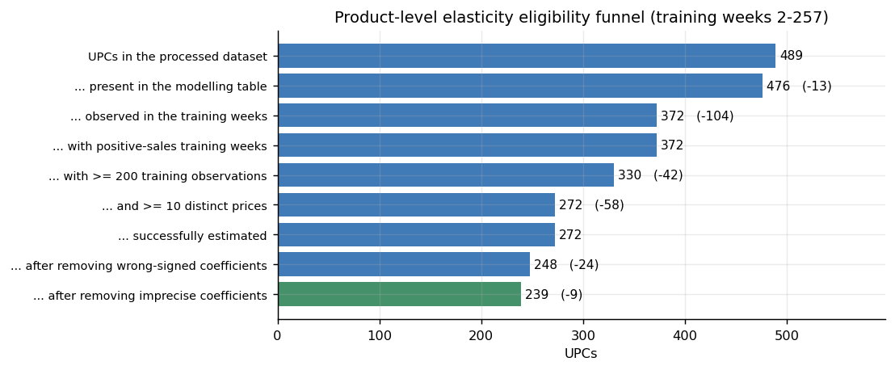

*Figure 6 — 489 UPCs enter, 239 leave with a usable own elasticity. Source:
`artifacts/metrics/elasticity_funnel.json`.*

### 30.5 Rejection summary

| reason | UPCs |
| --- | ---: |
| insufficient observations or price variation | **100** |
| wrong sign | **24** |
| standard error too large | **9** |
| **total rejected of 372 in the training window** | **133** |

### 30.6 Why wrong-signed coefficients are rejected rather than shrunk

A positive price coefficient does not mean demand slopes upward. It means that,
for that product, price moved *with* unobserved demand strongly enough to flip
the sign — the endogeneity problem winning outright. Shrinking such an estimate
toward the pooled value would blend contamination into the prior-weighted
answer instead of discarding it. Rejecting it and falling back to the pooled
estimate is the conservative choice (DECISIONS #35).

Note the difference from the *Phase D analysis*, where **5.1% of UPCs had a
significant positive coefficient**. Here 24 of 272 (**8.8%**) are wrong-signed
at all, significant or not — a slightly different population (training weeks
only, different thresholds) measured a slightly different way. Both numbers are
reported and neither is used as the other.

### 30.7 Coverage at decision time

At week 399 there are **13,964** UPC × store decision contexts:

| elasticity source | contexts | share |
| --- | ---: | ---: |
| `shrunk_product` | **8,962** | **64.18%** |
| `pooled_fallback` | **5,002** | **35.82%** |

**More than a third of decision contexts are priced with the category-level
number.** Those recommendations carry the `POOLED_ELASTICITY_FALLBACK` reason
code and can **never be rated LOW risk** — the risk layer promotes them to at
least MEDIUM (§57.4). That is the mechanism by which an estimation limitation
propagates into a policy consequence instead of disappearing.

### 30.8 Distribution of the shipped product elasticities

Over the 239 products with their own shrunk estimate
(`artifacts/models/elasticity_table.csv`):

| statistic | value |
| --- | ---: |
| mean | −1.954 |
| median | −1.898 |
| standard deviation | 0.769 |
| min / max | −4.058 / −0.331 |
| p25 / p75 | −2.464 / −1.396 |
| clipped to the [0.2, 6.0] band | **0** |

Including the pooled fallback across all 372 products, the final distribution
has median **−2.029**, p10 **−2.790**, p90 **−1.169**.

---

## 31. Empirical-Bayes shrinkage

This is the most statistically substantial component of the project, and the
one that was found to be broken and then fixed.

### 31.1 The problem it solves

You have 239 noisy per-product estimates `ε̂_i` with standard errors `se_i`, and
one precise pooled estimate `μ = −2.029`. Using `ε̂_i` directly over-fits the
noise; using `μ` everywhere throws away real heterogeneity. Empirical Bayes is
the principled compromise.

### 31.2 The hierarchical model

$$\hat{\varepsilon}_i \mid \theta_i \;\sim\; N(\theta_i,\; se_i^2) \qquad\text{(sampling)}$$

$$\theta_i \;\sim\; N(\mu,\; \tau^2) \qquad\text{(between products)}$$

The posterior mean of `θ_i` is a precision-weighted average:

$$\boxed{\;\hat{\theta}_i \;=\; w_i\,\hat{\varepsilon}_i \;+\; (1-w_i)\,\mu, \qquad w_i \;=\; \frac{\tau^2}{\tau^2 + se_i^2}\;}$$

### 31.3 Why the weight has this form, intuitively

`τ²` is how much true elasticities genuinely differ between products. `se_i²`
is how much noise sits on product `i`'s estimate. The weight is the share of
the *observed* variance in `ε̂_i` that is real signal:

* `se_i → 0` (a perfectly precise estimate) ⟹ `w_i → 1` ⟹ keep your own number.
* `se_i → ∞` (pure noise) ⟹ `w_i → 0` ⟹ fall back to the category.
* `τ² → 0` (all products identical) ⟹ `w_i → 0` for everyone ⟹ pool completely.
* `τ² → ∞` (products wildly different) ⟹ `w_i → 1` ⟹ trust each product.

`w_i` is monotonically decreasing in `se_i` and lies in [0, 1] by construction.
`tests/test_shrinkage.py` (12 tests) pins all four limiting cases, the
monotonicity and the bounds.

### 31.4 Estimating `τ²`

Two estimators are implemented.

**Method of moments** — transparent, and what Phase L used:

$$\hat\tau^2_{\text{mom}} \;=\; \max\!\Big(\;\overline{(\hat\varepsilon_i - \mu)^2} \;-\; \overline{se_i^2},\;\; 0\Big)$$

i.e. observed dispersion minus average sampling variance, floored at zero.

**REML** — the shipped default. The standard restricted-likelihood fixed point
from random-effects meta-analysis:

$$w_i = \frac{1}{\tau^2 + se_i^2}, \qquad
\tau^2 \leftarrow \frac{\sum_i w_i^2\left[(\hat\varepsilon_i-\mu)^2 - se_i^2 + \frac{1}{\sum_j w_j}\right]}{\sum_i w_i^2}$$

The `+ 1/Σw` term is the restricted correction for having estimated `μ`;
dropping it gives the ML estimator, which is biased downward. Floored at zero,
because a negative variance is not a variance.

REML is the default because the moment estimator is noisier and truncates at
zero more often (DECISIONS #45).

### 31.5 The prior mean

Two choices are implemented; the shipped one is **`prior_mean: pooled`** —
shrink toward the pooled controlled elasticity, which is *also* the fallback
used for products with no usable estimate. This makes the two internally
consistent: a product with `w_i = 0` and a product with no estimate at all
receive exactly the same number.

The alternative (estimate the prior mean freely from the product coefficients)
gives **−1.933** against the pooled **−2.029** — close enough that this choice
mattered far less than the standard-error fix.

Note also that `τ²` is measured **around the prior mean the shrinkage actually
targets**, not around the sample mean. Measuring dispersion around one centre
while shrinking toward another is internally inconsistent, and Phase L did
exactly that.

### 31.6 The shipped numbers

| quantity | value |
| --- | ---: |
| `τ²` (REML, around the pooled prior) | **0.7661** |
| `τ` | **0.8753** |
| `τ²` (method of moments, same inputs) | 0.6731 |
| prior mean `μ` | **−2.0289** (pooled) |
| prior mean if estimated freely | −1.9334 |
| products used | **239** |
| median per-product **robust** SE | **0.3904** |
| **mean shrinkage weight** | **0.7797** |
| median weight | 0.8341 |
| min / max weight | 0.2693 / 0.9834 |
| converged | true |
| weights monotone in SE | **true** (asserted) |

Weight distribution:

| band | products |
| --- | ---: |
| < 0.25 | 0 |
| 0.25 – 0.50 | 25 |
| 0.50 – 0.75 | 48 |
| 0.75 – 0.90 | **96** |
| 0.90 – 0.99 | 70 |
| > 0.99 | 0 |

That **no** product sits above 0.99 or below 0.25 is the signature of a
shrinkage estimator that is actually doing work. Under the Phase L inputs the
median weight was 0.989 and the distribution piled against the ceiling.

### 31.7 The audit and the correction — how the estimator was found to be broken

`scripts/audit_shrinkage.py` → `reports/14_SHRINKAGE_AUDIT.md` re-derived the
estimator from first principles and ran seven variants on the same data.

| variant | τ² | median SE | **mean weight** | median shrunk ε |
| --- | ---: | ---: | ---: | ---: |
| Phase L: moment τ², sample-mean prior, **HC1** SE, filtered | 0.906 | 0.101 | **0.955** | −1.842 |
| moment τ², pooled prior, HC1 SE, filtered | 0.913 | 0.101 | 0.955 | −1.846 |
| REML τ², pooled prior, HC1 SE, filtered | 0.901 | 0.101 | 0.955 | −1.846 |
| moment τ², pooled prior, **ROBUST** SE, filtered | 0.673 | 0.390 | 0.761 | −1.904 |
| **Phase M (shipped): REML τ², pooled prior, ROBUST SE, filtered** | **0.766** | **0.390** | **0.780** | **−1.898** |
| REML τ², pooled prior, ROBUST SE, **unfiltered** (272 products) | 1.246 | 0.404 | 0.813 | −1.816 |
| REML τ², **free** prior, ROBUST SE, filtered | 0.759 | 0.390 | 0.778 | −1.866 |

**The finding: the formula was correct; the inputs were wrong.** Rows 1–3 show
that changing the `τ²` estimator or the prior mean, holding HC1 standard errors
fixed, moves the mean weight by less than 0.001. Rows 4–5 show that changing
the standard errors — and nothing else — moves it from 0.955 to 0.76–0.78.

The mechanism is that understated standard errors inflate
`w = τ²/(τ² + se²)` **from both directions at once**: the denominator's `se²`
term shrinks directly, *and* `τ²` is estimated as observed dispersion minus
average sampling variance, so under-stating `se²` inflates `τ²` too. Both moves
push `w` toward 1.

The median per-product SE inflation from HC1 to panel-robust is **3.79×**, so
`se²` grows by roughly 14×. That is why a purely inferential bug silently
switched the shrinkage off.

`tests/test_shrinkage.py` now includes a regression test for exactly this
failure mode: that understated standard errors silently disable the shrinkage.

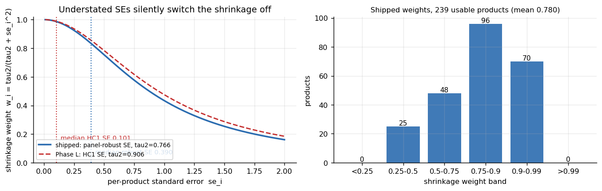

*Figure 7 — Left: `w = τ²/(τ² + se²)` under the shipped panel-robust inputs
(blue) and the Phase L HC1 inputs (red), with each regime's median standard
error marked. At the HC1 median SE of 0.101 the weight is 0.99 — effectively no
shrinkage. At the robust median of 0.390 it is 0.83. Right: the shipped weight
distribution across the 239 usable products. Source:
`artifacts/metrics/shrinkage_audit.json`.*

### 31.8 A worked example from the actual table

UPC **3000006560** (`CAPN CRUNCH JUMBO CR`), the context used throughout this
report:

| quantity | value |
| --- | ---: |
| training observations | 20,125 |
| distinct prices | 215 |
| raw estimate `ε̂_i` | **−3.0178** |
| HC1 standard error | 0.0398 |
| **panel-robust standard error** `se_i` | **0.2557** |
| SE inflation | 6.43× |
| `τ²` | 0.7661 |
| **weight** `w_i = 0.7661 / (0.7661 + 0.2557²)` | **0.9214** |
| pooled prior `μ` | −2.0289 |
| **shrunk** `0.9214 × (−3.0178) + 0.0786 × (−2.0289)` | **−2.9401** |
| clipped? | no |
| source | `shrunk_product` |

Check the arithmetic: `0.2557² = 0.06538`; `0.7661/(0.7661+0.06538) = 0.9214`;
`0.9214 × (−3.0178) = −2.7807`; `0.0786 × (−2.0289) = −0.1595`; sum
= **−2.9401**. ✓

This is a well-identified product — 20,125 observations, 215 distinct prices —
so it keeps 92% of its own estimate. Had the HC1 standard error of 0.0398 been
used, the weight would have been `0.7661/(0.7661+0.00158) = 0.9979` and the
shrunk value **−3.0157** — essentially the raw estimate, with the shrinkage
doing nothing at all.

**A documentation-drift note:** `README.md` §3 quotes this context's elasticity
as "−3.016 (shrunk_product)". That is the *raw* estimate (−3.0178) carrying the
*shrunk* label. The value actually applied by the current artifacts is
**−2.9401**, confirmed by a live `run_demo.py` execution and a live
`/recommend-price` API call on 2026-08-19. This report uses −2.9401 throughout.

### 31.9 Fallback behaviour

```python
def epsilon_for(self, upcs):
    lookup = self.products.set_index("upc")["elasticity_final"]
    return pd.Series(np.asarray(upcs)).map(lookup).fillna(self.pooled).to_numpy("float64")
```

A UPC not in the table, or one whose estimate was rejected, gets the pooled
value and the source string `pooled_fallback`. There is no silent NaN path and
no interpolation.

### 31.10 What shrinkage does and does not buy

**Buys:** stability. Noisy per-product coefficients are pulled toward a
well-identified category value in proportion to how noisy they are, and the
weight is recorded per product so any recommendation can be traced to how much
of its elasticity was its own.

**Does not buy:** identification. If the pooled elasticity is biased by
promotion contamination — and §11.4 argues it is — then **every shrunk product
estimate inherits a share `(1 − w_i)` of that bias**, and the products with the
*least* own information inherit the most. Shrinkage fixes variance, not bias.
This is limitation #34 in `KNOWN_LIMITATIONS.md` and it is stated in exactly
those terms.

---

## 32. Elasticity stability over time

`scripts/audit_elasticity_stability.py` →
`artifacts/metrics/elasticity_stability.json`,
`reports/17_ELASTICITY_STABILITY.md`.

### 32.1 Design

The entire elasticity stack — pooled controlled, UPC × store FE, per-UPC with
panel-robust SEs, REML empirical-Bayes shrinkage — is re-estimated on five
historical windows. **Every window lies strictly inside the approved training
period (weeks 2–257)**, and the script raises rather than run if a window would
cross into validation or test. W1/W2/W3 are **disjoint thirds**, so per-product
comparisons between them use non-overlapping data.

### 32.2 Category-level results

| window | weeks | rows | pooled | SE (two-way) | FE | τ² | mean `w` | usable products | median shrunk | p10 / p90 |
| --- | --- | ---: | ---: | ---: | ---: | ---: | ---: | ---: | ---: | --- |
| W1 early | 2–87 | 979,559 | **−1.903** | 0.223 | −2.279 | 1.016 | 0.663 | 85 / 259 | −1.90 | [−3.12, −0.98] |
| W2 middle | 88–129 | 545,034 | **−2.323** | 0.213 | −3.280 | 1.227 | 0.620 | 87 / 221 | −2.22 | [−3.35, −1.37] |
| W3 late | 130–257 | 1,681,844 | **−2.240** | 0.125 | −2.486 | 1.070 | 0.837 | 218 / 297 | −2.02 | [−3.17, −0.75] |
| W4 expanding | 2–129 | 1,524,593 | −1.917 | 0.166 | −2.304 | 1.045 | 0.682 | 146 / 285 | −1.99 | [−3.02, −1.09] |
| **W5 full window** | **2–257** | **3,206,437** | **−2.029** | **0.106** | **−2.222** | **0.766** | **0.780** | **239 / 372** | **−1.90** | **[−3.05, −0.95]** |

The pooled estimate ranges over **0.420** between the most extreme windows.

### 32.3 Is that drift or noise? A formal test

Using each window's own two-way clustered standard error on the three
**disjoint** windows:

| pair | pooled A | pooled B | difference | SE of difference | **z** | significant at 5%? |
| --- | ---: | ---: | ---: | ---: | ---: | --- |
| W1 vs W2 | −1.903 | −2.323 | +0.420 | 0.309 | **+1.36** | no |
| W1 vs W3 | −1.903 | −2.240 | +0.337 | 0.256 | +1.32 | no |
| W2 vs W3 | −2.323 | −2.240 | −0.083 | 0.247 | −0.33 | no |

**Largest absolute z between disjoint windows: 1.36.** No pair differs by more
than sampling noise once the panel clustering is admitted. **The category
elasticity is stable within the precision this data supports.**

Note how much the inference work in §29 is doing here. Under classical standard
errors these differences would be enormously significant, and the project would
have concluded that elasticity drifts violently over time. The correct
covariance assumption changes the scientific conclusion, not just the interval.

### 32.4 Product-level stability

| pair | common products | Spearman rank corr | Pearson | sign stability (raw) | median abs difference |
| --- | ---: | ---: | ---: | ---: | ---: |
| W1 vs W2 | 34 | **−0.054** | −0.054 | 100.0% | 0.952 |
| W1 vs W3 | 34 | +0.350 | +0.294 | 100.0% | 0.753 |
| W2 vs W3 | 34 | +0.187 | +0.175 | 100.0% | 0.695 |

**Median pairwise rank correlation: +0.187.** **Median sign stability: 100%.**

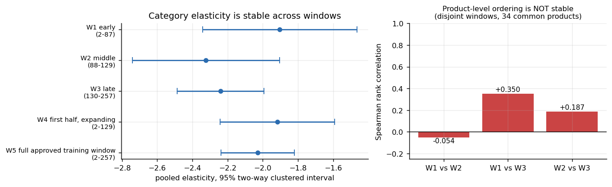

*Figure 8 — Left: pooled elasticity with 95% two-way clustered intervals across
all five windows; every interval overlaps every other. Right: Spearman rank
correlation of shrunk product elasticities between disjoint windows. Source:
`artifacts/metrics/elasticity_stability.json`.*

### 32.5 What this means for pricing policy

The two findings pull in opposite directions and both must be stated.

**Defensible:** "cereal demand in this chain is elastic, around −2, and that is
stable across the training period." The category number reproduces.

**Not defensible:** "product X is more price-sensitive than product Y, and that
ordering is a durable asset." A rank correlation of +0.19 between disjoint
windows means the *ordering* barely reproduces. The magnitudes differ by a
median of 0.70–0.95 in absolute elasticity between windows — which is roughly
the size of `τ` (0.875) itself.

Sign stability of 100% is the one genuinely encouraging product-level result:
whatever else moves, a product that looked elastic in one window looked elastic
in the others.

**Consequences the project actually draws:**

1. Product-level elasticity must not be described as a durable asset
   (`STATUS.md`, open issue 5).
2. The shrinkage is doing more work than it appears — pulling unstable product
   estimates toward a stable category number is exactly the right response to
   this pattern.
3. A long-lived pricing policy built on product-specific elasticities would
   decay. Re-estimation cadence is a real operational requirement, not a
   nice-to-have.
4. Only 34 products are common to all three disjoint windows, so the
   product-level conclusion itself rests on a thin sample and is reported with
   that caveat.

---

## 33. Causal limitations

This chapter is the boundary condition on everything else in this report.

### 33.1 The formal statement

The engine estimates the **observational conditional distribution**

$$P\big(Q \mid \text{Price} = p,\; X\big)$$

The pricing decision requires the **interventional distribution**

$$P\big(Q \mid do(\text{Price} = p),\; X\big)$$

These are equal only if price is assigned independently of everything else that
affects demand — conditional on the observed covariates. In this data it
demonstrably is not.

$$P(Q \mid \text{Price}, X) \;\neq\; P(Q \mid do(\text{Price}), X)$$

### 33.2 The project's own evidence that they differ

A **seven-fold** change in the headline coefficient (−0.348 → −2.419) produced
purely by adding controls nobody could argue against. If the naive association
were the causal effect, controls would not move it.

And nothing guarantees the last specification is causal either — it is only the
*least contaminated* of the four.

### 33.3 The specific threats, with evidence

**1. Promotion bundling.** Bonus Buys arrive with feature ads and display that
the data does not record. Estimated separately: −2.662 on promotion weeks
versus −1.830 on non-promotion weeks.

**2. Incomplete promotion coding.** 94.55% of rows carry no code, and two
undocumented codes (`G`, `L`) exist. Every promotion control is partial by
construction, so the "clean" subsample is not clean.

**3. Retailer anticipation / reverse causality.** Prices are cut *because* a
demand surge is expected. Low price and high demand then coincide for reasons
unrelated to the price. The direction of the resulting bias cannot be signed a
priori.

**4. Seasonality and trend.** Category demand and price levels both drift over
eight years; the monitoring artifact shows the reference price level rising
~12.5% between the training and test windows.

**5. Store heterogeneity and zone pricing.** Zones were tied to local
competition and demographics. Cross-store price differences reflect local
demand, not exogenous variation — which is why store fixed effects move the
estimate.

**6. Product heterogeneity.** p10 −4.094 to p90 −0.240, with 5.1% of UPCs
showing a *significant positive* coefficient. Those are not bad data; they are
series where price moves with unobserved demand.

**7. Stock-outs.** Unavailability and demand collapse are indistinguishable in
scanner data.

**8. Competitive response.** Rival stores' prices are entirely unobserved.

### 33.4 About the Dominick's experiments

The Dominick's research programme at Chicago Booth **did** include in-store
pricing experiments in several categories. **This project claims none of its
estimates are experimental.** The Cereals movement file used here carries no
experiment assignment, no treatment window and no randomisation indicator that
could be verified, so nothing here is claimed as causal identification.

### 33.5 What genuine causal pricing claims would require

In rough order of strength:

| approach | what it needs | feasible on this data? |
| --- | --- | --- |
| **Randomised price experiment** | prices assigned at random within stores/weeks; the design in `docs/PRICING_EXPERIMENT.md` | **no** — no randomisation exists in this extract; requires a live retailer |
| **Instrumental variables** | an instrument that shifts price without affecting demand directly — e.g. wholesale-cost shocks, distance-to-warehouse fuel costs, upstream trade-deal calendars | **no** — no such instrument is present in this file |
| **Natural experiment / regression discontinuity** | a documented policy change, zone reassignment or discrete pricing rule | **no** — none identified in the Cereals extract |
| **Difference-in-differences** | a treated and a control group with credible parallel pre-trends | **no** — no exogenous treatment to define |
| **Causal ML (double ML, causal forests)** | still requires unconfoundedness given observables — it improves *estimation*, not *identification* | **would not fix it** — the confounders here are unobserved |

The last row is worth emphasising because it is a common interview trap:
double machine learning and causal forests are **estimation** technologies.
They relax functional-form assumptions; they do not manufacture identification.
Applying them here would produce a more flexible, equally confounded estimate.

### 33.6 What this project does instead

It does not pretend. Specifically:

* elasticity results are labelled **observational elasticity estimates**
  throughout;
* the counterfactual uplift metric is named
  `model_internal_estimated_profit_uplift_pct` — the circularity is in the
  field name, where it cannot be dropped from a slide;
* the out-of-time validation report opens with a boxed warning that it is
  predictive, not causal (§45);
* `scripts/audit_claims.py --strict` scans the whole repository for ten watched
  phrases and fails the build if an UNSUPPORTED claim reappears — currently
  **0 UNSUPPORTED** across 49 files and 363 occurrences — re-run with this
  report itself included;
* the experiment that *would* settle it is fully designed in
  `docs/PRICING_EXPERIMENT.md` and explicitly **not run**.

---
---
# PART VI — DEMAND FORECASTING

## 34. Modelling objective

$$\hat{Q} = f(P,\, X)$$

where `X` is the decision-time context of §20. The model is fitted by
minimising a loss on **observed** `(P, X, Q)` triples — that is, it learns the
conditional expectation of demand at prices that were actually charged.

### 34.1 Prediction and price response are different jobs

| | forecasting | price response |
| --- | --- | --- |
| question | what will demand be next week? | what would demand be at a price we did not charge? |
| evaluated on | realised outcomes at observed prices | nothing directly observable |
| dominant signal | lags, seasonality, promotion, series level | the price coefficient alone |
| a good answer needs | conditional-mean accuracy | correct *slope*, identified |
| this project's metric | WAPE 0.4565 on 749,040 held-out rows | no direct offline metric exists |

A model can be excellent at the left column and wrong in the right one, because
at observed prices the lag and context features carry most of the signal and
the price coefficient can absorb whatever is left. That is not a hypothetical
here: the selected model is the best forecaster in the comparison *and* has an
implied elasticity (−3.102) materially steeper than every controlled
econometric estimate (§42).

Part VI is entirely about the left column. Part VII is about the right one.

---

## 35. Temporal train / validation / test split

### 35.1 The split

`temporal_split()` orders the distinct week indices and cuts at fixed fractions
(70 / 15 / 15 from `configs/config.yaml → modeling`).

| split | weeks | dates | rows | share |
| --- | --- | --- | ---: | ---: |
| **train** | **2 – 257** | 1989-09-21 … 1994-08-11 | **3,206,437** | 68.6% |
| **validation** | **258 – 342** | 1994-08-18 … 1996-03-28 | **715,856** | 15.3% |
| **test** | **343 – 399** | 1996-04-04 … 1997-05-01 | **749,040** | 16.0% |
| | 365 distinct weeks | | 4,671,333 | 100% |

The split is on **weeks**, not rows, which is why the row shares are not
exactly 70/15/15 — later weeks carry more active series.

Week 1 does not appear: it is entirely consumed by the "no lagged history"
drop (§22.5).

### 35.2 Why a random split would be indefensible

Three distinct failures, all of which a random split commits at once:

**(a) Within-series future leakage.** A random split puts week 300 of a series
in train and week 299 in test. But `lag_move_1` for week 300 *is* week 299's
demand. The model would be given the test row's target as a training feature.

**(b) Autocorrelation.** Weekly demand is strongly autocorrelated. Neighbouring
weeks are near-duplicates, so a random split makes train and test
near-identical and the metric measures interpolation, not forecasting.

**(c) Regime leakage.** The panel spans eight years of price-level drift
(§18.2). A random split lets the model see the 1996 price regime while
"predicting" it.

The combined effect is a metric that is optimistic by a wide and unknowable
margin. `tests/test_features.py::test_temporal_split_is_chronological_and_disjoint`
asserts the split is chronological and the three sets are disjoint.

### 35.3 How the split is used

* **Train (2–257)**: model fitting, the UPC demand prior, the prediction cap,
  and — separately — the entire elasticity table.
* **Validation (258–342)**: model *selection*. The rule was fixed in advance:
  lowest validation WAPE among **price-aware** models.
* **Test (343–399)**: scored **once**, after selection, for the final report.
  No tuning decision was made on it.

That last point is leakage channel #9 and the guard is procedural rather than
mechanical — but the training log in `artifacts/metrics/model_metrics.json`
records both windows for every model, so the sequence is auditable: only M1 and
M2 (the two price-aware models) carry validation metrics, and only the selected
M1 carries a `test` block plus segment breakdowns.

### 35.4 The elasticity window is *stricter* than the model window

The elasticity table is fitted on weeks **2–257 only** — the same as the model
training window. This is deliberate and it is leakage channel #11: an elasticity
fitted on the full panel would embed validation and test outcomes into every
recommendation scored in those weeks. The window is recorded in the elasticity
table metadata and the estimation script aborts if any input row exceeds it.

---

## 36. Baselines

Four naive baselines were implemented in
`src/pricing_engine/models/baselines.py`. None is price-aware — which is the
point: they establish how much of weekly demand is predictable from *series
level and season alone*, with no reference to price.

| model | formula | intuition |
| --- | --- | --- |
| **M0a** last-week naive | Q̂ₜ = Qₜ₋₁ | random walk; the classic hard-to-beat forecast baseline |
| **M0b** rolling-mean(4) | Q̂ₜ = 1/4Σⱼ₌₁⁴ Qₜ₋ⱼ | smooths week-to-week noise |
| **M0c** series historical mean | Q̂ₜ = Q̄_(series, train) | the series' long-run level |
| **M0d** seasonal naive (52w) | Q̂ₜ = Qₜ₋₅₂ | same week last year |

### 36.1 Results

| model | valid WAPE | valid MAE | valid RMSE | valid bias | test WAPE | test MAE | test RMSE | test bias |
| --- | ---: | ---: | ---: | ---: | ---: | ---: | ---: | ---: |
| M0a last-week naive | 0.8007 | 15.251 | 63.889 | +0.075 | 0.7735 | 14.407 | 88.014 | +0.141 |
| **M0b rolling-mean(4)** | **0.7471** | 14.230 | 51.926 | +0.219 | **0.7326** | 13.644 | 70.211 | +0.227 |
| M0c series historical mean | 0.7607 | 14.489 | **47.196** | +1.971 | 0.7441 | 13.860 | **62.329** | +1.443 |
| M0d seasonal naive (52w) | 0.7920 | 15.086 | 56.413 | +0.794 | 0.8207 | 15.287 | 76.395 | +1.041 |

### 36.2 Reading the baselines

**M0b is the best naive model** on both WAPE and MAE — smoothing beats the pure
random walk, which tells you weekly demand here is noisy around a slowly moving
level rather than a true random walk.

**M0c has the lowest RMSE but a worse WAPE** than M0b. That is not a
contradiction: RMSE punishes large errors quadratically, and a long-run mean
never chases a spike, so it avoids the catastrophic misses that a lagged
forecast makes on the week *after* a promotion. It pays for that with a large
positive bias (+1.97 units) — it systematically over-forecasts, because the
mean of a right-skewed series sits above its median.

**M0d is the worst on the test window** (0.8207, and worse than on validation).
Year-ago demand is a poor guide in a category where promotion timing shifts
between years — which is itself useful evidence that the seasonality here is
*not* a rigid annual pattern.

**Every baseline has positive bias; the selected model has negative bias.**
Naive methods over-forecast because they chase past spikes; the log-target
ridge under-forecasts because `E[exp(x)] > exp(E[x])` and the model is fitted
on the log scale (§41.4).

### 36.3 Their real purpose

WAPE 0.73–0.82 is the price of admission. Any price-aware model that cannot
beat 0.73 on the test window is not adding information about price — it is just
a more expensive way of computing a moving average. The selected model reaches
**0.4565**, a **37.7% relative improvement** over the best baseline. That gap
is the evidence that the feature set and the price signal carry real
information.

---

## 37. Ridge log-log model (M1 — selected)

### 37.1 Specification

$$\log(1 + Q) \;=\; \beta_0 \;+\; \beta_p \log P \;+\; \boldsymbol{\beta}_n' \mathbf{Z}_n \;+\; \boldsymbol{\beta}_c' \mathbf{D}_c \;+\; \epsilon$$

fitted by ridge regression with L2 penalty `α = 1.0`, then inverted with
`expm1` and clipped:

$$\hat{Q} = \min\!\Big(\max\big(e^{\hat{y}} - 1,\; 0\big),\; \text{cap}\Big)$$

### 37.2 Why the log target

1. **Weekly demand is heavy-tailed** (mean 14, max 18,688). On the raw scale a
   handful of promotional store-weeks would dominate the squared-error loss.
2. **`log(1+Q)` makes the model multiplicative**, which is what demand
   economics implies: a promotion multiplies volume, a price change scales it.
3. **It makes `β_p` directly interpretable** as a partial elasticity — although
   see §37.7 for why that reading is misleading here.
4. `log1p` rather than `log` handles `Q = 0` gracefully (moot in this dataset,
   but correct).

### 37.3 Feature preprocessing

```python
numeric = Pipeline([("impute", SimpleImputer(strategy="median")),
                    ("scale",  StandardScaler())])
categorical = OneHotEncoder(handle_unknown="ignore", min_frequency=50)
pre = ColumnTransformer([("num", numeric, list(self.numeric_features)),
                         ("cat", categorical, list(CATEGORICAL_FEATURES))])
Pipeline([("pre", pre), ("ridge", Ridge(alpha=alpha, random_state=self.seed))])
```

| choice | reason |
| --- | --- |
| median imputation | robust to the heavy tail; means would be dragged by spikes |
| standardisation | ridge penalises coefficients on their own scale, so unscaled features get arbitrarily different shrinkage |
| `handle_unknown="ignore"` | an unseen store at inference time produces an all-zero block, not a crash |
| `min_frequency=50` | rare categories are pooled instead of getting a coefficient fitted on a handful of rows |
| `log1p` on demand-level features | `LOG1P_FEATURES` — the lagged/rolling demand columns are as heavy-tailed as the target |

### 37.4 The 26 feature columns

Numeric (24, after exclusions): `log_price`, `price_vs_last_week`,
`price_vs_series_reference`, `price_vs_recent_mean`, `lag_move_1..4`,
`roll_mean_move_4/8/13`, `roll_std_move_4`, `lag_price_1`, `lag_price_2`,
`roll_mean_price_4`, `series_reference_price`, `decision_time_unit_cost`,
`lag_promotion_1`, `recorded_promotion_flag`, `series_age_weeks`,
`package_size_oz`, `upc_demand_prior`, `sin52`, `cos52`.

Categorical (2, one-hot): `store`, `com_code`.

### 37.5 Two features that are *not* there, and why

**`time_index` is excluded from the linear model only.** A standardised,
unbounded, monotone trend extrapolated into a future window explodes once the
log prediction is exponentiated. Observed WAPE before the fix: **27.9**
(DECISIONS #16). Trees saturate at the edge of their training range, so the
boosted model keeps it. The monitoring artifact confirms the diagnosis
independently: `time_index` has the largest PSI of any feature (12.41) between
the training and test windows.

**`upc` is not used as a raw categorical.** 489 one-hot columns would be
unwieldy, and `HistGradientBoostingRegressor` caps native categorical
cardinality at 255 anyway. Instead the model learns a **smoothed UPC demand
prior** on training rows only:

$$\text{prior}_u \;=\; \frac{\sum_{i \in u} \log(1+Q_i) \;+\; \lambda\,\bar{y}}{n_u \;+\; \lambda}, \qquad \lambda = 50$$

```python
self.upc_prior_ = (stats["sum"] + UPC_PRIOR_SMOOTHING * self.global_prior_) / (
                   stats["count"] + UPC_PRIOR_SMOOTHING)
```

This is empirical-Bayes shrinkage again, in a different guise: a product with
few training rows is pulled toward the global mean log-demand. Fitted on
training rows only, so it cannot leak; unseen UPCs at inference get the global
prior via `.fillna(self.global_prior_)`.

### 37.6 The prediction cap

```python
PREDICTION_CAP_MULTIPLE = 5.0
self.prediction_cap_ = float(np.nanmax(y) * PREDICTION_CAP_MULTIPLE)
```

Exponentiating a linear prediction can explode on extreme inputs. Predictions
are clipped to 5× the largest weekly demand ever observed in training. The cap
is stored **in the artifact**, so it travels with the model and is visible to
anyone auditing it (limitation #13). It is a documented safety bound, not a
silent clip.

### 37.7 Interpreting the price coefficient — a trap the code warns about

The raw ridge coefficient on `log_price` is **−0.0135**. That is *not* the
model's price response, and the code says so in a docstring:

```python
def raw_price_coefficient(self) -> float | None:
    """Ridge coefficient on ``log_price``, back on the raw scale.

    This is NOT the model's price response: ``log_price`` is collinear with
    the relative-price features and with lagged prices, so the response is
    spread across several coefficients. Use :meth:`implied_elasticity` for
    the number that actually matters.
    """
```

`log_price` sits alongside `price_vs_last_week`, `price_vs_series_reference`,
`price_vs_recent_mean`, `lag_price_1`, `lag_price_2`, `roll_mean_price_4` and
`series_reference_price` — all of which move when the price moves. Ridge spreads
the response across the whole collinear block. Reading −0.0135 as "the
elasticity is −0.01" would be badly wrong.

### 37.8 The correct way to measure the model's price response

`implied_elasticity()` measures it by **central finite difference**, recomputing
*every* price-dependent feature at `(1 ± rel)·p`:

```python
q_up = self.predict(recompute_price_features(d, base * (1.0 + rel)))
q_dn = self.predict(recompute_price_features(d, base * (1.0 - rel)))
elasticity = (np.log(q_up + eps) - np.log(q_dn + eps)) / (np.log(1+rel) - np.log(1-rel))
```

This is model-family agnostic — it works identically for the linear and the
boosted model — and it measures **the elasticity the optimizer will actually
exploit**, which is the only one that matters.

Results with `rel = 0.02` on a 50,000-row sample:

| window | median | mean | p10 | p90 | share negative |
| --- | ---: | ---: | ---: | ---: | ---: |
| validation (at training time) | **−3.322** | −3.345 | −3.862 | −2.980 | 99.996% |
| test (at evaluation time) | **−3.188** | −3.259 | −3.747 | −2.833 | 99.988% |
| 300 decision contexts, ±30% sweep (Phase F) | **−3.102** | — | −3.482 | −2.667 | 100% |

All three are steeper than every controlled econometric estimate. §42 is about
what was done in response.

### 37.9 Training cost

31.0 seconds to fit on 3,206,437 rows — against 181.9 s for the boosted model.

---

## 38. Gradient-boosting model (M2)

### 38.1 Specification

`HistGradientBoostingRegressor` with **Poisson loss**, on the raw (untransformed)
target.

| hyperparameter | value | reason |
| --- | --- | --- |
| `loss` | **poisson** | the right likelihood for weekly counts; guarantees `Q̂ ≥ 0` by construction |
| `learning_rate` | 0.06 | conservative, paired with many iterations |
| `max_iter` | 500 | |
| `max_leaf_nodes` | 63 | moderately deep interactions |
| `min_samples_leaf` | 40 | regularisation on a 3.2M-row panel |
| `l2_regularization` | 1.0 | |
| `early_stopping` | **False** | the internal split would be random, breaking the chronological discipline |
| `max_bins` | 255 | default |
| `categorical_features` | `"from_dtype"` | native categorical handling for `store`, `com_code` |
| `random_state` | 42 | |

The `early_stopping=False` choice is worth naming: `HistGradientBoosting`'s
internal early-stopping split is *random*, which would leak future weeks into
the stopping decision. A fixed iteration budget with strong per-leaf
regularisation is the disciplined alternative.

### 38.2 Results

| | valid WAPE | valid MAE | valid RMSE | valid bias | valid sMAPE | fit time |
| --- | ---: | ---: | ---: | ---: | ---: | ---: |
| **M1 ridge log-log** | **0.4135** | **7.875** | 39.597 | −3.706 | 0.3807 | 31.0 s |
| M2 HGB Poisson | 0.4226 | 8.050 | **38.378** | **+0.363** | 0.3809 | 181.9 s |

M2 has a **lower RMSE** (38.378 vs 39.597) and a **far better bias** (+0.363 vs
−3.706) — the Poisson loss on the raw scale is unbiased where the log-target
model is not. But it loses on WAPE, MAE and sMAPE, and the selection rule was
fixed in advance on WAPE.

M2 was **not scored on the test window**, correctly: only the selected model is.

### 38.3 The decisive problem with M2 — its price response

| | median | mean | p10 | p90 | **share negative** |
| --- | ---: | ---: | ---: | ---: | ---: |
| M1 implied elasticity | −3.322 | −3.345 | −3.862 | −2.980 | **99.996%** |
| **M2 implied elasticity** | **−4.512** | **−5.069** | **−10.109** | **−0.389** | **93.02%** |

Read the last column first. **For 7% of sampled contexts the boosted model
implies that raising the price *increases* demand.** That is not a subtle
calibration issue — it is an upward-sloping demand curve, and an optimizer
handed one will happily recommend a price increase for the wrong reason
entirely.

Read the spread second. M2's implied elasticity runs from **−10.1 at p10 to
−0.39 at p90** — a 26-fold range. M1's runs from −3.86 to −2.98, a 1.3-fold
range. The tree model's price response is wildly unstable across contexts.

The mechanism is easy to state: gradient-boosted trees fit **step functions**.
Near a split threshold the local price derivative is enormous; between
thresholds it is exactly zero; and nothing in the objective constrains the
response to be monotone. Sign, magnitude and smoothness of the price response
are all unconstrained.

`monotonic_cst` (monotonic constraints) is available in scikit-learn and would
address the sign problem. It was not used here — a legitimate criticism of this
project and an obvious extension (§102).

### 38.4 Was M2 wasted?

No. It establishes three things that only a second model family can establish:

1. **The linear model is not leaving obvious accuracy on the table.** A strong
   boosted model with 500 iterations and native categoricals scored *worse* on
   the selection metric, so the log-linear structure is not a crude
   approximation here.
2. **Price-response instability is a model-family property, not a data
   property.** Two models on identical features give −3.32 and −4.51 with
   completely different dispersions.
3. **It is the counter-example that justifies the price-aware selection
   restriction** (§39.2).

---

## 39. Model comparison

### 39.1 The complete table

Chronological split: train weeks 2–257, validation 258–342, test 343–399.
Validation `n = 715,856`; test `n = 749,040`.

| model | price-aware | valid WAPE | valid MAE | valid RMSE | valid bias | test WAPE | test MAE | test RMSE | test bias | interpretability | price-response suitability |
| --- | :--: | ---: | ---: | ---: | ---: | ---: | ---: | ---: | ---: | --- | --- |
| M0a last-week naive | no | 0.8007 | 15.251 | 63.889 | +0.075 | 0.7735 | 14.407 | 88.014 | +0.141 | trivial | **none** — no price term |
| M0b rolling-mean(4) | no | 0.7471 | 14.230 | 51.926 | +0.219 | 0.7326 | 13.644 | 70.211 | +0.227 | trivial | **none** |
| M0c series historical mean | no | 0.7607 | 14.489 | 47.196 | +1.971 | 0.7441 | 13.860 | 62.329 | +1.443 | trivial | **none** |
| M0d seasonal naive (52w) | no | 0.7920 | 15.086 | 56.413 | +0.794 | 0.8207 | 15.287 | 76.395 | +1.041 | trivial | **none** |
| **M1 ridge log-log** ✅ | **yes** | **0.4135** | **7.875** | 39.597 | −3.706 | **0.4565** | **8.503** | 72.064 | −3.883 | **high** — linear, inspectable | **usable but too steep** (implied −3.10) |
| M2 HGB Poisson | yes | 0.4226 | 8.050 | **38.378** | **+0.363** | *not scored* | — | — | — | low | **unsafe** — 7% wrong-signed, p10 −10.1 |

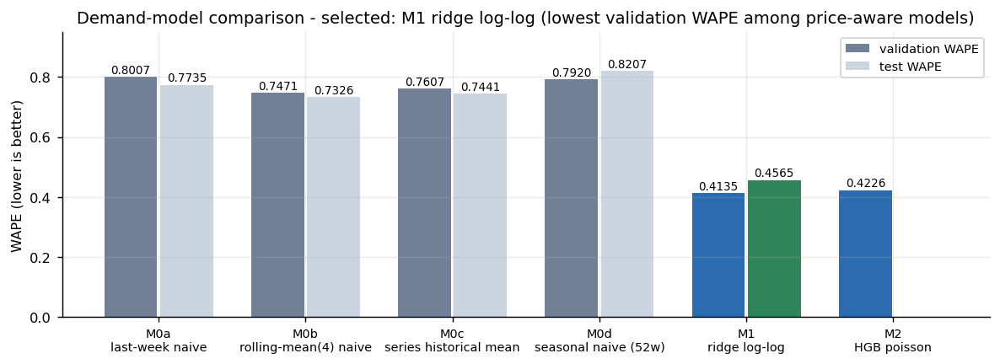

*Figure 9 — Validation and test WAPE for all six models. Grey = not
price-aware. Only the selected model was scored on the test window. Source:
`artifacts/metrics/model_metrics.json`.*

### 39.2 Why selection was restricted to price-aware models

This restriction is still in force and it is not arbitrary. The system's
purpose is to answer *"what happens if we change the price?"*. A model with no
price term answers that question with "nothing" — and M0b would have been a
perfectly respectable *forecaster* at WAPE 0.7326.

Selecting on forecast accuracy alone, across a candidate set that includes
price-blind models, would eventually select a model that cannot do the job at
all. The restriction encodes the actual requirement in the selection rule.

### 39.3 Test-set discipline

Only M1 has a `test` block in `model_metrics.json`. Selection used the
validation window; the test window was scored **once**, after the decision, and
never revisited. Reloading the persisted artifact and re-scoring gives a
**reload WAPE difference of exactly 0.00e+00** (`scripts/evaluate.py` →
`artifacts/metrics/evaluation.json`), so the reported test number is a property
of the saved model, not of the training session's memory.

---

## 40. Why Ridge won

"Because validation WAPE was lower" is the decision rule, not the explanation.
Here are the mechanisms, with the evidence for each.

### 40.1 The gap is small, and that is itself informative

0.4135 vs 0.4226 — a **2.2% relative** difference. The honest first statement
is that a well-specified linear model and a 500-iteration gradient booster are
**roughly equally good** at this task. Anyone claiming a decisive victory for
either has over-read a 0.009 WAPE gap.

### 40.2 Strong log-linear structure

Retail demand really is close to multiplicative: promotion multiplies, price
scales, seasonality modulates. `log(1+Q) ~ log(P) + log-lags` is not a
convenient approximation here — it is close to the correct functional form.
When the true structure is (log-)linear, a linear model with the right
transforms wins, because the tree has to *rediscover* a smooth surface by
stacking axis-aligned steps.

**Evidence:** the `LOG1P_FEATURES` transform is applied to exactly the
demand-level features, and the resulting model beats a booster given the same
raw features and full freedom to find interactions.

### 40.3 Well-designed features leave little for interactions to find

The feature set already encodes the interactions that matter:

* `price_vs_last_week`, `price_vs_series_reference`, `price_vs_recent_mean` are
  *ratios* — they encode price × history interactions explicitly;
* `upc_demand_prior` encodes the product-level demand scale, which is the main
  thing a tree would otherwise have to learn by splitting;
* `sin52`/`cos52` encode annual seasonality smoothly.

A booster's advantage is discovering interactions you did not encode. When you
have encoded them, the advantage shrinks to noise. This is the clearest
practical lesson in the modelling section: **feature engineering transferred
the boosted model's edge into the linear model.**

### 40.4 Regularisation on a very noisy panel

Weekly UPC × store demand is noisy: median 8 units, p99 103, max 18,688. Ridge
with `α = 1.0` on standardised features applies uniform shrinkage across the
collinear price block, which is close to the right prior when several
correlated features carry the same signal. The booster, with 500 iterations, 63
leaves and no early stopping, has far more capacity to fit noise — and its
`min_samples_leaf = 40` is the only thing holding it back.

### 40.5 Limited incremental non-linear signal *in this category*

Cereal is a stable, mature category. There is no evidence in these results of a
strong threshold effect ("demand collapses above $4.49") that a tree would
capture and a linear model would miss. The booster's lower RMSE (38.378 vs
39.597) suggests it *does* fit the extreme promotional weeks somewhat better —
which is exactly where trees should help — but that gain is outweighed on
WAPE, which is volume-weighted rather than squared-error weighted.

### 40.6 The tie-breaker that actually mattered: interpretability and safety

Even had the numbers been reversed, M2 would have been a problem:

| property | M1 | M2 |
| --- | --- | --- |
| implied elasticity, median | −3.322 | −4.512 |
| implied elasticity, p10 / p90 | −3.862 / −2.980 | **−10.109 / −0.389** |
| share of contexts with a **negative** (correct-signed) response | **99.996%** | **93.02%** |
| demand curve monotone decreasing across a ±30% sweep | **100% of 300 contexts** | not validated |
| price coefficient inspectable | yes | no |
| fit time | 31 s | 182 s |

A pricing engine built on a response that points the wrong way 7% of the time
would produce a confidently wrong price increase roughly once every fourteen
recommendations.

### 40.7 The honest caveat

M1 won **and its price response is still too steep** (−3.10 vs a controlled
−1.9 to −2.4). Winning the forecasting comparison did not make it right about
price. That is the subject of Part VII, and it is the finding that reshaped the
whole architecture.

---

## 41. Error analysis

All figures below are the **selected model on the test window**
(weeks 343–399, `n = 749,040`).

### 41.1 Headline test metrics

| metric | value |
| --- | ---: |
| **WAPE** | **0.4565** |
| MAE | 8.503 units |
| RMSE | 72.064 units |
| bias (mean signed error) | **−3.883 units** |
| sMAPE | 0.4000 |

### 41.2 What WAPE 0.4565 means in business terms

$$\text{WAPE} = \frac{\sum_i |Q_i - \hat{Q}_i|}{\sum_i Q_i}$$

WAPE is **volume-weighted**, so it is dominated by the store-weeks that matter
commercially, and it is well defined when individual weeks are zero.

**0.4565 means: across all test store-weeks, the total absolute forecast error
equals 45.65% of total actual units.** Equivalently, for a typical store-week
selling 19 units, the model is off by about 8.5 units.

Is that good? Three reference points:

1. **Against the best naive baseline (0.7326), it is a 37.7% relative
   improvement.**
2. **For weekly UPC × store retail demand, 0.40–0.55 is a normal range.** At
   this grain, most of the variance is genuinely irreducible: shopper arrival
   is a stochastic process, competitor activity is unobserved, and a single
   basket can double a slow item's week.
3. **It is an honest number.** It was measured once, on a chronologically held
   out window, after selection, and it is *worse* than the validation number
   (0.4135) — as an honest temporal split usually is.

The business consequence is the important part: **any counterfactual profit
difference smaller than this error deserves scepticism.** That is the entire
rationale for the materiality threshold (§53.9). A 1% predicted uplift computed
from a model with 46% error on a single store-week is noise; the threshold
turns that observation into a decision rule.

### 41.3 Error by promotion state — the dominant split

| segment | n | units | MAE | RMSE | **WAPE** | **bias** |
| --- | ---: | ---: | ---: | ---: | ---: | ---: |
| no recorded promotion | 691,836 | 9,868,496 | 5.336 | 56.089 | **0.3741** | −1.125 |
| **recorded promotion** | 57,204 | 4,082,965 | **46.800** | **173.070** | **0.6557** | **−37.238** |

This is the single most important error pattern in the project.

* **7.6% of rows carry 29.3% of the units.** Promotion weeks are where the
  volume is.
* **MAE is 8.8× higher on promotion weeks** (46.8 vs 5.3 units).
* **The bias on promotion weeks is −37.2 units per row.** The model
  systematically and massively **under-forecasts promotional lift.**

Why: the model knows *whether* a promotion code is present, but not its depth,
its display support, its feature-ad placement or its co-op funding. A Bonus Buy
that triples volume and one that adds 20% look identical in the feature set.
The model learns the average lift and misses both tails.

**Consequence for pricing:** the engine is least reliable exactly where price
moves most. This is why the risk layer promotes contexts with
`promotion_share > 0.5` out of LOW risk — "more than half of this series' weeks
carry a promotion code: the price effect is entangled with promotion activity"
(§57.4).

### 41.4 Why the model under-forecasts overall (bias −3.883)

Two mechanisms compound.

**(a) Jensen's inequality on the log target.** The model minimises squared error
on `log(1+Q)` and is inverted with `expm1`. For a convex transform,
`E[exp(x)] > exp(E[x])`, so back-transforming a conditional *mean of logs*
yields something closer to a conditional *median* of levels. On a
right-skewed distribution the median is below the mean. A smearing correction
(Duan's estimator) would address this and was not applied — a fair criticism.

**(b) Promotional under-prediction**, per §41.3, which contributes
`57,204 × (−37.24) / 749,040 ≈ −2.84` of the total −3.883. **Roughly 73% of the
overall bias comes from 7.6% of the rows.**

Note that the boosted model has bias **+0.363** — Poisson loss on the raw scale
is unbiased in levels by construction. The selected model traded bias for WAPE.

### 41.5 Error by within-series price variation

| price CV bucket | n | units | MAE | RMSE | **WAPE** | bias |
| --- | ---: | ---: | ---: | ---: | ---: | ---: |
| CV ≤ 0.05 (stable prices) | 73,077 | 1,066,404 | 5.840 | 18.149 | 0.4002 | −1.955 |
| 0.05 – 0.10 | 243,380 | 3,356,144 | 4.952 | 28.601 | **0.3591** | −1.437 |
| 0.10 – 0.15 | 351,047 | 7,368,028 | 9.903 | 67.390 | 0.4718 | −4.834 |
| **> 0.15 (volatile prices)** | 81,536 | 2,160,885 | 15.460 | **159.434** | **0.5833** | **−8.819** |

The pattern is monotone above CV 0.05: **the more a series' price moves, the
worse the forecast.** WAPE runs 0.359 → 0.472 → 0.583.

Two readings, both true:

* Volatile-price series are the promoted series, so this is largely §41.3 seen
  through a different lens.
* **It is a genuine tension in the architecture.** Price variation is what
  makes a series *eligible* for optimization (§15.2) — and it is also where the
  demand model is least accurate. The engine is most confident exactly where it
  forecasts worst.

The eligibility screen and the risk layer are the response: eligibility asks
"can this be modelled at all", risk asks "how much do we trust acting on it",
and the risk bands are deliberately stricter than the eligibility thresholds.

### 41.6 Error by store — the worst ten

| store | n | units | MAE | RMSE | WAPE | bias |
| ---: | ---: | ---: | ---: | ---: | ---: | ---: |
| 98 | 9,491 | 165,046 | 12.592 | 316.710 | **0.7241** | +1.116 |
| 86 | 9,365 | 417,882 | 30.827 | 377.157 | 0.6908 | −26.144 |
| 89 | 8,741 | 97,786 | 6.778 | 39.875 | 0.6059 | −3.543 |
| 92 | 3,416 | 28,776 | 4.785 | 24.578 | 0.5681 | −1.201 |
| 111 | 8,522 | 121,666 | 8.097 | 49.631 | 0.5672 | −4.556 |
| 90 | 8,541 | 83,239 | 5.524 | 31.681 | 0.5668 | −2.582 |
| 18 | 9,196 | 174,135 | 10.661 | 229.781 | 0.5630 | −1.384 |
| 106 | 8,945 | 85,182 | 5.305 | 23.934 | 0.5571 | −2.076 |
| 95 | 9,100 | 130,567 | 7.983 | 45.518 | 0.5564 | −4.471 |
| 40 | 9,050 | 107,128 | 6.577 | 35.630 | 0.5556 | −2.317 |

The spread is wide — 0.556 to 0.724 against a chain average of 0.457. **Store
86** is the stand-out: 417,882 units (by far the largest volume in this list)
with a bias of −26.1 units per row. It is a very high-volume, very heavily
promoted store, and it under-forecasts hardest. It is also, coincidentally, the
store in the demo context used throughout this report — which is a useful
reminder that the worked example is not a cherry-picked easy case.

Store 92's small row count (3,416 against ~9,000 for the others) suggests
partial coverage in the test window.

### 41.7 The largest individual errors

The biggest misses are, structurally, promotional spikes. The demo series
provides a clean instance: week 395 at store 86 sold **17,824 units at $1.50**
against 11–25 units at $3.35 in surrounding weeks — a 700× movement. No model
built on these features predicts that; the feature set contains a binary
promotion flag, and in that week the flag was in fact `NONE_RECORDED`.

This also explains the RMSE/MAE ratio of **8.5** (72.06 / 8.50). A handful of
enormous misses dominate the squared error while barely moving the absolute
error. Reporting both, plus WAPE, plus bias, plus segment breakdowns is what
makes the error structure legible instead of hiding behind one number.

### 41.8 Stability through time

From the monitoring artifact, test-window accuracy by calendar quarter:

| period | n | MAE | RMSE | WAPE | bias |
| --- | ---: | ---: | ---: | ---: | ---: |
| 1996 Q2 | 174,937 | 7.566 | 42.336 | **0.4091** | −2.928 |
| 1996 Q3 | 171,403 | 8.870 | 53.044 | 0.4577 | −4.140 |
| 1996 Q4 | 150,001 | 7.771 | 121.335 | 0.4645 | −2.775 |
| 1997 Q1 | 182,298 | 8.653 | 41.732 | 0.4634 | −4.592 |
| **1997 Q2** | 70,401 | **11.108** | 89.848 | **0.5278** | **−6.156** |

**Accuracy degrades monotonically the further the model gets from its training
window** — 0.409 → 0.528 over four quarters. That is model decay, visible and
measured. The last quarter is also the shortest (70,401 rows) so it is the
noisiest estimate, but the direction is consistent across all five periods.

The operational conclusion: **a deployed version of this model would need
periodic retraining**, and the monitoring script is the instrument that would
trigger it.

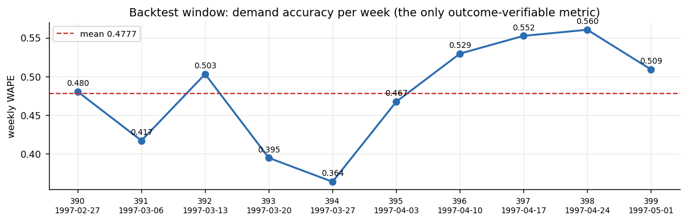

*Figure 10 — Weekly WAPE across the ten backtest weeks 390–399 (the last ten
weeks of the test window). Mean 0.4777, range 0.364–0.560. This is the only
outcome-verifiable metric in the backtest. Source:
`artifacts/metrics/backtest.json`.*

---
---
# PART VII — HYBRID PRICE RESPONSE

## 42. Why forecasting and price response were separated

### 42.1 The discovery

`scripts/price_response.py` (Phase F) exists to answer a question that no
accuracy metric can: **does the fitted model actually respond to price, and does
it respond sensibly?** It takes 300 real decision contexts from week 399,
sweeps the price ±30% around the current level, recomputes every price-dependent
feature at each candidate, and measures the resulting demand curve.

| diagnostic | result |
| --- | ---: |
| contexts tested | 300 |
| **share of demand curves monotone decreasing** | **100.0%** |
| share with any increasing segment | **0.0%** |
| share flat (relative demand span < 1%) | **0.0%** |
| share producing negative predicted units | **0.0%** |
| median relative demand span across the sweep | 1.832 |
| **median local implied elasticity** | **−3.102** |
| p10 / p90 local implied elasticity | −3.482 / −2.667 |
| share of contexts where the **profit** optimum is below the current price | 26.67% |
| share of contexts where the **revenue** optimum is below the current price | **100.00%** |
| share of contexts where the profit optimum sits at a grid edge | 7.67% |

The first five rows are a clean pass. The model responds to price, always in
the right direction, never flat, never negative. Nothing here is broken.

**Row seven is the problem.** A median implied elasticity of **−3.102** against
controlled econometric estimates of **−1.909 to −2.419** — and against a
training-window pooled estimate of **−2.029** whose two-way clustered 95%
interval is **[−2.236, −1.821]**. The forecaster's price response is not merely
at the edge of that interval; it is far outside it.

Note also row 12: the revenue optimum is below the current price in **100%** of
contexts, while the profit optimum is below it in only 27%. Same demand curve,
two objectives, two completely different answers — the §2.2 result appearing in
real data.

### 42.2 Why the discrepancy matters so much

Suppose the truth is −2.0 and the model believes −3.1. Then at a candidate price
10% above current, the model predicts

$$\left(1.10\right)^{-3.1} = 0.735 \quad\text{versus the truth}\quad \left(1.10\right)^{-2.0} = 0.826$$

— it expects to lose **26.5%** of volume where the truth is **17.4%**. The model
is systematically pessimistic about price increases, which biases every
recommendation downward. The error compounds with the size of the move, and it
is invisible to any accuracy metric because the counterfactual is never
observed.

### 42.3 Why the forecaster gets the slope wrong

Three mechanisms, in rough order of importance.

**(a) It is not identified on price.** The model's job is conditional-mean
accuracy at *observed* prices. Nothing in the loss function requires the price
coefficient to be the causal slope; it only has to help predict. The lag,
seasonality and promotion features carry most of the signal, and `log_price`
plus seven correlated relative-price features absorb whatever residual
structure remains — including the endogeneity that fixed effects remove in the
econometric specifications.

**(b) It has no fixed effects.** The econometric estimates get to −2.4 by
absorbing UPC and store effects. The ridge model has `store` and `com_code`
one-hots and a smoothed `upc_demand_prior`, but no UPC × store fixed effect and
no within transformation. Much of the composition bias that §27.2 diagnoses is
therefore still live in its price block.

**(c) Promotion contamination is worse in the forecaster.** The econometric
specifications control for the promotion flag *and* seasonality *and* trend
simultaneously. The forecaster has the flag, but its price features and its
promotion feature are fitted jointly on data where the two move together, so
the price block absorbs part of the promotional lift.

### 42.4 The principle this generalises to

> **The best forecaster is not necessarily the best intervention model.**

A predictive model is optimised for `P(Y | X)` on the distribution it was
trained on. An intervention model needs the *response surface* to be right in a
direction the training distribution barely explores. These are different
objectives, they are optimised by different estimators, and a model can be
excellent at one and unreliable at the other.

This is the single most portable lesson in the project.

### 42.5 The architectural response

Rather than discard the forecaster (its contextual skill is real and measured)
or trust its price coefficient (it is not defensible), Phase L **split the two
jobs**:

| job | owner | evidence for it |
| --- | --- | --- |
| where is demand *now*, given all context? | the ML forecaster | test WAPE 0.4565 on 749,040 held-out rows |
| how does demand move *with price*? | a separately estimated elasticity | pooled −2.029, two-way clustered CI [−2.236, −1.821], 239 shrunk product estimates |

The native ML response was **not deleted**. It is retained as
`PriceResponseMethod.ML` and is the benchmark in
`reports/08_PRICE_RESPONSE_COMPARISON.md` and
`reports/16_OUT_OF_TIME_PRICE_RESPONSE.md`. Keeping the thing you rejected, and
measuring against it, is what makes the decision auditable rather than
assertive (DECISIONS #33).

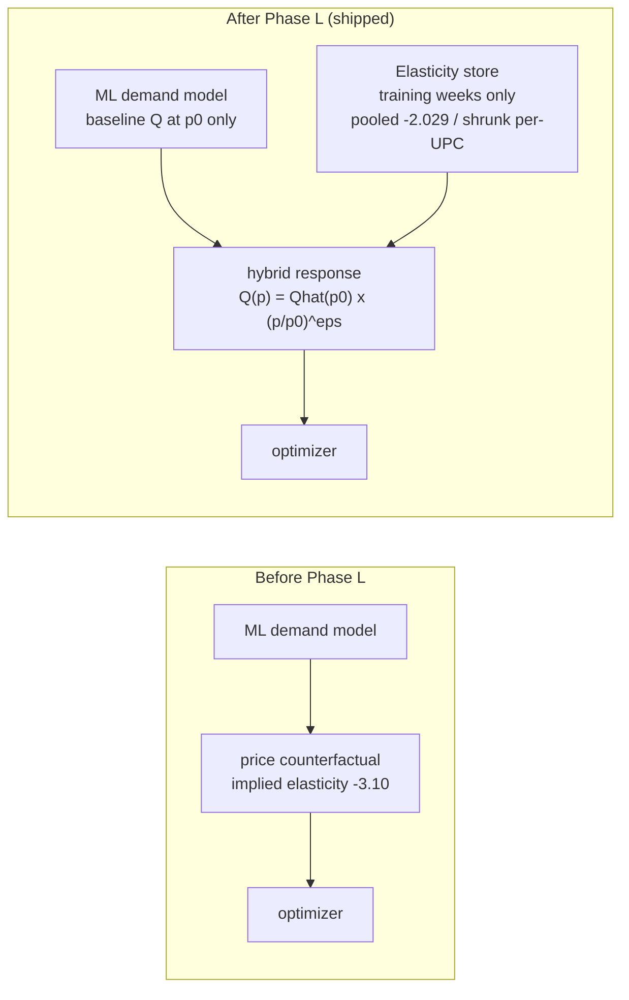
```mermaid
flowchart LR
    subgraph before["Before Phase L"]
        A1["ML demand model"] --> A2["price counterfactual<br/>implied elasticity -3.10"]
        A2 --> A3["optimizer"]
    end
    subgraph after["After Phase L (shipped)"]
        B1["ML demand model<br/>baseline Q at p0 only"] --> B3["hybrid response<br/>Q(p) = Qhat(p0) x (p/p0)^eps"]
        B2["Elasticity store<br/>training weeks only<br/>pooled -2.029 / shrunk per-UPC"] --> B3
        B3 --> B4["optimizer"]
    end
```

---

## 43. Hybrid formulation

### 43.1 The equation

$$\boxed{\;Q(p) \;=\; \hat{Q}(p_0)\cdot\left(\frac{p}{p_0}\right)^{\varepsilon}\;}$$

### 43.2 Every term defined

| term | definition | provenance |
| --- | --- | --- |
| `p` | the candidate price being scored | the decision variable |
| `p₀` | the **reference price** — the observed current price of the decision context | stamped from the observed row *before* any candidate is substituted |
| `Q̂(p₀)` | the ML forecaster's prediction evaluated **at the reference price**, with all price-dependent features recomputed at `p₀` | M1 ridge log-log |
| `ε` | the price elasticity applied to this row | pooled `−2.029`, or the shrunk per-UPC estimate; clipped to \|ε\| ∈ [0.2, 6.0] |
| `Q(p)` | the counterfactual demand used by the simulator and optimizer | — |

### 43.3 Implementation

```python
p  = frame["effective_unit_price"].to_numpy("float64")
p0 = frame[REFERENCE_PRICE_COLUMN].to_numpy("float64")
if np.any(~np.isfinite(p0)) or np.any(p0 <= 0):
    raise HybridModelError("reference_price must be positive and finite for every row")

# Baseline demand is evaluated AT the reference price, so every price-dependent
# feature is consistent with p0 and the price effect comes only from epsilon.
baseline_frame = recompute_price_features(frame, p0)
q0 = np.asarray(self.base_model.predict(baseline_frame), dtype="float64")

epsilon = self.elasticity_for(frame)
ratio   = np.power(p / p0, epsilon)
units   = np.clip(q0 * ratio, 0.0, None)
cap     = getattr(self.base_model, "prediction_cap_", None)
return np.clip(units, 0.0, cap) if cap else units
```

Three details worth naming:

1. **`recompute_price_features(frame, p0)` is called explicitly.** Even though
   the frame arrives with the candidate price in `effective_unit_price`, the
   baseline is re-evaluated with *every* price-dependent feature reset to `p₀`.
   Without this, `price_vs_last_week` and friends would still carry the
   candidate, and the baseline would not be a baseline.
2. **A missing reference price raises.** During candidate scoring the row's
   price *is* the candidate, so a silent fallback to "the row's current price"
   would make `p/p₀ = 1`, the elasticity term would vanish, and the engine would
   quietly return baseline demand for every candidate — a silent no-op that
   would look like a working system (DECISIONS #41).
3. **The base model's prediction cap is inherited**, so the hybrid cannot
   exceed the forecaster's own safety bound.

### 43.4 The anchoring property, stated precisely

At `p = p₀`:

$$Q(p_0) \;=\; \hat{Q}(p_0)\cdot\left(\frac{p_0}{p_0}\right)^{\varepsilon} \;=\; \hat{Q}(p_0)\cdot 1^{\varepsilon} \;=\; \hat{Q}(p_0)$$

**The hybrid reproduces the base model's prediction exactly at the reference
price**, bit for bit. This is pinned by 15 parametrised regression tests in
`tests/test_phase_l_pricing.py` spanning 5 elasticities × 3 price levels.

### 43.5 What this does NOT mean — the claim that was removed

An earlier version of this repository said *"no forecast skill is lost."* That
claim was **removed repository-wide** in Phase M (DECISIONS #51), because it is
a statement about **all** prices and the equality only holds at **one**.

The precise statement, from the module docstring:

> Preserving the prediction at `p₀` says nothing about accuracy at any other
> price. Away from the reference price the hybrid's demand curve is the
> elasticity model's, not the forecaster's, and its counterfactual accuracy is
> a separate empirical question — measured out of time in
> `reports/16_OUT_OF_TIME_PRICE_RESPONSE.md`, not assumed here.

This report uses the precise statement everywhere: **the hybrid preserves the
forecaster's baseline prediction at the reference price, not necessarily its
accuracy at counterfactual prices.**

### 43.6 The property with the largest downstream consequence

Because `Q̂(p₀)` does not depend on `p`, it is a **positive constant
across the candidate grid**. Therefore, for the gross-profit objective:

$$\arg\max_p\; (p - c)\cdot \hat{Q}(p_0)\left(\frac{p}{p_0}\right)^{\varepsilon}
\;=\; \arg\max_p\; (p - c)\left(\frac{p}{p_0}\right)^{\varepsilon}$$

**`Q̂(p₀)` cancels out of the arg-max.** The demand *forecast* sets the
predicted volume and every dollar amount reported, but it **does not choose the
price**. The chosen price is a function of `(p₀, c, ε)` and the guardrails
only.

This is verified numerically, not just algebraically: `tests/test_attribution.py`
scales the base model by 10× and asserts that **every recommended price is
unchanged**.

It also yields a closed form for the unconstrained optimum:

$$p^{*} \;=\; c\cdot\frac{\varepsilon}{1+\varepsilon}\quad (\varepsilon < -1), \qquad p^{*} \to \infty \quad (-1 < \varepsilon < 0)$$

which is the basis of the constraint-attribution audit (§54).

### 43.7 The three available methods

| method | `ε` used | role |
| --- | --- | --- |
| `ml` | none — the base model answers price counterfactuals directly | benchmark, retained |
| `pooled` | one category elasticity, **−2.029**, for every row | simple, transparent |
| **`shrunk`** ✅ | per-UPC empirical-Bayes estimate; pooled fallback | **shipped default** |

Selected on out-of-time evidence, not inheritance (§45, DECISIONS #50).

### 43.8 What the hybrid buys and what it costs

**Buys:**
* the price counterfactual is governed by an estimate whose provenance,
  standard error, clustering, shrinkage weight and estimation window are all
  known and recorded;
* the forecaster's contextual skill (seasonality, promotion state, series level,
  lag structure) is retained in the baseline;
* the two components can be audited, criticised and replaced independently.

**Costs:**
* **the response is now constant-elasticity by assumption.** The functional form
  is imposed, not learned. A real demand curve with kinks, reference-price
  effects or threshold behaviour is not representable;
* **no price × context interaction.** The elasticity is per-UPC, so it cannot
  differ between a promotion week and a normal week for the same product — even
  though §28.4 shows those elasticities differ by 0.83;
* **the elasticity is still observational.** The hybrid replaces one
  observational estimate with a better-identified observational estimate. It
  does not manufacture causal identification.

---

## 44. Native ML vs pooled vs shrunk

`scripts/compare_price_response.py --n-contexts 300` →
`artifacts/metrics/price_response_comparison.json`,
`reports/08_PRICE_RESPONSE_COMPARISON.md`. Week 399, `standard` policy profile,
**identical contexts and identical constraints** for all three methods — the
only thing that varies is the price response.

### 44.1 Recommendation behaviour by method

| metric | `ml` | `pooled` | `shrunk` |
| --- | ---: | ---: | ---: |
| share actionable (RECOMMEND_CHANGE) | **77.33%** | 70.00% | 74.67% |
| share KEEP_CURRENT | 10.33% | 16.67% | 11.67% |
| share REVIEW_REQUIRED | 12.33% | 13.33% | 13.67% |
| median absolute price change | 4.84% | **8.36%** | 7.54% |
| **share of changes that are increases** | **73.28%** | **94.76%** | **91.96%** |
| median model-internal estimated uplift | 8.28% | **17.57%** | 13.91% |
| mean recommended price | $3.181 | $3.268 | $3.268 |

### 44.2 Reading the differences

**The direction of the recommendation is the biggest divergence.** The native ML
response proposes an *increase* 73.3% of the time; the pooled response 94.8% of
the time. The mechanism is exactly the closed form: with `ε = −3.10`,
`p* = c·ε/(1+ε) = 1.476·c`; with `ε = −2.029`, `p* = 1.972·c`. A steeper
elasticity puts the optimum **closer to cost**, so the ML response proposes
price cuts far more often.

**The magnitude difference follows.** Median absolute change 4.84% (ml) versus
8.36% (pooled): the pooled response's optimum is further above the current
price, so it runs into the ±10% cap more often.

**The internal uplift claim more than doubles** between methods — 8.28% to
17.57%. Two methods, the same model, the same constraints, the same contexts,
and one claims twice the benefit of the other. **This is why no single uplift
number in this project is quoted without naming the price-response method that
produced it.**

**`shrunk` sits between the two, closer to `pooled`.** That is the expected
consequence of shrinking toward the pooled prior with a mean weight of 0.78 and
using the pooled fallback for 35.8% of contexts.

### 44.3 Pairwise disagreement on identical contexts

| pair | mean abs price gap | median | p90 | mean gap as % of price | identical price | **same decision state** | opposite direction | correlation |
| --- | ---: | ---: | ---: | ---: | ---: | ---: | ---: | ---: |
| ml vs pooled | $0.087 | $0.00 | $0.300 | 2.74% | 63.0% | **79.7%** | 4.0% | 0.981 |
| ml vs shrunk | $0.090 | $0.00 | $0.302 | 2.87% | 64.7% | **86.7%** | 7.7% | 0.975 |
| pooled vs shrunk | $0.032 | $0.00 | $0.100 | 0.95% | 86.7% | **91.7%** | 2.0% | 0.989 |

Three observations:

1. **The median gap is $0.00 in all three pairs.** Most of the time the
   constraints bind and all three methods land on the same guardrail corner.
   The disagreement lives in the tail: the p90 gap between ml and pooled is
   **$0.30**, which on a ~$3.18 price is a 9.4% difference.
2. **ml and pooled agree on the decision state only 79.7% of the time.** One
   context in five gets a different *decision* — not merely a different price —
   purely from the price-response assumption.
3. **They point in opposite directions in 4.0–7.7% of contexts.** One method
   says raise, the other says cut.

Correlations of 0.975–0.989 look reassuring and are somewhat misleading: they
are dominated by the fact that all three methods start from the same current
price and are bounded by the same ±10% cap.

**A documentation-drift note:** `README.md`, `KNOWN_LIMITATIONS.md` #28 and
`reports/VALIDATION_SUMMARY.md` row 15 used to quote "ml vs shrunk 87.3%" and "pooled vs
shrunk 89.0%". The current artifact
(`artifacts/metrics/price_response_comparison.json`) gives **86.7%** and
**91.7%**. The ml-vs-pooled figure (79.7%) matches. This report uses the
artifact values.

### 44.4 The elasticity sensitivity probe

The same 20 real contexts were re-optimised under four **assumed** elasticities
— −1.5, −1.9, −2.4, −3.1 — under two guardrail regimes.

| regime | median spread of the candidate profit-maximising price across the four scenarios |
| --- | ---: |
| **wide what-if guardrails** | **21.51%** |
| **production guardrails (`standard`)** | **0.00%** |

Under research conditions, the elasticity assumption moves the answer by more
than a fifth of the price. Under production conditions it moves it **not at
all**, because the ±10% change cap binds first in almost every context.

A worked row from the sensitivity table — `HONEY NUT CHEERIOS` (1600068290),
store 116, current price $4.79, unit cost $3.628:

| assumed ε | analytic CE optimum `c·ε/(1+ε)` | candidate price, **wide** | candidate price, **constrained** | decision |
| ---: | ---: | ---: | ---: | --- |
| −1.5 | $10.885 | $7.63 | **$5.11** | REVIEW_REQUIRED |
| −1.9 | $7.660 | $7.63 | **$5.11** | REVIEW_REQUIRED |
| −2.4 | $6.220 | $6.23 | **$5.11** | REVIEW_REQUIRED |

The unconstrained optimum ranges over **$6.22 to $10.89** — a 75% spread — and
the constrained candidate is **$5.11 in every case**. The guardrails have
absorbed the entire elasticity uncertainty.

### 44.5 What these differences teach

1. **Recommendations depend materially on the price-response assumption**, and
   that dependence is measurable. This is the strongest argument for why the
   elasticity had to be estimated properly rather than inherited from the
   forecaster.
2. **The production guardrails largely neutralise the dependence** — which is
   simultaneously reassuring (the system is robust to being wrong about
   elasticity) and deflating (the system is therefore not very sensitive to
   being *right* about it either). §55 pursues this honestly.
3. **Any uplift figure is meaningless without its method label**, since the two
   plausible methods differ by 2× on the same contexts.


*Figure 11 — Distribution of recommended price changes under the three
price-response methods on identical contexts. Source:
`scripts/compare_price_response.py`.*

---

## 45. Out-of-time price-change validation

`scripts/audit_out_of_time_response.py` →
`artifacts/metrics/out_of_time_price_response.json`,
`reports/16_OUT_OF_TIME_PRICE_RESPONSE.md`.

> **This is predictive / naturalistic validation, not causal identification.**
> Prices in the Dominick's data were set by the retailer, not randomised. An
> observed demand move after a price move confounds the price effect with
> whatever caused the retailer to change the price. Nothing in this section
> identifies a causal price effect, and no number here may be described as one.

### 45.1 The question it does answer

Given a price change that **actually happened** in weeks the elasticity
estimator never saw, which price-response method best predicts the demand that
followed?

This is the closest thing to an out-of-sample test of a counterfactual model
that observational data allows.

### 45.2 Design

* Elasticities fitted on training weeks **2–257** only. Every episode is from
  weeks **258–399** (validation + test).
* An **episode** is a UPC × store series observed in two consecutive weeks, both
  with positive price and positive units, where the price moved by **≥ 5% and
  ≤ 60%**.
* **154,899 episodes** qualify. Three further episodes were dropped because the
  contextual baseline predicted zero units, making every ratio metric undefined.
* The contextual baseline uses **week `t`'s context at the previous price**, so
  seasonality, trend, promotion coding and the lagged demand level are all
  absorbed and the elasticity only has to explain the deviation the price move
  caused:

$$\text{baseline}_t = Q_{ML}\big(p_{t-1} \mid \text{context of week } t\big), \qquad
\widehat{Q}_t = \text{baseline}_t \cdot \left(\frac{p_t}{p_{t-1}}\right)^{\varepsilon}$$

* **`ε = 0` (baseline only) is included as the null model.** A price-response
  method that cannot beat it is adding nothing.
* **73.3%** of episodes carry a recorded promotion code in at least one of the
  two weeks, so promotion and non-promotion splits are reported separately.

### 45.3 Results — all episodes (n = 154,899)

| method | **WAPE** | MAE (units) | bias | sign accuracy | median abs error in log demand change | rank corr |
| --- | ---: | ---: | ---: | ---: | ---: | ---: |
| null (`ε = 0`) | 0.8086 | 45.43 | −37.26 | n/a | 0.697 | n/a |
| pooled elasticity | 0.6249 | 35.11 | −29.35 | 81.7% | **0.436** | **+0.796** |
| **shrunk product elasticity** | **0.5853** | **32.89** | **−24.99** | 81.7% | 0.437 | +0.784 |
| native ML price response | 0.6042 | 33.95 | −26.07 | 81.7% | 0.459 | +0.786 |

### 45.4 Results — no recorded promotion (n = 41,310)

This is the cleanest split available and the one that should carry the most
weight, because it removes the episodes where price moved as part of a bundle.

| method | **WAPE** | MAE | bias | sign accuracy | median abs log error | rank corr |
| --- | ---: | ---: | ---: | ---: | ---: | ---: |
| null (`ε = 0`) | 0.7152 | 24.05 | −18.33 | n/a | 0.440 | n/a |
| pooled elasticity | 0.5944 | 19.99 | −14.77 | 68.3% | **0.392** | **+0.553** |
| **shrunk product elasticity** | **0.5596** | **18.82** | **−12.76** | 68.3% | 0.396 | +0.543 |
| native ML price response | 0.5877 | 19.76 | −13.29 | 68.3% | 0.436 | +0.543 |

### 45.5 Results — recorded promotion in either week (n = 113,589)

| method | **WAPE** | MAE | bias | sign accuracy | median abs log error | rank corr |
| --- | ---: | ---: | ---: | ---: | ---: | ---: |
| null (`ε = 0`) | 0.8263 | 53.21 | −44.15 | n/a | 0.819 | n/a |
| pooled elasticity | 0.6307 | 40.61 | −34.65 | 86.6% | 0.454 | **+0.818** |
| **shrunk product elasticity** | **0.5902** | **38.00** | **−29.44** | 86.6% | **0.454** | +0.810 |
| native ML price response | 0.6073 | 39.10 | −30.72 | 86.6% | 0.467 | +0.812 |

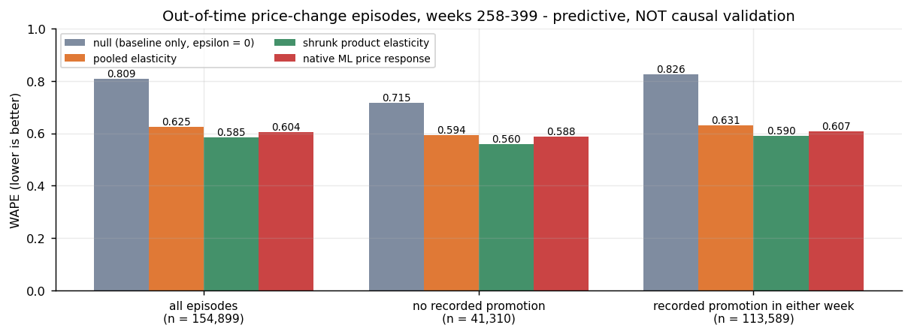

*Figure 12 — WAPE by method across the three episode splits. `shrunk` wins in
every split. All four methods beat the no-price-response null. Source:
`artifacts/metrics/out_of_time_price_response.json`.*

### 45.6 What can be concluded

**Every price-response method beats the null in every split.** Modelling a price
response is worth doing: on non-promotion episodes, WAPE falls from 0.715 to
0.560 — a **21.7% relative improvement** — purely from applying an elasticity
to the contextual baseline.

**`shrunk` has the lowest WAPE in every split**, and by a consistent margin:
0.5853 / 0.5596 / 0.5902 against native ML's 0.6042 / 0.5877 / 0.6073 and
pooled's 0.6249 / 0.5944 / 0.6307. This is the evidence on which `shrunk` was
retained as the default (DECISIONS #50) — **on measurement, not inheritance**.

**`shrunk` also has the smallest bias**, materially: −12.76 units on
non-promotion episodes against −18.33 for the null. All methods still
under-predict, consistent with §41.4.

**Sign accuracy is identical across methods** (81.7% / 68.3% / 86.6%) to three
decimal places. That is expected and worth understanding: sign accuracy asks
"did demand move in the direction the price move implies?", and since every
method uses a negative elasticity, they all predict the same *direction*. The
metric therefore discriminates between having a price response and not having
one, not between methods.

**The observed implied elasticity of these episodes is a useful independent
anchor:** median **−2.452** across all episodes, **−1.862** on non-promotion
episodes. The non-promotion figure sits very close to the training-window
pooled estimate of −2.029 and its interval [−2.236, −1.821], estimated on
completely disjoint weeks. That is meaningful corroboration — and it is
further evidence against the forecaster's −3.10.

**Interesting anomaly:** pooled has the *best* median-absolute-log-error (0.392
vs shrunk's 0.396) and the best rank correlation (+0.553 vs +0.543) on
non-promotion episodes, while losing decisively on WAPE and MAE. The
interpretation is that the pooled estimate is marginally better on *typical*
episodes, and the shrunk estimate is materially better on the **high-volume**
episodes that WAPE weights. Since the business cares about volume-weighted
error, WAPE is the right tie-breaker — but the disagreement is real and is
reported rather than smoothed away.

### 45.7 What cannot be concluded — the four limits

1. **Weeks in which the retailer changed price are not a random sample of
   weeks.** Selection on the treatment is exactly the condition under which
   observational comparisons fail.
2. **73.3% of episodes carry a promotion code**, so even the "all episodes"
   result is dominated by bundled events. This is why the non-promotion split is
   reported separately — and even that split contains *uncoded* promotions
   (§11.4).
3. **The baseline uses week `t`'s context**, including week `t`'s promotion
   flag. That is the right design for isolating the price effect, but it means
   the comparison is conditional on knowing the promotion state.
4. **This validates a price-response *predictor*, not a causal effect.** A
   method could win here by correctly predicting the confounded association and
   still be wrong about the intervention.

### 45.8 Why this is nonetheless the strongest empirical result in the project

Look at what it is not. It is not a self-scored simulation (the backtest is —
§64). It is not a claim about a price nobody charged. It is a comparison of
four candidate models against **154,899 realised outcomes**, on weeks the
estimator never saw, where the losing methods include the forecaster's own
native response and a no-price-response null. The winner was then made the
default.

That is a defensible model-selection procedure for a counterfactual component,
executed on real data, with the causal limitation stated in a box at the top of
its own report.

---
---
# PART VIII — PRICE SIMULATION

## 46. Candidate price generation

### 46.1 The grid

`src/pricing_engine/simulation/price_grid.py`:

$$\mathcal{G} \;=\; \Big\{\,\text{round}\big(\ell + k\cdot s,\; r\big) \;:\; k = 0,1,\dots,\big\lfloor (h-\ell)/s \big\rfloor \Big\} \;\cup\; \{\,\text{round}(p_0, r)\,\}$$

then filtered to `[ℓ, h]`, de-duplicated, and required to be strictly positive.

| parameter | config key | value |
| --- | --- | ---: |
| step `s` | `optimization.price_step` | **$0.05** |
| rounding `r` | `optimization.price_rounding` | **$0.01** |
| charm pricing (snap to x.x9) | `optimization.charm_pricing` | **false** |
| lower bound `ℓ`, upper bound `h` | from `build_bounds` (§53) | per context |

### 46.2 The current price is always a candidate

```python
if include_current:
    prices = np.append(prices, current_price)
```

"Keep the current price" must be a **scoreable option**, not a special case
handled by a separate branch. This matters for correctness: the materiality
check compares the best candidate's objective value against the objective value
*at the current price on the same grid*, and both must be produced by the same
scoring path.

### 46.3 Why $0.05 and $0.01

$0.05 is the granularity at which grocery shelf prices actually move; $0.01 is
the granularity at which they are *displayed*. Scoring at 5-cent resolution and
rounding to the cent matches the physical decision.

The cost of the grid is measured rather than assumed: the grid optimum sits a
**median of $0.025** (p90 **$0.043**) from the continuous optimum inside the
same feasible interval — about 1% of a typical $3.18 price. §54.4 uses that
number.

### 46.4 Failure modes are loud

```python
if high < low:
    raise PriceGridError(
        f"empty feasible price range [{low:.4f}, {high:.4f}]: the constraints "
        "leave no candidate price.")
if prices.size == 0:
    raise PriceGridError(
        f"no candidate prices survived rounding in [{low:.4f}, {high:.4f}] with step {step}")
```

An empty grid raises rather than returning an empty array that would silently
produce `argmax` on nothing. The optimizer catches the upstream case
(`bounds.is_empty`) and returns `KEEP_CURRENT` with `NO_FEASIBLE_PRICE`.

### 46.5 Grid size in practice

For the worked context (current $3.35, feasible $3.015–$3.685): 14 grid points
at $0.05 spacing plus the current price. Across all 13,964 week-399 contexts,
the ±10% change cap alone removes a median of **293** candidates from the wide
research grid, and the extrapolation guardrail a median of **264**.

---

## 47. Counterfactual feature construction

### 47.1 The two invariants

Stated in the module docstring of `simulation/counterfactual.py` and enforced by
tests:

> 1. **Only price-dependent features change.** All context features (lags,
>    rolling means, calendar, promotion, cost) are held fixed.
> 2. **Cost is held fixed.** The historical accounting margin is *not* reused at
>    a new price.

### 47.2 What changes when the candidate price changes

Exactly the five features in `PRICE_DEPENDENT_FEATURES`:

| feature | recomputation |
| --- | --- |
| `effective_unit_price` | `= p` |
| `log_price` | `= log(p)` |
| `price_vs_last_week` | `= p / lag_price_1 − 1` |
| `price_vs_series_reference` | `= p / series_reference_price − 1` |
| `price_vs_recent_mean` | `= p / roll_mean_price_4 − 1` |

The denominators — `lag_price_1`, `series_reference_price`,
`roll_mean_price_4` — are **historical context and do not move**. That is the
whole point: the relative-price features must express *this candidate against
the actual history*, not against itself.

### 47.3 What stays fixed

Everything in `CONTEXT_FEATURES` (24 columns): `store`, `upc`, `com_code`,
`week_of_year`, `month`, `quarter`, `time_index`, `recorded_promotion_flag`,
`lag_move_1..4`, `roll_mean_move_4/8/13`, `roll_std_move_4`, `lag_price_1`,
`lag_price_2`, `roll_mean_price_4`, `series_reference_price`,
`decision_time_unit_cost`, `lag_promotion_1`, `series_age_weeks`,
`package_size_oz`.

### 47.4 Why target-derived context cannot be changed consistently

Suppose you wanted the simulation to be "more realistic" by letting the demand
history respond to the candidate price. You immediately face an impossible
regress:

* `lag_move_1` is last week's **realised** demand. Changing this week's price
  cannot change it.
* To make a multi-week counterfactual coherent you would need a **dynamic**
  model: choose `p_t`, predict `Q_t`, feed `Q_t` into `lag_move_1` for `t+1`,
  and so on — accumulating prediction error at every step and requiring a
  *policy* over the whole horizon rather than a single price.
* Changing *some* context (say, letting `roll_mean_move_4` respond) while
  leaving the rest fixed produces an internally inconsistent frame: the model
  would see a demand history that never happened alongside a price history that
  did.

The engine therefore answers a precise, single-period question: **holding this
week's context fixed at what actually obtained, what would demand have been at
price `p`?** That is a well-posed question. "What would the world look like
after eight weeks of a different pricing policy?" is not answerable with this
architecture, and the project does not pretend otherwise.

### 47.5 Batched scoring

```python
frame = pd.concat([row] * grid.size, ignore_index=True)
frame = recompute_price_features(frame, grid)
units = np.asarray(model.predict(frame), dtype="float64")
```

The whole candidate grid is scored in **one** model call, not a Python loop.
`simulate_many` generalises this to `(n_contexts × n_candidates)` rows in a
single call — the path that would make batch pricing over all 36,443 series
tractable. (The batch script does not currently use it; limitation #18.)

### 47.6 Output validation

```python
if np.any(units < 0):
    raise SimulationError("demand model returned negative predicted units")
```

Negative predicted demand is a hard error, not something to clip and carry on
with. In the Phase F validation over 300 contexts and a ±30% sweep, **0%** of
predictions were negative.

### 47.7 Curve diagnostics

`demand_curve_diagnostics()` returns, for every simulated curve:

| diagnostic | why it matters |
| --- | --- |
| `share_segments_increasing` | fraction of adjacent grid steps where demand *rises* with price |
| `monotone_decreasing` | boolean — does the curve slope the right way everywhere? |
| `relative_demand_span` | `(max − min)/mean` — does the curve move at all? |
| `median_local_elasticity` | arc elasticity between adjacent grid points |
| `flat_response` | `relative_demand_span < 0.01` |

These are the diagnostics that make an *accurate* model *dangerous* visible: a
model can have excellent WAPE and produce an upward-sloping or flat demand
curve, and only this check would catch it. Under the hybrid response,
monotonicity is guaranteed by construction for `ε < 0`; the diagnostics remain
because the `ml` method is still selectable and because guarantees that are also
checked are worth more than guarantees that are only asserted.

---

## 48. Cost treatment during simulation

This section is short and is one of the two or three most important in the
report.

### 48.1 The error this prevents

The canonical table contains `gross_margin_rate` for every historical
observation. The tempting shortcut is:

```python
# WRONG
expected_gross_profit = candidate_price * predicted_units * historical_margin_rate
```

This is catastrophic, and it is catastrophic in a way that *looks like a
result*. Holding the margin **percentage** fixed means the implied unit cost
scales with the candidate price:

$$c(p) = p\,(1 - m) \quad\Rightarrow\quad GP(p) = p\,m\,Q(p)$$

Since `m` is a constant, gross profit becomes proportional to **revenue**. The
gross-profit objective silently collapses into a revenue objective — and worse,
because raising the price raises the implied cost, the model never sees the
margin expansion that a real price increase produces. Every recommendation
would be wrong, and the numbers would look entirely plausible.

### 48.2 The correct method

$$GP(p) \;=\; (p - c)\cdot \hat{Q}(p)$$

where **`c` is a decision-time cost estimate held fixed across the entire
candidate grid**.

```python
if unit_cost is not None and np.isfinite(unit_cost):
    out["unit_cost"] = float(unit_cost)
    out["expected_gross_profit"] = (grid - float(unit_cost)) * units
    out["expected_margin_rate"] = np.where(grid > 0, (grid - float(unit_cost)) / grid, np.nan)
```

Note that `expected_margin_rate` is now an **output**, computed from the
candidate price and the fixed cost — not an input assumed constant. In the
worked example (§2.3) it ranges from −1.9% at $2.51 to +37.8% at $4.11, which is
exactly the margin expansion a price increase produces and exactly what the
wrong method would have hidden.

`tests/test_simulation.py::test_cost_is_held_fixed_across_price_grid` asserts
that the `unit_cost` column is constant across every candidate.

### 48.3 Why holding cost fixed is the right economics, not just the safe choice

Within a single week's pricing decision, the retailer's acquisition cost is
already determined: the stock is bought, the trade deal is agreed, the invoice
is written. The shelf price does not change what the retailer paid. So `c` is
genuinely a constant of the decision.

The *empirical* complication from §17.1 — that AAC falls 9.2% on price cuts —
does not contradict this. It says that price cuts and cost reductions
**co-occur**, because promotions are trade-funded. It does not say that
choosing a lower shelf price *causes* the cost to fall. Treating cost as
responding to the candidate price would import that correlation into the
counterfactual as if it were a mechanism, which is a second, subtler version of
the same error.

### 48.4 Which cost, exactly

$$c \;=\; \texttt{decision\_time\_unit\_cost}(u, s, t) \;=\; \texttt{estimated\_unit\_aac}(u, s, t-1),\ \text{forward-filled within the series}$$

Three properties:

* **temporally available** — the week-`t` accounting margin is an outcome (§20);
* **causally clean** — it predates the pricing decision, so it cannot embed the
  trade deal that accompanied it;
* **provably so** — 4,671,333 rows compared with 0 mismatches, plus a future
  poisoning test with teeth and a recommendation-level check (§23.3).

### 48.5 When the cost is unavailable

```python
if objective == "gross_profit" and unit_cost is None:
    reasons.append(ReasonCode.COST_UNAVAILABLE.value)
```

and the optimizer returns `KEEP_CURRENT`. The objective function refuses too:

```python
if unit_cost is None or not np.isfinite(unit_cost):
    raise ObjectiveError(
        "Gross-profit optimization requires an available unit cost (estimated AAC) "
        "for this UPC and store. Use objective='revenue' or supply a cost.")
```

**No cost is ever invented.** The alternatives — impute the category median,
use the current price times a default margin — would put a fabricated number
directly into the objective the engine maximises. Returning "I cannot answer
this" is the correct behaviour and it is tested.

### 48.6 The full chain of custody for cost

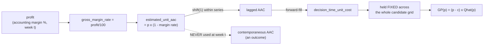
```mermaid
flowchart LR
    A["profit<br/>(accounting margin %, week t)"] --> B["gross_margin_rate = profit/100"]
    B --> C["estimated_unit_aac<br/>= p x (1 - margin rate)"]
    C -->|"shift(1) within series"| D["lagged AAC"]
    D -->|"forward-fill"| E["decision_time_unit_cost"]
    E --> F["held FIXED across<br/>the whole candidate grid"]
    F --> G["GP(p) = (p - c) x Qhat(p)"]
    C -.->|"NEVER used at week t"| X["contemporaneous AAC<br/>(an outcome)"]
```

---
---

# PART IX — OPTIMIZATION

## 49. Revenue objective

$$R(p) \;=\; p \cdot \hat{Q}(p)$$

```python
if objective == "revenue":
    return p * q
```

Revenue optimization needs no cost, so it is the fallback when
`decision_time_unit_cost` is unavailable, and it is a legitimate primary
objective when the business mandate is volume or category share rather than
profit.

Under the hybrid response `Q(p) = Q̂(p₀)(p/p₀)^ε`, revenue is
`Q̂(p₀)·p₀^{−ε}·p^{1+ε}`, which is:

* **monotonically decreasing** in `p` for `ε < −1` (elastic),
* **monotonically increasing** for `−1 < ε < 0` (inelastic),
* flat for `ε = −1`.

There is no interior revenue optimum under constant elasticity — the revenue
optimum is always a **boundary** of the feasible interval. Since 80.8% of UPCs
in this panel are elastic, the revenue optimum is almost always the **lower**
bound. Phase F confirms this empirically: **100% of 300 contexts have their
revenue optimum below the current price**, against 26.7% for profit.

That is precisely the §2.2 divergence, measured.

## 50. Gross-profit objective

$$GP(p) \;=\; (p - c)\cdot \hat{Q}(p)$$

```python
if unit_cost is None or not np.isfinite(unit_cost):
    raise ObjectiveError("Gross-profit optimization requires an available unit cost ...")
return (p - float(unit_cost)) * q
```

**This is the primary objective** (`optimization.objective: gross_profit`).

### 50.1 Why

1. It is the business objective. A retailer that maximises revenue on an
   elastic category prices toward cost and loses money.
2. It has a genuine **interior** optimum under constant elasticity
   (`p* = c·ε/(1+ε)` for `ε < −1`), so the answer comes from the demand curve
   rather than from a boundary — at least in principle (§54 shows how often the
   guardrails intervene in practice).
3. It forces the cost question to be confronted honestly (§8, §48). A revenue
   engine can pretend cost does not exist.
4. Both objectives use the **same** predicted demand, so the only difference
   between them is the economics applied on top — which makes the comparison
   between them meaningful rather than a comparison of two different models.

### 50.2 What it is not

It is expected **gross** profit at the item level: no labour, no shelf space, no
handling, no shrink, no basket effects, no cross-elasticity, no customer
lifetime value. It optimises `(p − c)·Q` for one UPC in one store in one week.

---

## 51. Why grid optimization was used

### 51.1 The choice

A discrete grid search over `𝓖` rather than a continuous solver
(`scipy.optimize`). DECISIONS #19.

### 51.2 The six reasons

**1. Retail prices are genuinely discrete.** Shelf prices move in 5-cent steps
and are displayed in cents. A continuous optimum of $3.6473 must be rounded
anyway, and rounding *after* optimising can push the answer outside the feasible
interval or across a constraint boundary. Optimising *on* the grid the price
will actually take avoids that entirely.

**2. The demand model may be a step function.** The architecture supports
`hgb_poisson`, whose prediction surface is piecewise constant. Gradients are
zero almost everywhere and undefined on the boundaries; every gradient-based
solver fails silently. A grid is indifferent to the model family — and the
`ml` price-response method is still selectable.

**3. Business constraints are not smooth.** Materiality is a threshold. The risk
gate is a discrete state machine. Rounding is a step function. Charm pricing is
a floor-plus-offset. Encoding these as smooth penalties would be an exercise in
making a solver converge, not in making a better decision.

**4. Auditability.** Every candidate is scored and the whole curve is available.
The engine can answer *"why not $3.71?"* with "it was outside the feasible
interval" or "its expected gross profit was $21.68 against $21.74 at $3.66" —
from stored data, not from a re-run. That is what makes reason codes possible.

**5. Low dimensionality.** One decision variable over a bounded interval. The
typical feasible interval here contains 10–30 candidates; the wide research grid
used by the attribution audit contains a few hundred. Exhaustive search is
trivially affordable, and it is **globally optimal on the grid by construction**
— no local minima, no initialisation, no convergence criterion.

**6. Vectorisation.** The entire grid is one batched model call (§47.5). A
continuous solver would make dozens of sequential single-row predictions —
slower *and* less amenable to batching across contexts.

### 51.3 The cost, measured

The grid quantises the answer. Measured over all 13,964 week-399 contexts, the
grid optimum sits a **median of $0.025** (p90 $0.043) from the continuous
optimum *inside the same feasible interval* — about **1%** of a typical price
(limitation #41). Given a demand model with 46% WAPE, a 1% quantisation error is
not the binding constraint on accuracy.

### 51.4 When a continuous solver would be the right choice

If the decision variable were multi-dimensional — pricing a whole category
jointly, with cross-elasticities and a category-level margin constraint — a grid
would be exponentially expensive and a constrained continuous solver (or a
mathematical program) would be the correct tool. That is §101's territory.

---

## 52. Analytical optimizer validation

The optimizer is validated against problems whose answers are known in closed
form. This is the strongest kind of test available for an optimizer:
**deterministic, closed-form ground truth, no reference to the trained model.**

### 52.1 Linear demand — profit optimum

$$Q(p) = a - bp, \qquad \Pi(p) = (p - c)(a - bp)$$

$$\frac{d\Pi}{dp} = a - bp - b(p - c) = a + bc - 2bp = 0 \;\;\Longrightarrow\;\; \boxed{p^{*} = \frac{a + bc}{2b}}$$

Second-order condition: `d²Π/dp² = −2b < 0` for `b > 0`, so it is a maximum.

**Fixture:** `Q = 100 − 10p`, `c = $2.50`.

$$p^{*} = \frac{100 + 10 \times 2.50}{2 \times 10} = \frac{125}{20} = \$6.25$$

**Result:** recovered **within one grid step ($0.05)**.

```python
def analytical_linear_optimum(a: float, b: float, c: float) -> float:
    """Profit-maximising price for the textbook linear demand Q(p) = a - b p."""
    if b <= 0:
        raise ObjectiveError("linear demand slope b must be positive")
    return (a + b * c) / (2.0 * b)
```

### 52.2 Linear demand — revenue optimum

$$R(p) = p(a - bp) \;\Longrightarrow\; \frac{dR}{dp} = a - 2bp = 0 \;\;\Longrightarrow\;\; \boxed{p_R^{*} = \frac{a}{2b}}$$

**Fixture:** same demand. `p_R* = 100/20 = $5.00`. **Result:** recovered within
one grid step.

And note the relationship the two fixtures demonstrate together:
`$6.25 − $5.00 = $1.25 = c/2`. The optimizer reproduces the theoretical gap
between the two objectives exactly.

### 52.3 The full analytical test suite

`tests/test_optimizer.py` (23 tests) plus `tests/test_attribution.py` (69):

| fixture | closed-form ground truth | result |
| --- | --- | --- |
| linear demand profit optimum, `Q = 100 − 10p`, `c = 2.50` | `p* = (a+bc)/(2b) = 6.25` | recovered within one grid step (0.05) |
| linear demand revenue optimum | `p* = a/(2b) = 5.00` | recovered within one grid step |
| constant elasticity, **inelastic** (`ε = −0.5`) | optimum at the upper guardrail | recommended price equals the feasible upper bound; `PRICE_CHANGE_LIMIT` raised |
| starting **at** the optimum | no change | `KEEP_CURRENT`, `KEEP_CURRENT_OPTIMAL` |
| gain below materiality (0.45% vs 1% threshold) | no change | `KEEP_CURRENT`, `NON_MATERIAL_UPLIFT` |
| hybrid with fixed `ε` | `Q(p) = Q₀(p/p₀)^ε` exactly | reproduced to floating-point tolerance |
| empirical-Bayes shrinkage | `w = τ²/(τ² + se²)` | weights and blend match the closed form |
| unconstrained CE optimum | `p* = c·ε/(1+ε)` | matched by the attribution replica |
| base model scaled 10× | recommended price unchanged | **0 changes** across the test set |

### 52.4 The inelastic fixture is the important one

`test_constant_elasticity_fixture_pushes_price_to_the_upper_bound` encodes the
§24.1 result: for `|ε| < 1` the profit function has no interior maximum, so the
optimizer *must* return the feasible upper bound and *must* say so via
`PRICE_CHANGE_LIMIT`. A test that only checked interior optima would miss the
case where the constraint layer is the only thing between the model and an
absurd recommendation.

### 52.5 What the analytical tests do and do not prove

**Prove:** the search, the objective evaluation, the constraint intersection,
the materiality check, the rounding and the reason-code emission are all
correct. Given a demand curve, the engine finds its optimum subject to its
constraints.

**Do not prove:** that the demand curve is right. That is Part V, Part VI and
Part VII's problem, and no optimizer test can substitute for it.

---
---
## 53. Constraints

All guardrails are intersected into **one feasible interval** `[ℓ, h]` by
`build_bounds()`, and the constraints that are **actually active at the edges**
of the final interval are recorded as `binding`. Each gets its own subsection
below with business rationale, mathematical form, implementation and a worked
example from the demo context (current price $3.35, unit cost $2.5571, observed
support $1.50–$3.79).

### 53.1 Absolute minimum price

* **Business rationale.** A hard floor below which no price is ever legal or
  sensible, independent of cost or history.
* **Form.** p ≥ pₘᵢₙ, default $0.01.
* **Implementation.** `lower["ABSOLUTE_PRICE_FLOOR"] = 0.01 if abs_min_price is None else float(abs_min_price)`
* **Example.** `ABSOLUTE_PRICE_FLOOR = $0.01` — never binds here.
* **Empirical.** Present in 13,964 contexts, **removes candidates in 0**, binds
  at the optimum in **0**. It is a backstop, and it correctly never fires.

### 53.2 Absolute maximum price

* **Business rationale.** A category-level ceiling (a gouging cap, a legal
  cap, a brand-positioning cap).
* **Form.** p ≤ pₘₐₓ.
* **Implementation.** Optional; `upper["ABSOLUTE_PRICE_CEILING"]` is only added
  when `abs_max_price` is supplied.
* **Example.** Not configured in any shipped profile.
* **Empirical.** **Present in 0 contexts.** This is a genuine gap: a production
  system for essential goods would need one (§94).

### 53.3 Cost floor

* **Business rationale.** Never sell below cost unless loss-leading is an
  explicit, deliberate policy.
* **Form.** p ≥ c unless `allow_below_cost` is true.
* **Implementation.**
  ```python
  if not allow_below_cost:
      lower["COST_FLOOR"] = float(unit_cost)
  ```
* **Example.** `COST_FLOOR = $2.5571`.
* **Empirical.** Present in 13,964 contexts, **removes a median of 36
  candidates** from the wide research grid, binds at the optimum in **0**,
  changes the final price in **0**. Interpretation: it is always doing work
  (removing sub-cost candidates) and it is never the *binding* constraint,
  because the minimum-margin floor sits strictly above it whenever
  `min_gross_margin_rate > 0`.
* `allow_below_cost` is **false in all three shipped profiles**, including the
  DEMO `aggressive` one.

### 53.4 Minimum gross margin

* **Business rationale.** A category margin floor that survives a bad cost
  estimate. Even if `c` is wrong, a 5% floor keeps the recommendation off the
  cliff.
* **Form.** Require (p - c)/p ≥ m, i.e.

  $$p \ge \frac{c}{1 - m}$$

* **Implementation.**
  ```python
  if min_margin >= 1.0:
      raise ConstraintError("min_gross_margin_rate must be < 1")
  margin_floor = float(unit_cost) / (1.0 - min_margin)
  lower["MIN_MARGIN"] = margin_floor
  ```
* **Example.** `m = 0.05` (standard) ⟹ `MIN_MARGIN = 2.5571/0.95 = $2.6916`.
* **Empirical.** Present in 13,964, **removes a median of 39 candidates**,
  **binds at the optimum in 982**, changes the decision state in **78**, changes
  the final price in **802**.
* **Profile sensitivity.** conservative `m = 0.10`, standard `m = 0.05`,
  aggressive `m = 0.00`.

### 53.5 Maximum price change

* **Business rationale.** Operational and reputational. Large weekly price
  swings confuse shoppers, break shelf-tag processes, invite competitor
  response and erode trust. It also bounds the size of any single mistake.
* **Form.** p  ∈  [p₀(1-δ), p₀(1+δ)].
* **Implementation.**
  ```python
  max_change = float(policy.get("max_price_change_pct", 0.10))
  lower["PRICE_CHANGE_LIMIT"] = current_price * (1.0 - max_change)
  upper["PRICE_CHANGE_LIMIT"] = current_price * (1.0 + max_change)
  ```
* **Example.** `δ = 0.10` ⟹ window `[$3.015, $3.685]`. **Both edges of the final
  interval come from this constraint** in the worked context.
* **Empirical.** Present in 13,964, **removes a median of 293 candidates**,
  **binds at the optimum in 10,329 (74.0%)**, changes the decision state in
  **166**, changes the final price in **7,874 (56.4%)**.
* **This is the dominant constraint in the system.** It is the *first* binding
  constraint in **44.6%** of contexts.
* **Risk interaction.** A MEDIUM-risk context has its cap tightened further:
  ```python
  policy["max_price_change_pct"] = min(float(policy.get("max_price_change_pct", 0.10)),
                                       float(cap))
  ```
  standard 10% → 5%, conservative 5% → 3%.

### 53.6 Extrapolation guardrail

* **Business rationale.** A demand model asked about a price the series has
  never carried is extrapolating, and log-linear models extrapolate confidently
  and wrongly. Do not let the optimizer wander outside observed evidence.
* **Form.** With observed support `[p_min^hist, p_max^hist]` for that
  UPC × store series and tolerance `t`:

  $$p \in \Big[p_{\min}^{hist}(1-t),\;\; p_{\max}^{hist}(1+t)\Big]$$

* **Implementation.**
  ```python
  tol = float(policy.get("extrapolation_tolerance_pct", 0.05))
  lower["OUTSIDE_EXTRAPOLATION_RANGE"] = float(hist_price_min) * (1.0 - tol)
  upper["OUTSIDE_EXTRAPOLATION_RANGE"] = float(hist_price_max) * (1.0 + tol)
  ```
* **Example.** Support $1.50–$3.79, `t = 0.05` ⟹ `[$1.425, $3.9795]`. Wider than
  the change window here, so it does not bind in this context.
* **Empirical.** Present in 13,964, **removes a median of 264 candidates**,
  binds at the optimum in **2,103**, **changes the decision state in 1,166**,
  changes the final price in **1,165**.
* **Why series-specific rather than a universal ±X%.** Support is a property of
  the series. A UPC × store that has ranged $1.50–$3.79 over 359 weeks supports
  a much wider recommendation than one that has only ever been $3.29 or $3.39.
  A single magic number would be arbitrary in both directions (DECISIONS #22).

### 53.7 Historical support (as a *risk* input)

The extrapolation guardrail and the historical-support screen are related but
distinct, and the attribution audit tracks them separately.

* **`EXTRAPOLATION`** is the hard interval above.
* **`HISTORICAL_SUPPORT`** is the *risk* pathway: `extrapolation_distance()`
  measures how far a candidate sits outside the observed support, and the risk
  bands use it directly (`max_extrapolation_pct`: 0.02 for LOW, 0.05 for
  MEDIUM). A candidate outside support cannot be LOW risk.
* **Empirical.** `HISTORICAL_SUPPORT` **binds at the optimum in 3,373 contexts
  (24.2%)**, **changes the decision state in 2,668**, but changes the final
  price in only **24**. Read that carefully: it almost never moves the *price*;
  it very often changes the *decision* — by pushing a context out of LOW risk
  and into the gate. It is the **second most frequent first-binding
  constraint** (24.2%).

### 53.8 Rounding

* **Business rationale.** Prices are displayed in cents; shelf tags are printed
  at a fixed granularity.
* **Form.** p  ←  r·round(p / r), `r = 0.01`. Optional
  charm pricing snaps to `x.x9`:
  `np.floor(values * 10.0) / 10.0 + 0.09` (disabled by default).
* **Empirical.** Removes no candidates, **binds at the optimum in 6,978
  (50.0%)**, changes the decision state in **0**, changes the final price in
  **6,978**. So in half of all contexts the reported price differs from the
  unrounded grid optimum — by a median of $0.025 — and in **no** context does
  that change the decision.

### 53.9 Materiality

* **Business rationale.** With weekly WAPE around 0.46, a sub-1% estimated gain
  is indistinguishable from noise. Acting on it burns operational effort and
  customer goodwill for nothing. It also produces the `KEEP_CURRENT` outcome
  that any credible engine must have — a system that always finds a better
  price is not a system anyone should trust.
* **Form.** Let `V(p)` be the objective. Recommend a change only if

  $$\frac{V(p^{*}) - V(p_0)}{|V(p_0)|} \;\ge\; \theta$$

* **Implementation.**
  ```python
  materiality = float(policy.get("materiality_threshold_pct", 0.01))
  if abs(price_change_pct) < 1e-9:
      return keep([*reasons, KEEP_CURRENT_OPTIMAL], ...)
  if not np.isfinite(uplift) or uplift < materiality:
      return keep([*reasons, NON_MATERIAL_UPLIFT, KEEP_CURRENT_OPTIMAL], ...)
  ```
* **Example.** `θ = 0.01` (standard). The demo context's estimated uplift is
  **+7.23%**, comfortably material.
* **Empirical.** Binds at the optimum in **716**, **changes the decision state
  in 716**, changes the final price in **700**. It is the *first* binding
  constraint in **4.0%** of contexts. In the 3,000-context batch,
  `NON_MATERIAL_UPLIFT` fires **136** times.
* **Honest caveat.** 1% is **asserted, not fitted**. Calibrating it would mean
  fitting realised out-of-sample error against the threshold, which was not done
  (limitation #40).

### 53.10 Risk gating

* **Business rationale.** Constraints bound the *size* of a mistake; they do not
  bound its *likelihood*. A thin series with almost no price variation can
  produce a perfectly feasible recommendation that nobody should act on
  automatically.
* **Form.** A discrete state machine, not an interval. See §57–§59.
* **Implementation.**
  ```python
  if final_risk.level is RiskLevel.HIGH and high_risk_action != "recommend":
      if high_risk_action == "keep_current":
          return keep([*reasons, HIGH_RISK_KEEP_CURRENT, LOW_CONFIDENCE, KEEP_CURRENT_OPTIMAL], ...)
      decision = DecisionState.REVIEW_REQUIRED
      reasons.extend([HIGH_RISK_REVIEW_REQUIRED, LOW_CONFIDENCE])
  ```
* **Empirical.** Binds at the optimum in **3,370**, **changes the decision state
  in 1,354**, changes the final price in **2,988**. It is the *first* binding
  constraint in only **0.02%** of contexts (3) — because by the time it fires,
  something else has usually already bound.

### 53.11 The intersection, and a Phase M correction worth naming

```python
low  = max(lower.values())
high = min(upper.values()) if upper else float("inf")
binding = [name for name, value in lower.items() if abs(value - low) <= 1e-9 * max(1.0, abs(low))]
        + [name for name, value in upper.items() if abs(value - high) <= 1e-9 * max(1.0, abs(high))]
```

`binding` lists the constraints **actually active at the edges of the final
interval**, not every constraint that tightened a running bound along the way.

An earlier version appended `PRICE_CHANGE_LIMIT` whenever the change window was
narrower than the absolute floor, **even when the extrapolation guardrail later
superseded it** — which over-reported how often the change cap binds. The bug
was found while validating the attribution replica against the real optimizer
(DECISIONS #48). It is a good example of a measurement instrument catching a
defect in the thing it was built to measure.

### 53.12 The full stack on the worked example

| bound | source | value |
| --- | --- | ---: |
| lower | `ABSOLUTE_PRICE_FLOOR` | $0.01 |
| lower | `OUTSIDE_EXTRAPOLATION_RANGE` | $1.4250 |
| lower | `COST_FLOOR` | $2.5571 |
| lower | `MIN_MARGIN` | $2.6916 |
| lower | **`PRICE_CHANGE_LIMIT`** ⬅ **binds** | **$3.0150** |
| upper | `OUTSIDE_EXTRAPOLATION_RANGE` | $3.9795 |
| upper | **`PRICE_CHANGE_LIMIT`** ⬅ **binds** | **$3.6850** |
| | **feasible interval** | **[$3.015, $3.685]** |

Both edges come from the ±10% change cap. The unconstrained gross-profit optimum
is `c·ε/(1+ε) = $3.875`, which sits **above** the upper bound — so the
recommendation is the guardrail corner, $3.66 after rounding to the grid.

---

## 54. Constraint attribution

`scripts/audit_constraints.py` → `artifacts/metrics/constraint_attribution.json`,
`reports/11_CONSTRAINT_ATTRIBUTION.md`. **This is the most important chapter in
the report.**

### 54.1 The question

When this engine recommends a price, is the price chosen by the estimated demand
response, or is it simply the nearest point the guardrails allow?

### 54.2 Method

Every one of the **13,964** UPC × store decision contexts of week 399 is run
through the full pipeline **eleven times**: once unconstrained on a wide research
grid (0.2× to 5× the current price), once under the `standard` policy, and once
per constraint with **that constraint and only that constraint relaxed**
(leave-one-out). Price response: `shrunk`.

The audit uses `pricing_engine.optimization.attribution.evaluate`, a fast
replica of `optimize_price` (~450× faster, which is what makes 11 × 13,964 runs
feasible). It is trusted **only** because `tests/test_attribution.py` asserts it
reproduces the real optimizer's decision state, final price and reason codes
exactly across **60 parameter combinations**, and it was additionally checked
against **400 real week-399 contexts with zero mismatches** (DECISIONS #49).

### 54.3 The closed form that makes the audit possible

Under the hybrid response, the unconstrained gross-profit optimum is

$$p^{*} = c\cdot\frac{\varepsilon}{1+\varepsilon} \quad (\varepsilon < -1), \qquad p^{*} \to \infty \quad (-1 < \varepsilon < 0)$$

because `Q̂(p₀)` cancels (§43.6). So the "what would the model want, with no
guardrails?" counterfactual has an analytic answer.

### 54.4 Three progressively stricter readings of "the model decided this"

| reading | contexts | share |
| --- | ---: | ---: |
| The unconstrained optimum is **inside the feasible interval at all** | 968 | **6.9%** |
| The optimizer's **proposal** lands on it (within one 5¢ grid step) | 638 | **4.6%** |
| The **final price** lands on it (also survived materiality and the risk gate) | 635 | **4.5%** |

The gap between rows 1 and 2 is **rounding**: the 5-cent grid is anchored on the
lower bound, so the grid optimum sits a median of $0.025 (p90 $0.043) from the
continuous optimum inside the same interval. The gap between rows 2 and 3 is the
**non-actionable states**: a REVIEW_REQUIRED or KEEP_CURRENT context ships the
current price whatever the optimizer proposed.

### 54.5 Where the unconstrained optimum actually wants to go

| statistic | value |
| --- | ---: |
| median unconstrained price change | **+49.0%** |
| p10 / p90 | −4.7% / **+174.6%** |
| share of contexts whose unconstrained optimum is **above** the current price | **86.7%** |
| **median FINAL price change actually recommended** | **+3.7%** |

The model, left alone, wants to raise prices by half. The system recommends
+3.7%. **The guardrails are absorbing an order of magnitude.**

Why does the model want +49%? Because `p* = c·ε/(1+ε)` and, at the median
shrunk elasticity of −2.03, `p* = 1.97·c` — nearly twice cost. Historical
prices in this panel sit at a blended 15.3% margin, i.e. around `1.18·c`. A
constant-elasticity model with `ε ≈ −2` and no competitive dynamics simply
believes the category is under-priced. Whether that is a real finding about
1990s grocery pricing or an artefact of an unidentified elasticity is exactly
the question this project cannot answer (§33) — and it is the strongest possible
argument for the guardrails.

### 54.6 Per-constraint attribution

Counts out of 13,964 contexts.

| constraint | present | removes candidates | median removed when active | **binding at optimum** | **changed decision state** | **changed final price** |
| --- | ---: | ---: | ---: | ---: | ---: | ---: |
| **MAX_PRICE_CHANGE** | 13,964 | 13,964 | **293** | **10,329** | 166 | **7,874** |
| MIN_PRICE | 13,964 | 0 | 0 | 0 | 0 | 0 |
| MAX_PRICE | **0** | 0 | 0 | 0 | 0 | 0 |
| MIN_MARGIN | 13,964 | 13,964 | 39 | 982 | 78 | 802 |
| COST_FLOOR | 13,964 | 13,964 | 36 | **0** | 0 | 0 |
| **EXTRAPOLATION** | 13,964 | 13,964 | **264** | 2,103 | **1,166** | 1,165 |
| ROUNDING | 13,964 | 0 | 0 | 6,978 | 0 | 6,978 |
| MATERIALITY | 13,964 | 0 | 0 | 716 | **716** | 700 |
| RISK_GATE | 13,964 | 0 | 0 | 3,370 | **1,354** | 2,988 |
| HISTORICAL_SUPPORT | 13,964 | 0 | 0 | 3,373 | **2,668** | **24** |

Reading the columns:

* **Removes candidates** — the constraint excludes at least one price from the
  wide research grid.
* **Binding at optimum** — its own bound is the active edge at the chosen price
  (or, for the non-interval guardrails, it is the rule that fired).
* **Changed decision state / final price** — leave-one-out: relaxing *only* this
  constraint changes the outcome.

Three rows deserve attention:

**`COST_FLOOR`: removes candidates in 100% of contexts, binds in 0.** It is
always working and never decisive, because `MIN_MARGIN` sits strictly above it
whenever the margin floor is positive.

**`HISTORICAL_SUPPORT`: changes the decision in 2,668 contexts but the price in
24.** It operates almost entirely through the *risk* pathway, not the price
pathway.

**`RISK_GATE`: changes the price in 2,988 contexts.** Because a gated context
ships the current price instead of the proposal.

### 54.7 First binding constraint

| constraint | contexts | share |
| --- | ---: | ---: |
| **MAX_PRICE_CHANGE** | 6,222 | **44.6%** |
| HISTORICAL_SUPPORT | 3,373 | 24.2% |
| **NONE** | 1,924 | **13.8%** |
| EXTRAPOLATION | 1,877 | 13.4% |
| MATERIALITY | 565 | 4.0% |
| RISK_GATE | 3 | 0.02% |

**The ±10% price-change cap is the first thing that bites in 44.6% of
contexts.** In only 13.8% does nothing bind at all.

### 54.8 The headline: what determines the final recommendation

| determinant | contexts | share |
| --- | ---: | ---: |
| **guardrail corner** (optimum outside the feasible interval) | **7,967** | **57.1%** |
| **screened out before optimisation** (eligibility / cost) | **3,528** | **25.3%** |
| **risk gate** (REVIEW_REQUIRED, not actionable) | 1,353 | 9.7% |
| **materiality threshold** (KEEP_CURRENT) | 716 | 5.1% |
| **learned signal** (interior optimum, actionable) | **400** | **2.9%** |

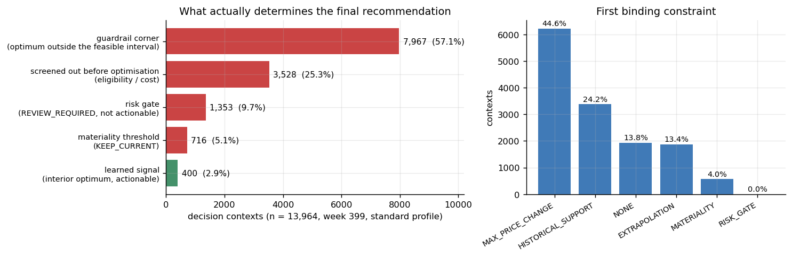

*Figure 13 — Left: the final determinant of each of the 13,964 week-399
recommendations. Green is the only category in which the estimated price
response chose the price. Right: the first binding constraint. Source:
`artifacts/metrics/constraint_attribution.json`.*

### 54.9 The answer, stated plainly

> **How much of the final recommendation comes from the model versus policy
> rules?**
>
> **2.9%** of final recommendations are set by an interior optimum of the
> estimated price response. **57.1%** are guardrail corners. **25.3%** never
> reach the optimizer at all. **9.7%** are risk-gated. **5.1%** fail
> materiality.
>
> This is a **rule-bounded pricing system with a learned direction**, not an ML
> pricing system.

### 54.10 Why this was published as the headline rather than buried

DECISIONS #43 records the choice explicitly. The alternative — present the
project as "ML pricing" and put the attribution in an appendix — was rejected on
the grounds that hiding it would make every other claim suspect, whereas leading
with it makes the project a demonstration of **auditing**, which is the more
valuable and rarer skill to show.

The finding is also, on reflection, **the correct architecture**. Given:

* an elasticity that is observational and not causally identified (§33),
* a demand model with 46% WAPE (§41),
* product-level elasticities that do not reproduce across time windows (§32),
* and no ability to measure realised outcomes at unobserved prices (§64),

…a system that let the model move prices by 49% would be reckless. The
guardrails are not covering for a weak model; they are the appropriate response
to a well-characterised uncertainty. The model's job in this architecture is to
supply **direction and eligibility** — *should this price move, and which way?*
— and the rules supply **magnitude**.

§85 returns to the question of whether that job is worth doing.

---

## 55. Guardrail ablation

`scripts/audit_guardrails.py` → `artifacts/metrics/guardrail_ablation.json`,
`reports/13_GUARDRAIL_ABLATION.md`.

### 55.1 The question

**At which policy layer does the pricing signal stop determining the
recommendation?**

### 55.2 Method

All 13,964 week-399 contexts are re-optimised under five progressively stricter
guardrail regimes, each under **four assumed elasticities** (−1.5, −1.9, −2.4,
−3.1). The diagnostic is: how much does the recommended price move when the
elasticity assumption changes?

### 55.3 Results

| layer | disabled constraints | median price change | p10 / p90 | RECOMMEND_CHANGE | KEEP_CURRENT | REVIEW_REQUIRED | **share where the elasticity changes the price** | **median price variation across scenarios** | p90 variation | share where a constraint moves the optimum |
| --- | --- | ---: | ---: | ---: | ---: | ---: | ---: | ---: | ---: | ---: |
| **A research** (cost floor only) | EXTRAP, SUPPORT, MATERIALITY, MAX_CHANGE, MIN_MARGIN, RISK_GATE | **+49.1%** | −4.7% / +174.4% | 99.2% | 0.8% | 0.0% | **99.99%** | **79.8%** | 80.4% | 0.0% |
| **B extrapolation only** | SUPPORT, MATERIALITY, MAX_CHANGE, MIN_MARGIN, RISK_GATE | +10.8% | −4.7% / +34.2% | 98.3% | 1.7% | 0.0% | 61.0% | **6.6%** | 38.5% | 74.6% |
| **C + price-change cap** | SUPPORT, MATERIALITY, MIN_MARGIN, RISK_GATE | +7.5% | −3.8% / +9.6% | 98.5% | 1.5% | 0.0% | 30.6% | **0.0%** | 16.9% | 90.3% |
| **D standard** (shipped) | — | **+3.7%** | 0.0% / +9.3% | **59.2%** | 31.1% | 9.7% | 21.3% | **0.0%** | 14.5% | 95.9% |
| **E conservative** | — | **0.0%** | 0.0% / +4.4% | 45.5% | 54.5% | 0.0% | 20.2% | **0.0%** | 4.1% | 98.5% |

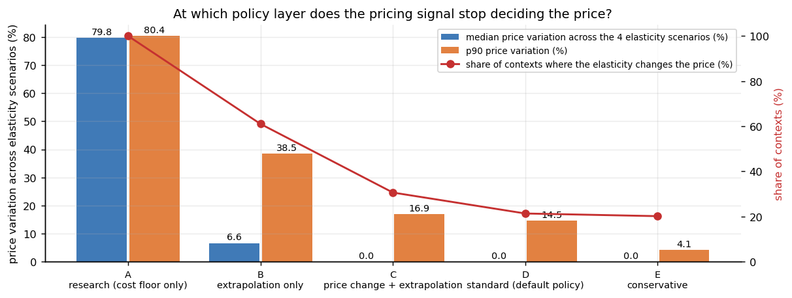

*Figure 14 — Median and p90 price variation across the four elasticity
scenarios (bars, left axis) and the share of contexts where the elasticity
changes the price at all (line, right axis), by guardrail layer. Source:
`artifacts/metrics/guardrail_ablation.json`.*

### 55.4 The finding

**The elasticity assumption matters enormously in research mode and essentially
not at all in production mode.**

* **Layer A (cost floor only):** the recommended price moves a median of
  **79.8%** across the four elasticities, and the elasticity changes the price
  in **99.99%** of contexts. In pure research conditions the pricing signal is
  everything.
* **Layer B (add the historical-support band):** median variation collapses to
  **6.6%** — a factor of twelve — and a constraint moves the optimum in 74.6% of
  contexts. The support band alone does most of the work.
* **Layer C (add the ±10% change cap):** median variation reaches **0.0%**. The
  p90 is still 16.9%, so the elasticity still matters in the tail, but for the
  median context the guardrails now decide.
* **Layers D and E:** median variation stays at 0.0%; the p90 falls further
  (14.5% → 4.1%).

**The pricing signal stops determining the median recommendation at layer C** —
the moment the price-change cap is added.

### 55.5 The honest interpretation

There are two readings and both are true.

**Reading 1 — the system is robust.** If the elasticity is wrong by ±0.8
(the full −1.5 to −2.4 span, which is wider than the two-way clustered
confidence interval), the shipped recommendation for the median context does
not change at all. That is a real safety property, and it is why an
unidentified observational elasticity can be deployed responsibly here.

**Reading 2 — the system is therefore not very sensitive to being right
either.** You cannot claim robustness to being wrong without accepting
insensitivity to being right. If the elasticity moved from −2.0 to the true
value, the median recommendation would not move either.

Both are stated in the repository (`KNOWN_LIMITATIONS.md` #29, #35;
`STATUS.md` open issue 1), and neither is presented without the other.

### 55.6 Where the elasticity does still matter

The median is 0.0% under production guardrails, but three things remain:

1. **The tail.** p90 variation is 14.5% under the standard profile — one context
   in ten still has its price materially determined by the elasticity.
2. **The direction.** The elasticity decides whether the optimum is above or
   below the current price. §44.1 shows this is where the methods diverge most:
   `ml` proposes increases 73.3% of the time, `pooled` 94.8%.
3. **Eligibility and risk.** A product with no usable own estimate gets
   `POOLED_ELASTICITY_FALLBACK` and can never be LOW risk (§57.4). The
   elasticity's *provenance* changes the decision state even when its *value*
   does not change the price.

---

## 56. Rule-only benchmark vs learned pricing

`scripts/audit_model_value.py` → `artifacts/metrics/model_value_ablation.json`,
`reports/12_MODEL_VALUE_ABLATION.md`.

### 56.1 The question — and, crucially, the non-question

**The question.** Does the learned demand/elasticity layer produce materially
different *decisions* from reasonable rules?

**Not the question.** Whether the model earns more money. Scoring a rule with
the model's own demand curve and declaring the model better is **circular** —
the same fitted curve would be both proposer and judge. **No profit comparison
is made in this audit.** That restraint is the single best methodological
decision in the whole Phase M suite.

### 56.2 Setup

All 13,964 week-399 contexts, `standard` profile, `shrunk` response. Every rule
is pushed through **the same policy layer** as the model — eligibility screen,
risk gate, feasible interval, rounding, materiality, decision state — so the
comparison isolates the **pricing signal**, not the guardrails. Rule inputs
(median margin, modal price) are computed from **training weeks only**.

### 56.3 The rules

| rule | definition |
| --- | --- |
| **R0** keep current price | never move a price; the only policy whose outcome was actually observed |
| **R1** hold historical margin | `p = c/(1−m)`, `m` = that series' median historical gross-margin rate |
| **R2** cost-plus 25% margin | `p = c/(1−0.25)`, one fixed category margin target |
| **R3** nearest historical modal price | snap to the most frequent historical price of that series |
| **R4** always take the max allowed increase | `p = p₀·(1 + effective change cap)` — **no demand model at all** |

### 56.4 Decision agreement with the engine

| rule | final price differs at all | **differs by > 1 grid step (5¢)** | mean abs diff | median abs diff | median abs diff % | **same decision state** | model keeps / rule changes | model changes / rule keeps |
| --- | ---: | ---: | ---: | ---: | ---: | ---: | ---: | ---: |
| R0 keep current | 59.7% | 59.1% | $0.141 | $0.130 | 4.3% | **30.7%** | 0.5% | 59.1% |
| R1 hold historical margin | 61.4% | 51.5% | $0.215 | $0.120 | 4.2% | 90.0% | 5.7% | 4.0% |
| R2 cost-plus 25% | 59.7% | 34.9% | $0.107 | $0.030 | 1.0% | 88.8% | 5.6% | 3.8% |
| R3 nearest modal price | 62.2% | 49.5% | $0.179 | $0.050 | 2.5% | 78.9% | 4.6% | 7.6% |
| **R4 max allowed increase** | 59.2% | **17.5%** | **$0.060** | **$0.019** | **0.6%** | **90.0%** | 5.6% | 4.2% |

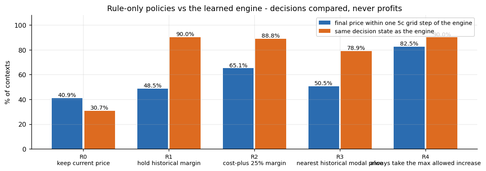

*Figure 15 — For each rule: share of contexts where its final price lands
within one 5-cent grid step of the engine's, and share where it reaches the
same decision state. Decisions are compared; profits are not. Source:
`artifacts/metrics/model_value_ablation.json`.*

### 56.5 The headline

**R4 — "always take the maximum allowed increase", a rule that never looks at
demand, cost-response, elasticity or any model output — lands within one 5-cent
grid step of the engine's final price in 82.5% of contexts** (100% − 17.5%),
**agrees on the decision state in 90.0%**, and differs by a median of **$0.019**
(0.6% of price).

The exact-match rate is lower (40.8%) only because the 5-cent candidate grid
rarely contains the cap itself.

This is §54 seen from the other direction: the model's unconstrained optimum
sits above the change cap in 86.7% of contexts, so the constrained answer is
"go to the cap" — which is exactly what R4 does by construction.

### 56.6 Where the model and R4 genuinely differ

The learned layer is not decorative. It differs from R4 in the contexts where:

1. **the estimated elasticity implies an optimum *below* the current price** — a
   price cut, which R4 can never propose;
2. **the optimum is interior**, so the recommended move is smaller than the cap
   (the 2.9% from §54.8, plus the near-interior cases);
3. **the estimated uplift is immaterial** and the model keeps the price while R4
   would still move it;
4. **the context is ineligible or the elasticity source is a fallback**, which
   changes the risk level and therefore the decision state.

Quantitatively: the model and R4 disagree on the decision state in **10.0%** of
contexts, and the model's median actionable change is **+8.36%** against R4's
**+10.0%** (the cap itself).

### 56.7 The other rules are informative too

**R0 (never move) agrees on the decision state only 30.7% of the time** and the
engine proposes a change where R0 keeps in **59.1%** of contexts. So the engine
is emphatically *not* equivalent to doing nothing — it is very active. It is
just that its activity is largely "go to the cap".

**R2 (flat cost-plus 25%) has the smallest median price gap of the margin rules
($0.030, 1.0%)** — notable because the observed blended margin in the panel is
15.3% and R2 targets 25%. That the engine's answers cluster near a 25%
cost-plus rule says the model is pushing prices well above their historical
margin, consistent with §54.5.

**R3 (snap to the modal historical price) has the worst decision agreement of
the price rules (78.9%)** and the highest "model changes / rule keeps" rate
(7.6%). Anchoring to history is the rule most different in kind from what the
engine does.

### 56.8 What this ablation does and does not establish

**Establishes:** the *magnitude* of most recommendations is reproducible by a
trivial rule. Any claim that "the ML model sets the price" is false for this
system as configured.

**Does not establish:** that the rule is as *good*. Nobody knows which policy
earns more, because that would require observing outcomes at both sets of
prices, which is precisely what offline data cannot provide (§64). The audit
deliberately refuses to answer it rather than answering it circularly.

**The honest summary:** *under these guardrails*, on *this* category, at *this*
decision cadence, the learned layer contributes direction, eligibility and
risk — not magnitude. Whether that is worth the engineering is a business
judgement, and §85 gives the evidence-based answer.

---
---
# PART X — RISK AND DECISION POLICY

## 57. Recommendation risk layer

### 57.1 What it is — stated first, because the naming matters

**It is a heuristic risk score. It is not a calibrated statistical
probability, and it is never described as one.**

From the module docstring of `optimization/risk.py`:

> This is **not** a calibrated statistical confidence interval, and it is never
> described as one. It is a transparent rule-based score over the factors that
> actually make a price recommendation unreliable in this dataset.

The direction of the scale is also fixed and stated:

| level | meaning | consequence |
| --- | --- | --- |
| **LOW** | plenty of history and price variation; the recommendation sits inside the observed price support | may be actionable |
| **MEDIUM** | usable but thinner evidence | actionable under a **tighter** price-change cap |
| **HIGH** | thin evidence and/or extrapolation | **never** an automatic price change under the default profiles |

### 57.2 The bands

`configs/config.yaml → risk`:

| band | min observations | min distinct prices | max extrapolation distance |
| --- | ---: | ---: | ---: |
| **LOW** | 150 | 15 | 2% |
| **MEDIUM** | 80 | 8 | 5% |
| **HIGH** | *(anything that meets neither)* | | |

Compare with the **eligibility** screen (40 obs, 5 distinct prices, CV ≥ 0.05).
The risk bands are deliberately **stricter**, and the config says why:

> Risk bands are deliberately STRICTER than the eligibility screen: eligibility
> answers "can this series be modelled at all", risk answers "how much do we
> trust acting on it". A series can therefore be eligible and still be HIGH
> risk, which is what routes it to REVIEW_REQUIRED instead of an automatic
> price change.

That two-tier design is the mechanism that produces a **human queue** rather
than a binary act/don't-act split.

### 57.3 The extrapolation distance

```python
def extrapolation_distance(price, hist_min, hist_max) -> float:
    if hist_min is None or hist_max is None:
        return float("nan")
    if price < hist_min: return (hist_min - price) / hist_min
    if price > hist_max: return (price - hist_max) / hist_max
    return 0.0
```

Zero inside the observed support, otherwise the relative distance outside it,
**NaN** when no support exists at all. NaN forces HIGH:

```python
no_support = dist != dist   # NaN
if no_support:
    level = RiskLevel.HIGH
```

A series with no observed price support cannot be assessed, so it is treated as
maximally risky rather than defaulting to permissive. This is the right
direction for the failure mode.

### 57.4 Two promotions out of LOW risk

Beyond the bands, two conditions demote a LOW assessment to MEDIUM:

```python
if promotion_share is not None and promotion_share > 0.5:
    notes.append("more than half of this series' weeks carry a promotion code: "
                 "the price effect is entangled with promotion activity")
    if level is RiskLevel.LOW: level = RiskLevel.MEDIUM

if elasticity_source == "pooled_fallback":
    notes.append("no usable product-specific elasticity: the category-level "
                 "(pooled) estimate is being applied to this product")
    if level is RiskLevel.LOW: level = RiskLevel.MEDIUM
```

The second is how an **estimation** limitation becomes a **policy**
consequence. 35.8% of week-399 contexts have no usable own elasticity; none of
them can be LOW risk; every one carries the `POOLED_ELASTICITY_FALLBACK` reason
code. That is limitation propagation done properly — the shortfall shows up in
the decision, not only in a footnote.

### 57.5 Risk is assessed twice

```python
preliminary_risk = risk_at(current_price)   # before any price is proposed
...
final_risk = risk_at(best_price)            # at the proposed price
```

The **preliminary** assessment can gate a context before optimisation ever runs
(under the `conservative` profile) and can tighten the change cap for MEDIUM
risk. The **final** assessment evaluates the extrapolation distance *of the
proposal*, which the preliminary one cannot know. Both are needed: a series can
be well-evidenced at its current price and the proposal can still extrapolate.

### 57.6 What is recorded

Every assessment returns the factors behind it, and they are logged:

```python
factors = {"n_obs", "n_distinct_prices", "price_cv", "extrapolation_distance",
           "abs_price_change_pct", "promotion_share", "elasticity_source"}
```

plus free-text `notes`. So "why is this HIGH risk?" is always answerable from
the audit log.

### 57.7 The honest limitation

The thresholds — 150/15/2% and 80/8/5% — are **asserted, not fitted**.
Calibrating them would mean regressing realised out-of-sample error against the
band boundaries and choosing cut-points that achieve a target error rate. That
was **not done** (limitation #40, `STATUS.md` open issue 7).

Calling an uncalibrated score "confidence" would have been dishonest, so the
project calls it risk, labels it heuristic in the config, the code, the API
response, the dashboard and every report, and lists it as an open issue
(DECISIONS #24).

### 57.8 The Phase L naming inversion — a failure worth recording

The scale used to read the other way round: "HIGH" meant *high confidence* and
sat on actionable recommendations. That is a genuinely dangerous naming bug —
a reviewer scanning a queue would read "HIGH" as "safe to auto-apply" when it
meant the opposite of the current semantics.

Phase L inverted it so that **HIGH means risky**, and added the gate
(DECISIONS #36). The fact that this had to be fixed is reported rather than
hidden, and `tests/test_decision_states.py` (246 tests) now pins the semantics
across every combination of risk level, decision state, actionability, proposal
and final price, for all three profiles.

---

## 58. Decision states

### 58.1 The three states

```python
class DecisionState(StrEnum):
    RECOMMEND_CHANGE = "RECOMMEND_CHANGE"
    KEEP_CURRENT     = "KEEP_CURRENT"
    REVIEW_REQUIRED  = "REVIEW_REQUIRED"
```

| state | meaning | `actionable` | final price |
| --- | --- | :--: | --- |
| **RECOMMEND_CHANGE** | an actionable price change | **true** | the proposal |
| **KEEP_CURRENT** | leave the price alone | false | the current price |
| **REVIEW_REQUIRED** | a proposal exists but a **human must approve it** | false | the current price |

### 58.2 Why three and not two

A binary change/keep split throws information away. A HIGH-risk context can
still deserve a human's attention: the model has found something, but the
evidence is too thin to act on automatically. Collapsing that into
`KEEP_CURRENT` silently discards a real signal; collapsing it into
`RECOMMEND_CHANGE` acts on evidence that does not support it.

`REVIEW_REQUIRED` is the honest third option, and it is what makes the system a
**decision-support** tool rather than an autonomous pricer (DECISIONS #37).

### 58.3 The proposal / final-price split

Phase M split what used to be one field into two (DECISIONS #47):

| field | meaning |
| --- | --- |
| `proposed_candidate_price` | what the optimizer proposed. **Not a business price on its own.** |
| `final_recommended_price` | what would actually be charged: the proposal **only when actionable**, otherwise the current price |
| `proposed_price_change_pct` | change of the proposal |
| `price_change_pct` | change of the **final** price — **0.0 whenever not actionable** |
| `model_internal_estimated_profit_uplift_pct` | the proposal's estimated uplift |
| `realisable_profit_uplift_pct` | **forced to 0.0** whenever not actionable |

```python
actionable = decision is DecisionState.RECOMMEND_CHANGE
final_price = proposed_candidate_price if actionable else current_price
...
realisable_profit_uplift_pct = (profit_uplift if (actionable and profit_uplift is not None) else 0.0)
```

**Why this matters.** With a single `recommended_price` field, any consumer that
forgot to read the `actionable` flag would display a price the policy had
refused to authorise — and, worse, a dashboard summing uplift across a batch
would include proposals that will never be applied. Forcing
`realisable_profit_uplift_pct` to zero makes that class of error impossible by
construction rather than by convention.

### 58.4 The invariants

Six invariants are asserted over **every** decision:

| # | invariant |
| --- | --- |
| 1 | **HIGH risk is never actionable** (under default profiles) |
| 2 | `actionable` **iff** `decision == RECOMMEND_CHANGE` |
| 3 | `REVIEW_REQUIRED` keeps the current price |
| 4 | `KEEP_CURRENT` keeps the current price |
| 5 | `KEEP_CURRENT` proposes nothing (proposal == current price) |
| 6 | `RECOMMEND_CHANGE` actually changes the price |

### 58.5 Invariant verification over every real context

`scripts/audit_decision_states.py` → `artifacts/metrics/decision_state_audit.json`,
`reports/19_DECISION_STATE_AUDIT.md`. All **13,964** week-399 contexts × three
profiles.

| profile | inv. 1 | inv. 2 | inv. 3 | inv. 4 | inv. 5 | inv. 6 |
| --- | ---: | ---: | ---: | ---: | ---: | ---: |
| **standard** | **0** | 0 | 0 | 0 | 0 | 0 |
| **conservative** | **0** | 0 | 0 | 0 | 0 | 0 |
| aggressive (DEMO) | **4,717** | 0 | 0 | 0 | 0 | 0 |

**Zero violations under both default profiles.** The 4,717 under `aggressive`
are **by design** — that profile sets `high_risk_action: recommend` and is
explicitly labelled DEMO ONLY in the configuration:

```yaml
aggressive:
  # DEMO ONLY: explicitly allows acting on HIGH-risk contexts. Never the default.
  high_risk_action: recommend
```

The audit reporting them as violations rather than suppressing them is the
correct behaviour: the invariant is stated absolutely, and the one profile that
breaks it is named.

### 58.6 Decision-state distribution by profile

All 13,964 week-399 contexts:

| profile | RECOMMEND_CHANGE | KEEP_CURRENT | REVIEW_REQUIRED | LOW risk | MEDIUM | HIGH | **HIGH & actionable** |
| --- | ---: | ---: | ---: | ---: | ---: | ---: | ---: |
| **standard** | **8,265 (59.2%)** | 4,346 (31.1%) | **1,353 (9.7%)** | 5,511 | 3,693 | 4,760 | **0** |
| **conservative** | 6,354 (45.5%) | 7,610 (54.5%) | **0** | 7,163 | 2,041 | 4,760 | **0** |
| aggressive (DEMO) | 9,885 (70.8%) | 4,079 (29.2%) | 0 | 4,032 | 1,830 | 8,102 | **4,717** |

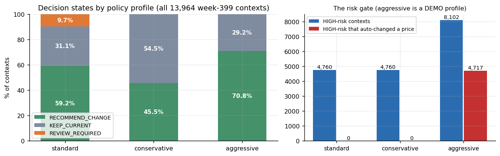

*Figure 16 — Left: decision-state mix by policy profile over all 13,964
contexts. Right: HIGH-risk contexts and how many of them auto-changed a price.
Zero under both default profiles. Source:
`artifacts/metrics/decision_state_audit.json`.*

Two things worth reading off this table:

* **`conservative` produces no REVIEW_REQUIRED at all**, because its
  `high_risk_action` is `keep_current` — HIGH-risk contexts are silently kept
  rather than queued. That is a deliberate difference in operating model, not
  an inconsistency.
* **`aggressive` has *more* HIGH-risk contexts (8,102 vs 4,760)**, which is
  initially surprising. The mechanism: its wider ±20% change cap and 10%
  extrapolation tolerance let the optimizer propose prices further outside the
  observed support, and the **final** risk assessment is made *at the proposal*.
  Looser guardrails manufacture risk.

### 58.7 The 246 property tests

`tests/test_decision_states.py` contains **246** tests that walk every
combination of risk level × decision state × actionability × proposal × final
price across all three profiles, plus audit-log schema rotation. It is the
single largest test file in the project, and appropriately so: the decision
state is the contract every downstream consumer relies on.

---

## 59. High-risk gating

### 59.1 The batch statistics

**3,000-context batch** (`reports/07_RECOMMENDATION_SUMMARY.md`, week 399,
standard profile, `shrunk` response):

| quantity | value |
| --- | ---: |
| contexts scored | 3,000 |
| RECOMMEND_CHANGE | **1,766 (58.87%)** |
| KEEP_CURRENT | 923 (30.77%) |
| REVIEW_REQUIRED | **311 (10.37%)** |
| LOW risk | 1,175 |
| MEDIUM risk | 786 |
| **HIGH risk** | **1,039** |
| **HIGH-risk contexts that auto-changed a price** | **0 of 1,039** |

**Full week** (13,964 contexts, `reports/19`): HIGH risk 4,760, **HIGH-risk
actionable 0**.

### 59.2 What happens to HIGH-risk contexts

Under the `standard` profile, 4,760 HIGH-risk contexts split as:

| outcome | contexts |
| --- | ---: |
| KEEP_CURRENT | 3,407 |
| REVIEW_REQUIRED | 1,353 |
| RECOMMEND_CHANGE | **0** |

And the KEEP_CURRENT ones break down by cause (causes overlap):

| cause | contexts |
| --- | ---: |
| screened out by the eligibility rules (never reaches the optimizer) | 3,349 |
| the optimum **is** the current price | 3,391 |
| no feasible price inside the guardrails | 41 |
| estimated uplift below the materiality threshold | 16 |

Most HIGH-risk contexts never reach the risk gate at all: the eligibility screen
catches them first, which is the cheaper and earlier defence.

### 59.3 Why HIGH-risk recommendations are not auto-actioned

**Constraints bound the size of a mistake; they do not bound its likelihood.**

The guardrails guarantee that no single recommendation moves a price more than
10%, stays above cost, keeps a 5% margin and stays near observed support. They
say nothing about whether the *evidence* supports moving at all. A series with
45 observations and 6 distinct prices can produce a perfectly feasible +9.3%
recommendation with a large estimated uplift — computed from an elasticity
fitted on almost no price variation, or falling back to the category number
entirely.

That is a different kind of error from "the move is too big", and it needs a
different control.

### 59.4 Human-in-the-loop pricing

The intended lifecycle, implemented in `src/pricing_engine/audit.py`:

```
GENERATED → REVIEWED → APPROVED / REJECTED → PUBLISHED
```

Every recommendation is appended to `artifacts/recommendation_log.csv` (34
columns) with its inputs, constraints, model version, elasticity used and
source, risk level, decision state, both prices, both uplift figures and the
reason codes. The current log holds **3,002 rows**.

`REVIEW_REQUIRED` is where the human enters. The engine's contribution is to
make the queue **small and prioritised**: 9.7% of contexts under the standard
profile — 1,353 of 13,964.

### 59.5 The limitation the project states about its own queue

> **REVIEW_REQUIRED is a queue, not a solution.** In a real deployment somebody
> has to work that queue; this demo only produces it.
> (`KNOWN_LIMITATIONS.md` #33)

1,353 items per week is a real staffing question. A category manager with 45,477
weekly price decisions cannot review 1,353 of them by hand every week without a
prioritisation layer — sorting by estimated value at risk, or by product
importance. That layer does not exist here, and saying so is more useful than
pretending the queue is free.

### 59.6 The `aggressive` profile and why it exists

`aggressive` sets `high_risk_action: recommend` and would auto-change 4,717
HIGH-risk prices. It exists for exactly one reason: to make the **sensitivity of
the output to the policy** visible and measurable. Turning the gate off and
showing that 4,717 prices move is a far more convincing demonstration that the
gate does something than asserting it.

It is labelled DEMO ONLY in the config comment, in the dashboard selector
("Policy profile (DEMO setting)"), in `DECISIONS.md` #25 and #38, and in the
decision-state audit, which reports its 4,717 invariant violations rather than
excluding it.

---

## 60. Reason codes

Every recommendation carries a sorted, de-duplicated list of reason codes.
`reason_codes=sorted(set(reasons))`.

### 60.1 The full catalogue

| code | meaning | when it fires |
| --- | --- | --- |
| `KEEP_CURRENT_OPTIMAL` | the engine recommends leaving the price alone | attached to **every** KEEP_CURRENT outcome |
| `LOW_CONFIDENCE` | the evidence does not support automatic action | with HIGH-risk gating |
| `INSUFFICIENT_HISTORY` | fewer observations than `eligibility.min_observations` (40) | eligibility screen |
| `INSUFFICIENT_PRICE_VARIATION` | fewer than 5 distinct prices, or price CV < 0.05 | eligibility screen |
| `OUTSIDE_EXTRAPOLATION_RANGE` | the extrapolation guardrail is an active edge of the feasible interval | constraint binding |
| `COST_UNAVAILABLE` | no decision-time cost for a gross-profit objective | eligibility screen |
| `MARGIN_CONSTRAINT` | the cost floor or minimum-margin floor is an active edge | constraint binding |
| `PRICE_CHANGE_LIMIT` | the maximum-change window is an active edge | constraint binding |
| `PROFIT_UPLIFT_POSITIVE` | the proposal beats the current price on estimated gross profit by more than materiality | objective = gross_profit |
| `REVENUE_UPLIFT_POSITIVE` | as above, revenue objective | objective = revenue |
| `NO_FEASIBLE_PRICE` | the constraint intersection is empty, or no candidate survives | constraints |
| `NON_MATERIAL_UPLIFT` | the estimated gain is below the materiality threshold | materiality check |
| `DEMAND_CURVE_NOT_DECREASING` | the simulated demand curve is not monotone decreasing | curve diagnostic |
| `HIGH_RISK_REVIEW_REQUIRED` | HIGH risk under a profile whose `high_risk_action` is `review_required` | risk gate |
| `HIGH_RISK_KEEP_CURRENT` | HIGH risk under a profile whose `high_risk_action` is `keep_current` | risk gate |
| `MEDIUM_RISK_CONSERVATIVE` | MEDIUM risk; the price-change cap has been tightened | risk adjustment |
| `POOLED_ELASTICITY_FALLBACK` | no usable product-specific elasticity; the category estimate is applied | elasticity provenance |

### 60.2 Observed frequencies (3,000-context batch, week 399, standard)

| code | count | share of contexts |
| --- | ---: | ---: |
| `PRICE_CHANGE_LIMIT` | **2,216** | 73.9% |
| `PROFIT_UPLIFT_POSITIVE` | **2,077** | 69.2% |
| `KEEP_CURRENT_OPTIMAL` | 923 | 30.8% |
| `INSUFFICIENT_PRICE_VARIATION` | 668 | 22.3% |
| `INSUFFICIENT_HISTORY` | 567 | 18.9% |
| `POOLED_ELASTICITY_FALLBACK` | 523 | 17.4% |
| `OUTSIDE_EXTRAPOLATION_RANGE` | 465 | 15.5% |
| `MEDIUM_RISK_CONSERVATIVE` | 416 | 13.9% |
| `LOW_CONFIDENCE` | 311 | 10.4% |
| `HIGH_RISK_REVIEW_REQUIRED` | 311 | 10.4% |
| `MARGIN_CONSTRAINT` | 208 | 6.9% |
| `NON_MATERIAL_UPLIFT` | 136 | 4.5% |
| `NO_FEASIBLE_PRICE` | 37 | 1.2% |

Sanity checks that the codes are internally consistent:

* `LOW_CONFIDENCE` (311) and `HIGH_RISK_REVIEW_REQUIRED` (311) match exactly,
  and both equal the REVIEW_REQUIRED count (311). ✓
* `KEEP_CURRENT_OPTIMAL` (923) equals the KEEP_CURRENT count (923). ✓
* `PRICE_CHANGE_LIMIT` is the most frequent code, consistent with the
  attribution finding that it is the first binding constraint in 44.6% of
  contexts. ✓
* `POOLED_ELASTICITY_FALLBACK` (523/3,000 = 17.4%) is lower than the full-week
  fallback share (35.8%) because the 3,000-context batch is a sample and because
  the code is only emitted for contexts that pass the eligibility screen — a
  fallback context that is screened out never reaches that line. ✓
* `DEMAND_CURVE_NOT_DECREASING` **never fires**, consistent with the hybrid
  response being monotone by construction for `ε < 0`. ✓

### 60.3 Worked examples

**Example A — actionable, at the guardrail corner** (the demo context):

```
CAPN CRUNCH JUMBO CR (3000006560), store 86, week 399
  $3.35 → $3.66 (+9.25%)   RECOMMEND_CHANGE, actionable, LOW risk
  reason codes: PRICE_CHANGE_LIMIT, PROFIT_UPLIFT_POSITIVE
```

Read as: *the proposal beats the current price on estimated gross profit
(`PROFIT_UPLIFT_POSITIVE`), and it sits at the edge of the ±10% change window
(`PRICE_CHANGE_LIMIT`) — the model wanted to go further.*

**Example B — screened out before optimisation:**

```
  KEEP_CURRENT, not actionable
  reason codes: INSUFFICIENT_HISTORY, INSUFFICIENT_PRICE_VARIATION,
                KEEP_CURRENT_OPTIMAL
```

Read as: *this series has too few observations and too little price variation
to model, so no price was proposed at all.*

**Example C — a proposal a human must approve:**

```
  REVIEW_REQUIRED, not actionable, HIGH risk
  reason codes: HIGH_RISK_REVIEW_REQUIRED, LOW_CONFIDENCE,
                POOLED_ELASTICITY_FALLBACK, PRICE_CHANGE_LIMIT,
                PROFIT_UPLIFT_POSITIVE
```

Read as: *a proposal exists and looks profitable, but this product has no usable
own elasticity and the evidence is thin — final price stays where it is until a
human approves.*

### 60.4 Why reason codes rather than feature importances

A SHAP plot explains a *prediction*. A reason code explains a **decision** —
which is what a category manager, an auditor or a regulator actually asks
about. "Why this price?" is answered with `PRICE_CHANGE_LIMIT,
PROFIT_UPLIFT_POSITIVE` and a feasible interval, not with a bar chart of
feature attributions.

Reason codes are also **testable**: `tests/test_optimizer.py` and
`tests/test_attribution.py` assert exact code sets for specific fixtures, and
the attribution replica must reproduce them exactly to be trusted. A SHAP
explanation cannot be unit-tested in that way.

---
---

# PART XI — BACKTESTING AND POLICY EVALUATION

## 61. Historical evaluation design

`scripts/backtest.py --weeks 10 --contexts-per-week 400` →
`artifacts/metrics/backtest.json`, `reports/06_BACKTEST.md`.

| parameter | value |
| --- | --- |
| weeks evaluated | **390 – 399** (1997-02-27 … 1997-05-01) |
| contexts per week | 400 (sampled) |
| model | `ridge_loglog-20260818-132847`, trained on weeks 2–257 |
| policy profile | `standard` |
| price response | `shrunk` |
| objective | gross profit |

The backtest window sits **entirely inside the test window (343–399)** and
therefore **entirely after** the model's training window and the elasticity
estimation window (both ending at week 257). Leakage channel #10 is closed by
construction.

### 61.1 The two halves, which must not be confused

The backtest produces two categorically different kinds of number:

| half | what it measures | verifiable against outcomes? |
| --- | --- | :--: |
| **demand accuracy per week** | how well the forecaster predicted realised demand at the prices actually charged | **YES** |
| **policy economics** | what four pricing policies would have earned, scored by the model | **NO — circular** |

The report keeps them separate, and so does this section. §62 is the first;
§63 is the second; §64 explains exactly why the second cannot be trusted.

### 61.2 Which model scores which half

A design detail worth naming (DECISIONS #42): **accuracy is scored with the
baseline forecaster; policies are scored with the pricing model.** WAPE measures
forecasting at observed prices, which is the base model's job; the
price-response layer only matters for counterfactuals. Mixing them would make
the accuracy number depend on the elasticity, which it should not.

---

## 62. Demand forecast evaluation

### 62.1 Weekly accuracy

| week | week start | n | MAE | RMSE | **WAPE** | bias | sMAPE |
| ---: | --- | ---: | ---: | ---: | ---: | ---: | ---: |
| 390 | 1997-02-27 | 14,053 | 8.092 | 33.862 | 0.4802 | −2.954 | 0.4104 |
| 391 | 1997-03-06 | 14,036 | 6.871 | 56.248 | 0.4170 | −2.299 | 0.3767 |
| 392 | 1997-03-13 | 14,010 | 9.531 | 69.951 | 0.5030 | −5.013 | 0.3755 |
| 393 | 1997-03-20 | 14,097 | 6.323 | 20.311 | 0.3947 | −2.144 | 0.3786 |
| **394** | 1997-03-27 | 14,255 | 6.396 | 23.998 | **0.3638** | −3.434 | 0.3135 |
| 395 | 1997-04-03 | 14,166 | 8.225 | **168.758** | 0.4673 | −2.859 | 0.3922 |
| 396 | 1997-04-10 | 14,151 | 11.094 | 57.358 | 0.5294 | −7.213 | 0.4011 |
| 397 | 1997-04-17 | 14,074 | 13.363 | 64.906 | 0.5524 | −9.169 | 0.4042 |
| **398** | 1997-04-24 | 14,046 | 13.570 | 57.362 | **0.5602** | −9.691 | 0.5039 |
| 399 | 1997-05-01 | 13,964 | 9.298 | 30.309 | 0.5089 | −1.836 | 0.4450 |

| anchor statistic | value |
| --- | ---: |
| **mean weekly WAPE** | **0.4777** |
| min / max weekly WAPE | 0.3638 / 0.5602 |
| mean weekly bias | **−4.661 units** |

### 62.2 Reading it

**The mean weekly WAPE of 0.4777 is consistent with the test-window figure of
0.4565** — slightly worse, as expected, because these are the *last* ten weeks
of the test window and accuracy degrades with distance from training (§41.8).

**The range 0.364–0.560 is wide**, and that spread is the operationally
important number. It says the *same model on the same category* can be 36% or
56% wrong depending on the week. It is the direct justification for the
materiality threshold: a counterfactual difference smaller than the week-to-week
variation in the model's own error is not a signal.

**Week 395 has an RMSE of 168.8 against a MAE of 8.2** — a ratio of 20.5. That
is one or more enormous individual misses. It is the week containing the
17,824-unit promotional spike in the demo series (§18.5), and it is a clean
illustration of why RMSE alone would be a misleading headline metric here.

**Bias is negative in every single week**, ranging −1.8 to −9.7. The systematic
under-forecast (§41.4) is stable, not episodic. A production system would either
apply a smearing correction or calibrate the bias out; this one reports it.

### 62.3 This is the only outcome-verifiable metric in the backtest

Every number in §62 is checkable against what actually happened: prices were
charged, units were sold, the model predicted, the errors are real. Nothing in
§63 has that property.

---

## 63. Pricing policy evaluation

### 63.1 The four policies

Implemented in `src/pricing_engine/optimization/policies.py`, all pushed through
the same constraint layer:

| policy | definition |
| --- | --- |
| **HistoricalPricePolicy** | charge what was actually charged — **the only policy whose outcome was observed** |
| **SimpleMarginPolicy** | cost-plus to a target margin |
| **ElasticityBaselinePolicy** | the closed-form CE optimum `p* = c·ε/(1+ε)`, clipped to the feasible interval |
| **MLPricingPolicy** | the full engine: hybrid response, constrained optimizer, risk gate |

### 63.2 Results — **model-internal estimates only**

Totals across 10 weeks × ~400 contexts.

| policy | expected revenue | **expected gross profit** | predicted units | mean price | share unchanged | median abs change | share outside support | share constrained | **GP vs historical** | rev vs historical |
| --- | ---: | ---: | ---: | ---: | ---: | ---: | ---: | ---: | ---: | ---: |
| **HistoricalPricePolicy** | $170,709 | $37,679 | 53,834 | $3.181 | **100%** | 0.0% | 0.0% | 0% | **0.00%** | 0.00% |
| SimpleMarginPolicy | **$173,228** | $38,546 | **55,352** | $3.134 | 0% | 4.37% | 25.1% | 100% | +2.30% | **+1.48%** |
| **ElasticityBaselinePolicy** | $161,290 | **$42,834** | 48,526 | $3.336 | 6.4% | 9.99% | **37.9%** | 100% | **+13.68%** | −5.52% |
| **MLPricingPolicy** | $163,340 | $41,617 | 49,620 | $3.320 | **36.9%** | 4.40% | 21.4% | 78.4% | **+10.45%** | −4.32% |

### 63.3 Reading the table — carefully

**Every "vs historical" figure is a model-internal estimate.** The same fitted
price response both proposes and scores the prices. See §64 before drawing any
conclusion.

That said, the *relative* patterns are informative about the policies'
behaviour, which is a legitimate reading:

**All profit-seeking policies trade revenue for profit.** Elasticity baseline:
+13.7% gross profit, −5.5% revenue. ML: +10.5% profit, −4.3% revenue. That is
§2.2 in action — with `|ε| > 1`, raising price loses revenue and can still gain
profit.

**SimpleMarginPolicy is the outlier**: it *raises* revenue (+1.5%) and barely
raises profit (+2.3%), because a fixed margin target on a 15.3%-blended-margin
category mostly *lowers* prices (mean $3.134 vs $3.181 historical).

**ElasticityBaselinePolicy "wins" on estimated profit and is the least
deployable.** It moves 93.6% of prices, by a median of 10.0% (the cap), and
puts **37.9%** of them outside the observed price support. It is the
unconstrained model optimum with the guardrails only partially applied — the
research policy of §55 layer A, essentially.

**MLPricingPolicy is deliberately more conservative:** 36.9% of prices
unchanged, median change 4.4%, only 21.4% outside support, and 78.4% of its
recommendations touched by a binding constraint. It gives up 3.2 percentage
points of *estimated* profit for a materially safer profile. That trade is the
whole point of the risk and materiality layers, and it is visible in the table.


*Figure 17 — Model-internal estimated gross profit by policy across weeks
390–399. Only the HistoricalPricePolicy bar corresponds to an outcome that was
actually observed. Source: `scripts/backtest.py`.*

---

## 64. The circularity problem

This section exists because it is the single most important caveat attached to
§63, and because a report that buried it would be misleading.

### 64.1 The problem, stated

To evaluate a pricing policy you must know what would have happened at the
prices it proposes. Those prices were **never charged**. The only instrument
available to estimate the outcome is the **same fitted price-response model
that proposed them**.

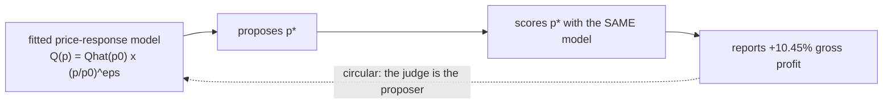
```mermaid
flowchart LR
    A["fitted price-response model<br/>Q(p) = Qhat(p0) x (p/p0)^eps"] --> B["proposes p*"]
    B --> C["scores p* with the SAME model"]
    C --> D["reports +10.45% gross profit"]
    D -.->|"circular: the judge is the proposer"| A
```

### 64.2 What the +10.45% actually means

> *"If the fitted price-response model is correct, then applying the ML
> policy's prices instead of the historical ones would have produced 10.45%
> more gross profit — as computed by that same model."*

The conditional clause is not decoration. It is the entire content of the
statement.

### 64.3 Why this is not fixable with better offline methodology

Standard fixes do not apply.

* **Cross-validation** validates predictions at *observed* prices. It says
  nothing about unobserved ones.
* **A held-out test set** contains the retailer's prices, not the policy's.
* **Off-policy evaluation** (importance sampling, doubly-robust estimators)
  requires a **known behaviour policy with positive propensity** over the
  actions being evaluated. The retailer's pricing rule is unknown, deterministic
  in effect, and assigns zero probability to most candidate prices. The
  importance weights are undefined.
* **A better demand model** reduces the variance of a circular estimate. It does
  not make it non-circular.

The only escape is **intervention** — assigning prices exogenously (§98).

### 64.4 A concrete illustration of how the bias arises

Suppose the true elasticity is −2.0 and the model believes −2.4.

The model computes its optimum as `p* = c·2.4/1.4 = 1.714·c`, whereas the true
optimum is `c·2.0/1.0 = 2.0·c`. It then *scores* `1.714·c` using its own
`ε = −2.4` curve, which — relative to the truth — **understates** how much
volume survives a price rise, so it under-states the profit at its own chosen
price. In this particular direction the bias happens to be conservative.

Reverse the error (model believes −1.6, truth −2.0) and the model both
over-shoots the price *and* over-states the profit there. **The direction of the
bias depends on the direction of the model's error, which is unknown.** That is
why the number cannot be signed, let alone trusted.

### 64.5 How the project handles it

| mechanism | where |
| --- | --- |
| the metric is **named** `model_internal_estimated_profit_uplift_pct` | code, API schema, dashboard, audit log, all reports |
| `realisable_profit_uplift_pct` is forced to 0 for non-actionable rows | `optimizer.py` |
| every dashboard page carries the disclaimer | `dashboard/app.py` `DISCLAIMER` constant |
| the API `ModelInfoResponse` and `RecommendPriceResponse` carry `disclaimer` fields | `api/schemas.py` |
| the backtest report is labelled `VALIDATED (LIMITED)` in `STATUS.md` | `STATUS.md` |
| `scripts/audit_claims.py --strict` fails the build if an unsupported claim reappears | CI-enforceable |
| the model-value ablation **refuses to compare profits** at all (§56.1) | `audit_model_value.py` |

### 64.6 The one thing that partly escapes circularity

§45's out-of-time validation compares four candidate price-response methods
against **154,899 realised outcomes** following **real** price changes. That is
not self-scoring — the ground truth is observed demand. It is still not causal
(§45.7), but it is genuinely out-of-sample, and it is why `shrunk` was chosen on
evidence rather than assertion.

---

## 65. What can actually be verified offline

### 65.1 Strongly verifiable

These are checkable against outcomes or against closed-form ground truth, and
this report presents them as facts.

| claim | evidence | value |
| --- | --- | --- |
| demand-model accuracy on held-out time | `artifacts/metrics/evaluation.json`, 749,040 rows scored once | **test WAPE 0.4565**, MAE 8.503, RMSE 72.064, bias −3.883 |
| accuracy vs naive baselines | `model_metrics.json` | 37.7% relative WAPE improvement over the best baseline |
| accuracy through time | `backtest.json`, `monitoring.json` | weekly WAPE 0.364–0.560; quarterly 0.409 → 0.528 |
| model persistence is lossless | `evaluate.py` | reload WAPE difference **0.00e+00** |
| **optimizer correctness** | `tests/test_optimizer.py` | linear-demand profit optimum `(a+bc)/(2b) = 6.25` and revenue optimum `a/(2b) = 5.00` recovered within one grid step |
| **constraint behaviour** | `constraint_attribution.json`, 13,964 contexts × 11 runs | every constraint's present / removes / binds / changes counts |
| **decision-state invariants** | `decision_state_audit.json` | 0 violations across 13,964 contexts × 2 default profiles |
| **no cost leakage** | `cost_leakage_audit.json` | 4,671,333 rows, 0 mismatches; poisoning test with teeth; 0 of 19 recommendations changed |
| **no feature leakage** | `tests/test_features.py` | 12 enumerated channels, each with a failing-if-broken test |
| **elasticity estimated only on training weeks** | elasticity table metadata | window 2–257 recorded; script aborts otherwise |
| **out-of-time price-response ranking** | `out_of_time_price_response.json` | 154,899 realised episodes; `shrunk` lowest WAPE in every split |
| **elasticity inference** | `elasticity_inference.json` | estimators validated against statsmodels; two-way clustered SE 16.24× classical |
| **elasticity stability (category)** | `elasticity_stability.json` | max pairwise z between disjoint windows 1.36 — not significant |
| **rule-vs-model decision agreement** | `model_value_ablation.json` | R4 within one grid step 82.5%, same decision state 90.0% |
| test suite and lint | live re-run at Phase N, 2026-08-19 | **519 passed, 0 failed**; ruff clean |

### 65.2 Not directly verifiable

These are estimates, and this report labels every one of them as such.

| claim | why it cannot be verified here |
| --- | --- |
| true counterfactual demand at any unobserved price | never observed; the model is the only estimator and it is also the proposer |
| the +8.30% portfolio uplift | model-internal; circular (§64) |
| the +10.45% backtest policy uplift | model-internal; circular |
| the causal effect of a price change | requires intervention (§33, §98) |
| whether the ML policy beats the rule-only policy | would require a profit comparison, which would be circular (§56.1) |
| whether the risk bands are correctly calibrated | never fitted against realised out-of-sample error |
| whether the AAC proxy is economically correct | only its temporal availability was proven |
| whether product-level elasticity is a durable asset | rank correlation +0.19 across disjoint windows says probably not |

### 65.3 The dividing line

**Everything about the *machinery* can be verified. Almost nothing about the
*economics* can.**

The engine's data pipeline, feature contract, model persistence, optimizer,
constraint layer, decision logic and audit trail are all testable and tested.
The one thing it exists to claim — that these prices would earn more money —
cannot be established offline by any method, and requires the experiment in
§98.

A project that understands that distinction, states it, and then builds the
verification apparatus for everything on the left side of the line is doing the
job correctly. A project that reports "+10% profit uplift" as a result is not.

---
---
# PART XII — SYSTEM ARCHITECTURE

## 66. End-to-end architecture

### 66.1 The full pipeline

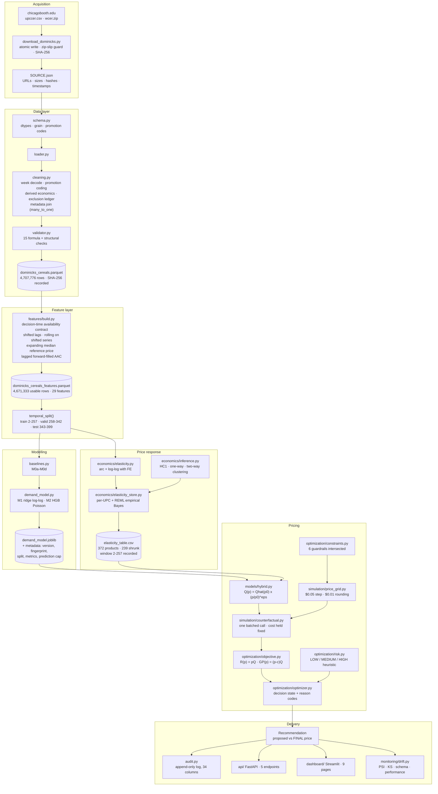
```mermaid
flowchart TD
    subgraph acq["Acquisition"]
        A1["chicagobooth.edu<br/>upccer.csv · wcer.zip"]
        A2["download_dominicks.py<br/>atomic write · zip-slip guard · SHA-256"]
        A3["SOURCE.json<br/>URLs · sizes · hashes · timestamps"]
        A1 --> A2 --> A3
    end

    subgraph data["Data layer"]
        B1["schema.py<br/>dtypes · grain · promotion codes"]
        B2["loader.py"]
        B3["cleaning.py<br/>week decode · promotion coding<br/>derived economics · exclusion ledger<br/>metadata join (many_to_one)"]
        B4["validator.py<br/>15 formula + structural checks"]
        B5[("dominicks_cereals.parquet<br/>4,707,776 rows · SHA-256 recorded")]
        B1 --> B2 --> B3 --> B4 --> B5
    end

    subgraph feat["Feature layer"]
        C1["features/build.py<br/>decision-time availability contract<br/>shifted lags · rolling on shifted series<br/>expanding median reference price<br/>lagged forward-filled AAC"]
        C2[("dominicks_cereals_features.parquet<br/>4,671,333 usable rows · 29 features")]
        C3["temporal_split()<br/>train 2-257 · valid 258-342 · test 343-399"]
        C1 --> C2 --> C3
    end

    subgraph model["Modelling"]
        D1["baselines.py<br/>M0a-M0d"]
        D2["demand_model.py<br/>M1 ridge log-log · M2 HGB Poisson"]
        D3[("demand_model.joblib<br/>+ metadata: version, fingerprint,<br/>split, metrics, prediction cap")]
        D1 --> D2 --> D3
    end

    subgraph elas["Price response"]
        E1["economics/elasticity.py<br/>arc + log-log with FE"]
        E2["economics/inference.py<br/>HC1 · one-way · two-way clustering"]
        E3["economics/elasticity_store.py<br/>per-UPC + REML empirical Bayes"]
        E4[("elasticity_table.csv<br/>372 products · 239 shrunk<br/>window 2-257 recorded")]
        E1 --> E3
        E2 --> E3 --> E4
    end

    subgraph price["Pricing"]
        F1["models/hybrid.py<br/>Q(p) = Qhat(p0) x (p/p0)^eps"]
        F2["simulation/price_grid.py<br/>$0.05 step · $0.01 rounding"]
        F3["simulation/counterfactual.py<br/>one batched call · cost held fixed"]
        F4["optimization/constraints.py<br/>6 guardrails intersected"]
        F5["optimization/objective.py<br/>R(p) = pQ · GP(p) = (p-c)Q"]
        F6["optimization/risk.py<br/>LOW / MEDIUM / HIGH heuristic"]
        F7["optimization/optimizer.py<br/>decision state + reason codes"]
        F1 --> F3
        F2 --> F3 --> F5 --> F7
        F4 --> F2
        F6 --> F7
    end

    subgraph out["Delivery"]
        G1["Recommendation<br/>proposed vs FINAL price"]
        G2["audit.py<br/>append-only log, 34 columns"]
        G3["api/ FastAPI · 5 endpoints"]
        G4["dashboard/ Streamlit · 9 pages"]
        G5["monitoring/drift.py<br/>PSI · KS · schema · performance"]
        G1 --> G2
        G1 --> G3
        G1 --> G4
        G1 --> G5
    end

    A3 --> B1
    B5 --> C1
    C3 --> D1
    C3 --> E1
    D3 --> F1
    E4 --> F1
    F7 --> G1
```

### 66.2 The decision path for one recommendation

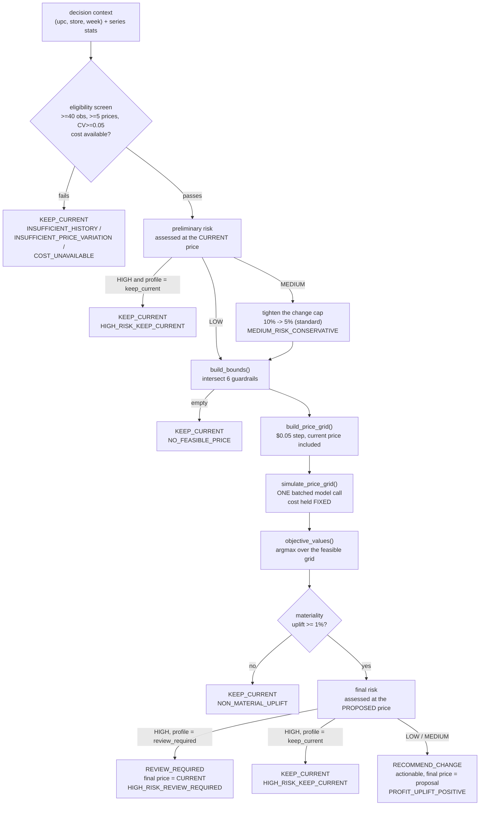
```mermaid
flowchart TD
    S["decision context<br/>(upc, store, week) + series stats"] --> E{"eligibility screen<br/>>=40 obs, >=5 prices, CV>=0.05<br/>cost available?"}
    E -->|fails| K1["KEEP_CURRENT<br/>INSUFFICIENT_HISTORY /<br/>INSUFFICIENT_PRICE_VARIATION /<br/>COST_UNAVAILABLE"]
    E -->|passes| R1["preliminary risk<br/>assessed at the CURRENT price"]
    R1 -->|HIGH and profile = keep_current| K2["KEEP_CURRENT<br/>HIGH_RISK_KEEP_CURRENT"]
    R1 -->|MEDIUM| M["tighten the change cap<br/>10% -> 5% (standard)<br/>MEDIUM_RISK_CONSERVATIVE"]
    R1 -->|LOW| B
    M --> B["build_bounds()<br/>intersect 6 guardrails"]
    B -->|empty| K3["KEEP_CURRENT<br/>NO_FEASIBLE_PRICE"]
    B --> G["build_price_grid()<br/>$0.05 step, current price included"]
    G --> SIM["simulate_price_grid()<br/>ONE batched model call<br/>cost held FIXED"]
    SIM --> OBJ["objective_values()<br/>argmax over the feasible grid"]
    OBJ --> MAT{"materiality<br/>uplift >= 1%?"}
    MAT -->|no| K4["KEEP_CURRENT<br/>NON_MATERIAL_UPLIFT"]
    MAT -->|yes| R2["final risk<br/>assessed at the PROPOSED price"]
    R2 -->|HIGH, profile = review_required| RR["REVIEW_REQUIRED<br/>final price = CURRENT<br/>HIGH_RISK_REVIEW_REQUIRED"]
    R2 -->|HIGH, profile = keep_current| K5["KEEP_CURRENT<br/>HIGH_RISK_KEEP_CURRENT"]
    R2 -->|LOW / MEDIUM| RC["RECOMMEND_CHANGE<br/>actionable, final price = proposal<br/>PROFIT_UPLIFT_POSITIVE"]
```

### 66.3 The layering principle

Each layer answers exactly one question, and the boundaries are where the
scientific claims change:

| layer | question | claim strength |
| --- | --- | --- |
| data | what happened? | **observed fact** |
| features | what was knowable at decision time? | contract, tested |
| forecast | how much will sell at this context? | **predicted**, measured on held-out time |
| elasticity | how does demand move with price? | **observational estimate**, with intervals |
| hybrid | what would demand be at price `p`? | **model-internal counterfactual** |
| optimizer | which feasible price maximises the objective? | **exact**, given the curve |
| constraints | which prices are allowed? | policy |
| risk | should we act automatically? | heuristic |
| audit | what did we decide, and why? | recorded |

---

## 67. Repository architecture

### 67.1 Package layout and responsibilities

| module | responsibility | why it is separate |
| --- | --- | --- |
| `config.py` | loads `configs/config.yaml`; `get` / `require` / `path` / `policy` accessors | one source of truth for every threshold; code never hardcodes a magic number, and `PRICING_ENGINE_CONFIG` allows overriding the whole tree |
| `data/schema.py` | canonical column list, grain, dtypes, promotion-code map | the schema is a constant, so column order and grain are stable across runs |
| `data/loader.py` | reads the raw CSVs with explicit dtypes | prevents pandas type inference from silently changing behaviour between runs |
| `data/cleaning.py` | week decoding, promotion coding, derived economics, the exclusion ledger, the metadata join | every exclusion is counted; the join asserts its own cardinality |
| `data/validator.py` | the 15 formula and structural checks | re-derives identities from the persisted file, independently of the code that wrote it |
| `economics/metrics.py` | `revenue`, `gross_profit`, `gross_margin_rate`, `price_change_pct`, `price_variation_summary`, `eligible_series` | **one definition of revenue project-wide** — EDA, simulator, optimizer, API and dashboard all call the same functions |
| `economics/elasticity.py` | arc and log-log elasticity with fixed effects | the analysis-layer estimators |
| `economics/inference.py` | OLS, HC1, one-way and two-way clustered covariance, demeaning | validated against statsmodels; used by both the analysis and the pricing estimators |
| `economics/elasticity_store.py` | per-UPC estimation, REML empirical Bayes, the servable `ElasticityTable` | the pricing elasticity is a **first-class artifact** with its own provenance, not a number in a script |
| `features/build.py` | the decision-time feature contract; `recompute_price_features`; `temporal_split` | **the single implementation of price-dependent features**, shared by training, simulation, optimization, API and dashboard |
| `models/baselines.py` | four naive forecasts | the price of admission |
| `models/demand_model.py` | `DemandModel` — one interface over ridge and HGB; UPC prior; prediction cap; `implied_elasticity`; persistence | downstream code never branches on model family |
| `models/hybrid.py` | `HybridPricingModel` — the elasticity price response | exposes the **same `predict(frame) → units` contract**, so the simulator, optimizer, API and dashboard need no special case |
| `models/metrics.py` | WAPE, MAE, RMSE, bias, sMAPE | one definition, used everywhere |
| `simulation/price_grid.py` | candidate grid construction, rounding, charm pricing | grid failures raise instead of returning empty |
| `simulation/counterfactual.py` | `simulate_price_grid`, `simulate_many`, `demand_curve_diagnostics` | enforces both simulation invariants |
| `optimization/objective.py` | the two objectives plus the **analytical optima** used as test ground truth | closed-form answers live next to the code they validate |
| `optimization/constraints.py` | `build_bounds`, `apply_constraints`, `PriceBounds` | one intersection, with provenance |
| `optimization/risk.py` | the heuristic risk layer | isolated so it can be replaced by a calibrated model without touching the optimizer |
| `optimization/optimizer.py` | `optimize_price` → `Recommendation` | the orchestrator; the only place decision states are assigned |
| `optimization/policies.py` | the four backtest policies | so alternative policies run through the *same* constraint layer |
| `optimization/attribution.py` | the fast optimizer replica used by the Phase M audits | ~450× faster; **only trusted because tests pin it against the real optimizer** |
| `monitoring/drift.py` | PSI, KS, schema checks, performance windows | offline monitoring |
| `audit.py` | append-only recommendation log with lifecycle states | every recommendation is reconstructible after the fact |
| `utils/io.py` | atomic writes, `ensure_dir`, `utc_now`, fingerprinting | so a crashed run cannot leave a half-written artifact |

### 67.2 The interaction that matters most

```
features.build.recompute_price_features
        ↑            ↑             ↑              ↑            ↑
   training     simulator     optimizer     hybrid model     API
```

One function, five callers. This is what makes the guarantee "a candidate price
is scored exactly as a training row would be" structural rather than
aspirational. Any divergence would be a leakage bug (channel #7) and it is
tested from both directions:
`test_recompute_price_features_changes_only_price_features` and
`test_price_features_recomputed_for_each_candidate`.

The second most important interaction is the **model interface**:
`DemandModel.predict(frame) → units` and
`HybridPricingModel.predict(frame) → units` have identical contracts, so
`simulate_price_grid`, `optimize_price`, the API and the dashboard are all
model-agnostic. Switching from `ml` to `pooled` to `shrunk` is a config change,
not a code change.

### 67.3 Scripts — one CLI per pipeline stage

29 pipeline scripts plus this report's figure generator. Grouped:

| group | scripts |
| --- | --- |
| **acquisition & data** | `download_dominicks.py`, `build_dataset.py`, `validate_data.py`, `build_features.py` |
| **analysis** | `run_eda.py`, `run_elasticity.py` |
| **modelling** | `train.py`, `evaluate.py`, `price_response.py` |
| **pricing** | `estimate_elasticity.py`, `compare_price_response.py`, `optimize.py`, `backtest.py`, `run_demo.py` |
| **monitoring & smoke** | `monitor.py`, `smoke_dashboard.py` |
| **Phase L audits** | `audit_zero_price.py`, `audit_cost_leakage.py` |
| **Phase M audits** | `audit_constraints.py`, `audit_model_value.py`, `audit_guardrails.py`, `audit_shrinkage.py`, `audit_elasticity_inference.py`, `audit_out_of_time_response.py`, `audit_elasticity_stability.py`, `audit_eligibility_funnel.py`, `audit_decision_states.py`, `audit_claims.py` |
| **reporting** | `make_report_figures.py` (added for this report) |

Every script writes both a **machine-readable JSON** to `artifacts/metrics/`
and a **human-readable Markdown report** to `reports/`. That pairing is what
makes the reports auditable: the prose is generated from the same dictionary
the JSON serialises.

### 67.4 Src-layout and why

`pyproject.toml` uses `[tool.setuptools.packages.find] where = ["src"]` and the
package is installed editable. So `import pricing_engine` resolves identically
for scripts, tests, the API and the dashboard — no `sys.path` manipulation in
library code, and no chance of importing a stale copy from the working
directory (DECISIONS #30).

---

## 68. Training pipeline

### 68.1 The command

```bash
python scripts/train.py     # or: make train
```

### 68.2 What it does, in order

1. **Load** `data/processed/dominicks_cereals_features.parquet`.
2. **Restrict to usable rows** via `training_frame()` — requires `move`,
   `lag_move_1` and `lag_price_1` (drops 36,443 series-opening rows).
3. **Chronological split** via `temporal_split()` — train 2–257 (3,206,437),
   validation 258–342 (715,856), test 343–399 (749,040). Prints the windows.
4. **Fit and score the four naive baselines** on validation *and* test.
5. **Fit M1 ridge log-log** — 31.0 s. Fit the smoothed UPC demand prior on
   training rows only; record the prediction cap at 5× max training demand.
6. **Fit M2 HGB Poisson** — 181.9 s.
7. **Measure each price-aware model's implied elasticity** by central finite
   difference on a 50,000-row sample.
8. **Select** the price-aware model with the lowest **validation** WAPE →
   **M1 ridge log-log** (0.4135 vs 0.4226).
9. **Score the selected model once on the test window** → WAPE 0.4565.
10. **Compute segment breakdowns** for the selected model: by promotion state,
    by within-series price-variation bucket, worst 10 stores by WAPE.
11. **Persist** `artifacts/models/demand_model.joblib` with `compress=3`, plus
    `demand_model_metadata.json`.
12. **Write** `artifacts/metrics/model_metrics.json` and
    `reports/04_MODEL_COMPARISON.md`.

Total runtime: **243 s**.

### 68.3 What is stored in the artifact

```python
joblib.dump({
    "kind": self.kind, "name": self.name, "params": self.params,
    "estimator": self.estimator,          # the whole sklearn Pipeline
    "upc_prior": self.upc_prior_,         # fitted on training rows only
    "global_prior": self.global_prior_,
    "prediction_cap": self.prediction_cap_,
    "metadata": self.metadata.as_dict(),
}, p, compress=3)
```

The **preprocessing travels with the model**, so a candidate price scored at
inference goes through exactly the same imputation, scaling and encoding as a
training row.

### 68.4 The separate elasticity fit

```bash
python scripts/estimate_elasticity.py     # or: make estimate-elasticity
```

Restricted to training weeks 2–257 (the script aborts otherwise), 35.0 s.
Produces `artifacts/models/elasticity_table.csv` — 372 product rows with
`elasticity_raw`, `std_error`, `std_error_hc1`, `std_error_cluster_store`,
`std_error_cluster_week`, `se_inflation_vs_hc1`, `t_stat`, CI bounds, `r_squared`,
`n_obs`, `n_distinct_prices`, `usable`, `reject_reason`, `shrinkage_weight`,
`elasticity_shrunk`, `elasticity_final`, `elasticity_source`, `clipped` — plus
23 `meta_*` columns carrying the pooled estimate, its several standard errors,
`τ²`, the prior mean, the estimation window and the clip band.

**The elasticity table is a versioned model artifact, not a number in a
script.**

### 68.5 The full pipeline

```bash
make all
```

which runs, in dependency order: `data` → `validate` → `features` → `eda` →
`elasticity` → `train` → `evaluate` → `price-response` → `estimate-elasticity`
→ `compare-response` → `optimize` → `backtest` → `monitor` →
`audit-zero-price` → `audit-cost` → `audit` (reports 11–20).

---

## 69. Recommendation pipeline

### 69.1 A real recommendation, end to end

Traced from a **live API call** made on 2026-08-19 (§72 shows the raw JSON).

**Step 0 — the request**

```json
{"upc": 3000006560, "store": 86, "objective": "gross_profit", "policy_profile": "standard"}
```

**Step 1 — context lookup.** `AppState.context(3000006560, 86, None)` filters
the in-memory serving slice (the most recent 8 weeks, 112,763 contexts) and
takes the latest row: **week 399, 1997-05-01**.

**Step 2 — the observed context**

| field | value |
| --- | --- |
| product | CAPN CRUNCH JUMBO CR |
| current effective unit price `p₀` | **$3.35** |
| decision-time unit cost `c` (lagged, forward-filled AAC) | **$2.5571** |
| observed price support | **$1.50 – $3.79** over 359 weeks, 56 distinct prices |
| recent weeks | 392–394: 12–18 units @ $3.35 · **395: 17,824 units @ $1.50** · 396: 465 @ $3.19 (`S`) · 397–399: 11–25 @ $3.35 |

**Step 3 — reference price stamped.** `attach_reference_price(row)` records
`reference_price = $3.35` **from the observed row**, before any candidate is
substituted.

**Step 4 — elasticity lookup.** UPC 3000006560 has a usable own estimate:
raw −3.0178, panel-robust SE 0.2557, weight 0.9214 ⟹
**ε = −2.9401**, source `shrunk_product`.

**Step 5 — baseline demand.** `recompute_price_features(frame, $3.35)` then
`M1.predict(...)` ⟹ **`Q̂(p₀) = 25.5647` units**. (Actual observed that week:
12 — a 113% over-forecast on this single store-week, which is entirely typical
at WAPE 0.46.)

**Step 6 — eligibility.** 359 observations ≥ 40 ✓, 56 distinct prices ≥ 5 ✓,
price CV ≥ 0.05 ✓, cost available ✓. **Passes.**

**Step 7 — preliminary risk at $3.35.** 359 obs ≥ 150 ✓, 56 prices ≥ 15 ✓,
extrapolation distance 0.0 ≤ 0.02 ✓, elasticity source is `shrunk_product` (not
a fallback), promotion share ≤ 0.5 ⟹ **LOW**. No cap tightening.

**Step 8 — constraints.**

| bound | source | value |
| --- | --- | ---: |
| lower | ABSOLUTE_PRICE_FLOOR | $0.0100 |
| lower | OUTSIDE_EXTRAPOLATION_RANGE (`$1.50 × 0.95`) | $1.4250 |
| lower | COST_FLOOR | $2.5571 |
| lower | MIN_MARGIN (`$2.5571 / 0.95`) | $2.6916 |
| lower | **PRICE_CHANGE_LIMIT** (`$3.35 × 0.90`) ⬅ | **$3.0150** |
| upper | OUTSIDE_EXTRAPOLATION_RANGE (`$3.79 × 1.05`) | $3.9795 |
| upper | **PRICE_CHANGE_LIMIT** (`$3.35 × 1.10`) ⬅ | **$3.6850** |

**Feasible interval: [$3.015, $3.685].** Both edges are the change cap.

**Step 9 — candidate grid.** $0.05 step from $3.015 to $3.685, rounded to
$0.01, plus the current price: **{$3.02, $3.07, …, $3.66, $3.35}** — 15
candidates.

**Step 10 — simulate.** One batched call. Every candidate gets
`log_price`, `price_vs_last_week`, `price_vs_series_reference`,
`price_vs_recent_mean` recomputed; every context feature and the cost stay
fixed.

**Step 11 — objective.** `GP(p) = (p − $2.5571) · Q(p)`. The unconstrained CE
optimum is `$2.5571 × 2.9401/1.9401 = $3.875`, **outside** the feasible
interval, so `argmax` lands on the **upper edge**: **$3.66**.

| | current $3.35 | proposed $3.66 |
| --- | ---: | ---: |
| predicted units | 25.5647 | 19.7077 |
| expected revenue | $85.64 | $72.13 |
| **expected gross profit** | **$20.2714** | **$21.7365** |
| expected margin rate | 23.7% | 30.1% |

**Step 12 — materiality.** `(21.7365 − 20.2714)/20.2714 = 0.0723` = **+7.23%**
≥ 1% ⟹ material. `PROFIT_UPLIFT_POSITIVE` raised.

**Step 13 — final risk at $3.66.** $3.66 is inside the observed support
($1.50–$3.79), so extrapolation distance is 0.0 ⟹ still **LOW**.

**Step 14 — decision.** LOW risk ⟹ **RECOMMEND_CHANGE**, `actionable = true`,
`final_recommended_price = $3.66`.

**Step 15 — reason codes.** `PRICE_CHANGE_LIMIT` (the change window is an active
edge — the model wanted $3.875), `PROFIT_UPLIFT_POSITIVE`.

**Step 16 — audit.** Appended to `artifacts/recommendation_log.csv` with all 34
columns, lifecycle state `GENERATED`.

### 69.2 What this trace demonstrates

* The engine **wanted +15.7%** (to $3.875) and **recommended +9.25%** (to
  $3.66). The guardrail absorbed the difference — this is one of the 7,967
  "guardrail corner" contexts (§54.8).
* The elasticity applied was **92% the product's own** and 8% the category
  prior.
* The demand forecast over-predicted this particular week by 113% and **the
  recommended price would have been identical had it predicted 12 units**,
  because `Q̂(p₀)` cancels from the arg-max (§43.6). The forecast set the dollar
  amounts, not the price.
* Every threshold used came from `configs/config.yaml`; nothing was hardcoded.

---
---

# PART XIII — FASTAPI

## 70. API architecture

### 70.1 Startup and model loading

```python
@asynccontextmanager
async def lifespan(app: FastAPI):
    try:
        app.state.engine = build_state()
    except FileNotFoundError as exc:      # keep /health informative instead of crashing
        app.state.engine = None
        app.state.startup_error = str(exc)
    yield
    app.state.engine = None
```

The model artifact, the elasticity table and the serving context slice are
loaded **once** during the FastAPI lifespan, not per request. Reloading a
model per request is the classic way to turn a 5 ms endpoint into a 2 s one.

If artifacts are missing the app still starts, and `/health` reports
`model_loaded: false` rather than the process dying. That is the right failure
mode for a service behind a load balancer.

### 70.2 What is served

```python
model = load_pricing_model(base_model, cfg=cfg)   # the elasticity hybrid, not the raw forecaster
feats = pd.read_parquet(features_path)
contexts = feats[feats["week"] > max_week - SERVING_WEEKS]     # SERVING_WEEKS = 8
contexts = contexts[contexts["lag_price_1"].notna()]
stats = pd.read_csv(cfg.path("metrics_dir") / "price_variation_upc_store.csv")
```

**Verified live on 2026-08-19:**

```json
{"status":"ok","model_loaded":true,"contexts_loaded":112763,
 "decision_weeks":[392,393,394,395,396,397,398,399]}
```

The service deliberately serves the **configured pricing model** (`shrunk` by
default), not the raw forecaster — so the API and the batch pipeline cannot
disagree about what a recommendation means.

### 70.3 Validation strategy

From the schemas module docstring:

> Validation is deliberately strict: a pricing endpoint that silently accepts a
> negative price or an impossible range is a liability.

| rule | mechanism |
| --- | --- |
| `store ≥ 1`, `week ≥ 1` | Pydantic `Field(..., ge=1)` |
| `price > 0`, `unit_cost > 0` | `Field(..., gt=0)` |
| `min_price > 0`, `max_price > 0`, `0 < step ≤ 5.0` | `Field` bounds |
| `max_price ≥ min_price` | `@model_validator(mode="after")` |
| grid ≤ 500 candidates | `@model_validator` — `(max−min)/step > 500` rejected |
| `objective ∈ {gross_profit, revenue}` | `Literal` |
| `policy_profile ∈ {conservative, standard, aggressive}` | `Literal` |
| unknown context | `ContextNotFound` → **404** with the served week range |
| model not loaded | **503** |
| optimizer refusal (e.g. no cost) | `OptimizerError` → **422** |

The 500-candidate cap is a small but real piece of production thinking: without
it, `{"min_price": 0.01, "max_price": 100, "step": 0.001}` would allocate a
100,000-row frame and score it.

### 70.4 Disclaimers as schema fields

`ModelInfoResponse` and `RecommendPriceResponse` both carry a `disclaimer`
field with a default value. That means the caveat is **in the response payload**
— it cannot be lost when a consumer copies a number into a spreadsheet:

> "Predictions are observational model estimates, not causal effects.
> Counterfactual economics at unobserved prices are MODEL-INTERNAL estimates:
> the same fitted price-response model both proposes and scores candidate
> prices, so they are an internal simulation, not an unbiased policy value."

> "REVIEW_REQUIRED and KEEP_CURRENT are not actionable: for those states
> final_recommended_price equals current_price and only
> proposed_candidate_price carries the optimizer's proposal. Uplift figures are
> model-internal estimates, never realised or causal impact."

### 70.5 What the API does not have

No authentication, no rate limiting, no request logging, no tracing, no
per-tenant isolation. **Demo scope**, and `STATUS.md` says so.

---

## 71. Endpoints

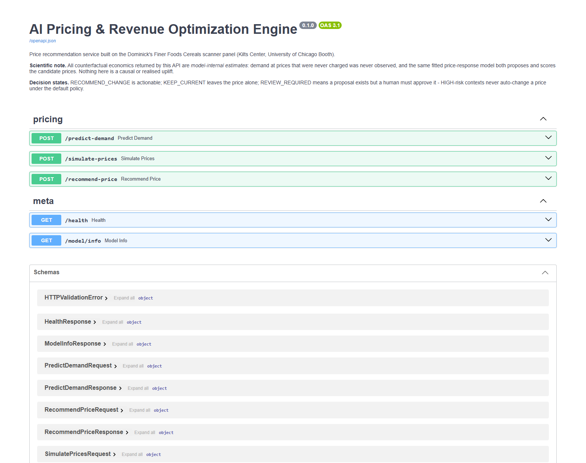

*Figure 18 — The live `/docs` page, captured from a running instance on
2026-08-19. Source: headless Chrome against `http://127.0.0.1:8077/docs`.*

### 71.1 `GET /health`

| | |
| --- | --- |
| **purpose** | liveness plus enough state to diagnose a bad deploy |
| **request** | none |
| **response** | `status`, `model_loaded`, `contexts_loaded`, `decision_weeks` |
| **live example** | `{"status":"ok","model_loaded":true,"contexts_loaded":112763,"decision_weeks":[392,…,399]}` |
| **failure modes** | never fails; reports `model_loaded: false` if artifacts are missing |

### 71.2 `GET /model/info`

| | |
| --- | --- |
| **purpose** | model provenance and headline metrics, for auditability |
| **request** | none |
| **response** | `name`, `kind`, `version`, `price_response_method`, `pooled_elasticity`, `elasticity_training_weeks`, `trained_at_utc`, `target`, `n_features`, `feature_columns`, `train/valid/test_weeks`, `metrics`, `data_fingerprint`, `disclaimer` |
| **failure modes** | 503 if the model is not loaded; returns nulls if metadata is absent |

**Live response (abridged), 2026-08-19:**

```json
{"name": "M1 ridge log-log", "kind": "ridge_loglog",
 "version": "ridge_loglog-20260818-132847",
 "price_response_method": "shrunk", "pooled_elasticity": -2.028859937952365,
 "elasticity_training_weeks": [2, 257], "trained_at_utc": "2026-08-18T09:28:47+00:00",
 "target": "move", "n_features": 26,
 "train_weeks": [2, 257], "valid_weeks": [258, 342], "test_weeks": [343, 399],
 "metrics": {"valid": {"wape": 0.41345926697946545, "mae": 7.875275193954714, ...},
             "test":  {"wape": 0.45649432400768286, "mae": 8.502566963198962, ...}},
 "data_fingerprint": "e9d26f2c0eda9f7e9d8dbb508053e56a932608668e16d8b5aeec0032373722d0"}
```

Note that the response carries **the elasticity estimation window** and the
**dataset fingerprint** — so a consumer can verify which data the served model
was fitted on without access to the training environment.

### 71.3 `POST /predict-demand`

| | |
| --- | --- |
| **purpose** | predicted units for one context, optionally at an override price |
| **request** | `upc`, `store`, `week?`, `price?` (`gt=0`) |
| **response** | `upc`, `store`, `week`, `week_start_date`, `product_description`, `price_used`, `observed_price`, `predicted_units`, `model_version` |
| **validation** | `store ≥ 1`, `week ≥ 1`, `price > 0` |
| **failure modes** | 404 unknown context (message names the served window); 422 invalid payload; 503 model not loaded |

The reference price is stamped **before** the candidate is substituted:

```python
frame = recompute_price_features(attach_reference_price(row), np.array([price]))
```

Without that, the hybrid would compute `p/p₀ = 1` and silently return baseline
demand for every price.

### 71.4 `POST /simulate-prices`

| | |
| --- | --- |
| **purpose** | the full demand / revenue / gross-profit curve over a requested price range |
| **request** | `upc`, `store`, `week?`, `min_price`, `max_price`, `step` (default 0.05), `unit_cost?` |
| **response** | `unit_cost_used`, `model_version`, `price_response_method`, `elasticity_used`, `elasticity_source`, `n_candidates`, `curve[]`, `diagnostics` |
| **curve point** | `candidate_price`, `predicted_units`, `expected_revenue`, `expected_gross_profit`, `expected_margin_rate` |
| **diagnostics** | `n_candidates`, `share_segments_increasing`, `monotone_decreasing`, `relative_demand_span`, `median_local_elasticity`, `min/max_predicted_units`, `flat_response` |
| **validation** | `max_price ≥ min_price`; **≤ 500 candidates**; `step ∈ (0, 5]` |
| **failure modes** | 422 empty or oversized grid; 404 unknown context |

`expected_gross_profit` and `expected_margin_rate` are `null` — not zero — when
no cost is available. That distinction is preserved through the Pydantic model
(`float | None`), so a consumer cannot mistake "unknown" for "zero".

### 71.5 `POST /recommend-price`

| | |
| --- | --- |
| **purpose** | the full constrained recommendation with reason codes |
| **request** | `upc`, `store`, `week?`, `objective` (default `gross_profit`), `policy_profile` (default `standard`), `unit_cost?` |
| **response** | 30 fields — see §72 |
| **validation** | `Literal` on objective and profile; `unit_cost > 0` |
| **failure modes** | 422 on `OptimizerError` (e.g. non-positive current price); 404 unknown context; 503 model not loaded |

`diagnostics` is deliberately **popped** from the response
(`d.pop("diagnostics", None)`) — it holds internal state (grid bounds, objective
values, series stats) that belongs in the audit log rather than in a public
contract.

---

## 72. Example API recommendation

A **live** call, executed 2026-08-19 against a running instance. (The capture
instance ran on port 8077 to avoid colliding with anything on the default port;
`make api` serves on 8000.)

```bash
curl -X POST localhost:8000/recommend-price \
  -H "content-type: application/json" \
  -d '{"upc": 3000006560, "store": 86, "objective": "gross_profit", "policy_profile": "standard"}'
```

```json
{
  "upc": 3000006560,
  "store": 86,
  "decision_week": 399,
  "decision_week_start_date": "1997-05-01",
  "product_description": "CAPN CRUNCH JUMBO CR",
  "objective": "gross_profit",
  "policy_profile": "standard",
  "model_version": "ridge_loglog-20260818-132847",
  "price_response_method": "shrunk",
  "elasticity_used": -2.9400591555147004,
  "elasticity_source": "shrunk_product",
  "current_price": 3.35,
  "proposed_candidate_price": 3.66,
  "final_recommended_price": 3.66,
  "proposed_price_change_pct": 0.09253731343283578,
  "price_change_pct": 0.09253731343283578,
  "decision": "RECOMMEND_CHANGE",
  "actionable": true,
  "predicted_units_current": 25.564729608414478,
  "predicted_units_recommended": 19.707714927805956,
  "expected_revenue_current": 85.6418441881885,
  "expected_revenue_recommended": 72.1302366357698,
  "expected_gross_profit_current": 20.271424609064187,
  "expected_gross_profit_recommended": 21.73652571021359,
  "model_internal_estimated_profit_uplift_pct": 0.0722742051633755,
  "model_internal_estimated_revenue_uplift_pct": -0.15776875989181677,
  "realisable_profit_uplift_pct": 0.0722742051633755,
  "unit_cost_used": 2.5570549964904785,
  "risk_level": "LOW",
  "reason_codes": ["PRICE_CHANGE_LIMIT", "PROFIT_UPLIFT_POSITIVE"],
  "risk_notes": [],
  "constraints": {
    "bounds": [3.015, 3.6850000000000005],
    "max_price_change_pct": 0.1,
    "price_change_window": [3.015, 3.6850000000000005],
    "extrapolation_tolerance_pct": 0.05,
    "support_low": 1.4249999999999998,
    "support_high": 3.9795000000000003,
    "unit_cost": 2.5570549964904785,
    "margin_floor": 2.6916368384110303,
    "lower_bounds": {"ABSOLUTE_PRICE_FLOOR": 0.01, "PRICE_CHANGE_LIMIT": 3.015,
                     "OUTSIDE_EXTRAPOLATION_RANGE": 1.4249999999999998,
                     "COST_FLOOR": 2.5570549964904785, "MIN_MARGIN": 2.6916368384110303},
    "upper_bounds": {"PRICE_CHANGE_LIMIT": 3.6850000000000005,
                     "OUTSIDE_EXTRAPOLATION_RANGE": 3.9795000000000003}
  },
  "disclaimer": "REVIEW_REQUIRED and KEEP_CURRENT are not actionable: ..."
}
```

### 72.1 Every field explained

| field | value | meaning |
| --- | --- | --- |
| `upc`, `store` | 3000006560, 86 | the decision key |
| `decision_week`, `decision_week_start_date` | 399, 1997-05-01 | the week being priced |
| `product_description` | CAPN CRUNCH JUMBO CR | from the UPC metadata join |
| `objective` | `gross_profit` | which objective was maximised |
| `policy_profile` | `standard` | which guardrail set applied |
| `model_version` | `ridge_loglog-20260818-132847` | ties the answer to a specific artifact |
| `price_response_method` | `shrunk` | **which counterfactual assumption produced this** |
| `elasticity_used` | −2.9401 | the `ε` actually applied |
| `elasticity_source` | `shrunk_product` | its provenance — not the pooled fallback |
| `current_price` | $3.35 | observed `p₀` |
| **`proposed_candidate_price`** | **$3.66** | the optimizer's proposal — **not a business price on its own** |
| **`final_recommended_price`** | **$3.66** | what would actually be charged (equal here only because the decision is actionable) |
| `proposed_price_change_pct` | +9.254% | change of the proposal |
| `price_change_pct` | +9.254% | change of the **final** price — would be 0.0 if not actionable |
| `decision` | `RECOMMEND_CHANGE` | the decision state |
| `actionable` | `true` | the single boolean a consumer must respect |
| `predicted_units_current` → `_recommended` | 25.56 → 19.71 | model-internal demand at both prices |
| `expected_revenue_current` → `_recommended` | $85.64 → $72.13 | revenue **falls** — `\|ε\| > 1` |
| `expected_gross_profit_current` → `_recommended` | $20.27 → $21.74 | profit **rises** |
| **`model_internal_estimated_profit_uplift_pct`** | **+7.227%** | the same model proposed and scored this — **not realised, not causal** |
| `model_internal_estimated_revenue_uplift_pct` | −15.777% | the revenue/profit trade-off, quantified |
| `realisable_profit_uplift_pct` | +7.227% | equals the estimate **only because actionable**; forced to 0.0 otherwise |
| `unit_cost_used` | $2.5571 | the lagged, forward-filled AAC held fixed across the grid |
| `risk_level` | `LOW` | heuristic, not calibrated confidence |
| `reason_codes` | `PRICE_CHANGE_LIMIT`, `PROFIT_UPLIFT_POSITIVE` | the change cap is an active edge; the proposal beats current on estimated profit |
| `risk_notes` | `[]` | no promotion-entanglement or fallback caveat applies |
| `constraints.bounds` | [$3.015, $3.685] | the feasible interval |
| `constraints.lower_bounds` / `upper_bounds` | 5 lower, 2 upper | **every** guardrail's value, not just the binding one — so "why not $3.90?" is answerable from the payload |
| `disclaimer` | (text) | travels with the response |

### 72.2 The two most important fields

**`price_response_method` + `elasticity_source`.** Without them, +7.227% is
uninterpretable — §44.1 showed the same engine reports 8.28% or 17.57% median
uplift depending only on the method. The payload always says which one produced
this number.

**`proposed_candidate_price` vs `final_recommended_price`.** They are equal here
only because `actionable` is true. For a `REVIEW_REQUIRED` context, the proposal
would be $3.66 and the final price $3.35, and any consumer reading only one
field would be wrong in one direction or the other.

---
---
# PART XIV — STREAMLIT DASHBOARD

## 73. Dashboard design

### 73.1 Why it exists

A JSON API answers "what price?". It does not let a **pricing manager** ask
"why?", "what if?", and "how much do I trust this?" — which are the three
questions that decide whether a recommendation gets applied.

### 73.2 Target user

A **category / pricing manager** who owns the price decision, plus a **data
scientist or analyst** auditing the engine's behaviour. Neither reads Parquet
files. Both need to interrogate a single decision *and* see the portfolio.

### 73.3 Design principles, enforced in code

**1. No number is typed into the app.** From the module docstring:

> Nine pages, all driven by artifacts produced by the pipeline — no numbers are
> typed into this file. Anything the pipeline has not produced yet is reported
> as missing rather than faked.

Every metric comes from `artifacts/metrics/*.json`, `artifacts/figures/*.png`,
the feature Parquet or the model artifact.

**2. Missing artifacts are reported, never faked.**

```python
def missing(what: str, command: str) -> None:
    st.warning(f"{what} is not available yet. Run `{command}` first.")

def figure(name: str):
    path = CFG.path("figures_dir") / name
    if path.exists(): st.image(str(path), use_container_width=True)
    else: st.info(f"Figure not generated yet: {name}")
```

**3. The disclaimer is unavoidable.** A module-level `DISCLAIMER` constant is
rendered on every page that shows counterfactual economics, and a permanent
sidebar warning appears on **all nine pages**:

> "Counterfactual economics shown anywhere in this app are MODEL-INTERNAL
> estimates - never realised or causal uplift. HIGH risk means risky: those
> contexts are gated to REVIEW_REQUIRED by default."

**4. Caching is explicit.** `@st.cache_data` for artifacts and the panel,
`@st.cache_resource` for the model. The panel is ~4.7M rows and is loaded with
an explicit column list (`PANEL_COLUMNS`, 38 columns) rather than the whole
table.

**5. The dashboard serves the pricing model, not the forecaster.**

```python
base = load_model(path, cfg=CFG)
try:    return load_pricing_model(base, cfg=CFG)
except Exception:  return load_pricing_model(base, cfg=CFG, method="ml")
```

So the dashboard, the API and the batch pipeline cannot disagree about what a
recommendation means. The `ml` fallback exists so the app still runs when the
elasticity table is missing — and it changes the displayed
`price_response_method`, so the substitution is visible.

**6. Plotly, deliberately.** `st.bar_chart`/`st.line_chart` pull in Altair,
which does not import on Python 3.13 in this environment. The choice is
commented in the code and recorded in DECISIONS #29.

---

## 74. Each dashboard page

Nine pages, verified rendering by `scripts/smoke_dashboard.py` and captured live
on 2026-08-19 (§75).

### 74.1 Page 1 — Executive overview

| aspect | detail |
| --- | --- |
| **purpose** | the whole project on one screen for a non-technical stakeholder |
| **filters** | none — this is the portfolio view |
| **KPIs (row 1)** | historical observed revenue **$262.0M**; historical observed gross profit **$40.1M**; products × stores **489 × 93**; weeks covered **366** |
| **KPIs (row 2)** | selected model **M1 ridge log-log**; test WAPE **0.4565**; series eligible for pricing **19,707 / 36,443**; model-internal estimated portfolio uplift **+8.30%** (with a hover: *"Internal simulation only. Not realised, not causal, not an unbiased policy value."*) |
| **charts** | weekly observed revenue and gross profit; weekly observed units; reason-code frequency bar chart |
| **batch panel** | contexts scored 3,000; actionable 58.9%; review required 10.4%; keep current 30.8%; plus the caption *"HIGH-risk contexts that still auto-changed a price: **0** of 1,039 (must be zero under the default policy profiles)"* |
| **business interpretation** | scale, model quality, coverage and the current recommendation mix, in one view |
| **limitations shown** | the uplift KPI is labelled model-internal in its own tooltip; the page-level disclaimer is directly under the title |

### 74.2 Page 2 — Product / store explorer

| aspect | detail |
| --- | --- |
| **purpose** | inspect the raw history of one UPC × store series before trusting any recommendation for it |
| **filters** | product (sorted by total units), store |
| **KPIs** | observations; observed revenue; observed gross profit; mean gross margin |
| **charts** | dual-axis time series — effective unit price and estimated unit AAC (dotted) on the left axis, units sold as bars on the right, with **triangles marking recorded promotion weeks** |
| **table** | the raw series: week, date, price, units, revenue, gross profit, margin rate, estimated AAC, promotion type |
| **business interpretation** | "has this series ever been priced near where the engine wants to put it?" and "does its cost move with its price?" |
| **limitations shown** | in-line caption: *"Triangles mark weeks with a recorded promotion code. Absence of a marker does NOT prove there was no promotion — the coding is incomplete."* |

### 74.3 Page 3 — Pricing and demand

| aspect | detail |
| --- | --- |
| **purpose** | category-level pricing structure |
| **KPIs** | mean effective unit price **$3.12**; rows with a promotion code **7.35%**; median cross-store price spread **13.6%** |
| **charts** | price distribution; price-versus-demand scatter; within-series price-CV histogram with the eligibility threshold (0.05) marked by a dashed line |
| **table** | top 200 series by units: `n_obs`, `n_distinct_prices`, `price_cv`, `price_min/max`, `n_price_changes`, `eligible` |
| **business interpretation** | how much price variation exists, and which series can be optimised at all |
| **limitations shown** | in-line caption: *"The scatter above is an association, not a demand curve: price and demand are jointly determined by promotions, seasonality and retailer decisions."* |

### 74.4 Page 4 — Elasticity analysis

| aspect | detail |
| --- | --- |
| **purpose** | show the naive-to-controlled elasticity ladder and the product-level spread |
| **table** | the four log-log specifications with elasticity, SE, CI, R², n, controls |
| **callout** | computed live: *"The naive pooled coefficient and the fixed-effects coefficient differ by a factor of 7.0. That gap is the clearest evidence that the raw association is not a causal effect."* |
| **KPIs** | median per-UPC elasticity **−2.36**; p10 / p90 **−4.09 / −0.24**; UPCs with a wrong-signed significant coefficient **5.1%** |
| **charts** | per-UPC elasticity histogram; arc-elasticity histogram |
| **table** | per-UPC estimates with SE, t, n, R² |
| **business interpretation** | how price-sensitive the category is, and how much products differ |
| **limitations shown** | the wrong-sign KPI is displayed as a headline metric, not buried |

### 74.5 Page 5 — Price simulator

| aspect | detail |
| --- | --- |
| **purpose** | free-form what-if on one context, with no policy layer |
| **filters** | product, store (latest week only) |
| **KPIs** | current price; decision-time unit cost (lagged AAC); observed price support; **elasticity applied** with a tooltip naming the source and method |
| **input** | a candidate-price slider, ±40% around the current price, $0.05 step |
| **outputs** | predicted units; expected revenue; expected gross profit; price change % |
| **chart** | dual-axis — predicted units on the left, expected revenue and expected gross profit on the right, with vertical markers for the current price and the candidate |
| **guards** | red error if the candidate is **outside the observed price support**: *"Extrapolation warning: $X is outside this series' observed price support ($A – $B). The model has no data there."* — and a second if the candidate is **below cost** |
| **business interpretation** | build intuition about the trade-off before looking at what the engine recommends |
| **limitations** | this page has **no guardrails** — it will happily simulate a price the policy layer would refuse. That is the point, and the two red warnings are how it stays honest. |

### 74.6 Page 6 — Recommendation engine

| aspect | detail |
| --- | --- |
| **purpose** | the product: a full recommendation with its reasoning |
| **filters** | product, store, **policy profile** (labelled *"Policy profile (DEMO setting)"*), objective (gross profit / revenue) |
| **KPIs** | current price; **proposed candidate price** (with tooltip: *"The optimizer's proposal. It only becomes a business price when the decision state is RECOMMEND_CHANGE."*); **FINAL recommended price** (tooltip: *"What would actually be charged under this policy: the current price whenever the decision is not actionable."*); decision state |
| **status banner** | green for RECOMMEND_CHANGE, blue for KEEP_CURRENT, **amber warning** for REVIEW_REQUIRED with the explicit text: *"this context is HIGH risk, so the proposal is NOT applied automatically. A human must approve it. The final price stays at $X."* |
| **provenance line** | `price response: shrunk | elasticity -3.248 (shrunk_product)` |
| **economics** | predicted units, expected revenue and expected gross profit, each shown as `current → recommended`, with the uplift labelled **"(model-internal estimate)"** |
| **reason codes** | rendered as inline code chips |
| **risk notes** | rendered as italic bullets when present |
| **feasible range** | printed explicitly |
| **expander** | full `constraints` and `diagnostics` JSON |
| **chart** | demand / revenue / gross-profit curves with the current price, the proposed candidate, a shaded **feasible band**, and — when the decision is not actionable — a red "not actionable" annotation on the proposal marker |
| **audit log** | expander showing the last 200 rows of `artifacts/recommendation_log.csv` |
| **business interpretation** | everything a manager needs to accept or reject a single price |
| **limitations shown** | the proposed/final split is explicit in the KPI row; the risk caption states the score is heuristic and not calibrated confidence |

### 74.7 Page 7 — Model performance

| aspect | detail |
| --- | --- |
| **purpose** | the evidence behind the model, for a technical reviewer |
| **split panel** | train / validation / test weeks and dates, with the sentence *"No random splitting is used anywhere."* |
| **table** | all six models: price-aware flag, validation WAPE/MAE, test WAPE/MAE, implied elasticity |
| **callout** | *"Selected model: M1 ridge log-log (lowest validation WAPE among price-aware models)"* |
| **charts** | actual vs predicted weekly; prediction scatter; residuals |
| **segment tables** | error by recorded promotion state; error by within-series price variation |
| **price-response panel** | curves monotone decreasing **100.0%**; median implied elasticity **−3.10**; flat curves **0.00%**; demand-curve figure |
| **method-comparison panel** | the per-method table and the pairwise-disagreement table, with the caption *"The same baseline demand model and constraints produce different prices depending only on the price-response assumption."* |
| **elasticity-estimation panel** | pooled controlled **−2.029**; UPC × store FE **−2.222**; products usable **239/372**; mean shrinkage weight **0.78** |
| **backtest panel** | the four-policy table and weekly-WAPE figure, under the heading *"Offline policy comparison (model-internal estimate)"* |
| **limitations shown** | the implied-elasticity column sits directly beside the WAPE column, so the −3.10 vs −2.03 tension is visible in one table |

### 74.8 Page 8 — Data quality

| aspect | detail |
| --- | --- |
| **purpose** | prove the data pipeline rather than assert it |
| **KPIs** | raw rows **6,602,582**; canonical rows **4,707,776**; rows removed **1,894,806 (28.7%)**; duplicate grain rows **0** |
| **table** | the complete exclusion ledger — rule, rows removed, % of raw, reason |
| **JSON** | metadata-join quality (duplicate metadata UPCs 0, movement UPCs 489, metadata UPCs 490, rows without metadata 0) |
| **tables** | `ok` flag counts; recorded sale-code counts, with the caption *"B = Bonus Buy, C = Coupon, S = simple price reduction. G and L are undocumented codes found in the Cereals file."* |
| **checks** | the 15 formula/structural checks with a green *"15 / 15 checks pass"* |
| **zero-price panel** | rows with price = 0 **1,851,380 (28.0% of raw)**; of which recorded any sales **677**; leading/trailing runs **73%** |
| **cost-leakage panel** | the three audit results as JSON, all `true` |
| **reproducibility panel** | Parquet SHA-256, DataFrame fingerprint, full environment |
| **business interpretation** | "can I trust the inputs?" answered with counts, not adjectives |
| **limitations shown** | the 26.6% zero-price exclusion is displayed as a headline KPI rather than hidden in the ledger |

### 74.9 Page 9 — Methodology and limitations

| aspect | detail |
| --- | --- |
| **purpose** | the caveats, in full, inside the product |
| **banner** | a red error box: *"**This engine does not measure causal price effects.** Dominick's prices were set by the retailer, not randomised. Every counterfactual number here is a model estimate."* |
| **tabs** | Limitations (`KNOWN_LIMITATIONS.md` in full) · Causal (`docs/CAUSAL_LIMITATIONS.md`) · Pricing science (`docs/PRICING_SCIENCE.md`) · Data source (`docs/DATA_SOURCE.md`) · Model card (`docs/MODEL_CARD.md`) · Reports (a selector over 12 generated reports) |
| **business interpretation** | a manager can read every caveat without leaving the app |
| **limitations shown** | this page **is** the limitations |

**One gap worth naming:** the Reports tab selector lists 12 reports
(`01`–`10`, `MONITORING_DESIGN`, `VALIDATION_SUMMARY`) and does **not** include
the ten Phase M audits (`11`–`20`). Those are the reports containing the
project's most important findings — the constraint attribution, the rule
ablation, the shrinkage correction. A user browsing only the dashboard would
not reach them. This is a real, small defect and it is recorded in the
limitations register (Appendix K, #L14).

---

## 75. Dashboard screenshots

**These are real screenshots of the running application**, captured on
2026-08-19 by driving the live Streamlit server (port 8511) with headless
Chrome via Selenium and saving full-page captures. No image in this report is
mocked, drawn or edited.

All nine are stored in `artifacts/report_figures/`:

| # | page | file |
| --- | --- | --- |
| 1 | Executive overview | `dashboard_1_executive_overview.png` |
| 2 | Product / store explorer | `dashboard_2_product_store_explorer.png` |
| 3 | Pricing & demand | `dashboard_3_pricing_and_demand.png` |
| 4 | Elasticity analysis | `dashboard_4_elasticity_analysis.png` |
| 5 | Price simulator | `dashboard_5_price_simulator.png` |
| 6 | Recommendation engine | `dashboard_6_recommendation_engine.png` |
| 7 | Model performance | `dashboard_7_model_performance.png` |
| 8 | Data quality | `dashboard_8_data_quality.png` |
| 9 | Methodology & limitations | `dashboard_9_methodology_limitations.png` |

Plus the API documentation: `api_openapi_docs.png` (§71).

### 75.1 Executive overview

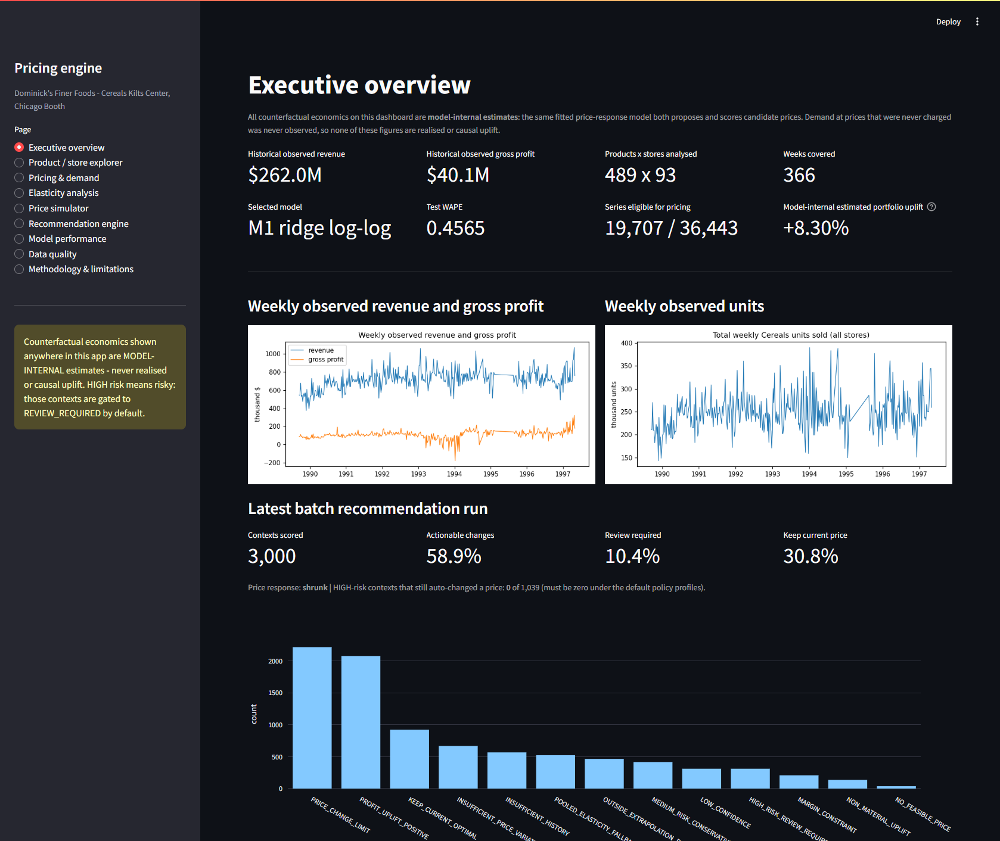

*Figure 19 — Every KPI on this page is read from a pipeline artifact. Note the
`+8.30%` uplift tile, which carries a tooltip stating it is an internal
simulation, and the caption confirming **0 of 1,039** HIGH-risk contexts
auto-changed a price.*

### 75.2 Price simulator

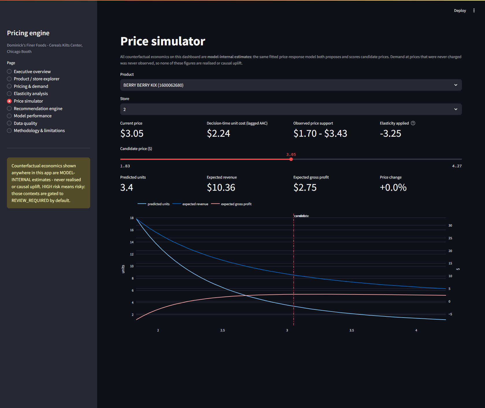

*Figure 20 — BERRY BERRY KIX (1600062680) at store 2. Current price $3.05,
decision-time unit cost $2.24, observed support $1.70–$3.43, applied elasticity
−3.25. The gross-profit curve (red) peaks well to the right of the current
price; the revenue curve (blue) falls monotonically — the §2.2 divergence,
visible in the product.*

### 75.3 Recommendation engine

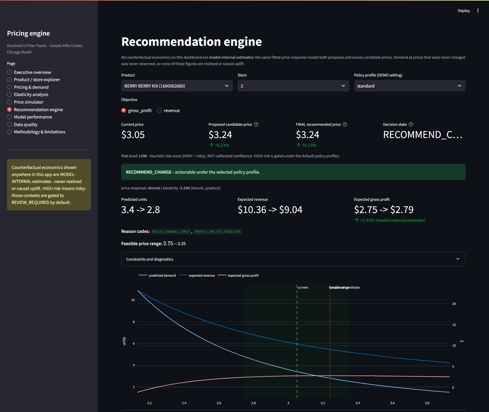

*Figure 21 — The same context under the `standard` profile: $3.05 → $3.24
(+6.23%), RECOMMEND_CHANGE, LOW risk, elasticity −3.248 (`shrunk_product`),
model-internal estimated uplift +1.43%, reason codes `PRICE_CHANGE_LIMIT` and
`PROFIT_UPLIFT_POSITIVE`, feasible range $2.75–$3.35 shaded on the chart. Note
that **proposed** and **FINAL** are shown as separate tiles.*

### 75.4 Data quality

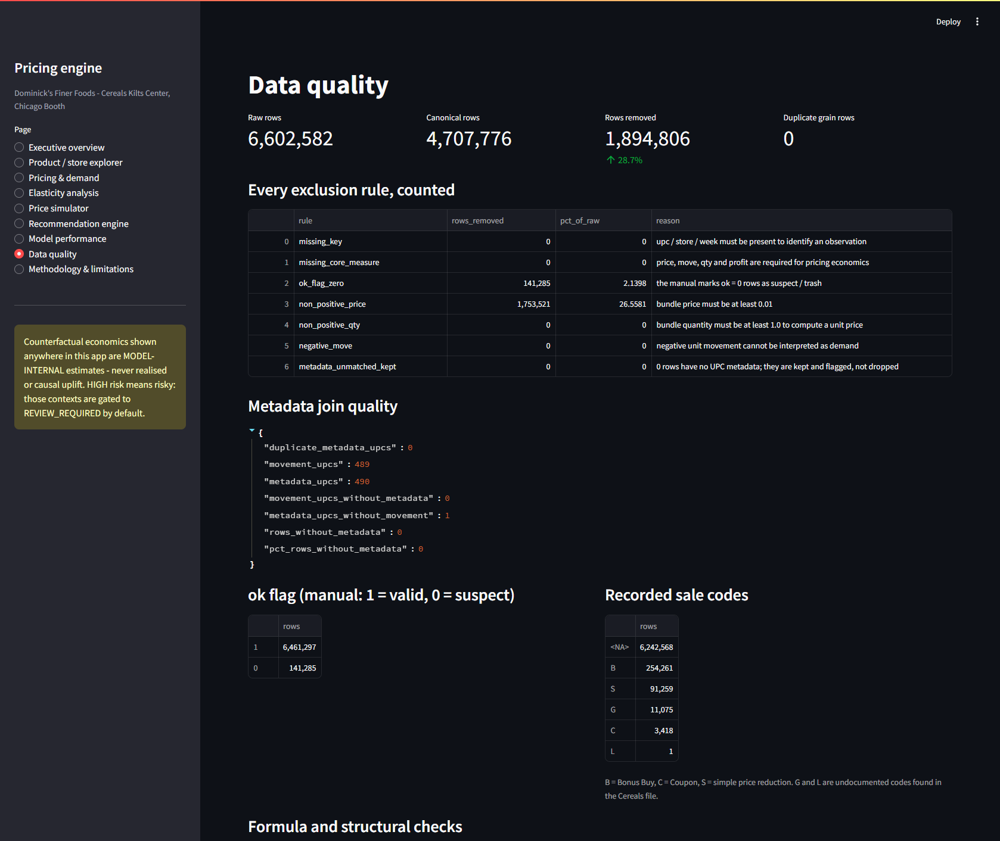

*Figure 22 — The exclusion ledger, the metadata-join report, the `ok` flag
counts and the recorded sale-code counts including the undocumented `G` (11,075)
and `L` (1) codes, all rendered directly from `build_audit.json` and
`raw_audit.json`.*

### 75.5 The remaining five pages

Captured and stored; referenced here rather than embedded to keep the report
readable:

* `dashboard_2_product_store_explorer.png` — the dual-axis price / cost / units
  series with promotion markers.
* `dashboard_3_pricing_and_demand.png` — price distribution, price-vs-demand
  scatter with its "association, not a demand curve" caption, and the
  price-CV histogram with the eligibility threshold marked.
* `dashboard_4_elasticity_analysis.png` — the four-specification table, the
  live factor-of-7.0 callout, and the per-UPC elasticity distribution.
* `dashboard_7_model_performance.png` — the six-model comparison table, the
  segment breakdowns, the price-response validation panel and the
  method-comparison tables.
* `dashboard_9_methodology_limitations.png` — the red causal banner and the
  six documentation tabs.

### 75.6 Capture method, for reproducibility

```bash
# terminal 1
python -m streamlit run dashboard/app.py --server.port 8511 --server.headless true
# terminal 2 — headless Chrome via Selenium, click each sidebar radio label,
# grow the viewport to the full document height, save a full-page PNG
```

The first page load takes ~40 s because the app materialises the ~4.7M-row
feature panel and loads the model; subsequent page switches take 25–45 s
depending on how much the page computes. Those load times are themselves a
finding, and they are limitation #19: *"The dashboard loads the full feature
panel (~4.7 M rows) into memory with caching. Fine on a workstation, not a
deployment pattern."*

---
---

# PART XV — TESTING AND SOFTWARE QUALITY

## 76. Testing strategy

### 76.1 The principle

**Decision-critical paths are prioritised over coverage percentage.** There is
no coverage-percentage target anywhere in the project. Instead, every place
where a wrong answer would be *invisible* — leakage, cost handling, constraint
logic, decision states, the analytical optimum — has a test that fails if it
breaks.

### 76.2 The seven kinds of test present

| kind | what it establishes | example |
| --- | --- | --- |
| **unit** | a pure function computes what it claims | `revenue`, `gross_margin_rate`, `price_change_pct` identities |
| **property / invariant** | a relationship holds across *every* combination | HIGH risk is never actionable, across 3 profiles × every state |
| **analytical** | the implementation recovers a closed-form answer | `p* = (a+bc)/(2b) = 6.25` |
| **leakage / poisoning** | corrupting the future changes nothing at or before the decision | `test_decision_time_cost_is_lagged_not_contemporaneous`, the 25-series cost poisoning |
| **integration** | the whole chain runs on synthetic fixtures | raw → processed → features → model → simulation → optimization → audit log |
| **contract / API** | the service honours its schema and rejects bad input | 15 API tests |
| **replica-equivalence** | a fast audit implementation matches the real one exactly | 69 attribution tests over 60 parameter combinations |

### 76.3 The synthetic-fixture discipline

CI never downloads the licensed Dominick's data. Tests that need the real
artifacts **skip themselves** via the `realdata` pytest marker; everything else
runs on deterministic synthetic fixtures where the correct answer is known in
closed form. That is what makes the analytical tests possible: on a fixture with
`Q = 100 − 10p`, the optimum is not "whatever the model says", it is exactly
$6.25.

### 76.4 The two tests-of-the-tests

Two places in the suite verify that a test would actually catch a failure:

1. **The cost-poisoning test has teeth.** It asserts not only that the poisoned
   future left the decision-time cost unchanged at or before the poisoned week,
   but that it **did change** the following week. Without that second assertion
   the test would pass if the poison never landed.
2. **The shrinkage regression test.** `tests/test_shrinkage.py` asserts that
   understated standard errors *silently disable the shrinkage* — encoding the
   exact failure mode Phase M discovered, so it cannot recur unnoticed.

---

## 77. Important tests

### 77.1 Pricing formulas — `tests/test_data_pipeline.py`, `test_economics.py`

Assert the five derived identities to floating-point tolerance, plus edge cases:
zero-`qty` safety (NaN, not `inf`), zero-price handling in
`gross_margin_rate` (NaN, not a silent 0 or `inf`), and `price_change_pct` with
a zero reference. The corresponding production checks on the **real 4.7M-row
table** are the 15 validation checks (§9.5), which report maximum absolute
deviations of `0.000e+00` and `1.421e-14`.

### 77.2 Merge cardinality — `tests/test_data_pipeline.py`

The UPC metadata join must not multiply rows. Enforced in production code by
`validate="many_to_one"` **and** an explicit row-count assertion that raises
`AssertionError`, and covered by a test with a deliberately duplicated metadata
UPC.

### 77.3 Lag leakage — `tests/test_features.py` (13 tests)

* `test_lag_features_never_use_the_current_week`
* `test_rolling_windows_are_shifted`
* `test_series_reference_price_uses_only_past_prices`
* `test_temporal_split_is_chronological_and_disjoint`
* `test_training_frame_drops_rows_without_history`
* `test_no_outcome_columns_are_features`
* `test_recompute_price_features_changes_only_price_features`

The last is a two-directional check: the five price-dependent features **must**
change and the 24 context features **must not**.

### 77.4 Cost poisoning — `tests/test_cost_leakage.py` (5 tests)

Plus the real-data audit (§23.3): 4,671,333 rows compared with 0 mismatches, a
25-series future poisoning from week 398 that changed nothing at or before the
poison and did change the next week, and 19 real recommendations of which 0
changed.

Also tested: the optimizer **refuses** rather than inventing a cost when none is
available (`COST_UNAVAILABLE` / `ObjectiveError`).

### 77.5 Hybrid anchor — `tests/test_phase_l_pricing.py` (40 tests)

The equality `Q_hybrid(p₀) = Q_ML(p₀)` is pinned by **15 parametrised tests**
spanning **5 elasticities × 3 price levels**. Also covered: the hybrid
reproduces `Q(p) = Q₀(p/p₀)^ε` exactly for a fixed `ε`; a missing
`reference_price` **raises** rather than silently returning baseline demand; the
elasticity table records its estimation window and marks each row's source; and
risk gating behaves correctly across all three profiles.

### 77.6 Analytical optimizer optima — `tests/test_optimizer.py` (23 tests)

The full fixture table is in §52.3. The two headline cases:

| fixture | ground truth | result |
| --- | --- | --- |
| `Q = 100 − 10p`, `c = 2.50`, profit | `(a+bc)/(2b) = 6.25` | recovered within one grid step |
| same, revenue | `a/(2b) = 5.00` | recovered within one grid step |

Plus every constraint individually, the inelastic-pushes-to-the-bound case,
starting-at-the-optimum, sub-materiality, and objective errors.

### 77.7 High-risk policy invariants — `tests/test_decision_states.py` (246 tests)

The largest file in the suite. Walks every combination of risk level × decision
state × actionability × proposal × final price for all three profiles, plus
audit-log schema rotation. The production counterpart is the real-data audit:
**0 invariant violations** across 13,964 contexts × 2 default profiles (§58.5).

### 77.8 Attribution replica equivalence — `tests/test_attribution.py` (69 tests)

The Phase M audits use a fast replica of `optimize_price` (~450× faster). These
69 tests assert it reproduces the real optimizer's **decision state, final price
and reason codes exactly** across **60 parameter combinations**; it was
additionally checked against **400 real week-399 contexts with zero mismatches**.

They also contain the numerical proof of §43.6: **scaling the base demand model
by 10× leaves every recommended price unchanged**, and the closed-form
unconstrained optimum `p* = c·ε/(1+ε)` is matched.

### 77.9 API validation — `tests/test_api.py` (15 tests)

Health, model info, **model loaded once** (not per request), the prediction
contract, validation rejections (negative price, inverted range, oversized
grid), decision states, and all three policy profiles.

### 77.10 Shrinkage mathematics — `tests/test_shrinkage.py` (12 tests)

The four limiting cases (imprecise → `w → 0`; precise → `w → 1`; zero
heterogeneity → strong pooling; large heterogeneity → weak pooling),
monotonicity of `w` in `se`, the [0,1] bounds, prior-mean handling, and the
regression test for the Phase M failure mode.

### 77.11 Repository hygiene — `tests/test_repo_and_downloader.py` (10 tests)

Licensed data is git-ignored; the downloader contacts **official URLs only**
(host asserted); zip-slip and absolute-path archive members are rejected;
archive-member selection is correct.

### 77.12 End-to-end integration — `tests/test_integration.py` (2 tests)

The complete chain on synthetic fixtures: raw → processed → features → model →
simulation → optimization → audit log.

---

## 78. Final test results

### 78.1 Test suite — verified 2026-08-19

```
$ python -m pytest
519 passed in 7.05s
```

| metric | value |
| --- | ---: |
| **tests passed** | **493** |
| tests failed | **0** |
| tests skipped | **0** |
| tests xfailed / xpassed | **0** |
| runtime | 7.05 s |

### 78.2 Composition by file (verified by `pytest --collect-only`)

| file | tests | covers |
| --- | ---: | --- |
| `test_decision_states.py` | **246** | risk × decision × actionable × proposal × final-price invariants over every combination and all three profiles; audit-log schema rotation |
| `test_attribution.py` | **69** | the audit replica reproduces `optimize_price` exactly across 60 parameter combinations; the baseline demand level cannot change the recommended price; closed-form unconstrained optimum; constraint intervals |
| `test_phase_l_pricing.py` | **40** | hybrid mechanics, shrinkage maths, per-UPC estimator, risk gating across all three profiles, uplift naming, elasticity provenance, `Q_hybrid(p₀) == Q_ML(p₀)` across 5 elasticities × 3 price levels |
| `test_optimizer.py` | **23** | analytical optima, every constraint, keep-current paths, objective errors, risk levels |
| `test_data_pipeline.py` | **17** | derived formulas, zero-qty safety, promotion coding, week decoding, exclusion rules, metadata join, grain uniqueness |
| `test_economics.py` | **16** | revenue/margin identities, price variation, arc-elasticity edge cases, log-log recovery, fixed-effects confounding |
| `test_simulation.py` | **16** | price grid, only price features move, cost held fixed, single batched call, curve diagnostics |
| `test_api.py` | **15** | health, model info, model loaded once, prediction contract, validation rejections, decision states, policy profiles |
| `test_features.py` | **13** | lag alignment, shifted rolling windows, leakage poisoning, decision-time cost, price-feature recomputation, temporal split |
| `test_shrinkage.py` | **12** | four limiting cases, monotonicity, bounds, prior-mean handling, and that understated SEs silently disable the shrinkage |
| `test_repo_and_downloader.py` | **10** | licensed data git-ignored, official URLs only, zip-slip and absolute-path rejection, archive-member selection |
| `test_monitoring.py` | **9** | PSI, KS, schema checks, drift ranking, performance windows |
| `test_cost_leakage.py` | **5** | decision-cost identity, future poisoning (and that the test has teeth), recommendation invariance, missing-cost refusal |
| `test_integration.py` | **2** | raw → processed → features → model → simulation → optimization → audit log |
| **total** | **493** | |

### 78.3 Lint — verified 2026-08-19

```
$ ruff check .
All checks passed!
```

Configuration: `line-length = 100`, `target-version = "py311"`,
`select = ["E", "F", "I", "UP", "B", "W"]` (pycodestyle errors, pyflakes,
isort, pyupgrade, flake8-bugbear, warnings), `ignore = ["E501"]`, notebooks
excluded.

`B` (bugbear) is the notable inclusion — it catches mutable default arguments,
bare `except`, `zip()` without `strict=`, and loop-variable binding bugs, which
are exactly the classes of defect that survive review.

### 78.4 Dashboard smoke test

```
$ python scripts/smoke_dashboard.py
```
**PASS — all 9 pages render without exceptions.** Independently confirmed for
this report by driving the live application with headless Chrome and capturing
all nine pages (§75).

### 78.5 Docker — **NOT TESTED**

`Dockerfile` and `docker-compose.yml` are written and are included in the CI
workflow. The image was **never built in this environment**: the Docker CLI
(29.7.2) is present but the daemon is not running
(`failed to connect to the docker API at npipe:////./pipe/dockerDesktopLinuxEngine`).

`STATUS.md` records this as `IMPLEMENTED (BLOCKED locally)` and
`reports/VALIDATION_SUMMARY.md` row 36 records it as **NOT TESTED — not PASS**.
This report repeats that verdict without softening it.

### 78.6 CI — implemented, not executed

`.github/workflows/ci.yml` runs on push to `main`/`master` and on pull requests,
across Python 3.11 and 3.12:

1. checkout, setup-python with pip cache
2. `pip install -e ".[api,dev]"`
3. `ruff check .`
4. smoke imports (`pricing_engine`, the optimizer, `api.main`)
5. `pytest -q`
6. `docker build -t pricing-engine:ci .` (3.11 only)

**Never executed**, because there is no GitHub remote in this environment and
the repository has no commits (§81.4). Status: `IMPLEMENTED`, not `VALIDATED`.

### 78.7 Claim audit — the meta-check

`scripts/audit_claims.py --strict` scans the repository for ten watched phrases
(`validated`, `guarantee`, `proven`, `causal`, `production ready`, `actual
uplift`, …), classifies every occurrence, recognises disclaimers as disclaimers,
and **fails the build** if an UNSUPPORTED claim reappears.

| verdict | before this report (43 files) | **including this report (49 files)** |
| --- | ---: | ---: |
| **UNSUPPORTED** | **0** | **0** |
| NEEDS QUALIFICATION | 11 | 38 |
| SAFE | 151 | 325 |
| total occurrences | 162 | 363 |

The scanner was re-run **with this report included**, and still reports
**0 UNSUPPORTED** — a useful independent check on the document you are reading.
It caught exactly one violation on the first pass: the phrase *"realised
margin"*, used here to mean the accounting margin a week actually produced,
matched the watched pattern for a claimed business outcome. It was reworded.
That is the scanner behaving correctly on a genuinely ambiguous phrase.

Of the 38 "needs qualification" hits, 27 are in this report and 11 are
pre-existing. All are uses of *validated*, *guarantees* or *profit uplift*
either as pipeline-stage labels (`**Status:** VALIDATED`,
`make features # modelling table with decision-time guarantees`) or carrying
the required qualifier (§113). They are surfaced rather than whitelisted, which
is the right default for a scanner of this kind.

### 78.8 Summary status table

| check | status | evidence |
| --- | --- | --- |
| pytest | **519 passed, 0 failed, 0 skipped** | live run at Phase N, 2026-08-19 |
| ruff | **All checks passed** | live run 2026-08-19 |
| dashboard smoke | **PASS — 9/9 pages** | `smoke_dashboard.py`; independently re-verified by live capture |
| API live | **PASS** | `/health`, `/model/info`, `/recommend-price` called live 2026-08-19 |
| demo pipeline | **PASS** | `run_demo.py` executed live 2026-08-19 |
| report figures | **PASS — 14 generated** | `make_report_figures.py`, live pipeline calls |
| Docker build | **NOT TESTED** | daemon unavailable |
| CI workflow | **IMPLEMENTED, not executed** | no remote; no commits |
| claim audit | **0 UNSUPPORTED** | `audit_claims.py --strict` |

---
---
# PART XVI — REPRODUCIBILITY AND MLOPS

## 79. Reproducible workflow

### 79.1 From an empty environment to a running application

```bash
# 0. Python 3.11+ (this build: 3.13.0)
python -m pip install -e ".[api,dashboard,dev]"

# 1. Data — official Kilts Center URLs only; never mirrored, never synthetic
make data                 # download_dominicks.py + build_dataset.py + reports/01
make validate             # 15 formula / structural checks on the persisted Parquet

# 2. Features — the decision-time availability contract
make features             # 4,671,333 usable rows, 29 features, ~73 s

# 3. Analysis
make eda                  # reports/02 + 6 figures
make elasticity           # reports/03 — naive → fixed effects ladder

# 4. Models
make train                # 6 models compared, selection on validation WAPE, ~243 s
make evaluate             # re-score the SAVED artifact on the test window
make price-response       # reports/05 — does the model respond to price?

# 5. Pricing layer
make estimate-elasticity  # training weeks 2–257 ONLY, ~35 s
make compare-response     # reports/08 — ml vs pooled vs shrunk + sensitivity
make optimize             # 3,000 recommendations + audit log, ~105 s
make backtest             # reports/06 — weeks 390–399
make monitor              # drift / schema / performance

# 6. The scientific audit
make audit-zero-price     # reports/09
make audit-cost           # reports/10
make audit                # reports/11–20 (ten Phase M audits)

# 7. Demo, quality gates and applications
make demo                 # one real UPC × store, end to end
make test lint            # 519 tests at Phase N, ruff
make api                  # http://127.0.0.1:8000/docs
make dashboard            # Streamlit, 9 pages

# or everything at once
make all
```

### 79.2 What makes a re-run reproducible

| mechanism | detail |
| --- | --- |
| **single seed** | `project.random_seed: 42`, threaded through `Config.seed` into the ridge, the HGB, the elasticity subsampling and every `.sample()` call |
| **chronological split by rule** | the split is derived from the week index and fixed fractions — no stored index list to drift |
| **dataset fingerprints** | Parquet SHA-256 **and** a storage-independent DataFrame fingerprint; the feature table has its own fingerprint |
| **environment capture** | Python, platform, numpy, pandas, scikit-learn versions and a UTC timestamp written into `dataset_fingerprint.json` and the model metadata |
| **provenance for the raw data** | `SOURCE.json` with URLs, byte sizes, SHA-256 hashes, timestamps |
| **atomic writes** | downloads and artifacts are written to a temp file and renamed, so a crash cannot leave a half-written artifact that looks complete |
| **config-only thresholds** | every threshold is in `configs/config.yaml`; changing a guardrail never requires a code edit |
| **JSON + Markdown pairing** | each script emits a machine-readable JSON and a human-readable report generated from the same dictionary |

### 79.3 What is not reproducible from this repository alone

**The data.** Raw and processed data are git-ignored and never redistributed
(academic-use licence). A reader must run `scripts/download_dominicks.py`
themselves. The downloader records exactly what it fetched so the inputs can be
verified byte for byte.

### 79.4 Runtime budget for a full run

| stage | time |
| --- | ---: |
| dataset build | (dominated by reading the 458 MB CSV) |
| feature build | 73.4 s |
| model training (6 models) | 243 s |
| elasticity estimation | 35.0 s |
| price-response comparison (300 contexts) | 38.5 s |
| batch optimize (3,000 contexts) | 105.3 s |
| elasticity inference audit | 22.3 s |
| elasticity stability audit | 51.3 s |
| guardrail ablation | 28.8 s |
| constraint attribution | 15.8 s |
| cost-leakage audit | 12.8 s |
| eligibility funnel | 10.1 s |
| model-value ablation | 9.6 s |
| decision-state audit | 6.4 s |
| out-of-time price response | 5.7 s |
| shrinkage audit | < 1 s |
| claim audit | 0.2 s |
| **test suite** | **7.05 s** |

The Phase M audit suite — twelve scripts producing ten reports over 13,964
contexts × 11 pipeline runs — completes in under four minutes, which is what
the 450× attribution replica bought.

---

## 80. Configuration

### 80.1 One file, one source of truth

```python
"""Everything tunable (paths, thresholds, policy profiles, model
hyper-parameters) lives in ``configs/config.yaml``. Code should never hardcode
a magic number; it should read it from here."""
```

`Config` exposes `get(dotted, default)`, `require(dotted)` (raises when absent),
`path(name)`, `policy(profile)` and `seed`. The whole tree can be overridden
with the `PRICING_ENGINE_CONFIG` environment variable.

### 80.2 The configuration blocks

| block | contents |
| --- | --- |
| `project` | name, `random_seed: 42`, category |
| `paths` | raw / interim / processed dirs, the two Parquet tables, artifacts, models, metrics, figures, reports, the recommendation log |
| `data` | `week1_start_date: 1989-09-14`, `keep_only_ok_rows: true`, `min_price: 0.01`, `min_qty: 1` |
| `modeling` | target, split fractions 0.70/0.15/0.15, `min_weeks_per_series: 20`, lags `[1,2,3,4]`, rolling windows `[4,8,13]`, HGB hyperparameters |
| `eligibility` | `min_observations: 40`, `min_distinct_prices: 5`, `min_price_cv: 0.05` |
| `optimization` | `objective: gross_profit`, `price_step: 0.05`, `price_rounding: 0.01`, `charm_pricing: false` |
| `policy_profiles` | conservative / standard / aggressive (below) |
| `risk` | LOW and MEDIUM band thresholds |
| `pricing_response` | `method: shrunk`, elasticity-table path, `min/max_abs_elasticity: 0.2 / 6.0`, `fallback: pooled` |
| `elasticity` | `min_obs_per_upc: 200`, `min_distinct_prices_per_upc: 10`, `shrinkage: empirical_bayes`, `shrinkage_tau2_estimator: reml`, `shrinkage_prior_mean: pooled`, `max_se_for_product_estimate: 1.5`, `sensitivity_scenarios: [-1.5, -1.9, -2.4, -3.1]` |

### 80.3 The three policy profiles

**These are DEMO settings**, labelled as such in the file itself:

> `# DEMO POLICY SETTINGS - illustrative guardrails for a portfolio demo, NOT`
> `# universal retail best-practice thresholds.`

| parameter | `conservative` | **`standard`** ✅ | `aggressive` (DEMO ONLY) |
| --- | ---: | ---: | ---: |
| `max_price_change_pct` | 5% | **10%** | 20% |
| `extrapolation_tolerance_pct` | 2% | **5%** | 10% |
| `min_gross_margin_rate` | 10% | **5%** | 0% |
| `materiality_threshold_pct` | 2% | **1%** | 0.5% |
| `allow_below_cost` | false | **false** | false |
| `high_risk_action` | `keep_current` | **`review_required`** | **`recommend`** ⚠ |
| `medium_risk_max_price_change_pct` | 3% | **5%** | 20% |

Behavioural consequences over all 13,964 week-399 contexts:

| profile | RECOMMEND_CHANGE | KEEP_CURRENT | REVIEW_REQUIRED | median change | HIGH-risk auto-changed |
| --- | ---: | ---: | ---: | ---: | ---: |
| conservative | 45.5% | 54.5% | 0% | **0.0%** | **0** |
| **standard** | **59.2%** | 31.1% | **9.7%** | +3.7% | **0** |
| aggressive | 70.8% | 29.2% | 0% | — | **4,717** ⚠ |

Having three profiles is a design decision in itself (DECISIONS #25): it makes
the **sensitivity of the output to the policy** explicit and measurable, rather
than leaving one arbitrary threshold set looking like a law of nature.

### 80.4 The risk configuration

```yaml
risk:
  low_risk:    {min_observations: 150, min_distinct_prices: 15, max_extrapolation_pct: 0.02}
  medium_risk: {min_observations:  80, min_distinct_prices:  8, max_extrapolation_pct: 0.05}
```

with the comment explaining both the direction of the scale and why the bands
are stricter than the eligibility screen (§57.2).

---

## 81. Model versioning

### 81.1 Model metadata

`artifacts/models/demand_model_metadata.json` — 20 fields:

| field | value in the shipped artifact |
| --- | --- |
| `name` / `kind` | M1 ridge log-log / `ridge_loglog` |
| **`version`** | **`ridge_loglog-20260818-132847`** |
| `trained_at_utc` | 2026-08-18T09:28:47+00:00 |
| `seed` | 42 |
| `feature_columns` | the 26 columns, in order |
| `categorical_features` | `store`, `com_code` |
| `target` | `move` |
| `params` | the **complete** sklearn Pipeline parameter dump (37 entries) |
| `train_weeks` / `valid_weeks` / `test_weeks` | [2,257] / [258,342] / [343,399] |
| `train_dates` / `valid_dates` / `test_dates` | the calendar equivalents |
| `n_train_rows` | 3,206,437 |
| `metrics` | validation and test blocks |
| **`data_fingerprint`** | **`e9d26f2c0eda9f7e9d8dbb508053e56a932608668e16d8b5aeec0032373722d0`** |
| `environment` | timestamp, Python 3.13.0, platform, numpy 2.0.2, pandas 2.2.3, scikit-learn 1.8.0, `git_commit` |

### 81.2 The fingerprint chain

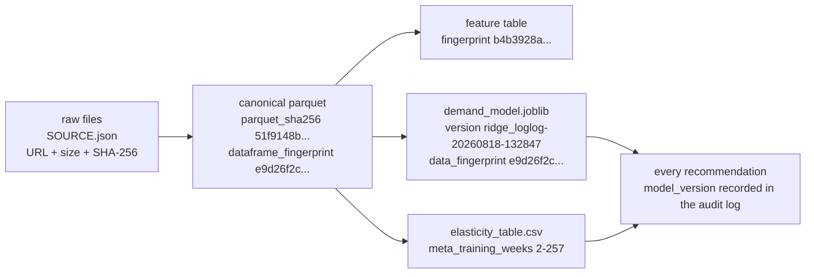
```mermaid
flowchart LR
    A["raw files<br/>SOURCE.json<br/>URL + size + SHA-256"] --> B["canonical parquet<br/>parquet_sha256 51f9148b...<br/>dataframe_fingerprint e9d26f2c..."]
    B --> C["feature table<br/>fingerprint b4b3928a..."]
    B --> D["demand_model.joblib<br/>version ridge_loglog-20260818-132847<br/>data_fingerprint e9d26f2c..."]
    D --> E["every recommendation<br/>model_version recorded in the audit log"]
    B --> F["elasticity_table.csv<br/>meta_training_weeks 2-257"]
    F --> E
```

A recommendation in `artifacts/recommendation_log.csv` carries
`model_version`, `price_response_method`, `elasticity_used` and
`elasticity_source`. From those four fields you can reach the model artifact,
its `data_fingerprint`, the canonical Parquet hash and the raw file hashes.
**Full lineage, from a shelf price back to a downloaded byte.**

### 81.3 Persistence is verified, not assumed

`scripts/evaluate.py` reloads the persisted artifact and re-scores the test
window:

```json
"reload_wape_difference": 0.0
```

Exactly zero. So the reported test WAPE is a property of the saved model, not of
the training session's in-memory state.

### 81.4 The version-control gap — stated plainly

**The repository has no commits.** `git log` returns
*"your current branch 'master' does not have any commits yet"*, and every file
is untracked. Consequently:

* `git_commit` in the model metadata reads the literal string `"HEAD"` rather
  than a SHA;
* the CI workflow has never run, because there is nothing to push;
* the model artifact cannot be tied to a code revision.

This is a genuine reproducibility gap and it is the one thing in this section
that a reviewer should fix first: `git add -A && git commit` would immediately
populate `git_commit` on the next training run and make the whole lineage chain
complete. It is recorded as limitation **#L15** in Appendix K.

### 81.5 What a real model registry would add

| capability | present here | a real registry |
| --- | --- | --- |
| immutable versioned artifacts | filename + metadata | content-addressed store |
| lineage to code revision | **missing (no commits)** | commit SHA + build ID |
| lineage to data | **yes** (fingerprints) | yes |
| stage transitions (staging → production) | none | explicit promotion |
| rollback | manual file copy | one command |
| approval gates | none | required reviewers |
| A/B / shadow serving | none | traffic splitting |

---

## 82. Monitoring

**Only what is actually implemented is described here.**

### 82.1 What exists

`src/pricing_engine/monitoring/drift.py` + `scripts/monitor.py` →
`artifacts/metrics/monitoring.json`, `reports/MONITORING_DESIGN.md`. Four checks,
run **offline**, comparing the reference window (training weeks 2–257) against
the current window (test weeks 343–399, 749,040 rows).

**1. Schema check** — column presence, dtypes, null shares. Result: **passed**,
0 missing columns, 0 unexpected dtypes.

**2. Feature drift** — Population Stability Index and Kolmogorov-Smirnov
statistic per feature, banded *stable* / *moderate shift* / *large shift*, and
ranked. Results are in §18.2; the headline is that `time_index` (PSI 12.41) and
`series_age_weeks` (1.00) are trivially large by construction on a chronological
split, while the genuinely informative drift is in the price block:
`series_reference_price` PSI 0.363 with the mean rising **$2.886 → $3.247**.

**3. Prediction drift** — PSI **0.0556** (*stable*), KS 0.0950, mean prediction
16.69 → 15.00, p95 40.50 → 35.26. **The model's output distribution is stable
even though its inputs have drifted**, which is a useful and non-obvious result.

**4. Performance by period** — WAPE, MAE, RMSE, bias and sMAPE by calendar
quarter. Results in §41.8: **0.409 → 0.528 over five quarters**, monotone
degradation with distance from training.

### 82.2 What the monitoring establishes

**Drift alone is not the alarm; drift *plus* degrading performance is.** This
artifact shows both, and they point the same way: the price regime moved, and
accuracy decayed. A production system would use the quarterly WAPE trend as the
retraining trigger and the feature PSI as the diagnostic explaining it.

### 82.3 What is **not** implemented

| capability | status |
| --- | --- |
| a metric store (Prometheus, a time-series DB) | **absent** |
| alerting (thresholds, pager, email) | **absent** |
| scheduled execution (cron, Airflow, Dagster) | **absent** |
| serving-latency / error-rate monitoring | **absent** |
| data-quality monitoring on incoming data | **absent** |
| a monitoring dashboard | **absent** (the Streamlit app shows the artifact, it does not monitor) |
| automatic retraining triggers | **absent** |
| **recommendation-outcome monitoring** | **absent — and impossible without a live deployment** |

The last is the important one. Even a fully instrumented version of this system
could not monitor whether its recommendations *worked* without applying them and
observing the result — which is §98's territory.

`STATUS.md` records monitoring as `IMPLEMENTED`, not `VALIDATED`, with the
remaining issue "Offline only; no metric store, no alerting." That is accurate.

---

## 83. Docker and CI

### 83.1 Dockerfile

`python:3.11-slim`, with these deliberate properties:

| property | detail |
| --- | --- |
| **code only** | `COPY src`, `api`, `configs`, `scripts` — **no data, no artifacts** |
| licensed data excluded | the Dominick's data are academic-use only and are never baked into an image |
| runtime mounts | `./artifacts` and `./data/processed` mounted **read-only** |
| **non-root user** | `useradd --create-home appuser`, `USER appuser` |
| layer ordering | `pyproject.toml` + `src` copied and installed *before* `api`/`configs`/`scripts`, so dependency layers cache across code changes |
| healthcheck | `HEALTHCHECK` polling `/health` every 30 s |
| env hygiene | `PYTHONDONTWRITEBYTECODE=1`, `PYTHONUNBUFFERED=1`, `PIP_NO_CACHE_DIR=1` |
| entrypoint | `uvicorn api.main:app --host 0.0.0.0 --port 8000` |

`docker-compose.yml` adds port mapping, the two read-only mounts, a
`PRICING_ENGINE_POLICY_PROFILE=standard` environment variable and
`restart: unless-stopped`.

### 83.2 Docker status: **NOT TESTED**

The image was **never built**. The Docker CLI (29.7.2) is present but the daemon
is not running in this environment:

```
failed to connect to the docker API at npipe:////./pipe/dockerDesktopLinuxEngine
```

`reports/VALIDATION_SUMMARY.md` row 36 records this as **NOT TESTED — not
PASS**, and `STATUS.md` as `IMPLEMENTED (BLOCKED locally)`. This report does not
soften either verdict. A Dockerfile that has never been built is a plausible
Dockerfile, not a working one.

### 83.3 CI workflow

`.github/workflows/ci.yml`, on push to `main`/`master` and on pull requests,
matrix over Python **3.11 and 3.12**:

1. checkout + setup-python with pip cache
2. `pip install -e ".[api,dev]"`
3. **lint** — `ruff check .`
4. **smoke imports** — `pricing_engine`, `optimize_price`, `api.main`
5. **tests** — `pytest -q`
6. **Docker build** — `docker build -t pricing-engine:ci .` (3.11 only)

With the explicit comment:

```yaml
# CI never downloads the licensed Dominick's dataset. Tests that need
# the real artifacts skip themselves; everything else runs on the
# deterministic synthetic fixtures.
```

### 83.4 CI status: implemented, never executed

There is no GitHub remote in this environment and **the repository has no
commits**, so the workflow has never run. Status: `IMPLEMENTED`, not
`VALIDATED`.

Note also that the matrix targets 3.11/3.12 while this build ran on **3.13.0**.
The package declares `requires-python = ">=3.11"` and works on 3.13 locally, but
3.13 is not in the CI matrix — a small inconsistency worth fixing.

### 83.5 What would be needed for a real deployment

| requirement | present |
| --- | --- |
| image builds | **not verified** |
| image scanned for vulnerabilities | no |
| multi-stage build to shrink the image | no (single stage, `build-essential` retained) |
| pinned dependency versions (lockfile) | no — `pyproject.toml` uses lower bounds |
| artifact provenance / SBOM | no |
| readiness vs liveness probes distinguished | no (one healthcheck) |
| horizontal scaling / resource limits | no |
| secrets management | not applicable (no secrets) |

---
---

# PART XVII — SCIENTIFIC AUDIT

## 84. Final scientific audit

Phase M produced ten audit reports (`reports/11`–`20`) plus two Phase L audits
(`09`, `10`). This section consolidates what they found.

### 84.1 The twelve audits and their verdicts

| # | audit | central question | finding |
| --- | --- | --- | --- |
| **09** | Zero-price exclusion | is dropping 26.6% of raw rows defensible? | **Yes, with a documented tilt.** 1,851,380 zero-price rows, only **677** with sales; 73.4% are leading/trailing runs. Rule kept; the sample now skews to continuously stocked series (21.0 vs 3.1 mean weekly units). |
| **10** | Cost leakage | does any future cost information reach a decision? | **No.** 4,671,333 rows, **0 mismatches**; poisoning changed nothing at or before the poisoned week and did change the next; 0 of 19 recommendations changed. Proves *temporal availability*, not economic correctness. |
| **11** | Constraint attribution | model or rules? | **Rules.** **2.9%** of final recommendations come from an interior model optimum; 57.1% are guardrail corners; the ±10% cap binds first in 44.6%. |
| **12** | Model-value ablation | do rules reproduce the decisions? | **Largely yes.** A no-model rule matches within one 5¢ step **82.5%** of the time and the decision state 90.0%. **No profit comparison made — it would be circular.** |
| **13** | Guardrail ablation | where does the pricing signal stop mattering? | **At the change cap.** Median price variation across four elasticity scenarios: **79.8%** research → 6.6% support band → **0.0%** with the cap. |
| **14** | Shrinkage audit | is the empirical-Bayes estimator correct? | **The formula was right; the inputs were wrong.** Mean weight 0.954 → **0.780** once panel-robust SEs replaced HC1. τ² 0.906 → 0.766. |
| **15** | Inference audit | are the standard errors right? | **They were too small by 16×.** Two-way clustered SE 0.1058 vs classical 0.0065; per-UPC median inflation 3.4×; share of products significant at 5% 90.1% → **75.2%**. Estimators validated against statsmodels. |
| **16** | Out-of-time price response | which method predicts real price changes best? | **`shrunk`, in every split.** 154,899 unseen episodes; non-promotion WAPE 0.560 vs 0.588 native ML, 0.594 pooled, 0.715 null. **Naturalistic, not causal.** |
| **17** | Elasticity stability | is elasticity durable? | **Category yes, product no.** Max pairwise z between disjoint windows **1.36** (not significant); median product rank correlation **+0.19**. |
| **18** | Eligibility funnel | why do so few products get their own estimate? | **489 → 239**, every transition counted: 104 not in training weeks, 42 too few observations, 58 too little price variation, 24 wrong-signed, 9 too imprecise. |
| **19** | Decision-state audit | can the policy layer contradict itself? | **No.** **0** invariant violations across 13,964 contexts × 2 default profiles. The 4,717 under `aggressive` are by design and are reported, not suppressed. |
| **20** | Claim audit | does the repository over-claim? | **0 UNSUPPORTED** — across 43 files / 162 occurrences before this report, and still 0 across 49 files / 363 occurrences with it included; `--strict` makes it enforceable. |

### 84.2 The three findings that changed the project's own description

1. **The engine is rule-bounded, not model-driven** (11, 12, 13). The README,
   `STATUS.md` and every downstream description were rewritten to say
   *"rule-bounded pricing with a learned direction"*.
2. **The published precision was overstated by an order of magnitude** (15),
   which in turn meant the shrinkage was not working (14). Both numbers were
   corrected everywhere and the old ones removed.
3. **Product-level elasticity is not a durable asset** (17), so it must not be
   described as one.

### 84.3 The audits that confirmed rather than corrected

Audits 09, 10, 16, 18, 19 and 20 all **confirmed** the existing design. That
matters: an audit suite that only ever finds problems is probably not testing
the things that work, and one that never finds problems is not testing anything.

### 84.4 The pattern worth naming

Three of the four *corrections* originated in **inference**, not in modelling:
the standard errors were wrong, which broke the shrinkage, which flattered the
per-product estimates. None of that would have surfaced from cross-validation,
a better model or more data. It surfaced from re-deriving an estimator and
asking what its inputs assumed.

---

## 85. What the model actually contributes

> **If guardrails dominate most recommendations, why do we need the pricing
> model at all?**

This is the hardest question the project faces, and the evidence-based answer
has five parts.

### 85.1 Part 1 — The honest concession

**On magnitude, for the median context, under production guardrails: it does
not contribute much.**

* 2.9% of final recommendations are set by an interior model optimum.
* A no-model rule matches the engine within one 5-cent step 82.5% of the time.
* Median price variation across four different elasticities is 0.0%.

Any claim that "the ML model sets the price" is **false** for this system as
configured, and the project says so in its own README.

### 85.2 Part 2 — Direction

R4 ("always take the maximum allowed increase") can only ever propose an
increase. The engine proposes a **cut** whenever the estimated elasticity puts
the optimum below the current price. Under the `shrunk` response, 8.0% of
actionable recommendations are decreases (91.96% are increases, §44.1); under
the `ml` response, 26.7%.

A rule that only ever raises prices is not a pricing policy — it is a price
increase with extra steps. The model is what makes the direction a *decision*.

### 85.3 Part 3 — Eligibility and refusal

The model layer is what allows the engine to say **"I don't know"**:

| refusal | contexts (week 399, standard) |
| --- | ---: |
| screened out before optimisation (insufficient history / price variation / no cost) | **3,528 (25.3%)** |
| risk-gated to REVIEW_REQUIRED | 1,353 (9.7%) |
| kept because the estimated gain is immaterial | 716 (5.1%) |
| **total non-actioned** | **5,597 (40.1%)** |

R4 has no concept of any of these. It would move every price it was allowed to
move. **40% of the engine's output is a refusal**, and the evidence for each
refusal is a model artefact: observation counts, distinct prices, elasticity
provenance, extrapolation distance, estimated uplift.

### 85.4 Part 4 — Magnitude in the tail

The median is 0.0% but the **p90 price variation across elasticity scenarios is
14.5%** under the standard profile. One context in ten still has its price
materially determined by the estimated response — and those are
disproportionately the well-identified, high-volume series where the estimate is
most trustworthy and the money is.

### 85.5 Part 5 — The counterfactual economics

Even when the price comes from a guardrail corner, **the model supplies the
dollar figures**: predicted units at both prices, expected revenue, expected
gross profit, the estimated uplift, the whole demand curve. A reviewer looking
at `$20.27 → $21.74` and a demand curve is making a different decision from one
looking at "go to the cap because the rule says so".

This is a real contribution and it is also the one most vulnerable to §64: those
dollar figures are model-internal estimates.

### 85.6 The synthesis

> **The model contributes direction, eligibility, refusal and the economics of
> the decision. The rules contribute magnitude.**
>
> That is a defensible architecture given an observational elasticity, a 46%-WAPE
> forecaster and no way to measure realised outcomes. It is *not* the
> architecture a press release would describe, and the project describes it
> accurately instead.

### 85.7 What would change the answer

| change | effect on the model's contribution |
| --- | --- |
| **run the experiment (§98)** and obtain a causally identified elasticity | the guardrails could be widened with evidence, and the interior-optimum share would rise |
| widen the change cap from 10% to 25% | the model would set magnitude far more often — and would need to be right |
| add cross-price elasticities | the decision becomes multi-dimensional and no simple rule can approximate it (§101) |
| calibrate the risk bands against realised error | refusal becomes quantitative rather than heuristic |
| model promotion depth, not just its presence | the largest error segment (WAPE 0.656) would shrink, improving both forecast and response |

---

## 86. The weakest scientific component

**Counterfactual policy evaluation. The backtest's policy economics are
circular by construction and cannot be repaired offline.**

### 86.1 Why this is the weakest, ranked against the alternatives

| candidate | why it is *not* the weakest |
| --- | --- |
| causal identification | genuinely absent, but it is **honestly and comprehensively disclosed**, quantified (the naive-to-FE swing), and the fix is designed in `docs/PRICING_EXPERIMENT.md`. A known, bounded, disclosed limitation. |
| incomplete promotion information | real and material (WAPE 0.656 on promotion weeks), but **measured** — the promotion/non-promotion split is reported everywhere it matters. |
| no substitution / cross-price effects | arguably the largest *missing mechanism*, but it is a scope decision, clearly stated, and it does not corrupt any number that *is* reported. |
| the heuristic risk layer | uncalibrated, but labelled as heuristic in the config, the code, the API, the dashboard and every report. |
| **counterfactual policy evaluation** | **the only one that produces a number people will quote.** |

### 86.2 The specific defect

The backtest reports **+10.45% model-internal estimated gross profit** for the
ML policy versus historical pricing, and `reports/07` reports **+8.30%** for the
portfolio. Both are produced by the same fitted price-response model that
proposed the prices being scored (§64).

This is the weakest component because:

1. **It is the number a reader will remember.** "+10%" is the headline; the
   circularity is a caveat. Caveats lose to headlines.
2. **The bias cannot be signed.** It depends on the direction of the model's
   elasticity error, which is unknown (§64.4).
3. **It is unfixable offline.** Cross-validation, held-out sets and off-policy
   estimators all fail for the reasons in §64.3.
4. **Everything downstream inherits it.** Any ROI calculation, business case or
   CV bullet built on those numbers inherits the same circularity.

### 86.3 How the project mitigates it — and why mitigation is not a fix

| mitigation | in place |
| --- | :--: |
| the metric is *named* `model_internal_estimated_*` | ✅ |
| `realisable_profit_uplift_pct` is forced to 0 for non-actionable rows | ✅ |
| disclaimers in the API schema, every dashboard page and every report | ✅ |
| the model-value ablation **refuses** to compare profits | ✅ |
| `audit_claims.py --strict` blocks "actual uplift" wording | ✅ |
| §64 exists as a standalone chapter | ✅ |
| the out-of-time validation partly escapes circularity (§45) | ✅ |
| **an unbiased estimate of policy value** | ❌ **impossible offline** |

Every one of these makes the number harder to *misread*. None makes it correct.

### 86.4 What would fix it

Only §98 — a randomised pricing experiment producing a difference-in-differences
estimate of gross profit per store-week with clustered standard errors. Nothing
short of intervention.

---

## 87. The strongest scientific component

**The Phase M audit suite itself — and within it, the inference-and-shrinkage
correction chain.**

### 87.1 Why the audit suite, and not the model

The demand model is competent and unremarkable: a ridge log-log with good
features, beating a boosted model by 2.2% relative WAPE. Any capable
practitioner would build something similar.

What is **rare** is a project that:

1. built a system,
2. built a second, independent apparatus to measure how much of the answer that
   system actually supplies,
3. found the answer was **2.9%**,
4. and published that as the headline.

### 87.2 The single strongest chain: inference → shrinkage → policy

Follow it end to end.

**Step 1 — a question about assumptions.** Are HC1 standard errors right on a
panel with within-store persistence and category-wide weekly shocks? Obviously
not, once asked.

**Step 2 — measure it properly.** Seven covariance assumptions, estimators
**validated against statsmodels to machine precision**, reported side by side.
Result: two-way clustered SE is **16.24×** the classical one; the per-UPC median
inflation is **3.38×**.

**Step 3 — a statistical consequence.** The share of products significant at 5%
falls from **90.1% to 75.2%**. One in six "significant" products was not.

**Step 4 — a modelling consequence nobody would have predicted.** Understated
SEs inflate `w = τ²/(τ² + se²)` from *both* directions, so the empirical-Bayes
shrinkage was **silently doing nothing**. Mean weight 0.954, median 0.989 —
piled against the ceiling.

**Step 5 — isolate the cause.** Seven estimator variants on identical data show
that changing the τ² estimator or the prior mean moves the mean weight by
< 0.001, while changing the standard errors alone moves it from 0.955 to 0.780.
**The formula was correct; the inputs were wrong.**

**Step 6 — correct it and propagate.** τ² 0.906 → 0.766, mean weight 0.954 →
**0.780**, and the old figure was **removed from every document** rather than
left alongside the new one.

**Step 7 — encode the failure mode as a test.** `tests/test_shrinkage.py` now
asserts that understated standard errors silently disable the shrinkage.

**Step 8 — check the scientific conclusion survives.** The elasticity-stability
audit re-runs the whole stack on five windows *with the corrected inference* and
finds the category elasticity stable (max z = 1.36). Under the old standard
errors that test would have declared violent, significant drift. **The
covariance assumption changed the scientific conclusion, not just the interval.**

### 87.3 Runner-up: the constraint-attribution methodology

The leave-one-out design over 13,964 contexts × 11 pipeline runs, made feasible
by a 450×-faster replica that is trusted **only because 69 tests pin it against
the real optimizer across 60 parameter combinations and 400 real contexts with
zero mismatches**.

The methodological point is that the audit instrument was itself audited before
its results were believed — and in the process it **found a genuine bug in the
production code** (the over-reported `PRICE_CHANGE_LIMIT` binding, DECISIONS
#48).

### 87.4 Runner-up: the out-of-time price-response validation

154,899 realised price-change episodes on weeks the estimator never saw, with a
**null model included**, results split by promotion state, the winner made the
default on measurement rather than inheritance, and the causal limitation stated
in a box at the top of its own report.

### 87.5 What these have in common

All three follow the same pattern: **state a claim precisely, build an
independent instrument to test it, report what the instrument says even when it
is unflattering, and encode the finding as a test so it cannot silently
regress.**

That is the transferable skill, and it is worth more than any individual number
in this report.

---
---
# PART XVIII — LIMITATIONS

Every item below is drawn from `KNOWN_LIMITATIONS.md`, `STATUS.md` or an audit
artifact. Nothing here is speculative. The consolidated register with IDs is in
**Appendix K**.

## 88. Data limitations

### 88.1 Historical data (1989–1997)

The panel is US grocery retail from three decades ago. Price levels, category
dynamics, competitive structure, promotion mechanics, shopper behaviour and the
retail landscape have all changed. Dominick's itself was acquired by Safeway in
1998 and the banner was retired in 2013.

### 88.2 The zero-price exclusion removes 26.56% of raw rows

1,753,521 rows (plus 97,859 already removed for `ok = 0`). Defensible (§10) but
consequential: the surviving sample tilts toward continuously stocked,
higher-volume series — **21.0 mean weekly units vs 3.1** for heavily excluded
series — and **no canonical row has zero sales**, so intermittent demand is out
of scope by construction.

### 88.3 Promotion coding is incomplete

94.55% of raw rows carry no `sale` code. Two undocumented codes (`G`, 11,075
rows; `L`, 1 row) appear. Display and feature advertising are absent entirely.
Any estimated "price effect" partly absorbs the whole marketing bundle
(§11.4, §33.3).

### 88.4 AAC is not economic cost

The implied unit cost comes from an accounting margin on Average Acquisition
Cost, which lags replacement cost. Within-series AAC is itself volatile (median
CV **0.088**, p90 0.153) and **falls 9.16% on price cuts**. The cost-leakage
audit proves temporal availability, **not** economic correctness (§8.3, §23.4).

### 88.5 No customer dimension

The grain is store × week. There is no basket composition, no traffic
normalisation, no loyalty data, no customer identity. Personalised pricing is
not merely unimplemented — it is **unimplementable** on this data, which is a
stronger guarantee (§94.3).

### 88.6 Stock-outs are invisible

Unavailability and demand collapse look identical in scanner data. A suppressed
sales week caused by an empty shelf is read as weak demand.

### 88.7 No competitor prices

Rival stores' prices are entirely unobserved, so competitive response cannot be
modelled or controlled for.

### 88.8 Extreme values retained by design

10.07% of week-over-week price-change events exceed ±50% (77,152 events); the
maximum unit price is $26.02 (a T-shirt in the Cereals commodity file); 6 UPCs
have negative total observed gross profit; the maximum weekly demand is 18,688
units. All kept and flagged rather than trimmed (DECISIONS #7), and bounded
downstream by the extrapolation guardrail.

### 88.9 Elasticity regressions use a 1.2M-row subsample

Seeded (`seed=42`) for tractability. The one full-sample check gives **−2.0443**
against **−2.0289** on the subsample — a difference far inside the standard
error — so subsampling is not driving the result. Full-panel estimates for the
other specifications were not run.

---

## 89. Modelling limitations

### 89.1 Point predictions only

No predictive intervals, so the optimizer maximises an **expectation** without
weighing dispersion. A candidate price with a high expected profit and enormous
variance is indistinguishable from a safe one. A quantile or distributional
model would let the objective become risk-adjusted.

### 89.2 Weekly WAPE ≈ 0.46 on the test window

0.364–0.560 across backtest weeks. **Any counterfactual difference smaller than
that error deserves scepticism** — which is the entire rationale for the
materiality threshold.

### 89.3 Systematic under-forecast (test bias −3.883 units)

Concentrated on promotional weeks (bias −37.24 there, against −1.13 elsewhere),
and driven partly by Jensen's inequality on the log target. **No smearing
correction was applied** — a fair criticism (§41.4).

### 89.4 A prediction cap is applied

5× the maximum training demand, to stop the log-target model exploding on
extreme inputs. Recorded in the artifact rather than hidden.

### 89.5 The promotion flag is assumed known at decision time

Realistic, but an assumption (§20.4). Impact bounded to 7.35% of rows, with
error reported separately by promotion state.

### 89.6 Only 54.08% of series are eligible

19,707 of 36,443. The rest lack history or price variation and always receive
keep-current.

### 89.7 The boosted model's price response is unsafe

M2's implied elasticity is **positive in 7% of contexts** and ranges from −10.1
(p10) to −0.39 (p90). Monotonic constraints (`monotonic_cst`) exist in
scikit-learn and were **not used** — an obvious extension that was not taken.

### 89.8 No price × context interaction in the shipped response

The hybrid applies one elasticity per UPC. It cannot differ between a promotion
week and a normal week for the same product — even though the promotion-split
regressions show those elasticities differ by **0.83** (−2.662 vs −1.830).

### 89.9 The constant-elasticity form is imposed, not learned

`Q(p) = Q̂(p₀)(p/p₀)^ε` cannot represent kinks, reference-price effects,
threshold behaviour or asymmetric responses to increases and decreases — all of
which are documented phenomena in pricing research.

---

## 90. Econometric limitations

### 90.1 No causal identification

The central limitation. `P(Q | price, X) ≠ P(Q | do(price))`. Prices were set by
the retailer, not randomised. The naive-to-fixed-effects swing (**−0.348 →
−2.419**) demonstrates how contaminated the raw association is, and nothing
guarantees the controlled estimate is causal either — only that it is the least
contaminated of the four (§33).

### 90.2 Shrinkage fixes variance, not bias

If the pooled elasticity is biased by promotion contamination, **every shrunk
product estimate inherits a share `(1 − w_i)` of that bias** — and the products
with the least own information inherit the most.

### 90.3 Product-level elasticity does not reproduce across time

Median rank correlation between disjoint training windows: **+0.19**. Sign
stability is 100% and the *category* estimate is stable (max pairwise z 1.36),
but a durable product-specific elasticity is not supported. And the product-level
conclusion itself rests on only **34 common products** across the three disjoint
windows.

### 90.4 133 of 372 products have no usable own elasticity

100 too thin, 24 wrong-signed, 9 too imprecise. They are priced with the pooled
fallback — **35.8% of week-399 decision contexts**.

### 90.5 Two-way clustering is used only at the pooled level

Inside a single product the Cameron-Gelbach-Miller subtraction is unstable, so
the per-UPC standard error is the **max** of the store-clustered, week-clustered
and HC1 estimates — conservative, but not the two-way estimator.

### 90.6 Wrong-signed products are rejected, which is itself a selection

24 products with positive coefficients are removed before shrinkage. That is the
right conservative choice (§30.6), but it means the surviving distribution is
**truncated at zero**, which biases the estimated `τ²` and the shrunk
distribution toward the elastic side by an amount nobody has quantified here.

### 90.7 The `sin52`/`cos52` seasonality is a single harmonic

One annual sine-cosine pair captures the dominant annual cycle and nothing else
— no semi-annual harmonic, no holiday indicators, no promotion-calendar
structure.

---

## 91. Optimization limitations

### 91.1 Business rules, not the model, set the magnitude of most recommendations

**2.9%** interior model optima; 57.1% guardrail corners; a no-model rule matches
within one 5¢ step **82.5%** of the time (§54, §56). This is the headline
limitation and it is stated as such in the README.

### 91.2 The demand forecast does not choose the price at all

`Q̂(p₀)` cancels from the arg-max. Verified numerically: scaling the base model
by 10× leaves every recommended price unchanged.

### 91.3 The guardrails neutralise the elasticity assumption

Median price variation across four elasticities: 79.8% → 6.6% → **0.0%** as
layers are added. Robustness to being wrong is also insensitivity to being
right (§55.5).

### 91.4 Materiality and the risk bands are asserted, not fitted

1% materiality, 150/15/2% for LOW, 80/8/5% for MEDIUM. Calibrating them would
mean fitting realised out-of-sample error against the bands, which was not done.

### 91.5 The 5-cent grid quantises the answer

The grid optimum sits a median of **$0.025** (p90 $0.043) from the continuous
optimum inside the same interval — about 1% of a typical price.

### 91.6 Single-period, single-product optimization

No multi-week policy, no cross-price effects, no inventory constraint, no
category-level margin target, no competitor reaction.

### 91.7 No absolute price ceiling is configured

`MAX_PRICE` is present in **0** contexts. For a discretionary category like
cereal this is defensible; for essential goods it would be a serious gap (§94.2).

### 91.8 Batch optimization is per-context

3,000 contexts take ~105 s. `simulation.simulate_many` provides the fully
vectorised path but the batch script does not use it.

---

## 92. Business and deployment limitations

### 92.1 Not production ready

No orchestration, no model registry, no live monitoring store, no alerting, no
serving SLOs, no authentication, no rate limiting, no CI on the real data (by
design — the licence forbids redistributing it).

### 92.2 Docker never built

Daemon unavailable in this environment. Status **NOT TESTED**, not PASS.

### 92.3 CI never executed and the repository has no commits

No GitHub remote; `git log` reports no commits; `git_commit` in the model
metadata is the literal string `"HEAD"`. Model artifacts cannot be tied to a
code revision.

### 92.4 The dashboard is not a deployment pattern

It loads the ~4.7M-row feature panel into memory. First page load takes ~40 s.
Fine on a workstation; not a serving architecture.

### 92.5 REVIEW_REQUIRED is a queue nobody staffs

**1,353 items per week** under the standard profile (9.7% of 13,964). There is
no prioritisation layer — no sorting by value at risk, product importance or
confidence. Producing the queue is the easy half.

### 92.6 Policy profiles are DEMO settings

Chosen for illustration, not derived from industry benchmarks or from this
retailer's operating constraints.

### 92.7 Notebooks are thin wrappers

`notebooks/01_pricing_eda.ipynb` and `02_elasticity.ipynb` wrap the scripts; the
scripts are the source of truth for every number.

### 92.8 Documentation drift existed, and was closed in v1.0

Quantified instances found while writing this report (full list in the sources
file and in Appendix J.24): the README's demo elasticity (−3.016 vs the applied
−2.940) and uplift (+6.51% vs +7.23%), two of the three method-agreement
percentages (87.3%/89.0% vs the artifacts' 86.7%/91.7%), the stale interview
answer in `docs/INTERVIEW_RED_TEAM.md` Q2, and several stale test counts.

This section proposed "a `make regenerate-readme` step that rebuilt the
README's numeric blocks from artifacts". The v1.0 engineering closure did
exactly that, and added a second, broader mechanism: a cross-document numeric
audit that checks every hand-authored statement of a headline metric against
the artifact that owns it. Both are enforced by tests, so this limitation is
closed for headline numeric results. It is **not** closed for prose claims -
those are covered by the separate claim audit (`reports/20_CLAIM_AUDIT.md`),
which classifies rather than verifies.

### 92.9 A concurrent agent session wrote into the repository during the build

Recorded in `STATUS.md` (open issue 11) and `reports/VALIDATION_SUMMARY.md`
(open issue 8). The tree was re-verified end to end afterwards, and this report
independently re-ran the tests, the lint, the demo, the API and the dashboard.

---

## 93. External validity

### 93.1 What this data is

US grocery retail, one chain, one metropolitan area, one category, 1989–1997.
93 stores, 489 UPCs, 366 weeks.

### 93.2 What would need to change for modern e-commerce

| dimension | Dominick's 1989–97 | modern e-commerce | consequence |
| --- | --- | --- | --- |
| price change cost | shelf tags, staff time, weekly cadence | **near zero**, continuous | the ±10% weekly cap is far too coarse; the decision becomes near-continuous and a bandit framing starts to make sense (§102) |
| competitor prices | unobserved | **scraped hourly** | competitor price becomes a first-class feature and a source of endogeneity |
| customer identity | none | full session and purchase history | personalisation becomes *possible*, which makes §94's ethics binding rather than moot |
| assortment | fixed shelf | effectively unlimited | cross-price and cannibalisation effects dominate (§101) |
| demand signal | weekly units | clicks, add-to-carts, impressions, conversion | far richer, and available before purchase |
| experimentation | in-store, expensive, slow | **cheap, fast, continuous** | the causal problem is solvable; there is no excuse for observational elasticity |
| inventory | store shelf | warehouse, drop-ship, backorder | price interacts with fulfilment cost and availability |
| stock-outs | invisible | **observable** | the §88.6 confound disappears |

**The single most important change: experimentation becomes cheap.** The
project's central limitation — no causal identification — is a *data-collection*
limitation, and modern e-commerce collects the right data by default.

### 93.3 What would need to change for other retail sectors

| sector | the binding difference |
| --- | --- |
| **fashion / apparel** | markdown optimization over a finite selling season with perishing inventory. The objective becomes dynamic and inventory-constrained; a single-period model is the wrong tool. |
| **fresh / perishable groceries** | spoilage makes price a function of remaining shelf life. Requires a time-to-expiry state variable. |
| **consumer electronics** | steep intertemporal price decay, strong reference-price effects, and consumers who strategically wait. Constant elasticity is badly wrong. |
| **airlines / hotels** | fixed capacity, perishable inventory, booking curves. Revenue management, not price optimization. |
| **B2B / contract pricing** | negotiated, volume-tiered, relationship-dependent. Not a shelf-price problem at all. |
| **pharmaceuticals / regulated goods** | price caps, reimbursement schedules, legal constraints dominate. The constraint layer becomes the whole system. |

### 93.4 What transfers unchanged

The **architecture** transfers even when the data does not:

1. separate forecasting from price response;
2. estimate the price response with methods designed for identification, not
   prediction;
3. use panel-robust inference and shrink noisy product estimates;
4. hold cost fixed across the candidate grid;
5. bound recommendations by explicit, attributable guardrails;
6. gate on evidence quality, not just on constraint feasibility;
7. **audit how much of the answer the model actually supplies**;
8. never report a model-internal counterfactual as a realised outcome.

`docs/USING_YOUR_OWN_DATA.md` documents the porting path.

---
---

# PART XIX — RESPONSIBLE PRICING

## 94. Ethics and pricing safety

Price optimization is one of the few analytics applications whose output lands
directly on a customer's receipt. That deserves explicit boundaries, and
`docs/RESPONSIBLE_PRICING.md` sets them.

### 94.1 What this engine optimises over

**Product, store and time context only**: UPC, store, week, seasonality,
promotion state, recent demand, recent price, decision-time cost. Nothing else
exists in the data.

### 94.2 What it must never optimise over

* individual customers or households;
* any protected or sensitive attribute — race, ethnicity, religion, disability,
  age, gender, sexual orientation, immigration status;
* **proxies** for those attributes — neighbourhood income, ZIP-code
  demographics, device type, browsing history, inferred willingness-to-pay.

### 94.3 Personalised pricing

**Not implemented, and not implementable on this data** — there is no customer
dimension.

The document states this positively rather than defensively, and the reasoning
is worth repeating: *"we could not"* is a weaker guarantee than *"we would
not"*. Personalised pricing based on inferred ability to pay raises
discrimination, transparency and trust problems that a portfolio project has no
business hand-waving through.

### 94.4 Store identity and the discrimination risk it carries

**A store is a place, and places correlate with demographics.**

Dominick's genuinely used price zones, and this project uses store as a decision
dimension because pricing *was* zone-based — the observed median cross-store
price spread is 13.6% (p90 27.5%). But zone pricing is precisely where "price by
location" can shade into "charge more where a protected group shops".

A real deployment would require:

* an explicit review of price differences across stores **against demographic
  data**;
* a **cap on cross-store dispersion** for essential goods;
* legal sign-off in every jurisdiction of operation.

None of that is implemented here, and the document says so.

### 94.5 Price gouging

**The guardrails are demo-grade, not a gouging policy.** What exists: a maximum
change per decision, a minimum-margin floor, an extrapolation guardrail keeping
prices inside historically observed levels, and a materiality threshold. These
*limit movement*; they do not encode an ethical policy.

What a real system needs, and this one does not have:

| requirement | present |
| --- | :--: |
| hard caps on increases for **staple and essential goods** | ❌ (`MAX_PRICE` is configured in 0 contexts) |
| an **emergency mode** freezing or reducing prices during disasters, supply shocks or declared emergencies — a **legal requirement** in many jurisdictions | ❌ |
| **category-level rules** — cereal is discretionary, infant formula is not, and no model should treat them identically | ❌ |
| monitoring for cumulative increases across consecutive weeks | ❌ |

The last is worth naming: the ±10% cap is **per decision**. Applied for four
consecutive weeks it compounds to **+46%**. Nothing in this engine tracks
cumulative movement, and a production system would need a rolling cap.

### 94.6 Customer trust and transparency

* **Price flapping erodes trust as much as price level does.** The backtest
  measures recommendation stability (36.9% of prices unchanged under the ML
  policy) precisely because a model that re-prices every week is operationally
  and reputationally expensive.
* **Every recommendation is auditable** — logged with inputs, constraints, model
  version, elasticity and its source, risk level and reason codes.
* **The engine can always answer "why this price?"** in plain reason codes
  rather than "the model said so".

### 94.7 Legal and regulatory obligations

Not legal advice, but the obligations a real deployment must map:

* unfair or deceptive pricing practices rules;
* price-gouging statutes (often state-level or emergency-triggered);
* unit-pricing and price-accuracy display requirements;
* **competition law — in particular, never use a shared model or signalling
  mechanism to coordinate prices with competitors**;
* consumer-protection rules on advertised promotions.

The competition-law point deserves emphasis because it is the one an ML team is
most likely to walk into unknowingly: a pricing model shared across competing
retailers, or one that reads and reacts to competitor prices in a way that
converges on tacit coordination, is a genuine antitrust exposure regardless of
intent.

---

## 95. Human approval

### 95.1 The intended workflow

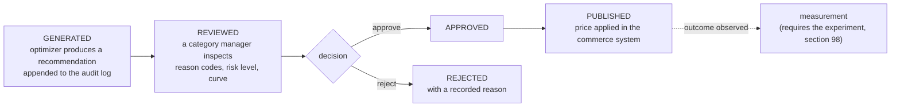
```mermaid
flowchart LR
    A["GENERATED<br/>optimizer produces a recommendation<br/>appended to the audit log"] --> B["REVIEWED<br/>a category manager inspects<br/>reason codes, risk level, curve"]
    B --> C{"decision"}
    C -->|approve| D["APPROVED"]
    C -->|reject| E["REJECTED<br/>with a recorded reason"]
    D --> F["PUBLISHED<br/>price applied in the commerce system"]
    F -.->|"outcome observed"| G["measurement<br/>(requires the experiment, section 98)"]
```

`LIFECYCLE_STATES = ("GENERATED", "REVIEWED", "APPROVED", "REJECTED",
"PUBLISHED")` in `src/pricing_engine/audit.py`.

### 95.2 Where the human is mandatory

| decision state | human required? | contexts (week 399, standard) |
| --- | :--: | ---: |
| `RECOMMEND_CHANGE` | **not by the engine** — but the lifecycle still routes it through REVIEWED → APPROVED before PUBLISHED | 8,265 (59.2%) |
| `KEEP_CURRENT` | no action needed | 4,346 (31.1%) |
| **`REVIEW_REQUIRED`** | **yes — the proposal is never applied without approval** | **1,353 (9.7%)** |

**A HIGH-risk context is never actionable under either default profile.**
Verified: **0 of 4,760** HIGH-risk contexts auto-changed a price.

### 95.3 What the reviewer is given

For each queued item: current price, proposed price, final price, decision
state, risk level and its factors, the elasticity applied and its source, the
feasible interval and every guardrail's value, the full reason-code list, risk
notes in plain English, the predicted units / revenue / gross profit at both
prices, the demand curve with the feasible band shaded, and the model version.

The dashboard's Recommendation Engine page is that reviewer interface, and its
REVIEW_REQUIRED banner states the consequence explicitly: *"this context is HIGH
risk, so the proposal is NOT applied automatically. A human must approve it. The
final price stays at $X."*

### 95.4 What is not built

| capability | status |
| --- | :--: |
| the lifecycle **states** and their persistence | ✅ implemented |
| a **queue UI** with assignment, prioritisation and SLAs | ❌ |
| approval **authentication and authorisation** | ❌ |
| **write-back** to a commerce system | ❌ |
| capture of **rejection reasons** as training signal | ❌ |
| **staffing** for 1,353 items a week | ❌ |

The fifth is the most interesting omission. A reviewer who rejects a
recommendation knows something the model does not — a competitor promotion, a
supply problem, a brand agreement. Capturing that as a labelled signal would be
one of the highest-value additions to the system and it is not implemented.

---
---

# PART XX — PRODUCTION DEPLOYMENT

## 96. How this would become a real production system

### 96.1 Target architecture

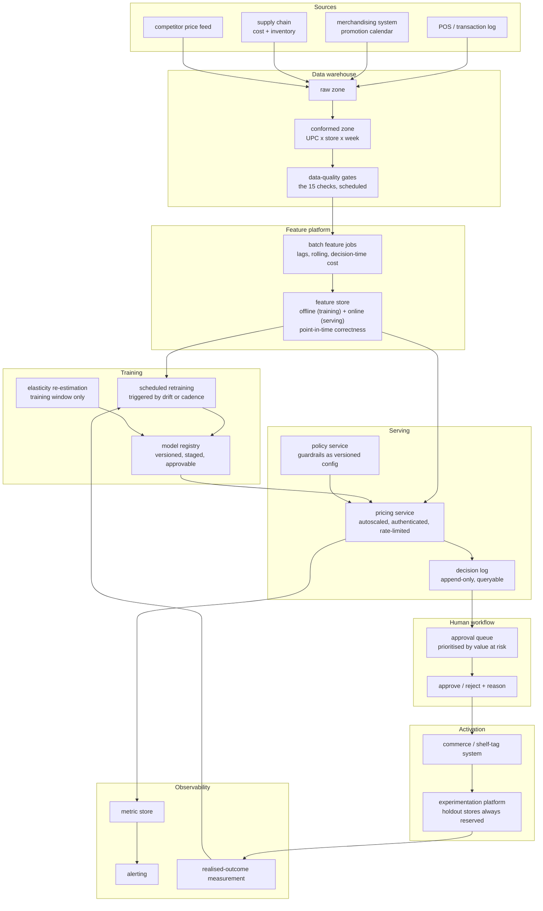
```mermaid
flowchart TD
    subgraph src["Sources"]
        A1["POS / transaction log"]
        A2["merchandising system<br/>promotion calendar"]
        A3["supply chain<br/>cost + inventory"]
        A4["competitor price feed"]
    end
    subgraph wh["Data warehouse"]
        B1["raw zone"] --> B2["conformed zone<br/>UPC x store x week"] --> B3["data-quality gates<br/>the 15 checks, scheduled"]
    end
    subgraph fs["Feature platform"]
        C1["batch feature jobs<br/>lags, rolling, decision-time cost"]
        C2["feature store<br/>offline (training) + online (serving)<br/>point-in-time correctness"]
        C1 --> C2
    end
    subgraph tr["Training"]
        D1["scheduled retraining<br/>triggered by drift or cadence"]
        D2["elasticity re-estimation<br/>training window only"]
        D3["model registry<br/>versioned, staged, approvable"]
        D1 --> D3
        D2 --> D3
    end
    subgraph sv["Serving"]
        E1["pricing service<br/>autoscaled, authenticated, rate-limited"]
        E2["policy service<br/>guardrails as versioned config"]
        E3["decision log<br/>append-only, queryable"]
    end
    subgraph hu["Human workflow"]
        F1["approval queue<br/>prioritised by value at risk"]
        F2["approve / reject + reason"]
    end
    subgraph act["Activation"]
        G1["commerce / shelf-tag system"]
        G2["experimentation platform<br/>holdout stores always reserved"]
    end
    subgraph obs["Observability"]
        H1["metric store"]
        H2["alerting"]
        H3["realised-outcome measurement"]
    end
    A1 --> B1
    A2 --> B1
    A3 --> B1
    A4 --> B1
    B3 --> C1
    C2 --> D1
    C2 --> E1
    D3 --> E1
    E2 --> E1
    E1 --> E3 --> F1 --> F2 --> G1
    G1 --> G2 --> H3
    E1 --> H1 --> H2
    H3 --> D1
```

### 96.2 What is demo-only today — explicitly

| component | today | production |
| --- | --- | --- |
| data ingestion | one-off download of a static archive | scheduled pipelines with SLAs and quality gates |
| feature computation | a script over a Parquet file | a feature store with point-in-time correctness and online serving |
| training | manual `make train` | scheduled and drift-triggered, with approval gates |
| model storage | a `.joblib` file plus a JSON | a registry with staging, promotion and rollback |
| **code lineage** | **none — the repo has no commits** | commit SHA + build ID on every artifact |
| serving | a single uvicorn process, no auth | autoscaled, authenticated, rate-limited, traced |
| policy config | a YAML file in the repo | versioned, reviewable, independently deployable |
| approval | a lifecycle enum | a real queue with assignment and SLAs |
| activation | none | write-back to the commerce system with confirmation |
| measurement | **model-internal only** | **a permanent holdout and a real experiment** |
| monitoring | an offline script | a metric store, alerting, on-call |

### 96.3 The dependency ordering that matters

The **experimentation platform is not the last box; it is the first
prerequisite**. Without a permanent holdout, every economic claim the system
makes remains model-internal forever, no matter how good the engineering
elsewhere becomes. §64 is not a limitation of this project's maturity — it is a
property of observational data.

### 96.4 Rollout sequence

1. **Shadow mode.** Generate recommendations, log them, apply none. Measure
   agreement with what the merchant actually did and the size of the proposed
   moves. Weeks 1–8.
2. **Human-approved pilot.** A handful of stores, `conservative` profile, every
   recommendation approved by a person. Weeks 9–16.
3. **Randomised experiment** (§98) on a treated store set with a control set.
   Weeks 17–28.
4. **Staged rollout** conditional on the primary estimate and the guardrail
   metrics, keeping a **permanent holdout**.
5. **Automation** only for LOW-risk, high-confidence contexts, with the review
   queue retained for everything else.

---

## 97. Scaling

### 97.1 Where this implementation would break

| dimension | today | breaks at |
| --- | --- | --- |
| SKUs × stores | 36,443 series | ~10⁵–10⁶ series: the per-context Python loop dominates |
| batch runtime | 3,000 contexts in ~105 s (≈ 35 ms each) | 1M contexts ≈ **10 hours** in the current loop |
| feature panel in memory | ~4.7M rows | tens of millions: the dashboard and API both load it in-process |
| elasticity table | 372 products | fine — this scales trivially |
| model artifact | one global model | fine, but a single model over 10⁶ heterogeneous SKUs is a modelling question, not an engineering one |

### 97.2 Millions of SKUs

**The vectorised path already exists and is unused.**
`simulation.simulate_many(model, contexts, price_matrix, unit_costs)` scores
`(n_contexts × n_candidates)` rows in **one** model call. Switching the batch
script to it is the single highest-leverage engineering change in the repository
(limitation #18).

Beyond that: partition by store or category and run partitions in parallel; the
optimization is embarrassingly parallel because contexts are independent (which
is also exactly why cross-price effects are missing — §101).

### 97.3 Batch versus real-time pricing

| | batch (weekly) | real-time |
| --- | --- | --- |
| fits | grocery shelf prices — this project | e-commerce, marketplaces |
| latency budget | hours | milliseconds |
| what changes | nothing architecturally | features must be served online with point-in-time correctness; the elasticity table becomes a cached lookup; the optimizer must be sub-millisecond |
| feasibility here | already the case | the grid search over ~15 candidates is already fast enough; the bottleneck is feature retrieval |

### 97.4 Caching

Natural boundaries, in decreasing hit rate: the **elasticity table** (changes
only on re-estimation), the **model artifact** (already loaded once at startup),
**series statistics** (`n_obs`, distinct prices, CV, price support — change
weekly), and the **feasible interval** for a context (a pure function of
`p₀`, cost, support and the policy).

### 97.5 Distributed training

The current fit is 31 s on 3.2M rows — nowhere near needing distribution. At 10⁸
rows: sample (this project's own evidence is that a 1.2M subsample gives
−2.0289 against −2.0443 on the full sample), or use out-of-core / incremental
learners, or partition by category and fit per-segment models.

### 97.6 Feature store

The requirement is **point-in-time correctness**: given `(upc, store, week)`,
return exactly the features that were knowable at that moment. This project
achieves it with a batch table and a shift discipline; at scale it needs a
purpose-built store, because the failure mode — training/serving skew — is
silent and produces confidently wrong prices.

### 97.7 Model segmentation

One global model is defensible here (489 UPCs, one category, one chain). At
scale the options are: per-category models (different demand dynamics), per-
region models (different competition), per-velocity models (fast movers versus
long tail), or a hierarchical model pooling across levels — which is exactly the
empirical-Bayes idea of §31 applied to the demand model rather than to the
elasticity.

---
---

# PART XXI — EXPERIMENTATION

## 98. Pricing A/B test

The full design is in `docs/PRICING_EXPERIMENT.md`. **No experiment was run and
no results are invented.**

### 98.1 Hypothesis

Applying the constrained optimizer's recommended prices (standard profile,
gross-profit objective) to eligible UPC × store series increases **gross profit
per store-week** relative to the retailer's current pricing, without material
harm to units or customer complaints.

### 98.2 Unit of randomisation: **store × category-block × week**

Randomise **whole stores** into treatment and control for a defined block of
Cereals UPCs.

**Why not randomise individual UPCs within a store.** Shoppers substitute
heavily within cereal. If Kellogg's Corn Flakes is treated and Post Toasties is
not, the "control" product absorbs the treated product's lost or gained volume,
and the estimated effect is contaminated by cannibalisation. This is the same
mechanism that §101 identifies as the largest missing model component.

**Why not a switchback (randomise weeks within a store).** Promotion calendars,
seasonality and shopper stock-piling create carry-over across weeks; a switchback
would need a long washout that eats the sample.

**Trade-off accepted:** store-level randomisation means **few independent
units** and requires clustered inference — which is precisely the lesson §29
taught about this data.

### 98.3 Design

* **Two arms**: control (current pricing process) and treatment (optimizer
  recommendations, human-reviewed, `standard` profile).
* **Stratified assignment** on pre-period gross profit, store size and price
  zone, to reduce imbalance with a small number of clusters.
* **Duration: 12 weeks minimum** — long enough to cover a promotion cycle and
  its post-promotion dips, short enough to limit drift — plus a **4-week
  pre-period** used only for stratification and pre-trend checks.
* **Freeze the recommendation policy for the whole test.** No mid-flight tuning.

### 98.4 Primary metric

**Gross profit per store-week for the treated category block.**

Chosen because it is the objective the engine optimises, it is measurable
weekly, and — unlike revenue or units alone — **it cannot be gamed by shifting
volume between prices**.

**One primary metric, one primary test.**

### 98.5 Secondary metrics

Revenue per store-week; unit sales per store-week; average selling price;
realised gross margin rate; **category share of store sales** (to detect
substitution *out of* the category).

Reported with a multiplicity correction (Holm or Benjamini-Hochberg) and
labelled exploratory.

### 98.6 Guardrail metrics with pre-registered stopping rules

* customer complaints per 1,000 transactions
* share of items with a price increase above a defined threshold
* **out-of-stock rate for treated items** — a price cut that empties the shelf
  is not a win
* returns / refunds where applicable
* basket size and store traffic (store-level spillover)
* any legally sensitive category flags

**Breach means the arm is paused, not explained away.**

### 98.7 Sample size and power

For a clustered design the usable sample is the number of **stores**, not
store-weeks. With `k` stores per arm, `T` weeks, within-store weekly gross-profit
standard deviation `σ` and intra-cluster correlation `ρ`:

$$SE \;\approx\; \sigma\sqrt{\frac{1 + (T-1)\rho}{k\,T}}$$

Detecting a small relative effect (2–3% of gross profit) in a category with high
weekly volatility typically requires **tens of stores per arm and a multi-week
horizon**.

**The honest planning step is to compute `σ` and `ρ` from the actual chain's
pre-period and solve for `k` — not to assert a number here.** The design
document does exactly that, and notes that this project's own demand model has a
weekly WAPE around 0.46; category-level aggregation reduces noise, but the design
must be powered against **measured** variance, not hope.

### 98.8 Duration and seasonality

12 weeks minimum, spanning at least one full promotion cycle. Week fixed effects
in the analysis absorb chain-wide seasonality; weeks with chain-wide promotional
events are either excluded or modelled explicitly.

### 98.9 Spillovers and other threats

| threat | handling |
| --- | --- |
| **spillover between stores** (cross-shopping) | randomise at store level; prefer geographically separated stores; measure traffic |
| **within-category substitution** | treat whole category **blocks**, not single UPCs |
| **seasonality** | week fixed effects; run across a full promotion cycle |
| **contamination from chain-wide promotions** | log promotion calendars; exclude or model those weeks |
| **novelty effects** | discard the first week from the primary window (pre-registered) |
| **competitor response** | monitor local competitor prices where available; a 12-week window limits exposure |
| **implementation failure** | **audit that treated shelves actually carry the recommended price** — an experiment measures what was *executed*, not what was recommended |

The last is the one most often forgotten and most often fatal.

### 98.10 Pre-registered analysis plan

* **Primary estimator:** difference-in-differences on store-week gross profit
  with **store and week fixed effects**, standard errors **clustered by store**.
* **Pre-trend check** on the pre-period, reported whether or not it is
  flattering.
* One primary metric, one primary test; secondaries corrected for multiplicity
  and labelled exploratory.
* **Analysis code written and frozen before unblinding.**

### 98.11 Rollout safety

1. Start with a **small pilot** (few stores, `conservative` profile).
2. Expand only after the guardrails hold and the primary estimate is stable.
3. Keep a **permanent holdout** so the effect can be re-measured after full
   rollout — models decay, and without a holdout nobody can tell.
4. Keep the human review step throughout.

---

## 99. How real business uplift would be established

### 99.1 The conversion

| today | after the experiment |
| --- | --- |
| *"model-internal estimated portfolio gross-profit uplift **+8.30%**"* | *"prices set by this engine **caused** a change in gross profit per store-week of **X%**, 95% CI [L, U], estimated by difference-in-differences with store-clustered standard errors over N stores and 12 weeks"* |

### 99.2 The four things that change

1. **The proposer stops being the judge.** Outcomes are *observed* at the prices
   the engine chose, not predicted by the model that chose them. §64's
   circularity is broken by construction.
2. **Randomisation supplies identification.** Treatment assignment is
   independent of unobserved demand, so `P(Q | do(price))` becomes estimable.
   §33 dissolves.
3. **The estimate acquires an interval.** Not a point from a simulation, but an
   estimate with a standard error that reflects the actual clustering — the
   lesson of §29 applied to the outcome rather than the elasticity.
4. **Guardrail metrics become evidence.** Complaints, out-of-stocks and traffic
   are measured, not assumed away.

### 99.3 What would still be unknown afterwards

Honesty cuts both ways. Even a clean experiment would leave open:

* **external validity** — the effect in these stores, this category, this
  quarter; not a universal elasticity;
* **decay** — models degrade (this one loses 0.12 WAPE over four quarters), so
  the measured effect has a shelf life, which is why the permanent holdout
  matters;
* **the counterfactual policy** — the experiment measures the engine against
  *the retailer's current process*, not against R4 or any other rule. Measuring
  "is the model worth it?" would require a **third arm** running the rule-only
  policy;
* **long-run customer effects** — 12 weeks cannot measure trust, loyalty or
  brand perception.

### 99.4 The third arm, and why it is the interesting one

Given §56's finding — a no-model rule matches the engine within one 5¢ step
82.5% of the time — the highest-value experiment is not "engine vs status quo".
It is **three arms**:

| arm | policy |
| --- | --- |
| **A — control** | the retailer's current process |
| **B — rule only** | R4: always take the maximum allowed increase, through the same guardrails |
| **C — full engine** | the hybrid response, constrained optimizer and risk gate |

The A-vs-C contrast answers *"is this worth deploying?"*. The **B-vs-C contrast
answers "is the model worth building?"** — the question §85 can only answer
argumentatively today.

That comparison is the single most valuable extension of this project, and it
costs one extra arm.

---
---
# PART XXII — FUTURE WORK

## 100. Cross-price elasticity

### 100.1 What is missing

Every elasticity in this project is **own-price**:

$$\varepsilon_{ii} = \frac{\partial \log Q_i}{\partial \log p_i}$$

A complete demand system needs the cross-price terms:

$$\varepsilon_{ij} = \frac{\partial \log Q_i}{\partial \log p_j}, \qquad i \ne j$$

with `ε_ij > 0` for **substitutes** (raising Post's price increases Kellogg's
volume) and `ε_ij < 0` for **complements**.

### 100.2 Why this matters most in exactly this category

Cereal is a substitution-heavy category. A shopper who finds their usual brand
at $3.66 instead of $3.35 does not necessarily leave without cereal — they
frequently buy a different box. The engine models that lost volume as **demand
destroyed**; in reality much of it is **volume redirected within the same
category, in the same store, in the same week**.

The direction of the error is knowable even if its size is not: **own-price
elasticity estimated without cross-price terms overstates the category-level
volume loss from a price increase.** So the engine is, if anything, *too
conservative* about price increases at the category level — while
simultaneously being blind to the fact that re-pricing many substitutes at once
is not the sum of the individual effects.

### 100.3 Why it was not done

| obstacle | detail |
| --- | --- |
| **dimensionality** | 489 UPCs ⟹ 489² = 239,121 elasticities. With 372 products in the training window and a median of ~5,400 usable rows per product, the parameters vastly outnumber the identifying variation. |
| **identification** | own-price elasticity is already unidentified (§33). Cross-price terms inherit every confounder and add more: competing brands promote in coordinated waves, so their prices move together for reasons unrelated to substitution. |
| **the shrinkage problem gets worse** | 133 of 372 products already lack a usable *own* estimate. Their cross-price terms would be pure noise. |

### 100.4 How it would be done

| approach | idea | cost |
| --- | --- | --- |
| **category aggregation** | model demand for brand × segment aggregates (e.g. "adult ready-to-eat", "kids' pre-sweetened") rather than UPCs | loses per-UPC precision; makes the problem tractable |
| **structural demand systems** (AIDS, nested logit, BLP) | impose economic structure — adding-up, homogeneity, Slutsky symmetry — to reduce the free parameters | strong functional-form assumptions; still needs identification |
| **regularised full matrix** | estimate `ε_ij` with a sparsity penalty and a hierarchical prior by brand/segment | the empirical-Bayes idea of §31 in matrix form |
| **price-index approach** | add a *competitor price index* (the mean price of the product's nearest substitutes) as one extra regressor per product | the cheapest useful step: one parameter per product, directly interpretable, and immediately usable in the hybrid response |

**The price-index approach is the right next step for this repository.** It is
tractable, it needs no new data, and it would convert a completely unmodelled
mechanism into a measured one.

---

## 101. Cannibalisation and multi-product optimization

### 101.1 The structural problem

The engine solves 13,964 **independent** single-product problems:

$$\max_{p_i \in \mathcal{F}_i} \; (p_i - c_i)\,Q_i(p_i) \qquad \text{for each } i \text{ separately}$$

The business problem is a **joint** one:

$$\max_{\mathbf{p} \in \mathcal{F}} \; \sum_i (p_i - c_i)\,Q_i(p_1, \dots, p_n)$$

These coincide only if `∂Q_i/∂p_j = 0` for all `i ≠ j` — i.e. only if no
substitution exists. In cereal, that is false.

### 101.2 The concrete failure

Suppose the engine recommends +9% on the twelve largest cereal brands in a store
simultaneously. Each recommendation is individually sound under its own model.
Jointly, the shopper's substitution options have all become more expensive at
once, so the aggregate volume response is **different from — and probably
smaller than — the sum of the individual responses**. The engine cannot see
this and reports the sum.

The reverse case is worse: cutting one brand's price cannibalises its
substitutes, so the *category* gain is smaller than the item-level gain the
engine reports.

### 101.3 What a joint optimizer would need

| ingredient | status |
| --- | :--: |
| a cross-price matrix (§100) | ❌ |
| a category-level objective | ❌ (the objective is per-item) |
| a joint feasible set (category margin targets, price-ladder constraints, brand-tier ordering) | ❌ |
| a multi-dimensional solver — the grid becomes `k^n` and is infeasible | ❌ (would need a mathematical program or coordinate descent) |
| price-architecture constraints (e.g. the 18 oz box must cost more than the 12 oz box) | ❌ **not even single-product-implementable today** |

The last is worth naming separately: **price-ladder consistency** (larger sizes
cost more per pack but less per ounce; premium tiers price above value tiers) is
a hard business requirement in real grocery pricing and is entirely absent here.
Two independently optimised sizes of the same product could easily end up
inverted.

### 101.4 Why this is the largest missing mechanism

`KNOWN_LIMITATIONS.md` #6 calls it "arguably the largest missing mechanism", and
that is right. Unlike the causal problem, which is a *data* limitation nothing in
this repository can fix, cannibalisation is a **modelling scope** decision that
could be addressed with the data already in hand — at the cost of a much harder
estimation problem.

---

## 102. Dynamic pricing, bandits and RL

### 102.1 The honest framing first

**These are not automatically better, and for this problem they would currently
be worse.** The reasons are specific.

### 102.2 Why they do not fit *this* problem

| requirement | contextual bandit / RL | this setting |
| --- | --- | --- |
| **online interaction** | the learner must *act* and observe the result | offline historical panel; no ability to act |
| **fast feedback** | rewards within seconds to hours | **weekly**; a 12-week experiment yields 12 observations per store |
| **many cheap trials** | thousands of arms pulled per day | ~45,000 price decisions per week, but each is a real customer-facing action with reputational cost |
| **acceptable exploration cost** | random exploration is cheap | a randomly-priced shelf is a real revenue loss and a trust cost |
| **stationarity within a learning horizon** | reasonably stable | eight years of drift; promotion calendars dominate |
| **a well-defined state** | observable | inventory, competitor prices and shopper stock-piling are all unobserved |

A contextual bandit run on weekly grocery prices would spend most of its budget
exploring, at real cost, and would converge slowly against a non-stationary
target.

### 102.3 When they *would* become relevant

| condition | why |
| --- | --- |
| **e-commerce with continuous repricing** | feedback in hours, exploration cost near zero, price changes invisible to most shoppers |
| **a category where exploration is cheap** | long-tail SKUs with low volume and low visibility |
| **an existing experimentation platform** | the bandit is then a *more efficient* experiment, not a replacement for one |
| **a genuinely sequential objective** | markdown optimization over a finite season, where today's price changes tomorrow's inventory — a real MDP rather than a repeated single-period problem |
| **inventory as an explicit state** | perishables, fashion, event tickets |

### 102.4 The intermediate step that is actually available

**Thompson sampling over a small, safe price ladder within an approved
experiment.** Rather than full RL:

* restrict the action space to 3–5 prices inside the existing feasible interval;
* run it only on LOW-risk, well-identified series;
* keep the guardrails and the risk gate untouched;
* treat it as an **adaptive experiment** that allocates more of the sample to
  promising prices, not as an autonomous pricer.

That would improve on §98's fixed two-arm design without abandoning
identification, and it is the version of "dynamic pricing" this project could
justify.

### 102.5 What the guardrail evidence implies

§55 shows the recommended price is insensitive to the elasticity assumption
under production guardrails. **A learning algorithm operating inside those same
guardrails would have almost nothing to learn**, because the feasible interval
is narrow and the answer is usually its edge. Any serious bandit deployment
would first require widening the guardrails — which requires the causal evidence
of §98. **The ordering is: experiment → identification → wider guardrails →
adaptive pricing.** Not the reverse.

---

## 103. Better causal identification

Ranked by strength.

### 103.1 Randomised prices — the gold standard

Assign prices exogenously (§98). Identification by construction; nothing else
comes close. **Cost:** real revenue at risk, operational complexity, executive
sponsorship.

### 103.2 Instrumental variables

Need an instrument `Z` that shifts price without affecting demand except through
price:

$$\text{Cov}(Z, p) \ne 0, \qquad \text{Cov}(Z, u) = 0$$

Candidate instruments in retail pricing:

| instrument | rationale | available here? |
| --- | --- | :--: |
| wholesale / commodity cost shocks (grain, packaging, energy) | shift the retailer's cost, hence price; plausibly unrelated to local demand | ❌ not in the Cereals file |
| distance-to-warehouse × fuel price | shifts delivered cost differentially by store | ❌ no store geography |
| manufacturer trade-deal calendars | exogenous timing of promotional funding | ❌ not recorded |
| **prices of the same UPC in geographically distant stores of the same chain** (a Hausman instrument) | captures common cost shocks, excludes local demand | **partially** — the data supports it, but the exclusion restriction fails if chain-wide demand shocks exist, which §29 shows they do (week clustering inflates SEs 12×) |

The last row is instructive: the one feasible instrument is invalidated by a
correlation structure this project has already measured.

### 103.3 Natural experiments and regression discontinuity

Need a documented policy change, a zone reassignment, a discrete pricing rule or
a threshold. **None identified** in the Cereals extract. Note that the broader
Dominick's research programme *did* include in-store pricing experiments in
several categories — but the Cereals movement file carries no experiment
assignment or window that could be verified, so this project claims none of its
estimates are experimental (§33.4).

### 103.4 Difference-in-differences

Needs a treated and a control group with credible parallel pre-trends. There is
no exogenous treatment to define here.

### 103.5 Causal ML — and the trap it represents

Double machine learning, causal forests and orthogonal learning are **estimation**
technologies. They relax functional-form assumptions and give valid inference
under **unconfoundedness given observables**. They do **not** manufacture
identification.

In this data the confounders — planned promotions, display, feature ads,
competitor prices, anticipated demand — are **unobserved**. Applying double ML
here would produce a more flexible, equally confounded estimate, dressed in
causal vocabulary. That would be worse than the current honest observational
estimate, because it would *sound* identified.

This is worth carrying into any interview: **the question "have you tried causal
ML?" is often a test of whether you know the difference between estimation and
identification.**

### 103.6 What is actually worth doing with the data in hand

| step | value |
| --- | --- |
| **add a competitor price index** (§100.4) | converts one unmodelled confounder into a measured control; cheapest real improvement |
| **model promotion depth, not just presence** | the biggest error segment (WAPE 0.656) and the biggest identification threat are the same rows |
| **richer promotion controls** — interact the flag with product and season | partially separates the marketing bundle from the price |
| **UPC × store × season fixed effects** | absorbs more time-varying heterogeneity, at the cost of precision |
| **a Hausman-style instrument with an explicit test of the exclusion restriction** | worth attempting *and reporting the failure* — the attempt itself is informative |

---
---

# PART XXIII — BUSINESS CASE

## 104. Business interpretation

### 104.1 Who uses this and how

A **category manager** for Cereals, owning ~45,000 weekly price decisions across
93 stores and 489 UPCs. Their week looks like this:

**Monday — the batch runs.** 13,964 decision contexts scored under the
`standard` profile:

| outcome | contexts | share | what the manager does |
| --- | ---: | ---: | --- |
| `RECOMMEND_CHANGE` | 8,265 | 59.2% | review in bulk, spot-check, approve |
| `KEEP_CURRENT` | 4,346 | 31.1% | nothing |
| `REVIEW_REQUIRED` | 1,353 | 9.7% | **the queue** — individual judgement required |

**Tuesday — work the queue.** For each of the 1,353, the dashboard shows the
proposal, the final price (unchanged), the risk level with its factors, the
elasticity and its provenance, the feasible interval, the reason codes and the
demand curve. The manager approves, rejects or overrides.

**Wednesday — publish.** Approved prices flow to shelf tags. (Not implemented
here — §95.4.)

**Ongoing — investigate.** When a buyer asks *"why did we raise Cap'n Crunch by
9%?"*, the answer is in the audit log: model version, elasticity −2.940 from the
product's own estimate with weight 0.92, cost $2.56, feasible range
$3.02–$3.69, the optimum was $3.88 but the ±10% cap bound, estimated gross
profit $20.27 → $21.74.

### 104.2 What the manager gains

| gain | mechanism | evidence |
| --- | --- | --- |
| **triage** | 40.1% of contexts are actively *not* recommended for change | 3,528 screened out + 1,353 gated + 716 immaterial |
| **direction** | a defensible answer to "up or down?" per item | 8.0% of actionable recommendations are cuts under `shrunk` |
| **consistency** | the same evidence produces the same decision every week | deterministic given the artifacts |
| **explainability** | reason codes and a feasible interval, not a black box | every recommendation carries both |
| **auditability** | every decision reconstructible after the fact | 34-column append-only log |
| **an explicit risk boundary** | HIGH-risk contexts never move automatically | 0 of 4,760 |

### 104.3 What the manager must supply

Judgement the engine cannot have: competitor activity, supplier relationships,
brand agreements, planogram constraints, price-ladder consistency across sizes,
category strategy, and the knowledge that a particular SKU is a traffic driver
whose price is a strategic signal rather than a profit lever.

### 104.4 What the manager must not be told

**That the engine will deliver +8.30% gross profit.** That number is a
model-internal estimate produced by the model that proposed the prices. The
honest statement is:

> *"Under the fitted price-response model, applying these recommendations would
> produce 8.30% more gross profit than current pricing on the scored contexts.
> Whether it actually would is unknown until it is tested (§98)."*

---

## 105. Example end-to-end pricing decision

The complete trace for one real recommendation, from raw context to final
decision. Verified live on 2026-08-19.

### 105.1 The context

| field | value |
| --- | --- |
| product | **CAPN CRUNCH JUMBO CR** (UPC 3000006560) |
| store | **86** |
| decision week | **399** (1997-05-01) |
| current effective unit price | **$3.35** |
| decision-time unit cost (lagged, forward-filled AAC) | **$2.5571** |
| current gross margin | 23.7% |
| observed price support | **$1.50 – $3.79**, over **359 weeks**, **56 distinct prices** |

### 105.2 Recent observed history

| week | price | units | revenue | gross profit | promotion |
| ---: | ---: | ---: | ---: | ---: | --- |
| 392 | $3.35 | 18 | $60.30 | $15.39 | NONE_RECORDED |
| 393 | $3.35 | 12 | $40.20 | $10.11 | NONE_RECORDED |
| 394 | $3.35 | 12 | $40.20 | $10.11 | NONE_RECORDED |
| **395** | **$1.50** | **17,824** | **$26,736.00** | **−$18,768.67** | NONE_RECORDED |
| 396 | $3.19 | 465 | $1,483.35 | $805.90 | Simple price reduction |
| 397 | $3.35 | 25 | $83.75 | $47.32 | NONE_RECORDED |
| 398 | $3.35 | 11 | $36.85 | $8.72 | NONE_RECORDED |
| **399** | **$3.35** | **12** | **$40.20** | **$9.52** | NONE_RECORDED |

Week 395 is a spectacular event: **17,824 units at $1.50** — 1,485× the
surrounding weeks — with an observed gross profit of **−$18,769**, and **no
recorded promotion code**. It is a textbook illustration of §11.4 (absence of a
code proves nothing) and §18.5 (extremes are retained, not trimmed).

### 105.3 Elasticity

| field | value |
| --- | --- |
| training observations for this UPC | 20,125 |
| distinct prices | 215 |
| raw per-UPC estimate | **−3.0178** |
| HC1 standard error | 0.0398 |
| **panel-robust standard error** | **0.2557** (6.4× inflation) |
| τ² | 0.7661 |
| **shrinkage weight** | **0.9214** |
| pooled prior | −2.0289 |
| **applied elasticity** | **−2.9401** |
| source | `shrunk_product` |

### 105.4 The economics on a grid

Predicted units, revenue and gross profit at candidate prices (model-internal):

| candidate | predicted units | revenue | **gross profit** | margin rate |
| ---: | ---: | ---: | ---: | ---: |
| $2.51 | 59.74 | $149.94 | −$2.81 | −1.9% |
| $2.71 | 47.68 | $129.22 | $7.29 | 5.6% |
| $2.91 | 38.68 | $112.54 | $13.65 | 12.1% |
| $3.11 | 31.81 | $98.93 | $17.59 | 17.8% |
| **$3.35** ← current | **25.56** | **$85.64** | **$20.27** | **23.7%** |
| $3.51 | 22.29 | $78.23 | $21.24 | 27.1% |
| **$3.66** ← **recommended** | **19.71** | **$72.13** | **$21.74** | **30.1%** |
| $3.81 | 17.51 | $66.72 | $21.94 | 32.9% |
| **$3.88** ← unconstrained optimum | ≈16.9 | ≈$65.6 | **≈$22.0** | ≈34.1% |
| $4.11 | 14.01 | $57.60 | $21.76 | 37.8% |

Revenue falls monotonically. Gross profit peaks at the closed-form optimum
`$2.5571 × 2.9401/1.9401 = $3.875` and then falls.

### 105.5 The guardrails

| bound | source | value | binds? |
| --- | --- | ---: | :--: |
| lower | ABSOLUTE_PRICE_FLOOR | $0.0100 | |
| lower | OUTSIDE_EXTRAPOLATION_RANGE | $1.4250 | |
| lower | COST_FLOOR | $2.5571 | |
| lower | MIN_MARGIN (5%) | $2.6916 | |
| lower | **PRICE_CHANGE_LIMIT** (−10%) | **$3.0150** | ✅ |
| upper | OUTSIDE_EXTRAPOLATION_RANGE | $3.9795 | |
| upper | **PRICE_CHANGE_LIMIT** (+10%) | **$3.6850** | ✅ |
| | **feasible interval** | **[$3.015, $3.685]** | |

**The unconstrained optimum ($3.875) is outside the feasible interval.** This
is one of the 7,967 guardrail-corner contexts.

### 105.6 The decision

| field | value |
| --- | --- |
| proposed candidate price | **$3.66** (+9.25%) |
| **final recommended price** | **$3.66** |
| decision state | **RECOMMEND_CHANGE** |
| actionable | **true** |
| risk level | **LOW** |
| predicted units | 25.56 → 19.71 (**−22.9%**) |
| expected revenue | $85.64 → $72.13 (**−15.78%**) |
| **expected gross profit** | **$20.27 → $21.74 (+7.23%)** |
| reason codes | `PRICE_CHANGE_LIMIT`, `PROFIT_UPLIFT_POSITIVE` |
| risk notes | none |

### 105.7 What a manager should take from this

1. **The engine wanted +15.7% and was allowed +9.25%.** The guardrail did the
   last third of the work.
2. **This is a volume-for-margin trade**: −22.9% units, −15.8% revenue, +7.2%
   gross profit. If the mandate were share or volume, this recommendation would
   be **wrong** — and the engine supports a revenue objective for exactly that
   case.
3. **The elasticity is 92% this product's own**, which is why this context is
   LOW risk and actionable rather than queued.
4. **+7.23% is a model-internal estimate.** If the true elasticity is the pooled
   −2.029 rather than −2.940, the optimum would be `$2.5571 × 2.029/1.029 =
   $5.04` — far above the cap — so the recommendation at $3.66 would be
   *unchanged*, but the predicted volume loss would be smaller and the estimated
   profit gain **larger**. The guardrail makes the price robust; it does not make
   the *estimate* robust.
5. **Week 395 is a warning.** This series has carried $1.50 with 17,824 units.
   The extrapolation guardrail's lower bound of $1.425 reflects that. A model
   asked about $1.50 here would not be extrapolating — and would predict a very
   different world.


*Figure 23 — The same figure as §2.3, repeated here because it is the decision.
Shaded band = the feasible interval; grey dashed = current; red dotted =
recommended; black dash-dot = cost.*

---

## 106. Portfolio-level recommendation summary

### 106.1 The 3,000-context batch (`reports/07`)

Week 399, `standard` profile, `shrunk` response, gross-profit objective.

| category | contexts | share |
| --- | ---: | ---: |
| **actionable** (`RECOMMEND_CHANGE`) | **1,766** | **58.87%** |
| **keep current** (`KEEP_CURRENT`) | **923** | **30.77%** |
| **review required** (`REVIEW_REQUIRED`) | **311** | **10.37%** |
| **high-risk blocked** (HIGH risk, never auto-actioned) | **1,039 HIGH-risk, 0 actionable** | — |

| statistic | value |
| --- | ---: |
| median absolute price change | 8.39% |
| share of changes that are increases | 91.28% |
| median internal uplift among actionable | 13.33% |
| risk mix | LOW 1,175 · MEDIUM 786 · HIGH 1,039 |
| elasticity source | `shrunk_product` 1,904 · `pooled_fallback` 1,096 |
| median elasticity used | −2.029 |
| portfolio expected gross profit, current | **$37,580.82** |
| portfolio expected gross profit, if applied | **$40,700.96** |
| **model-internal estimated uplift** | **+8.30%** |
| runtime | 105.3 s |

### 106.2 The full week (13,964 contexts, `reports/11`/`19`)

| category | contexts | share |
| --- | ---: | ---: |
| actionable | **8,265** | **59.19%** |
| keep current | 4,346 | 31.12% |
| review required | **1,353** | **9.69%** |
| HIGH risk | 4,760 | 34.09% |
| **HIGH risk that auto-changed a price** | **0** | **0.00%** |

### 106.3 Why the two batches differ slightly

58.87% vs 59.19% actionable, 10.37% vs 9.69% review. The 3,000-context batch is
a **sample** of the 13,964; the differences are sampling variation of the
expected order. This report quotes both and always names which is which — a
practice worth adopting generally, because "58.9% actionable" and "59.2%
actionable" appearing in the same document without labels is exactly how a
metrics dictionary drifts.

### 106.4 What the portfolio view is for

| question | answer from the batch |
| --- | --- |
| how much work is this? | 8,265 approvals + a **1,353-item queue** per week |
| how aggressive is the engine? | median +8.4%, 91% increases, 31% no change |
| is it safe? | 0 of 4,760 HIGH-risk contexts auto-changed |
| how much is model-driven? | **2.9%** interior optima (§54) |
| what is it worth? | **unknown** — the +8.30% is model-internal (§64) |

The last two rows are the ones a serious reviewer reads. Everything above them
describes activity; those two describe evidence.

---
---

# PART XXIV — PROJECT EVOLUTION

## 107. How the project changed

This chapter exists because the project's value is in the **iteration**, not in
the first architecture. `DECISIONS.md` records **52 numbered decisions** across
three phases, with alternatives and rationale for each.

### 107.1 Phase A–K — the initial build (decisions 1–30)

Official data acquisition; the canonical panel with a counted exclusion ledger;
the decision-time feature contract with a twelve-channel leakage audit; the
elasticity ladder; six models on a chronological split; a native ML price
response; a grid optimizer with guardrails; a risk layer; a FastAPI service and
a nine-page dashboard.

**The architecture at the end of this phase:** the ML demand model answered
price counterfactuals **directly**. The optimizer swept candidate prices through
the fitted forecaster and took the arg-max.

### 107.2 The problem discovered

`scripts/price_response.py` measured the fitted model's own price response by
central finite difference over 300 real contexts:

| source | elasticity |
| --- | ---: |
| **native ML implied** | **−3.102** |
| controlled econometric, + UPC × store FE | −2.419 |
| controlled econometric, + promo/season/trend | −1.909 |
| pricing pooled, training weeks only | **−2.029**, 95% CI **[−2.236, −1.821]** |

The forecaster's implied elasticity was **outside the confidence interval of
every controlled estimate**. Using it for counterfactuals would bake a
systematic pessimism about price increases into every recommendation (§42.2).

Crucially, the demand curves themselves were **fine** — 100% monotone
decreasing, 0% flat, 0% negative predictions. The model was not broken. It was
*well-calibrated for forecasting and wrong for intervention*, which is a much
harder failure to notice.

### 107.3 Phase L — pricing-science hardening (decisions 31–42)

| change | decision |
| --- | :--: |
| **separate forecasting from price response**: `Q(p) = Q̂(p₀)(p/p₀)^ε` | #31 |
| default method `shrunk`: per-UPC empirical-Bayes elasticity | #32 |
| **keep the native ML response as a benchmark**, do not delete it | #33 |
| elasticities fitted on **training weeks only** (2–257), script aborts otherwise | #34 |
| reject wrong-signed and imprecise product estimates **before** shrinking | #35 |
| **invert the risk scale** so HIGH means risky; bands stricter than eligibility | #36 |
| three decision states + an `actionable` flag | #37 |
| **HIGH risk is never auto-actionable** under default profiles | #38 |
| rename uplift to `model_internal_estimated_*` everywhere | #39 |
| keep the zero-price rule but **evidence** it (audit `reports/09`) | #40 |
| **stamp the reference price explicitly; a missing one raises** | #41 |
| score accuracy with the base model, policies with the pricing model | #42 |

Two of these deserve emphasis as *failures corrected*:

**#36 — the risk-scale inversion.** The scale used to read backwards: "HIGH"
meant *high confidence* and sat on actionable recommendations. A reviewer
scanning a queue would have read the most dangerous label as the safest one.

**#41 — the silent no-op.** During candidate scoring the row's price *is* the
candidate, so a silent fallback for a missing reference price would make
`p/p₀ = 1`, the elasticity term would vanish, and the engine would quietly
return baseline demand for every candidate — a system that appeared to work and
recommended nothing meaningful. It now raises.

### 107.4 Phase M — the final scientific audit (decisions 43–52)

Ten audit reports. What they found is in §84. What changed as a result:

| change | decision |
| --- | :--: |
| **report constraint dominance as the headline architectural fact**, not an appendix | #43 |
| per-UPC standard errors become **panel-robust**, not HC1 | #44 |
| τ² by **REML**, measured around the prior the shrinkage targets | #45 |
| **mean shrinkage weight 0.954 → 0.780**; the old figure removed everywhere | #46 |
| split `recommended_price` into **proposed** and **FINAL**; force `realisable_uplift` to 0 when not actionable | #47 |
| **fix `build_bounds`** to report constraints binding at the final interval, not every constraint that tightened a running bound | #48 |
| audits use an **exact replica** of the optimizer, pinned by 69 tests | #49 |
| **`shrunk` retained on out-of-time evidence**, not inheritance | #50 |
| **remove "no forecast skill is lost"** repository-wide; replace with the precise statement | #51 |
| add **`audit_claims.py --strict`** as an enforceable build check | #52 |

### 107.5 The four corrections that changed a published number

| # | correction | before | after |
| --- | --- | ---: | ---: |
| 1 | standard errors: HC1 → two-way clustered (pooled) | SE 0.0065 | **SE 0.1058** (16.2×) |
| 2 | mean empirical-Bayes shrinkage weight | 0.954 | **0.780** |
| 3 | τ² (REML, panel-robust inputs) | 0.906 | **0.766** |
| 4 | share of products significant at 5% | 90.1% | **75.2%** |

And two corrections that changed a **claim** rather than a number:

* *"no forecast skill is lost"* → *"the hybrid preserves the forecaster's
  baseline prediction at the reference price, not necessarily its accuracy at
  counterfactual prices"*;
* *"ML pricing"* → *"rule-bounded pricing with a learned direction"*.

### 107.6 The arc

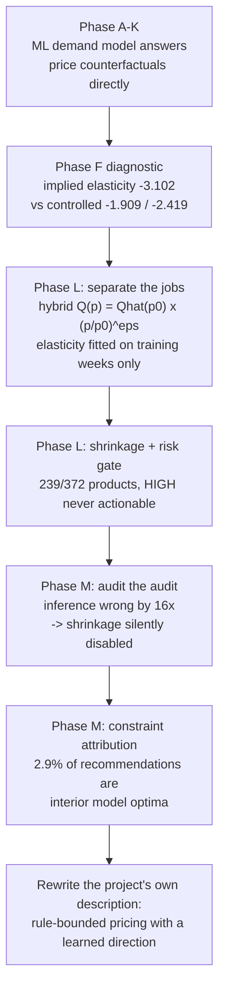
```mermaid
flowchart TD
    A["Phase A-K<br/>ML demand model answers<br/>price counterfactuals directly"] --> B["Phase F diagnostic<br/>implied elasticity -3.102<br/>vs controlled -1.909 / -2.419"]
    B --> C["Phase L: separate the jobs<br/>hybrid Q(p) = Qhat(p0) x (p/p0)^eps<br/>elasticity fitted on training weeks only"]
    C --> D["Phase L: shrinkage + risk gate<br/>239/372 products, HIGH never actionable"]
    D --> E["Phase M: audit the audit<br/>inference wrong by 16x<br/>-> shrinkage silently disabled"]
    E --> F["Phase M: constraint attribution<br/>2.9% of recommendations are<br/>interior model optima"]
    F --> G["Rewrite the project's own description:<br/>rule-bounded pricing with a learned direction"]
```

### 107.7 What this demonstrates

Not that the first architecture was good — it was not. It demonstrates:

1. **Building a diagnostic for a component nobody else measures.** The Phase F
   price-response check is not standard practice. It is what found the problem.
2. **Responding architecturally rather than cosmetically.** The response was not
   "clip the elasticity"; it was to separate two jobs that had been conflated.
3. **Keeping the rejected alternative as a measured benchmark**, so the decision
   remains auditable and reversible.
4. **Auditing the fix.** Phase M found that the Phase L shrinkage — the
   centrepiece of the correction — was not working, because of an assumption in
   its *inputs*.
5. **Publishing the least flattering finding as the headline** (#43), and
   rewriting the project's own description to match the evidence.
6. **Encoding each finding as a test** so it cannot silently regress.

A perfect first implementation would be less informative than this record.

---
---
# PART XXV — INTERVIEW PREPARATION

## 108. The thirty most important questions

Each entry gives a **deep answer**, a **short answer** (for when you have 30
seconds), the **common trap**, and the **repository evidence**.

---

### Q1. What does this project do?

**Deep.** It recommends a shelf price for a given product, store and week that
maximises expected gross profit subject to explicit business and scientific
guardrails, on the Dominick's Finer Foods Cereals scanner panel — 4,707,776
UPC × store × week observations, 489 products, 93 stores, 366 weeks, 1989–1997.
The pipeline runs from an official download through a validated canonical table,
a decision-time feature contract, a demand forecaster, a separately estimated
elasticity, a hybrid price response, a constrained grid optimizer, a risk gate,
an append-only audit log, a FastAPI service and a nine-page dashboard. It was
covered by 519 tests at Phase N and twelve audit reports that measure how much
of the answer the model actually supplies.

**Short.** A price-recommendation engine on real retail scanner data, with the
scientific limits measured rather than asserted.

**Trap.** Saying "I used ML to optimise prices." That claim is false for this
system — 2.9% of final recommendations come from an interior model optimum.

**Evidence.** `README.md`, `reports/11_CONSTRAINT_ATTRIBUTION.md`.

---

### Q2. Why Dominick's rather than a Kaggle retail dataset?

**Deep.** It is one of very few publicly documented retail scanner panels that
carries store-level weekly **price**, **unit movement**, **promotion coding**
*and* **gross margin** simultaneously. The margin field is decisive: without a
cost you cannot build a gross-profit objective, and revenue optimization on an
elastic category prices toward cost and loses money. The store dimension makes
zone pricing (and therefore endogeneity) visible instead of hidden. And it is
academically documented, so its quirks can be justified rather than invented.

**Short.** It is the only public panel with price, units, promotions **and**
cost — and cost is what makes gross profit possible.

**Trap.** Answering "it's big" or "it's real". Size is not the reason.

**Evidence.** `docs/DATA_SOURCE.md`, `DECISIONS.md` #1.

---

### Q3. What is `effective_unit_price` and why not just use `price`?

**Deep.** `price` is the price of the **bundle** scanned; `qty` is how many
items the bundle contains; `move` counts **individual units**. So `price × move`
is wrong whenever `qty > 1`. The correction is `price / qty`. Only 0.105% of
rows are bundles (4,946 of 4,707,776), but for those the unit price would be
overstated by **2–4×**, and a 4× price error propagates into the elasticity, the
implied cost, the objective and the recommendation.

**Short.** `price` is a bundle price; dividing by `qty` gives the price a
customer pays per unit. It affects 0.1% of rows by a factor of 2–4×.

**Trap.** Dismissing it as negligible. The frequency is low; the magnitude is
not, and it is a silent error.

**Evidence.** `docs/DATA_DICTIONARY.md`, validation check
`formula_effective_unit_price` (max deviation 0.000e+00), `DECISIONS.md` #3.

---

### Q4. Why is the cost column called `estimated_unit_aac`?

**Deep.** `profit` is a gross-margin percentage computed on **Average
Acquisition Cost** — an inventory-accounting measure of what the retailer paid
on average for stock on hand. It is not necessarily the economically relevant
replacement cost: forward buying, inventory ageing and trade-fund accounting all
drive a wedge. In this panel the median within-series AAC coefficient of
variation is **0.088**, and AAC falls **9.16%** on price cuts — so it moves, and
it moves with price. Calling it `true_unit_cost` would make every downstream
gross-profit number sound more authoritative than the evidence supports.

**Short.** It is an *accounting* average cost, not a replacement cost, and it
lags. Naming it precisely stops the gross-profit figures being over-read.

**Trap.** Treating cost as a known constant. It is an estimate with measured
volatility, and the optimum is linear in it.

**Evidence.** `DECISIONS.md` #4, `artifacts/metrics/eda_summary.json`
(`aac_stability`, `margin_mechanics`).

---

### Q5. You dropped 26.6% of the raw data. Justify it.

**Deep.** Those rows have `price = 0`, so no unit price can be derived and the
decision variable of the whole project is undefined. The exclusion was audited
rather than assumed: of **1,851,380** zero-price rows, only **677** — 0.037% —
recorded any sales; **73.4%** sit in leading or trailing runs (the item was not
yet carried, or had been delisted); and there is **not a single row** with a
positive price and zero sales. Imputing a price would fabricate the optimised
variable. The resulting selection tilt is measured and published: the retained
series sell 21.0 mean weekly units against 3.1 for heavily excluded series.

**Short.** No price means no unit price; 99.96% of them had no sales anyway;
73% are before-first-listing or after-delisting. The tilt toward continuously
stocked series is measured and documented.

**Trap.** Saying "they were bad data". You must know the counts and the
positional evidence, and you must volunteer the selection bias.

**Evidence.** `reports/09_ZERO_PRICE_AUDIT.md`,
`artifacts/metrics/zero_price_audit.json`.

---

### Q6. How do you know there is no leakage?

**Deep.** Twelve enumerated channels, each with a control and a **failing-if-broken**
test: outcome columns are excluded by a module-level constant; rolling windows
are computed on the already-shifted series; the reference price is an expanding
median of shifted prices; the split is chronological; rows without history are
dropped rather than imputed; one shared `recompute_price_features` implementation
prevents stale price features; cost is held fixed across the grid; selection uses
validation only; the backtest scores only post-training weeks; and the elasticity
is fitted on training weeks only, with the script aborting otherwise. On top of
the unit tests, a **poisoning audit on the real 4.7M-row panel** corrupts future
costs and asserts nothing changes at or before the decision — and that it *does*
change the following week, so the test has teeth.

**Short.** Twelve channels, each with a test that fails if it breaks, plus a
poisoning audit on the real data: 4,671,333 rows compared, 0 mismatches, and 0
of 19 real recommendations changed by poisoned future costs.

**Trap.** Answering "I used a time-based split". That is one channel of twelve.

**Evidence.** `docs/DATA_LEAKAGE_AUDIT.md`, `tests/test_features.py`,
`tests/test_cost_leakage.py`, `reports/10_COST_LEAKAGE_AUDIT.md`.

---

### Q7. Why WAPE rather than MAPE or RMSE?

**Deep.** MAPE is undefined at zero demand and explodes on small denominators —
fatal on a panel whose median weekly demand is 8 units. RMSE is dominated by
promotional spikes (the RMSE/MAE ratio here is 8.5, and one backtest week has
RMSE 168.8 against MAE 8.2). WAPE — total absolute error divided by total actual
units — is volume-weighted, so it reflects the store-weeks that matter
commercially, and it is well defined when individual weeks are zero. All five
metrics are reported; WAPE is the headline and the selection criterion.

**Short.** MAPE breaks at low volume, RMSE is dominated by promotion spikes.
WAPE is volume-weighted and well defined. All five are reported anyway.

**Trap.** Not knowing what the number means in business terms. **0.4565 means
total absolute error equals 45.65% of total actual units.**

**Evidence.** `docs/METRICS.md`, `artifacts/metrics/evaluation.json`.

---

### Q8. Why did the linear model beat gradient boosting?

**Deep.** Five reasons, in order. (a) The gap is small — 0.4135 vs 0.4226, a
2.2% relative difference; the honest first statement is that they are roughly
equal. (b) Retail demand is close to multiplicative, so `log(1+Q) ~ log(P) +
log-lags` is near the correct functional form rather than an approximation.
(c) The feature set already encodes the interactions a tree would discover —
`price_vs_last_week`, `price_vs_series_reference` and `price_vs_recent_mean` are
ratios, i.e. explicit price × history interactions, and `upc_demand_prior`
encodes the product-level scale. (d) Ridge's uniform shrinkage across the
collinear price block is close to the right prior on a very noisy panel.
(e) There is no evidence of strong threshold effects in this mature category.
And the tie-breaker that mattered more than accuracy: the boosted model's
implied elasticity is **positive in 7% of contexts** and spans −10.1 to −0.39.

**Short.** Feature engineering transferred the booster's edge into the linear
model — and the booster's price response points the wrong way 7% of the time,
which is disqualifying for a pricing engine.

**Trap.** "Linear models are more interpretable." True but secondary; lead with
the functional form and the price-response safety.

**Evidence.** `artifacts/metrics/model_metrics.json` (`implied_elasticity` per
model), `reports/04_MODEL_COMPARISON.md`.

---

### Q9. Your naive elasticity is −0.35 and your controlled one is −2.42. Explain.

**Deep.** Composition. Different cereals sit at different price *levels* for
reasons unrelated to elasticity — brand, size, ingredient cost. Pooling them,
the regression reads between-product differences as a price response. Adding UPC
fixed effects moves it from −0.348 to **−2.289** (a factor of 6.6); adding store
fixed effects to **−2.419**. Then adding promotion, seasonality and trend moves
it **back** to −1.909, because promotion bundling biases in the opposite
direction. The naive R² is **0.0126** — log price alone explains 1.3% of the
variance in log demand, so the naive coefficient is a slope through a cloud.

**Short.** The naive number is composition across products and stores. Fixed
effects remove it (−0.35 → −2.42); promotion controls then pull back (−1.91).
The two biases have opposite signs.

**Trap.** Only naming one bias. The direction of the M4 correction is the part
that shows you understand the mechanism.

**Evidence.** `reports/03_ELASTICITY_ANALYSIS.md`,
`artifacts/metrics/elasticity.json`.

---

### Q10. Is your elasticity causal?

**Deep.** **No.** The engine estimates `P(Q | price, X)`; pricing needs
`P(Q | do(price))`. Prices were set by the retailer in response to demand
conditions, not randomised. The evidence that they differ is internal to the
project: a seven-fold change in the headline coefficient produced purely by
adding controls. The specific threats are promotion bundling (−2.66 on promotion
weeks vs −1.83 without), incomplete promotion coding (94.55% of rows carry no
code, plus two undocumented codes), retailer anticipation, seasonality, zone
pricing, product heterogeneity including 5.1% of UPCs with a *significant
positive* coefficient, invisible stock-outs and unobserved competitor prices.
The experiment that would settle it is fully designed and was not run.

**Short.** No. It is observational, the confounders are named and quantified,
and the experiment that would fix it is designed in
`docs/PRICING_EXPERIMENT.md`.

**Trap.** Hedging with "well, sort of, with fixed effects". Fixed effects remove
time-invariant confounders, not anticipation or unobserved promotion.

**Evidence.** `docs/CAUSAL_LIMITATIONS.md`, `docs/PRICING_EXPERIMENT.md`.

---

### Q11. Why did you separate forecasting from price response?

**Deep.** The fitted forecaster's own implied elasticity, measured by central
finite difference over 300 real contexts, is **−3.102** — outside the two-way
clustered 95% interval of every controlled estimate ([−2.236, −1.821] for the
pooled pricing estimate). If the truth is −2.0 and the model believes −3.1, then
at a 10% price increase it expects to lose 26.5% of volume where the truth is
17.4% — systematic pessimism about price increases, baked into every
recommendation and invisible to any accuracy metric. So the two jobs were split:
the ML model answers "where is demand now, given all context?" (test WAPE
0.4565), and a separately estimated elasticity answers "how does demand move
with price?".

**Short.** The best forecaster is not necessarily the best intervention model.
Its implied elasticity was −3.10 against a controlled −2.03, so the price
counterfactual was moved to an estimate whose provenance and precision are known.

**Trap.** Framing it as "the model was bad". It was the *best* forecaster in the
comparison — that is exactly the point.

**Evidence.** `reports/05_PRICE_RESPONSE_VALIDATION.md`,
`src/pricing_engine/models/hybrid.py`, `DECISIONS.md` #31.

---

### Q12. Write the hybrid equation and say precisely what it preserves.

**Deep.** `Q(p) = Q̂(p₀) · (p/p₀)^ε`, where `p₀` is the reference (current)
price stamped from the observed row before any candidate is substituted,
`Q̂(p₀)` is the ML forecaster's prediction with **every** price-dependent
feature recomputed at `p₀`, and `ε` is the separately estimated elasticity. At
`p = p₀` the ratio is 1, so the hybrid reproduces the base model's prediction
**exactly** — pinned by 15 parametrised tests over 5 elasticities × 3 price
levels. What it does **not** claim: accuracy at any other price. Away from `p₀`
the curve is the elasticity model's, not the forecaster's, and its
counterfactual accuracy is a separate empirical question, measured out of time
in `reports/16`.

**Short.** `Q(p) = Q̂(p₀)(p/p₀)^ε`. It preserves the forecaster's baseline
prediction **at the reference price** — not its accuracy at counterfactual
prices.

**Trap.** Saying "no forecast skill is lost". That claim was **removed from this
repository** in Phase M precisely because it is a statement about all prices and
the equality holds at one.

**Evidence.** `src/pricing_engine/models/hybrid.py` docstring, `DECISIONS.md`
#51, `tests/test_phase_l_pricing.py`.

---

### Q13. Explain the empirical-Bayes shrinkage.

**Deep.** A normal-normal hierarchical model: `ε̂_i | θ_i ~ N(θ_i, se_i²)` and
`θ_i ~ N(μ, τ²)`. The posterior mean is `θ̂_i = w_i ε̂_i + (1−w_i) μ` with
`w_i = τ²/(τ² + se_i²)`. `τ²` is the between-product variance of *true*
elasticities, estimated by REML around the pooled prior; `μ` is the pooled
controlled elasticity **−2.029**, which is also the fallback for products with
no usable estimate, so the two are consistent. Shipped values: τ² = **0.766**,
τ = 0.875, median robust SE = 0.390, **mean weight 0.780**, 239 usable products
of 372. No product has a weight above 0.99 or below 0.25.

**Short.** Precision-weighted blending of each product's own noisy estimate with
the category estimate: `w = τ²/(τ² + se²)`. τ² = 0.766, mean weight 0.780 across
239 of 372 products.

**Trap.** Reciting the formula without knowing that **the standard errors are
half of it**. See Q14.

**Evidence.** `src/pricing_engine/economics/elasticity_store.py`,
`reports/14_SHRINKAGE_AUDIT.md`, `tests/test_shrinkage.py`.

---

### Q14. Something went wrong with that shrinkage. What was it?

**Deep.** The mean shrinkage weight was **0.954** — essentially no shrinkage.
The audit ran seven estimator variants on identical data and found that changing
the τ² estimator (moment → REML) or the prior mean (sample → pooled) moved the
mean weight by **less than 0.001**, while changing the standard errors alone
moved it from 0.955 to 0.78. **The formula was correct; the inputs were wrong.**
HC1 standard errors on a panel with within-store persistence and category-wide
weekly shocks were too small by a median factor of **3.79**, and understated
`se` inflates `w = τ²/(τ² + se²)` from *both* directions — `se²` shrinks
directly, and `τ²` is estimated as observed dispersion minus average sampling
variance, so it inflates too. Corrected: τ² 0.906 → **0.766**, mean weight
0.954 → **0.780**. The failure mode is now a regression test.

**Short.** The estimator was fine; its standard errors were understated ~3.8×,
which silently pushed every weight toward 1. Fixing the inference moved the mean
weight from 0.954 to 0.780.

**Trap.** Not knowing that under-stated SEs inflate `w` from both directions.
That is the part that shows you understand the estimator.

**Evidence.** `reports/14_SHRINKAGE_AUDIT.md` (the seven-variant table),
`reports/15_ELASTICITY_INFERENCE_AUDIT.md`.

---

### Q15. Why do standard errors need clustering here, and by how much?

**Deep.** Three correlated dimensions exist structurally: within-store
persistence (local demand shocks last months), category-wide weekly shocks
(holidays, weather, the chain's promotion calendar), and within-product
persistence. Classical SEs assume none of them. Measured on the pooled
specification: HC1 is 1.78× classical; UPC × store panel clustering 2.35×; store
4.67×; week 12.46×; UPC 12.84×; **two-way (UPC, week) 16.24×**. The published
interval goes from [−2.042, −2.016] to **[−2.236, −1.821]**. At the product
level the median inflation is 3.38× and the share significant at 5% falls from
90.1% to **75.2%**. The estimators were validated against statsmodels to machine
precision.

**Short.** Store persistence and category-wide weekly shocks. Two-way clustered
SEs are **16×** the classical ones; one product in six loses its significance.

**Trap.** Saying "I used robust standard errors". HC1 is robust and is still
1.78× too small here — the clustering is the point, not the heteroskedasticity.

**Evidence.** `reports/15_ELASTICITY_INFERENCE_AUDIT.md`,
`src/pricing_engine/economics/inference.py`.

---

### Q16. Why hold cost fixed across the candidate grid?

**Deep.** The tempting shortcut is to reuse the observed gross-margin
*percentage* at a new price. That makes the implied cost scale with the price:
`c(p) = p(1−m)`, so `GP(p) = p·m·Q(p)` — gross profit becomes proportional to
revenue, the gross-profit objective silently collapses into a revenue objective,
and the model never sees the margin expansion a real price increase produces.
Every recommendation would be wrong and the numbers would look plausible. The
correct method is `GP(p) = (p − c)·Q̂(p)` with `c` a decision-time estimate held
fixed. Economically this is right too: within a week's pricing decision the
acquisition cost is already determined — the shelf price does not change what
was paid. It is enforced by a test.

**Short.** Reusing the margin percentage mechanically manufactures profit and
turns the objective into revenue. Cost is a constant of the decision, held fixed
and tested.

**Trap.** Not noticing that this failure produces plausible-looking numbers.

**Evidence.** `src/pricing_engine/simulation/counterfactual.py`,
`tests/test_simulation.py::test_cost_is_held_fixed_across_price_grid`,
`DECISIONS.md` #21.

---

### Q17. Why a grid search instead of `scipy.optimize`?

**Deep.** Six reasons. Retail prices are genuinely discrete, so optimising on the
grid the price will actually take avoids rounding a continuous answer outside a
constraint. The architecture supports a tree model whose surface is piecewise
constant, so gradients are zero almost everywhere. Materiality, the risk gate,
rounding and charm pricing are thresholds and state machines, not smooth
penalties. A grid makes every candidate's score available, which is what makes
reason codes and "why not $3.71?" answerable. The problem is one-dimensional
over a bounded interval, so exhaustive search is **globally optimal by
construction** — no local minima, no initialisation, no convergence criterion.
And the whole grid is one batched model call. The cost is measured: the grid
optimum sits a median of **$0.025** from the continuous optimum in the same
interval, about 1% of price.

**Short.** Discrete prices, a possibly-step-function model, non-smooth business
rules, and full auditability — for a one-dimensional bounded problem where
exhaustive search is globally optimal and costs a median $0.025 of quantisation.

**Trap.** Implying grids are a shortcut. Here they are strictly better, and the
quantisation cost is quantified.

**Evidence.** `DECISIONS.md` #19, `artifacts/metrics/constraint_attribution.json`
(`median_rounding_distance_dollars`).

---

### Q18. How do you know the optimizer is correct?

**Deep.** Closed-form ground truth. For linear demand `Q = a − bp` the
profit-maximising price is `(a+bc)/(2b)` and the revenue-maximising price is
`a/(2b)`. On `Q = 100 − 10p`, `c = $2.50` the fixtures give $6.25 and $5.00, and
both are recovered within one $0.05 grid step. Their difference — $1.25 — is
exactly `c/2`, the theoretical gap. Additional fixtures cover the inelastic case
(optimum at the upper guardrail, `PRICE_CHANGE_LIMIT` raised), starting at the
optimum, sub-materiality, the hybrid reproducing `Q₀(p/p₀)^ε` exactly, and the
shrinkage weights matching the closed form. What these do **not** prove is that
the demand curve is right — that is a different problem.

**Short.** Against closed-form optima: `(a+bc)/(2b) = 6.25` and `a/(2b) = 5.00`
on a linear fixture, both recovered within one grid step, plus the inelastic
boundary case.

**Trap.** Saying "I wrote unit tests". Say *what the ground truth was*.

**Evidence.** `tests/test_optimizer.py`,
`src/pricing_engine/optimization/objective.py`.

---

### Q19. How much of the final recommendation comes from the model?

**Deep.** **2.9%.** Over all 13,964 week-399 decision contexts under the default
policy: 2.9% of final recommendations come from an interior optimum of the
estimated price response; **57.1%** sit on a guardrail corner; 25.3% are screened
out before optimisation; 9.7% are risk-gated; 5.1% fail materiality. The
constraint that binds first is the ±10% price-change cap, in **44.6%** of
contexts. The unconstrained optimum wants a median **+49.0%** price change; the
system recommends **+3.7%**. This is a rule-bounded pricing system with a
learned direction, and the README says so.

**Short.** 2.9%. The rest are guardrail corners, screened-out contexts, risk
gates and materiality. This is rule-bounded pricing with a learned direction.

**Trap.** Being defensive. This finding is the project's strongest evidence of
scientific honesty — lead with it.

**Evidence.** `reports/11_CONSTRAINT_ATTRIBUTION.md`,
`artifacts/metrics/constraint_attribution.json`.

---

### Q20. Then why build the model at all?

**Deep.** Five parts. (1) Concede the magnitude point honestly. (2) **Direction**
— a no-model rule can only ever raise prices; the engine proposes cuts whenever
the estimated optimum is below current (8.0% of actionable recommendations under
`shrunk`, 26.7% under `ml`). (3) **Eligibility and refusal** — 40.1% of contexts
are actively *not* actioned (3,528 screened out, 1,353 risk-gated, 716
immaterial), and every refusal is justified by a model artefact. (4) **The
tail** — p90 price variation across elasticity scenarios is still 14.5% under
the standard profile, concentrated in the well-identified, high-volume series.
(5) **The economics** — the model supplies predicted units, revenue, gross
profit and the whole demand curve, which is what a reviewer actually reads.

**Short.** The model contributes direction, eligibility, refusal and the
economics of the decision. The rules contribute magnitude. 40% of the engine's
output is a justified refusal, which no rule can produce.

**Trap.** Over-claiming after conceding. The concession is what makes the
defence credible.

**Evidence.** `reports/12_MODEL_VALUE_ABLATION.md`,
`reports/13_GUARDRAIL_ABLATION.md`, `STATUS.md` open issue 1.

---

### Q21. A rule with no model matches your engine 82.5% of the time. Is the model useless?

**Deep.** "Always take the maximum allowed increase" lands within one 5-cent grid
step of the engine's final price in **82.5%** of contexts and agrees on the
decision state in **90.0%**. That is the same fact as Q19 seen from the other
side: the model's unconstrained optimum sits above the change cap in 86.7% of
contexts, so the constrained answer is "go to the cap" — which is what R4 does by
construction. But R4 can never propose a **cut**, has no concept of eligibility,
risk or materiality, and produces no economics. And critically: the ablation
compares **decisions**, never profits, because scoring a rule with the model's
own demand curve and declaring the model better would be circular. Nobody knows
which earns more; that requires the three-arm experiment.

**Short.** It matches the price 82.5% of the time and the decision 90%. It
cannot cut prices, cannot refuse, and cannot say why. Which earns more is
untested — deliberately, because measuring it offline would be circular.

**Trap.** Claiming the model earns more. The repository explicitly refuses to
make that comparison.

**Evidence.** `reports/12_MODEL_VALUE_ABLATION.md` §1 ("Not the question").

---

### Q22. What does the +8.30% uplift mean?

**Deep.** It means: *if the fitted price-response model is correct*, applying the
recommended prices instead of the current ones on 3,000 week-399 contexts would
produce 8.30% more gross profit — **as computed by that same model**. Portfolio
expected gross profit $37,580.82 → $40,700.96. It is **circular**: the same
fitted response both proposes and scores the candidate prices. This is not
fixable offline — cross-validation validates predictions at observed prices; a
held-out set contains the retailer's prices, not the policy's; off-policy
estimators need a known behaviour policy with positive propensity over the
evaluated actions, and the retailer's rule is unknown and effectively
deterministic. The bias cannot even be signed, because it depends on the
direction of the model's elasticity error.

**Short.** A model-internal estimate: the model that chose the prices also
scored them. Circular by construction, unfixable offline, and named
`model_internal_estimated_profit_uplift_pct` so the caveat cannot be dropped.

**Trap.** Quoting it as a business result. Never do this.

**Evidence.** `artifacts/metrics/recommendations.json`,
`reports/06_BACKTEST.md`, §64 of this report.

---

### Q23. What *can* you verify offline?

**Deep.** Demand accuracy on a chronologically held-out window (test WAPE
0.4565 on 749,040 rows, scored once); the 37.7% relative improvement over the
best naive baseline; accuracy decay through time (0.409 → 0.528 across five
quarters); optimizer correctness against closed-form optima; constraint
behaviour across 13,964 contexts × 11 runs; decision-state invariants (0
violations); absence of leakage including a poisoning audit on real data; the
elasticity estimation window; and the out-of-time price-response ranking on
154,899 realised price-change episodes. What cannot be verified: true
counterfactual demand at any unobserved price, the uplift figures, the causal
effect, whether the model beats the rule, and whether the risk bands are
calibrated.

**Short.** Everything about the machinery. Almost nothing about the economics.
The one partial exception is the out-of-time validation on 154,899 real price
changes.

**Trap.** Blurring the two categories. The distinction *is* the answer.

**Evidence.** §65 of this report; `reports/VALIDATION_SUMMARY.md`.

---

### Q24. What is your out-of-time validation and why does it not solve the causal problem?

**Deep.** 154,899 real price-change episodes in weeks 258–399 — weeks the
elasticity estimator never saw. For each, the contextual baseline is the ML
model's prediction at the *previous* price using week `t`'s context, and each
candidate response method predicts the demand that followed. `shrunk` has the
lowest WAPE in every split: 0.585 all episodes, **0.560** non-promotion, 0.590
promotion — against native ML 0.604/0.588/0.607, pooled 0.625/0.594/0.631, and a
no-price-response null of 0.809/0.715/0.826. That evidence is why `shrunk` is
the default. But it is **not causal**: weeks in which the retailer changed price
are not a random sample of weeks, and 73.3% of episodes carry a promotion code
in at least one of the two weeks. A method can win here by correctly predicting
a confounded association.

**Short.** 154,899 real price changes on unseen weeks; `shrunk` wins every
split. It validates a *predictor* of the association, not a causal effect,
because price changes are not randomly assigned.

**Trap.** Presenting it as causal validation. Its own report opens with a boxed
warning that it is not.

**Evidence.** `reports/16_OUT_OF_TIME_PRICE_RESPONSE.md`.

---

### Q25. Is elasticity stable over time?

**Deep.** **Category yes, product no.** Re-estimating the whole stack on five
windows inside the training period: the pooled elasticity ranges over 0.420
between the most extreme windows, but the largest pairwise z-statistic between
**disjoint** windows is **1.36** — not significant once panel clustering is
admitted. So a stable category elasticity around −2 is defensible. Product-level
ordering is not: the median Spearman rank correlation of shrunk product
elasticities between disjoint windows is **+0.19**, with median absolute
differences of 0.70–0.95 — roughly the size of τ itself. Sign stability is 100%.
Note that under classical standard errors the category test would have shown
violent significant drift; the covariance assumption changed the scientific
conclusion.

**Short.** Category elasticity is stable (max pairwise z 1.36). Product-level
ordering is not (rank correlation +0.19). So the category number is an asset;
a product-specific elasticity is not.

**Trap.** Claiming product-level elasticities are a durable asset. They are not,
and the project says so.

**Evidence.** `reports/17_ELASTICITY_STABILITY.md`.

---

### Q26. How does the risk layer work, and is it calibrated?

**Deep.** Three bands over observation count, distinct prices and extrapolation
distance: LOW needs ≥150 observations, ≥15 distinct prices and ≤2%
extrapolation; MEDIUM needs ≥80, ≥8 and ≤5%; anything else is HIGH. Two
additional demotions: a series where >50% of weeks carry a promotion code, or a
product using the pooled elasticity fallback, cannot be LOW. Risk is assessed
twice — before optimisation at the current price, and again at the proposed
price. HIGH is never actionable under either default profile: **0 of 4,760**
HIGH-risk contexts auto-changed a price. **It is a heuristic, not calibrated
confidence.** The thresholds are asserted; calibrating them would mean fitting
realised out-of-sample error against the bands, which was not done — and it is
listed as an open issue.

**Short.** A transparent rule over history, price variation and extrapolation
distance, assessed twice, with HIGH never auto-actionable. Explicitly a
heuristic — the thresholds are asserted, not fitted.

**Trap.** Calling it "confidence". The project deliberately does not.

**Evidence.** `src/pricing_engine/optimization/risk.py` docstring,
`configs/config.yaml`, `STATUS.md` open issue 7.

---

### Q27. What are the three decision states and why three?

**Deep.** `RECOMMEND_CHANGE` (actionable — the final price is the proposal),
`KEEP_CURRENT` (leave it alone), `REVIEW_REQUIRED` (a proposal exists but a
human must approve; the final price stays where it is). Three rather than two
because a binary split throws information away: a HIGH-risk context can deserve
a human's attention, and collapsing it into "keep" discards a real signal while
collapsing it into "change" acts on evidence that does not support it. Phase M
also split `recommended_price` into `proposed_candidate_price` and
`final_recommended_price`, and forces `realisable_profit_uplift_pct` to 0 when
not actionable — so a consumer that forgets to read the `actionable` flag cannot
display an unauthorised price or sum an unrealisable uplift. Six invariants are
asserted over all 13,964 contexts: **0 violations** under both default profiles.

**Short.** Change, keep, and review-required. The third exists because "the model
found something but the evidence is thin" is real information. Proposal and final
price are separate fields, with zero invariant violations across 13,964 contexts.

**Trap.** Not knowing why the proposal/final split exists.

**Evidence.** `reports/19_DECISION_STATE_AUDIT.md`, `DECISIONS.md` #47,
`tests/test_decision_states.py` (246 tests).

---

### Q28. How would you prove this makes money?

**Deep.** A randomised experiment. Unit of randomisation: **store × category
block**, not individual UPCs — because shoppers substitute within cereal and a
"control" product would absorb the treated product's volume. Stratified
assignment on pre-period gross profit, store size and price zone. 12 weeks
minimum plus a 4-week pre-period, policy frozen throughout. Primary metric:
**gross profit per store-week** for the treated block, one primary test.
Guardrails with pre-registered stopping rules: complaints per 1,000
transactions, out-of-stock rate, traffic, basket size. Primary estimator:
difference-in-differences with store and week fixed effects and **standard errors
clustered by store**. And the most interesting design is **three arms** — control,
rule-only (R4), full engine — because the B-vs-C contrast is what answers "is the
model worth building?".

**Short.** Randomise whole stores into treatment and control for a category
block, 12 weeks, primary metric gross profit per store-week, DiD with
store-clustered SEs. Add a rule-only third arm to test whether the model is
worth it.

**Trap.** Randomising products within a store — cannibalisation destroys the
comparison.

**Evidence.** `docs/PRICING_EXPERIMENT.md`.

---

### Q29. What is the weakest part of this project?

**Deep.** Counterfactual policy evaluation. The backtest's policy economics are
circular by construction — the same fitted response proposes and scores the
prices — and it is unfixable offline. It is weaker than the causal limitation
because the causal limitation is *disclosed and bounded*, whereas the uplift
figure is **the number a reader will quote**. Everything downstream — any ROI
calculation, business case or CV bullet — inherits the circularity. The project
mitigates it comprehensively (the metric is named `model_internal_estimated_*`,
disclaimers travel in the API schema and every dashboard page, the model-value
ablation refuses to compare profits, and `audit_claims.py --strict` blocks
"actual uplift" wording) but mitigation is not a fix. Only an experiment is.

**Short.** Counterfactual policy evaluation. The uplift figures are
self-scored and circular, and that is the number people remember. Only an
experiment fixes it.

**Trap.** Naming something trivial, or naming the causal limitation without
explaining why the circularity is worse.

**Evidence.** §64 and §86 of this report; `KNOWN_LIMITATIONS.md` #4, #27.

---

### Q30. What is the strongest part?

**Deep.** The audit suite, and within it the inference → shrinkage → policy
chain. The demand model is competent and unremarkable. What is rare is building
a second, independent apparatus to measure how much of the answer the first one
supplies, finding that it is **2.9%**, and publishing that as the headline. The
single strongest thread: question whether HC1 standard errors are right on a
panel with within-store persistence and category-wide weekly shocks → measure
seven covariance assumptions, validated against statsmodels → find two-way
clustering is **16×** classical → find the share of significant products falls
from 90.1% to 75.2% → discover that the understated SEs had **silently disabled
the empirical-Bayes shrinkage** → isolate the cause with seven estimator
variants showing the formula was right and the inputs wrong → correct it
(0.954 → 0.780) and remove the old figure everywhere → encode the failure mode
as a regression test → re-run the stability audit with corrected inference and
find the scientific conclusion *changes*.

**Short.** The audit apparatus. Especially the chain where an inference
assumption turned out to have silently disabled the shrinkage, and fixing it
changed both the numbers and a scientific conclusion.

**Trap.** Naming the model. It is the least distinctive part of the project.

**Evidence.** `reports/14`, `reports/15`, `reports/17`, `reports/11`.

---

### Bonus — five rapid-fire

| question | answer |
| --- | --- |
| **What is `p* = c·ε/(1+ε)`?** | the profit-maximising price under constant elasticity, defined only for `ε < −1`; for `−1 < ε < 0` profit rises without bound and the answer is set by constraints |
| **Why does the demand forecast not choose the price?** | `Q̂(p₀)` is constant across candidates, so it cancels from `argmax (p−c)Q(p)`. Verified: scaling the base model 10× leaves every recommended price unchanged |
| **Why 3 policy profiles?** | to make the sensitivity of the output to policy explicit and measurable; `aggressive` exists to demonstrate what the risk gate prevents (4,717 HIGH-risk auto-changes) |
| **What is the biggest missing mechanism?** | cross-price / cannibalisation. The engine prices each UPC × store independently, so the category effect of re-pricing many substitutes is not the sum of the individual effects |
| **What would you do next?** | (1) add a competitor price index; (2) model promotion *depth*, not just presence; (3) switch the batch script to `simulate_many`; (4) commit the repository so artifacts have code lineage; (5) run the three-arm experiment |

---

## 109. Five-minute project explanation

> I built an end-to-end price-recommendation engine on the Dominick's Finer
> Foods Cereals scanner panel — real store-level retail data from the Kilts
> Center at Chicago Booth. Ninety-three stores, 489 products, 366 weeks, 1989 to
> 1997. About 6.6 million raw rows became 4.7 million validated observations at a
> UPC-by-store-by-week grain, with every exclusion counted in an audit ledger and
> fifteen formula and structural checks passing.
>
> The question the system answers is: given a product, a store, a week and a
> feasible price range, what price maximises expected gross profit without taking
> risks the evidence cannot support?
>
> **On the modelling side**, I predict weekly units — never revenue or profit,
> because those are functions of the target and using them is leakage. Money is
> derived after prediction, which is also what makes the counterfactual coherent.
> The split is strictly chronological: train weeks 2 to 257, validate 258 to 342,
> test 343 to 399. I compared four naive baselines, a ridge log-log regression and
> a gradient-boosted Poisson model. Ridge won on validation WAPE, 0.4135 against
> 0.4226, and scored 0.4565 on the test window — about a 38% relative improvement
> over the best naive baseline.
>
> **Then I found the interesting problem.** I measured the fitted model's own
> price response by finite difference across 300 real decision contexts. Its
> implied elasticity was minus 3.1. My controlled econometric estimates were
> minus 1.9 to minus 2.4, and the pooled pricing estimate was minus 2.03 with a
> two-way clustered confidence interval of minus 2.24 to minus 1.82. The
> forecaster's price response was outside the interval of every controlled
> estimate. The demand curves were fine — a hundred percent monotone decreasing —
> the model just had the *slope* wrong. That is the lesson: the best forecaster is
> not necessarily the best intervention model.
>
> **So I separated the two jobs.** The pricing layer uses a hybrid: `Q(p)` equals
> the ML model's baseline prediction at the current price, times the price ratio
> raised to a separately estimated elasticity. The forecaster supplies context —
> seasonality, promotion state, recent demand. The elasticity supplies the price
> response, and it is fitted on training weeks only, so an elasticity used to
> price week 399 never saw week 399's outcome. Per-product estimates are shrunk
> toward the category estimate by empirical Bayes, with weights τ² over τ² plus
> the squared standard error. 239 of 372 products get their own estimate; the
> rest use the category number and are flagged.
>
> **The optimizer** is a grid search over discrete candidate prices — because
> retail prices are discrete, the constraints are not smooth, and I wanted every
> candidate's score available for reason codes. It is validated against
> closed-form optima: for linear demand the profit optimum is `(a+bc)/(2b)`, and
> it recovers 6.25 on a fixture where the truth is 6.25. Six guardrails are
> intersected into one feasible interval, and a heuristic risk layer gates
> anything with thin evidence: HIGH-risk contexts never auto-change a price —
> zero of 4,760 did.
>
> **Then I audited the whole thing**, and this is the part I would lead with. I
> asked: when this engine recommends a price, does the model choose it, or is it
> just the nearest point the guardrails allow? I ran all 13,964 decision contexts
> of the final week through the pipeline eleven times, leave-one-out over every
> constraint. **Two point nine percent** of final recommendations come from an
> interior optimum of the estimated price response. Fifty-seven percent are
> guardrail corners. A rule that never looks at demand — "always take the maximum
> allowed increase" — lands within one five-cent grid step of my engine's price
> 82.5% of the time.
>
> So I rewrote the project's own description. This is **rule-bounded pricing with
> a learned direction**, not ML pricing. The model contributes direction,
> eligibility, refusal — 40% of contexts are actively not actioned — and the
> economics of the decision. The rules contribute magnitude.
>
> **Two more corrections mattered.** I was using HC1 standard errors on a panel
> with within-store persistence and category-wide weekly shocks. Two-way
> clustering by product and week made them **sixteen times** larger, and the share
> of products significant at 5% fell from 90 to 75 percent. That correction also
> revealed that my empirical-Bayes shrinkage had been silently doing nothing —
> understated standard errors push every weight toward one from both directions.
> Mean weight went from 0.954 to 0.780. An inference bug had become a modelling
> bug.
>
> **What I will not claim.** Nothing here is causal. Prices were set by the
> retailer, not randomised, and my naive elasticity of minus 0.35 versus minus
> 2.42 with fixed effects shows exactly how contaminated the raw association is.
> The uplift figures — plus 8.3 percent portfolio gross profit — are
> **model-internal estimates**: the same fitted response proposes and scores the
> prices. That is circular and it is unfixable offline. The metric is literally
> named `model_internal_estimated_profit_uplift_pct` so the caveat cannot be
> dropped from a slide, and a strict claim-audit script fails the build if
> unsupported wording reappears.
>
> The one thing that partly escapes it: I validated the price-response methods
> against 154,899 **real** price-change episodes in weeks the estimator never saw.
> The shrunk product elasticity has the lowest error in every split. That is why
> it is the default — on measurement, not inheritance.
>
> **It ships** as a FastAPI service and a nine-page Streamlit dashboard, with 493
> tests, clean lint, a Dockerfile and a CI workflow. Every recommendation is
> logged with its model version, elasticity, provenance, constraints, risk level
> and reason codes. And the whole thing is honest about what it is: a
> decision-support tool with measured limits, not an autonomous pricer.

---

## 110. One-minute project explanation

> I built a price-recommendation engine on real retail scanner data — the
> Dominick's Cereals panel, 4.7 million validated store-week observations.
>
> A ridge log-log demand model forecasts weekly units on a strict chronological
> split, reaching test WAPE 0.4565 against 0.73 for the best naive baseline. But
> I found the model's own implied price elasticity was minus 3.1 while every
> controlled econometric estimate said minus 1.9 to minus 2.4 — so I separated
> forecasting from price response. The pricing layer is a hybrid: the ML baseline
> at the current price, scaled by a separately estimated, empirical-Bayes-shrunk
> elasticity fitted on training weeks only. A grid optimizer validated against
> closed-form optima maximises expected gross profit inside six guardrails, and a
> risk gate routes thin-evidence contexts to human review — zero of 4,760
> high-risk contexts ever auto-changed a price.
>
> Then I audited how much the model actually contributes: **2.9%** of final
> recommendations come from an interior model optimum; 57% are guardrail corners;
> a rule with no demand model matches my price 82.5% of the time. So I describe
> it as rule-bounded pricing with a learned direction, not ML pricing.
>
> Nothing is causal — prices were not randomised — and the uplift figures are
> model-internal by construction. That is stated in the metric name, the API
> schema, every dashboard page and an enforceable claim-audit script.
>
> It shipped as a FastAPI service and a nine-page dashboard with 519 tests at Phase N.

---

## 111. Thirty-second version

> I built a retail price-optimization engine on 4.7 million rows of real
> Dominick's scanner data: a demand model, a separately estimated price
> elasticity with panel-robust inference and empirical-Bayes shrinkage, a
> constrained optimizer validated against closed-form optima, and a risk gate
> that routes thin-evidence decisions to a human.
>
> The most interesting result is an audit I ran on my own system: only **2.9%**
> of its recommendations are actually set by the model — the rest are guardrail
> corners. So I call it rule-bounded pricing with a learned direction, not ML
> pricing.
>
> Nothing in it is causal, and I never report the uplift as a business result —
> the metric is literally named "model-internal estimated" so the caveat cannot
> be dropped.

---
---
# PART XXVI — CLAIMS

The repository maintains an enforceable claim audit (`scripts/audit_claims.py
--strict`): **0 UNSUPPORTED** — across 43 files and 162 occurrences before this
report, and still 0 across 49 files and 363 occurrences once this report is
included in the scan. This part restates the boundary in exact wording.

## 112. Claims that are fully supported

Each of these can be quoted verbatim.

### Data

* *"Built a validated canonical panel of **4,707,776** UPC × store × week
  observations from **6,602,582** raw rows, with every exclusion counted and
  **15 / 15** formula and structural checks passing."*
* *"Coverage: **489 UPCs × 93 stores × 366 weeks**, 1989-09-14 to 1997-05-01,
  totalling **$262,008,582** observed revenue and **$40,091,143** observed gross
  profit (**15.30%** blended margin)."*
* *"The **26.56%** zero-price exclusion was audited: of 1,851,380 zero-price
  rows, only **677** recorded any sales and **73.4%** sit in leading or trailing
  runs."*
* *"**0** duplicate UPC × store × week rows; the metadata join is verified
  `many_to_one` with the row count asserted before and after."*

### Modelling

* *"Selected model **M1 ridge log-log**, chosen on a rule fixed in advance —
  lowest validation WAPE among price-aware models — validation WAPE
  **0.4135**, test WAPE **0.4565** (MAE 8.503, RMSE 72.064, bias −3.883) on
  **749,040** held-out rows scored once."*
* *"A **37.7% relative WAPE improvement** over the best naive baseline
  (rolling-mean-4, test WAPE 0.7326)."*
* *"Model persistence is lossless: reloading the saved artifact and re-scoring
  the test window gives a WAPE difference of **0.00e+00**."*
* *"Error is reported by segment: WAPE **0.374** on non-promotion rows versus
  **0.656** on recorded-promotion rows, with bias −1.13 versus −37.24."*

### Leakage

* *"**Twelve** enumerated leakage channels, each with a control and an
  enforcing test."*
* *"Decision-time cost leakage audited on the real panel: **4,671,333 rows
  compared, 0 mismatches**; a future-cost poisoning test changed nothing at or
  before the poisoned week and did change the following week; **0 of 19** real
  recommendations changed."*

### Econometrics

* *"Observational elasticity ladder: naive pooled **−0.348** → UPC fixed effects
  **−2.289** → UPC × store fixed effects **−2.419** → plus promotion,
  seasonality and trend **−1.909**."*
* *"Pooled pricing elasticity **−2.029**, two-way clustered (UPC, week) 95%
  interval **[−2.236, −1.821]**, fitted on training weeks 2–257 only."*
* *"Two-way clustered standard errors are **16.24×** the classical ones; the
  share of products significant at 5% falls from **90.1% to 75.2%**. Estimators
  validated against statsmodels."*
* *"Empirical-Bayes shrinkage with REML `τ² = 0.766`, mean weight **0.780**
  across the **239 of 372** products with a usable own estimate."*
* *"Category elasticity is stable across disjoint training windows (largest
  pairwise z = **1.36**, not significant); product-level ordering is not (median
  rank correlation **+0.19**)."*

### Optimization and policy

* *"The optimizer recovers the closed-form optima `(a+bc)/(2b) = 6.25` and
  `a/(2b) = 5.00` within one $0.05 grid step on a linear-demand fixture."*
* *"Over all 13,964 week-399 contexts, **2.9%** of final recommendations come
  from an interior optimum of the estimated price response; **57.1%** are
  guardrail corners; the ±10% change cap binds first in **44.6%**."*
* *"A rule with no demand model matches the engine's final price within one
  5-cent grid step in **82.5%** of contexts and agrees on the decision state in
  **90.0%**."*
* *"Median recommended-price variation across four elasticity scenarios falls
  from **79.8%** (cost floor only) to **0.0%** once the ±10% change cap is
  added."*
* *"**0 of 4,760** HIGH-risk contexts auto-changed a price; **0** decision-state
  invariant violations across 13,964 contexts under both default profiles."*

### Validation

* *"On **154,899** unseen price-change episodes in weeks 258–399, the shrunk
  product elasticity has the lowest WAPE in every split (**0.560** on
  non-promotion episodes versus 0.588 native ML, 0.594 pooled, and 0.715 for a
  no-price-response null). This is naturalistic prediction, not causal
  identification."*

### Engineering

* *"**519 tests pass at Phase N**, 0 failed, 0 skipped; `ruff check .` clean;
  all 9 dashboard pages render; the FastAPI service and the batch pipeline
  share one pricing model."* (Verified 2026-08-19.)
* *"Every recommendation is written to an append-only audit log with its model
  version, elasticity and provenance, constraints, risk level and reason codes."*

---

## 113. Claims that require qualification

Each of these is defensible **only** with its qualifier attached. The qualifier
is not optional.

| claim | required qualification |
| --- | --- |
| *"portfolio gross-profit uplift of **+8.30%**"* | **"model-internal estimated"** — the same fitted price-response model proposed and scored the prices; it is an internal simulation, not a realised or unbiased policy value, and it is unfixable offline |
| *"the ML policy delivers **+10.45%** gross profit versus historical pricing"* | **"model-internal estimated"**, on 400 contexts × 10 weeks, with the same circularity |
| *"price elasticity of **−2.029**"* | **"observational estimate"**, fitted on training weeks only, with a two-way clustered 95% interval of [−2.236, −1.821]; not a causal parameter |
| *"the shrunk product elasticity is the best price-response method"* | **"lowest WAPE on 154,899 out-of-time price-change episodes"** — predictive, not causal; 73.3% of episodes carry a promotion code |
| *"239 products have their own elasticity"* | …and **133 do not** and use the pooled fallback — **35.8%** of decision contexts |
| *"risk level LOW / MEDIUM / HIGH"* | **"heuristic risk score, not calibrated statistical confidence"**; the thresholds are asserted, not fitted |
| *"the demand model achieves WAPE 0.4565"* | at **observed** prices, on the test window; it says nothing about accuracy at counterfactual prices |
| *"the hybrid preserves the forecaster's prediction"* | **at the reference price only** — not at any other price |
| *"the engine recommends a price"* | only when the decision state is **RECOMMEND_CHANGE**; `REVIEW_REQUIRED` and `KEEP_CURRENT` ship the current price |
| *"the pipeline is validated"* | 15 structural checks and 519 tests pass at Phase N; **"validated" refers to the machinery, not to the economics** |
| *"54.08% of series are eligible"* | eligible **for price optimization** under the configured screen; the remaining 45.92% always receive keep-current |
| *"the decision-time cost is leakage-safe"* | **temporal availability** is proven; **economic correctness** of the AAC proxy is not |
| *"Docker and CI are implemented"* | the image was **never built** (daemon unavailable) and the workflow has **never run** (no remote, no commits) |
| *"3,000 contexts scored"* | a **sample**; the full week is 13,964 contexts and the percentages differ slightly |

---

## 114. Claims that must not be made

These are false, unsupported, or both, for this project as it stands.

| ❌ forbidden claim | why it is wrong | what to say instead |
| --- | --- | --- |
| *"delivers a 7% (or 8.3%, or 10.45%) profit increase"* | the figures are self-scored by the model that chose the prices; nothing was applied or realised | "model-internal estimated uplift of +8.30% on the scored contexts" |
| *"proves that lowering/raising prices causes demand to change by X"* | prices were not randomised; `P(Q\|price) ≠ P(Q\|do(price))` | "the observational estimate is −2.029, with the confounders named" |
| *"a production-ready autonomous pricing system"* | no orchestration, no registry, no monitoring store, no alerting, no auth, no serving SLOs, Docker never built, CI never run | "a decision-support demo with measured limits" |
| *"finds the optimal price"* | it finds the arg-max **of an estimated demand curve** on a discrete grid **inside policy constraints**; the true optimum is unknown | "recommends the feasible price that maximises estimated gross profit" |
| *"ML-driven pricing"* | 2.9% of final recommendations come from an interior model optimum; a no-model rule matches 82.5% of the time | "rule-bounded pricing with a learned direction" |
| *"validated on real business outcomes"* | only demand accuracy at observed prices was validated against outcomes | "demand accuracy validated on a held-out window; policy economics are model-internal" |
| *"the model is 95% accurate"* | meaningless for regression; WAPE 0.4565 means 45.65% total absolute error relative to total units | quote WAPE and say what it means |
| *"no forecast skill is lost by the hybrid"* | **removed from this repository in Phase M**; the equality holds at the reference price only | "preserves the baseline prediction at the reference price" |
| *"our elasticities are stable and reusable per product"* | median rank correlation between disjoint windows is +0.19 | "the category elasticity is stable; product-level ordering is not" |
| *"the risk score is a confidence level"* | it is an uncalibrated heuristic over history, price variation and extrapolation distance | "heuristic risk score; HIGH means risky and is gated" |
| *"the system handles millions of SKUs"* | the batch path is a per-context loop; 3,000 contexts take ~105 s | "a vectorised path exists (`simulate_many`) but the batch script does not use it yet" |
| *"the data is clean"* | 28.7% of raw rows were excluded, 10.07% of price changes exceed ±50%, and a T-shirt appears in the Cereals file | "every exclusion is counted and every anomaly is flagged rather than trimmed" |

### 114.1 The enforcement mechanism

`scripts/audit_claims.py --strict` scans the repository for ten watched phrases,
classifies each occurrence, recognises disclaimers as disclaimers, and **fails
the build** if an UNSUPPORTED claim reappears. Current state: **0 UNSUPPORTED**
across 49 files and 363 occurrences — a scan that includes this report.

The 38 "needs qualification" hits are uses of *validated*, *guarantees* or
*profit uplift* either as pipeline-stage labels (`**Status:** VALIDATED`,
`make features # modelling table with decision-time guarantees`) or carrying the
qualifier §113 requires. They are surfaced rather than whitelisted — the right
default for a scanner of this kind.

---
---

# PART XXVII — CV / GITHUB POSITIONING

## 115. Three CV bullets

Using **final, actual** numbers only.

> **AI Pricing & Revenue Optimization Engine** — *Python, pandas, scikit-learn,
> statsmodels, FastAPI, Streamlit, Docker*
>
> * Built an end-to-end retail price-recommendation system on **4.7M validated
>   UPC × store × week observations** (Dominick's Finer Foods, Kilts Center /
>   Chicago Booth): demand forecasting on a strict chronological split (**test
>   WAPE 0.4565**, a **37.7% relative improvement** over the best naive
>   baseline), a separately estimated price elasticity with **two-way clustered
>   inference** and **REML empirical-Bayes shrinkage** (pooled **−2.029**, 95% CI
>   **[−2.24, −1.82]**; 239 of 372 products with a usable own estimate), a
>   constrained grid optimizer validated against **closed-form optima**, and a
>   risk gate under which **0 of 4,760 high-risk contexts ever auto-changed a
>   price**.
>
> * Diagnosed that the best-performing forecaster's **implied elasticity
>   (−3.10)** lay outside the confidence interval of every controlled
>   econometric estimate, and re-architected the system to **separate
>   forecasting from price response** (`Q(p) = Q̂(p₀)·(p/p₀)^ε`); selected the
>   shipped response method on **154,899 out-of-time price-change episodes**,
>   where it achieved the lowest WAPE in every split (0.560 vs 0.715 for a
>   no-price-response null).
>
> * Built an independent **audit suite** measuring how much of each
>   recommendation the model actually supplies — finding that only **2.9%** come
>   from an interior model optimum and that a no-model rule reproduces the
>   engine's price within one 5-cent step **82.5%** of the time — and discovered
>   that understated standard errors had **silently disabled** the
>   empirical-Bayes shrinkage (mean weight 0.954 → **0.780**). Shipped with
>   **519 tests at Phase N**, a FastAPI service, a 9-page Streamlit dashboard
>   and 22 generated analysis reports.

### 115.1 Alternative shorter set (for a one-page CV)

> * **Retail price optimization on 4.7M real scanner observations** — demand
>   model (test WAPE **0.4565**), panel-robust elasticity estimation with
>   empirical-Bayes shrinkage, constrained optimizer validated against
>   closed-form optima, FastAPI + Streamlit, **519 tests at Phase N**.
> * **Found and fixed a price-response defect**: the best forecaster's implied
>   elasticity (−3.10) contradicted every controlled estimate (−1.91 to −2.42),
>   so forecasting and price response were separated and the replacement was
>   selected on **154,899 out-of-time price changes**.
> * **Audited the system's own contribution**: only **2.9%** of recommendations
>   are set by the model; a no-model rule matches 82.5% of the time. Published
>   as the headline finding rather than an appendix.

### 115.2 What these bullets deliberately avoid

No "increased profit by X%". No "causal". No "production-ready". No "optimal
prices". Every number is traceable to an artifact in this report's sources file.

---

## 116. GitHub repository description

**Short (the GitHub "About" field, ≤ 350 characters):**

> Retail price-optimization engine on 4.7M real Dominick's scanner observations:
> demand forecasting, panel-robust elasticity with empirical-Bayes shrinkage,
> constrained optimization with reason codes, risk gating, FastAPI + Streamlit.
> Includes an audit showing only 2.9% of recommendations are set by the model.
> Extensively tested. Nothing causal is claimed.

**Long (README opening):**

> **AI Pricing & Revenue Optimization Engine**
>
> A price-recommendation system built end to end on **real retail scanner
> data**: the Dominick's Finer Foods Cereals panel from the Kilts Center,
> University of Chicago Booth (93 stores, 489 UPCs, 366 weeks, 1989–1997).
>
> > *Given a product, store, week, commercial context and a feasible price
> > range, what price should we recommend to maximise expected gross profit,
> > while respecting business and scientific guardrails?*
>
> Every number in this repository was produced by running the pipeline. Nothing
> is hardcoded, and every counterfactual figure is labelled a **model-internal
> estimate**: demand at prices that were never charged was never observed, and
> the same fitted price-response model both proposes and scores candidate
> prices.
>
> **What makes it different from a demand-forecasting notebook:** a twelve-report
> scientific audit that measures how much of each recommendation the model
> actually supplies. The answer is **2.9%** — so the project describes itself as
> *rule-bounded pricing with a learned direction*, not ML pricing.

**Suggested topics:** `pricing` · `price-optimization` · `elasticity` ·
`econometrics` · `causal-inference` · `demand-forecasting` · `empirical-bayes` ·
`retail-analytics` · `fastapi` · `streamlit` · `mlops` · `scikit-learn` ·
`panel-data`

---

## 117. Skills demonstrated

Mapped to actual implementation, with the file that evidences each.

| skill | evidence in this repository |
| --- | --- |
| **Python** | 17,370 lines across a `src/` package, 30 CLI scripts, an API, a dashboard and 14 test files; dataclasses, `StrEnum`, protocols-by-convention, context managers, typed signatures, custom exception hierarchies |
| **pandas** | a 4.7M-row panel; grouped shifted lags and rolling windows; `transform` with per-group closures; expanding medians; `validate="many_to_one"` joins with row-count assertions; categorical dtypes; Parquet with explicit column projection |
| **numpy** | vectorised economics throughout; `np.errstate` guards around every division; manual within-group demeaning; `keep_independent_columns` for rank-deficient designs; batched price-grid construction |
| **statistics** | WAPE / MAE / RMSE / bias / sMAPE; PSI and KS drift statistics; percentile and CV summaries; a normal-normal hierarchical model with **REML** estimation of `τ²` |
| **econometrics** | log-log elasticity; **fixed-effects absorption** by within transformation; **HC1, one-way and two-way clustered covariance** validated against statsmodels; formal z-tests between disjoint windows; explicit treatment of endogeneity and identification |
| **machine learning** | ridge on a log target with a `ColumnTransformer` pipeline; HistGradientBoosting with **Poisson loss**; smoothed target-encoding prior fitted on training rows only; a documented prediction cap; model selection on a pre-declared rule |
| **time-series validation** | chronological split by week index; no shuffling anywhere; twelve enumerated leakage channels with tests; poisoning audits on the real panel; quarterly performance decay measured |
| **optimization** | constrained grid search; six guardrails intersected into one interval with provenance; **closed-form validation** (`(a+bc)/(2b)`, `a/(2b)`, `c·ε/(1+ε)`); leave-one-out constraint attribution over 13,964 contexts × 11 runs |
| **causal reasoning** | the naive-to-fixed-effects ladder as evidence of confounding; an explicit `P(Q\|price) ≠ P(Q\|do(price))` treatment; a full randomised-experiment design with clustered inference and pre-registered stopping rules; an explicit refusal to present causal ML as identification |
| **FastAPI** | lifespan model loading; strict Pydantic validation including a cross-field validator and a grid-size cap; typed responses; disclaimers as schema fields; correct 404/422/503 semantics; 15 contract tests |
| **Streamlit** | 9 pages driven entirely by artifacts; explicit `cache_data`/`cache_resource`; Plotly dual-axis charts; missing-artifact handling; a smoke test that renders every page |
| **testing** | **493** tests: unit, property/invariant (246 decision-state), analytical (closed-form), leakage/poisoning, replica-equivalence (69), integration, and API contract — plus two tests-of-the-tests |
| **MLOps** | config-driven thresholds with env override; dataset SHA-256 **and** content fingerprints; model artifacts carrying split, metrics, environment and data fingerprint; atomic writes; append-only audit log with lifecycle states; drift/schema/performance monitoring; Dockerfile with a non-root user; a CI matrix |
| **software engineering** | `src/` layout, one shared implementation for every price-dependent feature, a single model interface across two families, domain-specific exceptions, ruff with bugbear, 100-char lines, and a fast audit replica pinned by tests to the production code |
| **business reasoning** | gross profit chosen over revenue with a derivation of why they differ by `c/2`; guardrails justified operationally; a review queue quantified at 1,353 items/week and its staffing cost named; ethics and legal obligations documented; three CV bullets that refuse to claim uplift |
| **scientific communication** | 22 generated reports, 52 recorded decisions with alternatives, a claim audit that fails the build, and a project that publishes its least flattering finding as its headline |

---
---

# PART XXVIII — CONCLUSION

## 118. Final project assessment

### **PORTFOLIO READY WITH CLEAR LIMITATIONS**

This matches the repository's own self-assessment in `STATUS.md`, and this
report — having independently re-run the tests, the lint, the demo, the API, the
dashboard and every figure — concurs.

### 118.1 Why "portfolio ready"

| criterion | evidence |
| --- | --- |
| **real, licensed, documented data** | 4,707,776 validated observations from official Kilts Center sources, with provenance hashes |
| **the whole pipeline runs** | `make all` from download to reports; every number in every report is generated |
| **rigorous validation** | 15 structural checks, 12 leakage channels with enforcing tests, poisoning audits on the real panel, closed-form optimizer validation, 0 invariant violations over 13,964 contexts |
| **defensible econometrics** | fixed effects, panel-robust and two-way clustered inference validated against statsmodels, REML empirical-Bayes shrinkage, formal stability tests |
| **a real scientific finding, honestly handled** | the forecaster's implied elasticity contradicted the controlled estimates; the architecture was changed in response and the rejected alternative kept as a measured benchmark |
| **an audit of its own contribution** | 2.9% interior model optima, published as the headline rather than buried |
| **working software** | FastAPI (5 endpoints, model loaded once), Streamlit (9 pages), 519 tests at Phase N, clean lint, an audit log, a Dockerfile, a CI workflow |
| **calibrated communication** | 0 UNSUPPORTED claims across 49 files (this report included), enforced by a script that fails the build |

### 118.2 Why "with clear limitations"

Ranked by how much they should change what is claimed:

1. **Business rules, not the model, set the magnitude of most recommendations**
   (2.9% interior optima; a no-model rule matches 82.5% of the time).
2. **No causal identification.** Every price effect is observational.
3. **Cross-price and substitution effects are not modelled** — arguably the
   largest missing mechanism.
4. **Counterfactual policy economics are circular** and unfixable offline.
5. **Product-level elasticity does not reproduce across time** (rank correlation
   +0.19).
6. **133 of 372 products have no usable own elasticity** — 35.8% of decision
   contexts.
7. **The risk layer is a heuristic**, not calibrated confidence.
8. **REVIEW_REQUIRED creates a 1,353-item weekly queue** that nothing staffs.
9. **The AAC cost proxy** lags true replacement cost; only its temporal
   availability is proven.
10. **Docker was never built; CI never ran; the repository has no commits.**

### 118.3 Why not "NOT READY"

Every limitation above is **known, measured, documented and disclosed**, most of
them by instruments this project built specifically to find them. The pipeline
runs end to end on real data; the tests pass; the claims are audited. A project
is not unready because it has limits — it is unready when it does not know what
they are.

### 118.4 Why not "PORTFOLIO READY" without qualification

Because the guardrail-dominance finding is genuinely material to what the system
is, because nothing here is causal, and because the headline economic figure is
circular. A reviewer discovering any of those unprompted would rightly discount
everything else. Stating them first is both more honest and more persuasive.

### 118.5 Who this is ready for

| audience | verdict |
| --- | --- |
| **data science / ML interview portfolio** | **strongly ready** — the audit work is unusually rare and highly differentiating |
| **pricing / revenue-management interview** | **strongly ready** — the elasticity, inference and guardrail-attribution work is domain-credible |
| **ML engineering interview** | **ready** — clean architecture, a real test suite, a service, and one honest gap (no commits, Docker untested) |
| **an academic write-up** | **not without the experiment** — the causal question is open by construction |
| **production deployment** | **not ready**, and the repository says so in six places |

### 118.6 The three things to fix first

1. **Commit the repository.** `git add -A && git commit` immediately gives every
   future artifact a code lineage and lets the CI workflow actually run. Cost:
   minutes.
2. **Switch the batch script to `simulate_many`.** The vectorised path already
   exists and is tested; using it is the single highest-leverage engineering
   change. Cost: hours.
3. **Regenerate the README's numeric blocks from artifacts.** Three quantified
   drift instances were found while writing this report; a `make
   regenerate-readme` step would close the class of problem permanently. Cost:
   hours.

---

## 119. Final lessons

### 119.1 The best forecaster is not necessarily the best intervention model

The selected model won the accuracy comparison **and** had a price response
outside the confidence interval of every controlled econometric estimate
(−3.10 vs [−2.24, −1.82]). Predictive accuracy is measured on the distribution
you trained on; an intervention needs the response surface to be right in a
direction that distribution barely explores. **They are different objectives and
no accuracy metric can tell them apart.**

### 119.2 Measure how much of the answer your model actually supplies

The single most valuable artefact in this project is the constraint-attribution
audit, and its answer was **2.9%**. Almost no ML system publishes this number,
and almost every one would benefit from knowing it. The technique generalises:
run your system with each constraint relaxed in turn, compare against the
unconstrained optimum, and count.

### 119.3 Inference assumptions are modelling assumptions

Understated standard errors did not merely produce over-confident intervals.
They **silently disabled the empirical-Bayes shrinkage**, because `w = τ²/(τ² +
se²)` is pushed toward 1 from both directions when `se` is too small. An
inference bug became a modelling bug, and it was invisible from any accuracy
metric. **Ask what your standard errors assume, and whether anything downstream
consumes them.**

### 119.4 Name the thing accurately and the caveat cannot be dropped

`model_internal_estimated_profit_uplift_pct` is a mouthful, and that is the
point. A caveat in a footnote is lost the first time somebody copies a number
into a slide; a caveat in the field name travels with the value through the API,
the log, the dashboard and the spreadsheet.

### 119.5 Keep the alternative you rejected, and measure against it

The native ML price response was not deleted when the hybrid replaced it. It
remained as `--method ml`, was compared on identical contexts, and was tested
head-to-head on 154,899 out-of-time episodes. That is what makes the decision
auditable — and reversible if the evidence changes.

### 119.6 Refusal is a feature

**40% of this engine's output is a refusal**: 25.3% screened out, 9.7%
risk-gated, 5.1% immaterial. A system that always finds a better price is not a
system anybody should trust. Building the ability to say *"the evidence does not
support acting here"* — and justifying each refusal with a model artefact — is
harder and more valuable than building the recommendation.

### 119.7 Poisoning tests beat assertions, and tests-of-tests beat both

A test asserting "the lag equals the previous row" verifies the code you wrote.
A test that corrupts the future and asserts nothing changes verifies the code
you *did not* think about. And a poisoning test that also asserts the poison
**did** land somewhere is the only version that proves the test itself works.

### 119.8 Guardrails are the right response to a well-characterised uncertainty

The guardrails are not covering for a weak model. Given an observational
elasticity, a 46%-WAPE forecaster, product-level estimates that do not reproduce
across windows, and no way to observe outcomes at unobserved prices, a system
that let the model move prices by 49% would be reckless. Robustness to being
wrong is also insensitivity to being right — and that trade is the correct one
here. It stops being correct the day an experiment supplies identification.

### 119.9 Publish the least flattering finding as the headline

The constraint-attribution result made the project sound less impressive and
made every other claim in it more credible. A reviewer who finds a limitation
you disclosed reads it as rigour; a reviewer who finds one you concealed
discounts everything else you wrote.

### 119.10 Offline evaluation has a hard ceiling, and knowing where it is *is* the skill

Everything about the machinery can be verified. Almost nothing about the
economics can. The one thing this engine exists to claim — that these prices
would earn more money — cannot be established by any offline method, and
requires an experiment. Recognising that boundary, stating it, building
verification for everything on the near side of it, and designing the
experiment for the far side, is what separates a pricing *project* from a
pricing *demo*.

---

# PART XXIX — POST-FREEZE ENGINEERING

## 120. Phase O addendum (added Thursday, 2026-08-27)

Everything above this section describes the system as it stood at the v1.0.0
freeze (Phase N, verified 2026-08-19) and is unchanged by what follows. On
**Thursday, 2026-08-27**, a post-freeze engineering phase ("Phase O") added
three items from `FUTURE_WORK.md` §3 ("Product and operations — no new
science"): a recommendation review/approval workflow, monitoring metric
history with local threshold alerting, and a batch scale-testing harness.
None of it touches an estimator, model, feature, guardrail or decision rule
— every scientific finding in Parts I–XXVIII, including the headline **2.9%**
interior-optimum attribution, stands exactly as reported.

**What was added:**

* **Review/approval workflow** — every logged recommendation now carries a
  `rec_id`; a new append-only `recommendation_transitions.csv` records
  `GENERATED → REVIEWED → APPROVED/REJECTED → PUBLISHED` transitions (an
  illegal edge raises rather than silently no-opping); a `scripts/review.py`
  CLI and a tenth Streamlit dashboard page ("Review queue") let a human work
  the `REVIEW_REQUIRED` backlog. This is the tool a reviewer would use, not a
  reviewer, an SLA, or a notification path.
* **Monitoring history + local alerting** — `scripts/monitor.py` now appends
  one JSON line per run to `artifacts/metrics/monitoring_history.jsonl`
  (previously a single overwritten snapshot) and evaluates the run against
  config-driven local thresholds (`configs/config.yaml` `monitoring:` block),
  exiting non-zero on a breach. These thresholds are loosely calibrated
  against this project's own reported numbers, not agreed with a business or
  fitted against realised out-of-sample error.
* **Batch scale harness** — `scripts/benchmark_scale.py` sweeps
  `optimize_price_batch` up to 30,000+ contexts by tiling the same real
  sampled pool `benchmark_batch.py` already proved equivalent to the
  per-context path. Sizes above the base sample are that sample
  **replicated**, not independent catalogue growth or a scaling claim to
  other hardware.

**What this section does not claim:** no realised staffing of the review
queue, no business-calibrated monitoring thresholds, no metric-store database
or paging integration, no proof of scaling to a larger real catalogue, and no
GitHub remote was created or pushed to. Full evidence — real command output
for every item above, including the one-time archival of the pre-Phase-O
`recommendation_log.csv` that adding `rec_id` triggered, and one disclosed
(not fabricated) residual test-count inconsistency inside this very report —
is in `reports/22_POST_FREEZE_ENGINEERING.md`.

---
---
# APPENDICES

## Appendix A — Full dataset dictionary

### A.1 Canonical table — `data/processed/dominicks_cereals.parquet`

Grain: one valid `upc × store × week` observation (uniqueness asserted).
4,707,776 rows × 31 columns.

**Raw fields (as documented in the Kilts Center manual)**

| column | type | meaning |
| --- | --- | --- |
| `upc` | int64 | Universal Product Code of the item |
| `store` | int32 | Dominick's store number |
| `week` | int32 | Dominick's week index (1 = week starting 1989-09-14) |
| `move` | float | number of **individual units** sold in that store-week — **the prediction target** |
| `price` | float | price of the **bundle** actually scanned (may cover several units) |
| `qty` | float | number of items in the bundle |
| `sale` | string | promotion code: `B` Bonus Buy, `C` Coupon, `S` simple price reduction (also observed: undocumented `G`, `L`) |
| `profit` | float | gross-margin **percentage**, based on Average Acquisition Cost |
| `ok` | int8 | 1 = valid, 0 = suspect / trash per the manual (only `ok = 1` is kept) |

Raw fields intentionally **not** loaded: `PRICE_HEX`, `PROFIT_HEX` (redundant
binary encodings of `price` and `profit`).

**Product metadata (joined from `upccer.csv`, `validate="many_to_one"`)**

| column | meaning |
| --- | --- |
| `com_code` | commodity code (Cereals) |
| `descrip` | product description, e.g. `CAPN CRUNCH JUMBO CR` |
| `size` | package size string, e.g. `12 OZ` |
| `case` | units per case |
| `nitem` | internal item number |

**Derived economics**

| column | formula | meaning |
| --- | --- | --- |
| `effective_unit_price` | `price / qty` | price paid per individual unit — **the decision variable** |
| `revenue` | `effective_unit_price × move` | observed revenue for that store-week-UPC |
| `gross_margin_rate` | `profit / 100` | margin as a fraction, not a percentage |
| `estimated_unit_aac` | `effective_unit_price × (1 − gross_margin_rate)` | unit cost **implied by the accounting margin** — never called "true cost" |
| `gross_profit` | `revenue × gross_margin_rate` = `(p − aac) × move` | observed gross profit |

**Calendar fields**

| column | meaning |
| --- | --- |
| `week_start_date` | `1989-09-14 + (week − 1) × 7 days`; store weeks run Thursday → Wednesday |
| `year`, `month`, `quarter`, `week_of_year` | derived from `week_start_date` |

**Promotion fields**

| column | meaning |
| --- | --- |
| `recorded_promotion_flag` | 1 if a documented code (`B`/`C`/`S`) is present |
| `recorded_promotion_type` | `Bonus Buy` / `Coupon` / `Simple price reduction` / `UNKNOWN_CODE` / `NONE_RECORDED` |

`NONE_RECORDED` means *no code was recorded*, **not** *no promotion happened*.

**Quality flags (kept; never used to silently drop rows)**

| column | definition | share |
| --- | --- | ---: |
| `margin_implausible_flag` | `gross_margin_rate` outside (−1, 1) | 0.0% |
| `aac_nonpositive_flag` | implied unit AAC ≤ 0 | 0.0% |
| `zero_move_flag` | zero units sold that week | 0.0% |
| `bundle_flag` | `qty > 1` | 0.1051% |
| `has_metadata_flag` | UPC matched the metadata file | 100% |

### A.2 Feature table — `data/processed/dominicks_cereals_features.parquet`

4,707,776 rows; **4,671,333 usable for training** (36,443 series-opening rows
lack lags). 29 engineered features.

**Price-dependent (5) — recomputed for every candidate price**

| feature | formula | availability |
| --- | --- | --- |
| `effective_unit_price` | `p` | KNOWN AT DECISION TIME |
| `log_price` | `log(p)` | KNOWN AT DECISION TIME |
| `price_vs_last_week` | `p / lag_price_1 − 1` | KNOWN AT DECISION TIME |
| `price_vs_series_reference` | `p / series_reference_price − 1` | KNOWN AT DECISION TIME |
| `price_vs_recent_mean` | `p / roll_mean_price_4 − 1` | KNOWN AT DECISION TIME |

**Context (24) — held fixed while a candidate price varies**

| feature | formula / source | availability | missing |
| --- | --- | --- | ---: |
| `store`, `upc`, `com_code` | identity (categorical) | BEFORE DECISION | 0% |
| `week_of_year`, `month`, `quarter` | from `week_start_date` | BEFORE DECISION | 0% |
| `time_index` | the Dominick's week index (int32) | BEFORE DECISION | 0% |
| `recorded_promotion_flag` | binary code presence | **REQUIRES ASSUMPTION** | 0% |
| `lag_move_1` | `y_{t−1}` within series | BEFORE DECISION | 0.774% |
| `lag_move_2` | `y_{t−2}` | BEFORE DECISION | 1.536% |
| `lag_move_3` | `y_{t−3}` | BEFORE DECISION | 2.282% |
| `lag_move_4` | `y_{t−4}` | BEFORE DECISION | 3.017% |
| `roll_mean_move_4/8/13` | mean of the **shifted** series, `min_periods=2` | BEFORE DECISION | 1.536% |
| `roll_std_move_4` | sd of the shifted series, `min_periods=2` | BEFORE DECISION | 1.536% |
| `lag_price_1`, `lag_price_2` | `p_{t−1}`, `p_{t−2}` | BEFORE DECISION | 0.774% / 1.536% |
| `roll_mean_price_4` | mean of shifted prices, `min_periods=1` | BEFORE DECISION | 0.774% |
| `series_reference_price` | **expanding median** of shifted prices | BEFORE DECISION | 0.774% |
| `decision_time_unit_cost` | `estimated_unit_aac_{t−1}`, forward-filled | **REQUIRES ASSUMPTION** | 0.774% |
| `lag_promotion_1` | promotion flag at `t−1` | BEFORE DECISION | 0.774% |
| `series_age_weeks` | `groupby(upc, store).cumcount()` | BEFORE DECISION | 0% |
| `package_size_oz` | parsed from `size` (LB → ×16) | BEFORE DECISION | 0.705% |

**Model-only derived (added inside `DemandModel.prepare`)**

| feature | formula |
| --- | --- |
| `sin52`, `cos52` | `sin(2π·week_of_year/52)`, `cos(2π·week_of_year/52)` |
| `upc_demand_prior` | `(Σ log1p(y) + 50·ȳ) / (n + 50)` per UPC, fitted on training rows only |

**Never used as features:** `revenue`, `gross_profit`, `profit`,
`gross_margin_rate` (week `t`), `estimated_unit_aac` (week `t`), the raw `sale`
code of week `t`, `ok`, `qty`, `price` (bundle form).

### A.3 Elasticity table — `artifacts/models/elasticity_table.csv`

372 product rows + 23 `meta_*` columns.

| column | meaning |
| --- | --- |
| `upc` | product |
| `n_obs`, `n_stores`, `n_weeks`, `n_distinct_prices`, `price_cv`, `price_min`, `price_max` | identifying variation available |
| `elasticity_raw` | the per-UPC OLS coefficient with store FE absorbed |
| `std_error` | **panel-robust** — `max(store-clustered, week-clustered, HC1)` |
| `std_error_hc1`, `std_error_cluster_store`, `std_error_cluster_week` | components |
| `se_inflation_vs_hc1` | `std_error / std_error_hc1` |
| `t_stat`, `ci_low`, `ci_high`, `r_squared`, `significant_negative` | inference |
| `usable`, `usable_for_pricing`, `reject_reason` | eligibility |
| `shrinkage_weight` | `w_i = τ²/(τ² + se_i²)` |
| `elasticity_shrunk` | `w_i·ε̂_i + (1−w_i)·μ` |
| **`elasticity_final`** | after clipping to \|ε\| ∈ [0.2, 6.0] — **the value applied** |
| `elasticity_source` | `shrunk_product` (239) or `pooled_fallback` (133) |
| `clipped` | whether clipping bound (0 rows) |
| `meta_*` | pooled estimate, its several SEs, τ², prior mean, method, n used, estimation window, clip band |

### A.4 Recommendation audit log — `artifacts/recommendation_log.csv`

34 columns, append-only, 3,002 rows currently. Columns: `logged_at_utc`,
`lifecycle_state`, `upc`, `store`, `product_description`, `decision_week`,
`decision_week_start_date`, `objective`, `policy_profile`, `model_version`,
`price_response_method`, `elasticity_used`, `elasticity_source`,
`current_price`, `proposed_candidate_price`, `final_recommended_price`,
`proposed_price_change_pct`, `price_change_pct`, `decision`, `actionable`,
`predicted_units_current`, `predicted_units_recommended`,
`expected_revenue_current`, `expected_revenue_recommended`,
`expected_gross_profit_current`, `expected_gross_profit_recommended`,
`model_internal_estimated_profit_uplift_pct`,
`model_internal_estimated_revenue_uplift_pct`, `realisable_profit_uplift_pct`,
`unit_cost_used`, `risk_level`, `reason_codes`, `risk_notes`,
`constraints_json`.

---

## Appendix B — Formula reference

### B.1 Data derivations

$$\text{effective\_unit\_price} = \frac{\text{price}}{\text{qty}}$$
$$\text{revenue} = \text{effective\_unit\_price} \times \text{move} = \frac{\text{price} \times \text{move}}{\text{qty}}$$
$$\text{gross\_margin\_rate} = \frac{\text{profit}}{100}$$
$$\text{estimated\_unit\_aac} = \text{effective\_unit\_price} \times (1 - \text{gross\_margin\_rate})$$
$$\text{gross\_profit} = \text{revenue} \times \text{gross\_margin\_rate} = (p - \text{aac})\times \text{move}$$
$$\text{week\_start\_date} = \text{1989-09-14} + (\text{week} - 1) \times 7\ \text{days}$$

### B.2 Economics

$$Q = Q(p, X) \qquad R(p) = p\,Q(p) \qquad GP(p) = (p - c)\,Q(p)$$
$$\text{unit gross margin} = p - c \qquad \text{margin rate} = \frac{p - c}{p} \qquad \text{price change} = \frac{p_{new}}{p_{old}} - 1$$

### B.3 Elasticity

$$E = \frac{\%\Delta Q}{\%\Delta P} = \frac{\partial \log Q}{\partial \log P}$$

**Arc (midpoint):**
$$E_{arc} = \frac{(Q_2-Q_1)\big/\frac{Q_1+Q_2}{2}}{(P_2-P_1)\big/\frac{P_1+P_2}{2}}$$

**Log-log:**
$$\log Q = \beta_0 + \beta_1 \log P + \sum_k \gamma_k X_k + u, \qquad \beta_1 = E$$

**Within (fixed-effects) transformation:**
$$\log Q_{it} - \overline{\log Q_i} = \beta_1(\log P_{it} - \overline{\log P_i}) + \tilde{u}_{it}$$

**Seasonality controls:**
$$\sin_{52} = \sin\!\left(\frac{2\pi w}{52}\right), \qquad \cos_{52} = \cos\!\left(\frac{2\pi w}{52}\right), \qquad \text{trend} = \frac{w}{100}$$

### B.4 Empirical-Bayes shrinkage

$$\hat{\varepsilon}_i \mid \theta_i \sim N(\theta_i,\, se_i^2), \qquad \theta_i \sim N(\mu,\, \tau^2)$$
$$\hat{\theta}_i = w_i\,\hat{\varepsilon}_i + (1 - w_i)\,\mu, \qquad w_i = \frac{\tau^2}{\tau^2 + se_i^2}$$

**Method of moments:**
$$\hat\tau^2_{\text{mom}} = \max\!\left(\overline{(\hat\varepsilon_i - \mu)^2} - \overline{se_i^2},\; 0\right)$$

**REML fixed point:**
$$w_i = \frac{1}{\tau^2 + se_i^2}, \qquad \tau^2 \leftarrow \frac{\sum_i w_i^2\left[(\hat\varepsilon_i-\mu)^2 - se_i^2 + \frac{1}{\sum_j w_j}\right]}{\sum_i w_i^2}$$

### B.5 Price response

**Hybrid:**
$$Q(p) = \hat{Q}(p_0)\left(\frac{p}{p_0}\right)^{\varepsilon}, \qquad Q(p_0) = \hat{Q}(p_0)$$

**Native ML implied elasticity (central finite difference):**
$$\hat\varepsilon = \frac{\log \hat{Q}\big(p(1+r)\big) - \log \hat{Q}\big(p(1-r)\big)}{\log(1+r) - \log(1-r)}, \qquad r = 0.02$$

### B.6 Optimization

**Linear demand `Q = a − bp`:**
$$p^{*}_{GP} = \frac{a + bc}{2b}, \qquad p^{*}_{R} = \frac{a}{2b}, \qquad p^{*}_{GP} - p^{*}_{R} = \frac{c}{2}$$

**Constant elasticity `Q = k p^{ε}`:**
$$p^{*}_{GP} = c\,\frac{\varepsilon}{1+\varepsilon} \quad (\varepsilon < -1), \qquad p^{*}_{GP} \to \infty \quad (-1 < \varepsilon < 0)$$
$$p^{*}_{R}: \text{revenue is monotone; the optimum is a boundary of } \mathcal{F}$$

**Constraints (intersected):**
$$\ell = \max\Big\{p_{\min},\; p_0(1-\delta),\; p^{hist}_{\min}(1-t),\; c,\; \tfrac{c}{1-m}\Big\}$$
$$h = \min\Big\{p_{\max},\; p_0(1+\delta),\; p^{hist}_{\max}(1+t)\Big\}$$

**Materiality:**
$$\frac{V(p^{*}) - V(p_0)}{|V(p_0)|} \ge \theta$$

### B.7 Metrics

$$\text{WAPE} = \frac{\sum_i |y_i - \hat{y}_i|}{\sum_i y_i} \qquad \text{MAE} = \frac{1}{n}\sum_i |y_i - \hat{y}_i| \qquad \text{RMSE} = \sqrt{\frac{1}{n}\sum_i (y_i - \hat{y}_i)^2}$$
$$\text{bias} = \frac{1}{n}\sum_i (\hat{y}_i - y_i) \qquad \text{sMAPE} = \frac{1}{n}\sum_i \frac{|y_i - \hat{y}_i|}{(|y_i| + |\hat{y}_i|)/2}$$

**Population Stability Index:**
$$\text{PSI} = \sum_b (p_b^{cur} - p_b^{ref})\ln\frac{p_b^{cur}}{p_b^{ref}}$$

### B.8 Experiment design

$$SE \approx \sigma\sqrt{\frac{1 + (T-1)\rho}{k\,T}}$$

---

## Appendix C — Model hyperparameters (actual final values)

### C.1 M1 ridge log-log — **the selected model**

| component | parameter | value |
| --- | --- | --- |
| target transform | — | `log1p(y)`, inverted with `expm1` |
| numeric imputer | `strategy` | `median` |
| scaler | `with_mean` / `with_std` | true / true |
| one-hot encoder | `handle_unknown` | `ignore` |
| one-hot encoder | `min_frequency` | **50** |
| one-hot encoder | `sparse_output` | true |
| **Ridge** | **`alpha`** | **1.0** |
| Ridge | `fit_intercept` | true |
| Ridge | `solver` | `auto` |
| Ridge | `tol` | 1e-4 |
| Ridge | `random_state` | 42 |
| ColumnTransformer | `remainder` | `drop` |
| ColumnTransformer | `sparse_threshold` | 0.3 |
| model | `PREDICTION_CAP_MULTIPLE` | **5.0** (cap = 5 × max training demand) |
| model | `UPC_PRIOR_SMOOTHING` | **50.0** |
| model | `LINEAR_EXCLUDED_FEATURES` | `("time_index",)` |
| model | `LOG1P_FEATURES` | the 8 demand-level lag/rolling features |
| | numeric features used | 24 (26 total minus 2 categorical) |
| | categorical features | `store`, `com_code` |
| | fit time | **31.0 s** on 3,206,437 rows |
| | version | `ridge_loglog-20260818-132847` |

### C.2 M2 HGB Poisson

| parameter | value |
| --- | ---: |
| `loss` | **poisson** |
| `learning_rate` | 0.06 |
| `max_iter` | 500 |
| `max_leaf_nodes` | 63 |
| `min_samples_leaf` | 40 |
| `l2_regularization` | 1.0 |
| `early_stopping` | **false** |
| `max_bins` | 255 |
| `max_depth` | `None` |
| `max_features` | 1.0 |
| `categorical_features` | `from_dtype` |
| `monotonic_cst` | `None` (**not used** — see §89.7) |
| `random_state` | 42 |
| fit time | **181.9 s** |

### C.3 Elasticity estimation

| parameter | value |
| --- | ---: |
| `min_obs_per_upc` | 200 |
| `min_distinct_prices_per_upc` | 10 |
| `max_se_for_product_estimate` (panel-robust) | 1.5 |
| `shrinkage` | `empirical_bayes` |
| `shrinkage_tau2_estimator` | **`reml`** |
| `shrinkage_prior_mean` | **`pooled`** |
| pooled subsample size | 1,200,000 (seed 42) |
| controls | `recorded_promotion_flag`, `sin52`, `cos52`, `trend` |
| absorbed | UPC × store fixed effects |
| per-UPC SE | `max(store-clustered, week-clustered, HC1)` |
| pooled SE | two-way clustered (UPC, week) |
| `sensitivity_scenarios` | −1.5, −1.9, −2.4, −3.1 |
| clip band | \|ε\| ∈ [0.2, 6.0] |
| runtime | 35.0 s |

### C.4 Optimization

| parameter | value |
| --- | ---: |
| `objective` | `gross_profit` |
| `price_step` | $0.05 |
| `price_rounding` | $0.01 |
| `charm_pricing` | false |
| random seed | 42 |

---

## Appendix D — Configuration profiles

### D.1 Policy profiles (DEMO settings)

| parameter | `conservative` | **`standard`** ✅ | `aggressive` (DEMO ONLY) |
| --- | ---: | ---: | ---: |
| `max_price_change_pct` | 0.05 | **0.10** | 0.20 |
| `extrapolation_tolerance_pct` | 0.02 | **0.05** | 0.10 |
| `min_gross_margin_rate` | 0.10 | **0.05** | 0.00 |
| `materiality_threshold_pct` | 0.02 | **0.01** | 0.005 |
| `allow_below_cost` | false | **false** | false |
| `high_risk_action` | `keep_current` | **`review_required`** | ⚠ `recommend` |
| `medium_risk_max_price_change_pct` | 0.03 | **0.05** | 0.20 |

### D.2 Behaviour over all 13,964 week-399 contexts

| profile | RECOMMEND_CHANGE | KEEP_CURRENT | REVIEW_REQUIRED | median change | p90 change | LOW | MEDIUM | HIGH | HIGH auto-changed |
| --- | ---: | ---: | ---: | ---: | ---: | ---: | ---: | ---: | ---: |
| conservative | 45.50% | 54.50% | 0% | **0.0%** | +4.40% | 7,163 | 2,041 | 4,760 | **0** |
| **standard** | **59.19%** | 31.12% | **9.69%** | **+3.75%** | +9.27% | 5,511 | 3,693 | 4,760 | **0** |
| aggressive | 70.79% | 29.21% | 0% | — | — | 4,032 | 1,830 | 8,102 | ⚠ **4,717** |

### D.3 Eligibility screen

| parameter | value |
| --- | ---: |
| `min_observations` | 40 |
| `min_distinct_prices` | 5 |
| `min_price_cv` | 0.05 |
| **series passing** | **19,707 / 36,443 (54.08%)** |

### D.4 Risk bands (deliberately stricter than eligibility)

| band | min observations | min distinct prices | max extrapolation |
| --- | ---: | ---: | ---: |
| **LOW** | 150 | 15 | 2% |
| **MEDIUM** | 80 | 8 | 5% |
| **HIGH** | *(meets neither)* | | |

Plus two demotions from LOW to MEDIUM: `promotion_share > 0.5`, or
`elasticity_source == "pooled_fallback"`. No support at all ⟹ HIGH.

### D.5 Price-response methods

| method | `ε` used | status |
| --- | --- | --- |
| `ml` | none — the base model answers counterfactuals directly | benchmark, retained |
| `pooled` | −2.029 for every row | supported |
| **`shrunk`** | per-UPC empirical Bayes, pooled fallback | **shipped default** |

---

## Appendix E — API schemas

### E.1 Endpoints

| method | path | request model | response model |
| --- | --- | --- | --- |
| GET | `/health` | — | `HealthResponse` |
| GET | `/model/info` | — | `ModelInfoResponse` |
| POST | `/predict-demand` | `PredictDemandRequest` | `PredictDemandResponse` |
| POST | `/simulate-prices` | `SimulatePricesRequest` | `SimulatePricesResponse` |
| POST | `/recommend-price` | `RecommendPriceRequest` | `RecommendPriceResponse` |

### E.2 Requests

```python
class PredictDemandRequest(BaseModel):
    upc: int
    store: int = Field(..., ge=1)
    week: int | None = Field(None, ge=1)
    price: float | None = Field(None, gt=0)

class SimulatePricesRequest(BaseModel):
    upc: int
    store: int
    week: int | None = Field(None, ge=1)
    min_price: float = Field(..., gt=0)
    max_price: float = Field(..., gt=0)
    step: float = Field(0.05, gt=0, le=5.0)
    unit_cost: float | None = Field(None, gt=0)

    @model_validator(mode="after")
    def check_range(self):
        if self.max_price < self.min_price:
            raise ValueError("max_price must be greater than or equal to min_price")
        if (self.max_price - self.min_price) / self.step > 500:
            raise ValueError("requested grid exceeds 500 candidate prices; widen step or narrow range")
        return self

class RecommendPriceRequest(BaseModel):
    upc: int
    store: int
    week: int | None = Field(None, ge=1)
    objective: Literal["gross_profit", "revenue"] = "gross_profit"
    policy_profile: Literal["conservative", "standard", "aggressive"] = "standard"
    unit_cost: float | None = Field(None, gt=0)
```

### E.3 `RecommendPriceResponse` — the 30 fields

| field | type | note |
| --- | --- | --- |
| `upc`, `store` | int | |
| `decision_week`, `decision_week_start_date` | int, str | |
| `product_description` | str \| None | |
| `objective`, `policy_profile` | str | |
| `model_version` | str \| None | |
| `price_response_method` | str \| None | **required to interpret the uplift** |
| `elasticity_used` | float \| None | |
| `elasticity_source` | str \| None | `shrunk_product` / `pooled_fallback` / `ml_native` |
| `current_price` | float | |
| `proposed_candidate_price` | float | **not a business price on its own** |
| `final_recommended_price` | float | **what would be charged** |
| `proposed_price_change_pct` | float | |
| `price_change_pct` | float | of the **final** price; 0.0 when not actionable |
| `decision` | `Literal["RECOMMEND_CHANGE","KEEP_CURRENT","REVIEW_REQUIRED"]` | |
| `actionable` | bool | the single flag consumers must respect |
| `predicted_units_current` / `_recommended` | float | |
| `expected_revenue_current` / `_recommended` | float | |
| `expected_gross_profit_current` / `_recommended` | float \| None | `None` when no cost |
| `model_internal_estimated_profit_uplift_pct` | float \| None | **model-internal** |
| `model_internal_estimated_revenue_uplift_pct` | float \| None | |
| `realisable_profit_uplift_pct` | float \| None | **forced to 0.0 when not actionable** |
| `unit_cost_used` | float \| None | |
| `risk_level` | `Literal["LOW","MEDIUM","HIGH"]` | heuristic |
| `reason_codes` | list[str] | sorted, de-duplicated |
| `risk_notes` | list[str] | plain-English caveats |
| `constraints` | dict | bounds + **every** guardrail's value |
| `disclaimer` | str | default value; travels with the response |

### E.4 Error semantics

| condition | status | detail |
| --- | ---: | --- |
| model not loaded | **503** | "Model is not loaded yet." |
| unknown UPC × store in the served window | **404** | names the served week range |
| unknown week for a known series | **404** | lists the served weeks |
| invalid payload (Pydantic) | **422** | field-level errors |
| empty or oversized price grid | **422** | explicit message |
| optimizer refusal | **422** | the `OptimizerError` message |

---

## Appendix F — Reason codes

| code | meaning | fires when |
| --- | --- | --- |
| `KEEP_CURRENT_OPTIMAL` | leave the price alone | attached to **every** KEEP_CURRENT outcome |
| `LOW_CONFIDENCE` | the evidence does not support automatic action | with HIGH-risk gating |
| `INSUFFICIENT_HISTORY` | fewer than 40 observations | eligibility screen |
| `INSUFFICIENT_PRICE_VARIATION` | fewer than 5 distinct prices, or price CV < 0.05 | eligibility screen |
| `OUTSIDE_EXTRAPOLATION_RANGE` | the extrapolation guardrail is an active edge | constraint binding |
| `COST_UNAVAILABLE` | no decision-time cost for a gross-profit objective | eligibility screen |
| `MARGIN_CONSTRAINT` | the cost floor or minimum-margin floor is an active edge | constraint binding |
| `PRICE_CHANGE_LIMIT` | the maximum-change window is an active edge | constraint binding |
| `PROFIT_UPLIFT_POSITIVE` | the proposal beats current on estimated gross profit by ≥ materiality | gross-profit objective |
| `REVENUE_UPLIFT_POSITIVE` | as above, revenue objective | revenue objective |
| `NO_FEASIBLE_PRICE` | the constraint intersection is empty, or no candidate survives | constraints |
| `NON_MATERIAL_UPLIFT` | the estimated gain is below the materiality threshold | materiality check |
| `DEMAND_CURVE_NOT_DECREASING` | the simulated curve is not monotone decreasing | curve diagnostic (never fires under the hybrid) |
| `HIGH_RISK_REVIEW_REQUIRED` | HIGH risk under `high_risk_action: review_required` | risk gate |
| `HIGH_RISK_KEEP_CURRENT` | HIGH risk under `high_risk_action: keep_current` | risk gate |
| `MEDIUM_RISK_CONSERVATIVE` | MEDIUM risk; the change cap has been tightened | risk adjustment |
| `POOLED_ELASTICITY_FALLBACK` | no usable product-specific elasticity | elasticity provenance |

**Observed frequencies** (3,000-context batch, week 399, standard, `shrunk`):

| code | count |
| --- | ---: |
| `PRICE_CHANGE_LIMIT` | 2,216 |
| `PROFIT_UPLIFT_POSITIVE` | 2,077 |
| `KEEP_CURRENT_OPTIMAL` | 923 |
| `INSUFFICIENT_PRICE_VARIATION` | 668 |
| `INSUFFICIENT_HISTORY` | 567 |
| `POOLED_ELASTICITY_FALLBACK` | 523 |
| `OUTSIDE_EXTRAPOLATION_RANGE` | 465 |
| `MEDIUM_RISK_CONSERVATIVE` | 416 |
| `LOW_CONFIDENCE` | 311 |
| `HIGH_RISK_REVIEW_REQUIRED` | 311 |
| `MARGIN_CONSTRAINT` | 208 |
| `NON_MATERIAL_UPLIFT` | 136 |
| `NO_FEASIBLE_PRICE` | 37 |
| `DEMAND_CURVE_NOT_DECREASING` | 0 |
| `COST_UNAVAILABLE` | 0 |
| `REVENUE_UPLIFT_POSITIVE` | 0 (gross-profit run) |
| `HIGH_RISK_KEEP_CURRENT` | 0 (standard profile uses `review_required`) |

---

## Appendix G — Test inventory

**519 tests at Phase N, 0 failed, 0 skipped — verified 2026-08-19, 7.05 s.**

| file | tests | coverage |
| --- | ---: | --- |
| `tests/test_decision_states.py` | **246** | risk × decision × actionable × proposal × final-price invariants over every combination and all three profiles; audit-log schema rotation |
| `tests/test_attribution.py` | **69** | the audit replica reproduces `optimize_price` exactly across 60 parameter combinations; the baseline demand level cannot change the recommended price; closed-form unconstrained optimum; constraint intervals |
| `tests/test_phase_l_pricing.py` | **40** | hybrid mechanics; shrinkage maths; per-UPC estimator; risk gating across all three profiles; uplift naming; elasticity provenance and window; `Q_hybrid(p₀) == Q_ML(p₀)` across 5 elasticities × 3 price levels |
| `tests/test_optimizer.py` | **23** | analytical optima `(a+bc)/(2b)` and `a/(2b)`; every constraint; keep-current paths; objective errors; risk levels; inelastic boundary case |
| `tests/test_data_pipeline.py` | **17** | derived formulas; zero-qty safety; promotion coding; week decoding; exclusion rules; metadata join cardinality; grain uniqueness |
| `tests/test_economics.py` | **16** | revenue/margin identities; price-variation summary; arc-elasticity edge cases; log-log recovery on synthetic data; fixed-effects confounding demonstration |
| `tests/test_simulation.py` | **16** | price-grid construction; only price features move; cost held fixed across the grid; single batched call; curve diagnostics |
| `tests/test_api.py` | **15** | health; model info; model loaded once (not per request); prediction contract; validation rejections; decision states; policy profiles |
| `tests/test_features.py` | **13** | lag alignment; shifted rolling windows; leakage poisoning; decision-time cost; price-feature recomputation (both directions); temporal split |
| `tests/test_shrinkage.py` | **12** | four limiting cases; monotonicity in `se`; [0,1] bounds; prior-mean handling; **that understated SEs silently disable the shrinkage** |
| `tests/test_repo_and_downloader.py` | **10** | licensed data git-ignored; official URLs only (host asserted); zip-slip and absolute-path rejection; archive-member selection |
| `tests/test_monitoring.py` | **9** | PSI; KS; schema checks; drift ranking; performance windows |
| `tests/test_cost_leakage.py` | **5** | decision-cost identity; future poisoning **and that the test has teeth**; recommendation invariance; missing-cost refusal |
| `tests/test_integration.py` | **2** | raw → processed → features → model → simulation → optimization → audit log |
| **total** | **493** | |

---

## Appendix H — Repository tree (actual, at report time)

183 tracked-eligible files (excluding `.git`, caches, `data/`, `*.egg-info` and
the 46 PNG figures).

```text
.
├── .dockerignore
├── .env.example
├── .github/workflows/ci.yml
├── .gitignore
├── AI_Pricing_Revenue_Optimization_Claude_Codex_Master_Prompt.txt
├── Claude Code Prompt — Ultra-Detailed Full Project Report.md
├── DECISIONS.md            # 52 recorded decisions, alternatives, rationale
├── Dockerfile
├── KNOWN_LIMITATIONS.md
├── Makefile
├── README.md
├── ROADMAP.md
├── STATUS.md
├── docker-compose.yml
├── pyproject.toml
│
├── api/
│   ├── __init__.py
│   ├── main.py             # FastAPI app, lifespan model loading
│   ├── schemas.py          # Pydantic request/response models
│   ├── state.py            # AppState: model + serving context slice
│   └── routes/pricing.py   # predict-demand / simulate-prices / recommend-price
│
├── artifacts/
│   ├── figures/            # 22 pipeline PNGs
│   ├── report_figures/     # 24 PNGs generated for this report (14 figures + 10 screenshots)
│   ├── metrics/            # 33 JSON/CSV artifacts
│   │   ├── raw_audit.json          build_audit.json         data_validation.json
│   │   ├── dataset_fingerprint.json feature_build.json      eda_summary.json
│   │   ├── elasticity.json          elasticity_estimation.json elasticity_by_upc.csv
│   │   ├── elasticity_funnel.json   elasticity_inference.json  elasticity_stability.json
│   │   ├── elasticity_per_upc_inference.csv  elasticity_stability_by_upc.csv
│   │   ├── model_metrics.json       evaluation.json          monitoring.json
│   │   ├── price_response.json      price_response_comparison.json
│   │   ├── out_of_time_price_response.json  price_change_episodes.csv
│   │   ├── recommendations.json     backtest.json            shrinkage_audit.json
│   │   ├── constraint_attribution.json/.csv  model_value_ablation.json
│   │   ├── guardrail_ablation.json  decision_state_audit.json claim_audit.json
│   │   ├── zero_price_audit.json    cost_leakage_audit.json
│   │   └── price_variation_upc_store.csv
│   ├── models/
│   │   ├── demand_model.joblib
│   │   ├── demand_model_metadata.json
│   │   └── elasticity_table.csv
│   ├── recommendation_log.csv
│   └── recommendation_log__schema_pre_phase_m.csv
│
├── configs/config.yaml     # the single source of every threshold
├── dashboard/app.py        # Streamlit, 9 pages
│
├── docs/                   # 15 documents
│   ├── DATA_SOURCE.md          DATA_DICTIONARY.md      FEATURE_AVAILABILITY.md
│   ├── DATA_LEAKAGE_AUDIT.md   CAUSAL_LIMITATIONS.md   PRICING_SCIENCE.md
│   ├── MODEL_CARD.md           METRICS.md              TECHNICAL_DESIGN.md
│   ├── BUSINESS_CASE.md        INTERVIEW_GUIDE.md      INTERVIEW_RED_TEAM.md
│   ├── RESPONSIBLE_PRICING.md  PRICING_EXPERIMENT.md   USING_YOUR_OWN_DATA.md
│
├── notebooks/              # thin wrappers; the scripts are the source of truth
│   ├── 01_pricing_eda.ipynb
│   └── 02_elasticity.ipynb
│
├── reports/                # 22 generated reports + this one
│   ├── 01_DATA_AUDIT.md .. 20_CLAIM_AUDIT.md
│   ├── MONITORING_DESIGN.md
│   ├── VALIDATION_SUMMARY.md
│   ├── AI_PRICING_REVENUE_OPTIMIZATION_FULL_REPORT.md      ← this document
│   ├── AI_PRICING_REVENUE_OPTIMIZATION_REPORT_SOURCES.md
│   └── REPORT_QA.md
│
├── scripts/                # 30 CLIs, one per pipeline stage
│   ├── download_dominicks.py  build_dataset.py     validate_data.py
│   ├── build_features.py      run_eda.py           run_elasticity.py
│   ├── train.py               evaluate.py          price_response.py
│   ├── estimate_elasticity.py compare_price_response.py
│   ├── optimize.py            backtest.py          monitor.py
│   ├── run_demo.py            smoke_dashboard.py
│   ├── audit_zero_price.py    audit_cost_leakage.py
│   ├── audit_constraints.py   audit_model_value.py audit_guardrails.py
│   ├── audit_shrinkage.py     audit_elasticity_inference.py
│   ├── audit_out_of_time_response.py  audit_elasticity_stability.py
│   ├── audit_eligibility_funnel.py    audit_decision_states.py
│   ├── audit_claims.py        _phase_m.py
│   └── make_report_figures.py                       ← added for this report
│
├── src/pricing_engine/     # 34 modules
│   ├── config.py           audit.py
│   ├── data/               schema · loader · cleaning · validator
│   ├── economics/          metrics · elasticity · inference · elasticity_store
│   ├── features/           build
│   ├── models/             baselines · demand_model · hybrid · metrics
│   ├── simulation/         price_grid · counterfactual
│   ├── optimization/       objective · constraints · risk · optimizer · policies · attribution
│   ├── monitoring/         drift
│   └── utils/              io
│
└── tests/                  # 14 files, 519 tests (at Phase N)
    ├── conftest.py
    ├── test_data_pipeline.py       test_repo_and_downloader.py
    ├── test_features.py            test_economics.py
    ├── test_simulation.py          test_optimizer.py
    ├── test_phase_l_pricing.py     test_cost_leakage.py
    ├── test_api.py                 test_monitoring.py
    ├── test_integration.py         test_attribution.py
    ├── test_shrinkage.py           test_decision_states.py
```

---

## Appendix I — Reproduction commands

```bash
# ---- environment ------------------------------------------------------------
python -m pip install -e ".[api,dashboard,dev]"        # Python 3.11+

# ---- data (official Kilts Center URLs only) ---------------------------------
python scripts/download_dominicks.py                   # or: make download
python scripts/build_dataset.py                        # → reports/01_DATA_AUDIT.md
python scripts/validate_data.py                        # 15 checks
python scripts/build_features.py                       # → 4,671,333 usable rows

# ---- analysis ---------------------------------------------------------------
python scripts/run_eda.py                              # → reports/02 + 6 figures
python scripts/run_elasticity.py                       # → reports/03

# ---- models -----------------------------------------------------------------
python scripts/train.py                                # → reports/04, model artifact
python scripts/evaluate.py                             # reload + re-score
python scripts/price_response.py --n-contexts 300      # → reports/05

# ---- pricing layer ----------------------------------------------------------
python scripts/estimate_elasticity.py                  # training weeks only
python scripts/compare_price_response.py --n-contexts 300   # → reports/08
python scripts/optimize.py --batch 3000 --profile standard  # → reports/07
python scripts/optimize.py --upc 3000006560 --store 86      # one context
python scripts/backtest.py --weeks 10 --contexts-per-week 400   # → reports/06
python scripts/monitor.py                              # drift / schema / performance

# ---- audits -----------------------------------------------------------------
python scripts/audit_zero_price.py                     # → reports/09
python scripts/audit_cost_leakage.py --n-series 25     # → reports/10
python scripts/audit_constraints.py                    # → reports/11
python scripts/audit_model_value.py                    # → reports/12
python scripts/audit_guardrails.py                     # → reports/13
python scripts/audit_shrinkage.py                      # → reports/14
python scripts/audit_elasticity_inference.py           # → reports/15
python scripts/audit_out_of_time_response.py           # → reports/16
python scripts/audit_elasticity_stability.py           # → reports/17
python scripts/audit_eligibility_funnel.py             # → reports/18
python scripts/audit_decision_states.py                # → reports/19
python scripts/audit_claims.py --strict                # → reports/20, fails on UNSUPPORTED

# ---- demo, quality gates, applications --------------------------------------
python scripts/run_demo.py                             # one real UPC × store
python -m pytest                                       # 519 passed at Phase N
python -m ruff check .                                 # All checks passed
python scripts/smoke_dashboard.py                      # 9 pages render
python -m uvicorn api.main:app --host 127.0.0.1 --port 8000 --reload
python -m streamlit run dashboard/app.py

# ---- this report's figures --------------------------------------------------
python scripts/make_report_figures.py                  # → artifacts/report_figures/

# ---- everything -------------------------------------------------------------
make all
```

**Example API call**

```bash
curl -X POST localhost:8000/recommend-price \
  -H "content-type: application/json" \
  -d '{"upc": 3000006560, "store": 86, "objective": "gross_profit", "policy_profile": "standard"}'
```

---
## Appendix J — Final consolidated metrics table

**This is the authoritative metrics dictionary for this report.** Every number
used anywhere above appears here with its source artifact. Where the
repository's prose disagrees with an artifact, the artifact value is used and
the discrepancy is flagged.

### J.1 Data

| metric | value | source |
| --- | ---: | --- |
| raw movement rows | 6,602,582 | `raw_audit.json` |
| raw exact duplicate rows | 0 | `raw_audit.json` |
| raw duplicate grain rows | 0 | `raw_audit.json` |
| raw UPCs / stores / weeks | 490 / 93 / 367 | `raw_audit.json` |
| `ok = 1` / `ok = 0` rows | 6,461,297 / 141,285 | `raw_audit.json` |
| sale codes: NA / B / S / G / C / L | 6,242,568 / 254,261 / 91,259 / 11,075 / 3,418 / 1 | `raw_audit.json` |
| raw zero-price rows | **1,851,380** (agrees across both artifacts) | `raw_audit.json` (`price.n_zero`), `zero_price_audit.json` |
| raw zero-`move` rows | 1,850,703 | `raw_audit.json` (`move.n_zero`) |
| **canonical rows** | **4,707,776** | `build_audit.json` |
| rows removed | 1,894,806 (28.698%) | `build_audit.json` |
| removed by `ok_flag_zero` | 141,285 (2.1398%) | `build_audit.json` |
| removed by `non_positive_price` | 1,753,521 (26.5581%) | `build_audit.json` |
| canonical UPCs / stores / weeks | 489 / 93 / 366 | `build_audit.json` |
| date range | 1989-09-14 … 1997-05-01 | `build_audit.json` |
| **observed total units** | **90,766,941** | `build_audit.json` |
| **observed total revenue** | **$262,008,582.30** | `build_audit.json` |
| **observed total gross profit** | **$40,091,143.49** | `build_audit.json` |
| blended gross margin | 15.3015% | `eda_summary.json` |
| mean / median effective unit price | $3.1157 / $3.15 | `eda_summary.json` |
| mean gross-margin rate per row | 17.419% | `eda_summary.json` |
| share of rows with a recorded promotion | 7.3484% | `eda_summary.json` |
| share of bundle rows (`qty > 1`) | 0.10506% (4,946 rows) | `eda_summary.json` |
| validation checks | **15 / 15 pass** | `data_validation.json` |
| Parquet SHA-256 | `51f9148b…761a9` | `dataset_fingerprint.json` |
| DataFrame fingerprint | `e9d26f2c…22d0` | `dataset_fingerprint.json` |

### J.2 Zero-price audit

| metric | value | source |
| --- | ---: | --- |
| zero-price rows | 1,851,380 (28.0402% of raw) | `zero_price_audit.json` |
| …of which recorded any sales | **677** (0.0366%) | `zero_price_audit.json` |
| rows with price > 0 and zero sales | **0** | `zero_price_audit.json` |
| leading / trailing / interior share | 15.73% / 57.69% / 26.21% | `zero_price_audit.json` |
| **leading + trailing** | **73.42%** | derived |
| series never priced | 6,868 (0.371%) | `zero_price_audit.json` |
| interior gaps with sales | 660 | `zero_price_audit.json` |
| UPCs above 80% zero | 112 of 490 | `zero_price_audit.json` |
| mean units: heavy-zero vs light-zero series | 3.053 vs 20.999 | `zero_price_audit.json` |
| mean price: heavy-zero vs light-zero series | $2.717 vs $3.228 | `zero_price_audit.json` |

### J.3 EDA

| metric | value | source |
| --- | ---: | --- |
| UPCs generating 80% of revenue | 121 of 489 | `eda_summary.json` |
| top-10 revenue / gross-profit share | 14.147% / 12.677% | `eda_summary.json` |
| UPCs with negative total gross profit | 6 | `eda_summary.json` |
| UPC × store series | 36,443 | `eda_summary.json` |
| median obs / distinct prices per series | 78 / 8 | `eda_summary.json` |
| median within-series price CV | 0.0791 | `eda_summary.json` |
| median price-change rate | 13.803% | `eda_summary.json` |
| **series eligible for pricing** | **19,707 (54.076%)** | `eda_summary.json` |
| median distinct prices per UPC | 51 | `eda_summary.json` |
| median cross-store price spread | 13.627% (p90 27.452%) | `eda_summary.json` |
| median within-series AAC CV | 0.0884 (p90 0.1528) | `eda_summary.json` |
| corr(price, margin rate) | −0.0143 | `eda_summary.json` |
| price-change events | 766,384 (42.59% cuts) | `eda_summary.json` |
| mean AAC change on a price cut | −9.159% | `eda_summary.json` |
| mean units with / without recorded promo | 54.46 / 16.49 | `eda_summary.json` |
| mean price with / without recorded promo | $2.544 / $3.161 | `eda_summary.json` |
| WoW price jumps > 50% | 10.067% (77,152) | `eda_summary.json` |
| max / min observed unit price | $26.02 / $0.05 | `eda_summary.json` |

### J.4 Features and split

| metric | value | source |
| --- | ---: | --- |
| rows in the feature table | 4,707,776 | `feature_build.json` |
| **usable for training** | **4,671,333** | `feature_build.json` |
| dropped for no history | 36,443 | `feature_build.json` |
| engineered features | 29 | `feature_build.json` |
| distinct weeks | 365 | `feature_build.json` |
| **train weeks / rows** | **2–257 / 3,206,437** | `feature_build.json` |
| **validation weeks / rows** | **258–342 / 715,856** | `feature_build.json` |
| **test weeks / rows** | **343–399 / 749,040** | `feature_build.json` |
| train / valid / test dates | 1989-09-21…1994-08-11 / 1994-08-18…1996-03-28 / 1996-04-04…1997-05-01 | `feature_build.json` |
| feature-table fingerprint | `b4b3928a…53ae` | `feature_build.json` |
| build time | 73.4 s | `feature_build.json` |

### J.5 Demand models

| model | valid WAPE | valid MAE | valid RMSE | valid bias | test WAPE | test MAE | test RMSE | test bias |
| --- | ---: | ---: | ---: | ---: | ---: | ---: | ---: | ---: |
| M0a last-week naive | 0.80071 | 15.251 | 63.889 | +0.075 | 0.77352 | 14.407 | 88.014 | +0.141 |
| M0b rolling-mean(4) | 0.74710 | 14.230 | 51.926 | +0.219 | **0.73256** | 13.644 | 70.211 | +0.227 |
| M0c series historical mean | 0.76070 | 14.489 | 47.196 | +1.971 | 0.74412 | 13.860 | 62.329 | +1.443 |
| M0d seasonal naive (52w) | 0.79201 | 15.086 | 56.413 | +0.794 | 0.82074 | 15.287 | 76.395 | +1.041 |
| **M1 ridge log-log** ✅ | **0.41346** | **7.875** | 39.597 | −3.706 | **0.45649** | **8.503** | 72.064 | −3.883 |
| M2 HGB Poisson | 0.42264 | 8.050 | **38.378** | **+0.363** | *not scored* | — | — | — |

Source: `model_metrics.json`, `evaluation.json`.

| metric | value | source |
| --- | ---: | --- |
| selected model | M1 ridge log-log | `model_metrics.json` |
| model version | `ridge_loglog-20260818-132847` | `demand_model_metadata.json` |
| test sMAPE | 0.40003 | `evaluation.json` |
| reload WAPE difference | **0.00e+00** | `evaluation.json` |
| M1 fit time / M2 fit time | 31.0 s / 181.9 s | `model_metrics.json` |
| M1 raw `log_price` coefficient | −0.013495 | `model_metrics.json` |
| M1 implied elasticity (valid, at training) | median −3.3223 | `model_metrics.json` |
| M1 implied elasticity (test window) | median −3.1884 | `evaluation.json` |
| M2 implied elasticity | median −4.5122, share negative **93.02%** | `model_metrics.json` |
| relative WAPE improvement over best baseline (test) | **37.7%** | derived |

**Segments (M1, test window)**

| segment | n | units | MAE | RMSE | WAPE | bias |
| --- | ---: | ---: | ---: | ---: | ---: | ---: |
| no recorded promotion | 691,836 | 9,868,496 | 5.336 | 56.089 | 0.37408 | −1.125 |
| recorded promotion | 57,204 | 4,082,965 | 46.800 | 173.070 | 0.65569 | −37.238 |
| price CV ≤ 0.05 | 73,077 | 1,066,404 | 5.840 | 18.149 | 0.40017 | −1.955 |
| price CV 0.05–0.10 | 243,380 | 3,356,144 | 4.952 | 28.601 | 0.35911 | −1.437 |
| price CV 0.10–0.15 | 351,047 | 7,368,028 | 9.903 | 67.390 | 0.47181 | −4.834 |
| price CV > 0.15 | 81,536 | 2,160,885 | 15.460 | 159.434 | 0.58334 | −8.819 |

### J.6 Elasticity — analysis ladder (Phase D, full panel, 1.2M subsample)

| specification | elasticity | SE | 95% CI | R² |
| --- | ---: | ---: | --- | ---: |
| M1 naive pooled | **−0.34800** | 0.00321 | [−0.35430, −0.34170] | 0.01260 |
| M2 + UPC FE | **−2.28941** | 0.00721 | [−2.30354, −2.27527] | 0.13154 |
| M3 + UPC × store FE | **−2.41875** | 0.07115 | [−2.55819, −2.27930] | 0.19662 |
| M4 + promo/season/trend | **−1.90930** | 0.06899 | [−2.04452, −1.77407] | 0.22677 |
| promotion weeks only | −2.66170 | 0.00742 | — | 0.29993 |
| non-promotion weeks | −1.83004 | 0.00777 | — | 0.09874 |

Source: `elasticity.json`.

| metric | value |
| --- | ---: |
| arc elasticity: usable pairs / undefined | 716,858 / 84.104% |
| arc median / p25 / p75 | −2.8219 / −8.5057 / +0.2560 |
| per-UPC (Phase D): median / p10 / p90 | −2.3580 / −4.0944 / −0.2399 |
| share of UPCs elastic / wrong-signed significant | 80.845% / **5.070%** |
| per-store: median / min / max | −0.3855 / −0.9470 / +0.2971 |

### J.7 Elasticity — the pricing table (training weeks 2–257)

| metric | value | source |
| --- | ---: | --- |
| **pooled controlled elasticity** | **−2.028860** | `elasticity_estimation.json` |
| pooled SE (clustered by UPC, via `fit_loglog`) | 0.082764 | `elasticity_estimation.json` |
| **pooled SE, two-way (UPC, week)** | **0.105846** | `elasticity_estimation.json` |
| **pooled 95% CI, two-way** | **[−2.23631, −1.82141]** | `elasticity_estimation.json` |
| pooled SE, HC1 | 0.011614 | `elasticity_estimation.json` |
| UPC × store FE elasticity | −2.221718 (SE 0.083980) | `elasticity_estimation.json` |
| pooled controlled, **full** training sample | −2.044259 | `elasticity_inference.json` |
| **τ² (REML)** | **0.766135** | `elasticity_estimation.json` |
| τ | 0.875291 | `elasticity_estimation.json` |
| τ² (method of moments) | 0.673069 | `elasticity_estimation.json` |
| prior mean (pooled) / freely estimated | −2.028860 / −1.933409 | `elasticity_estimation.json` |
| **mean shrinkage weight** | **0.779742** | `elasticity_estimation.json` |
| median / min / max weight | 0.834102 / 0.269277 / 0.983396 | `shrinkage_audit.json` |
| median per-product robust SE | 0.390359 | `shrinkage_audit.json` |
| median per-UPC SE inflation vs HC1 | **3.79280** | `elasticity_estimation.json` |
| products / usable | **372 / 239** | `elasticity_estimation.json` |
| rejected: thin / wrong sign / imprecise | 100 / 24 / 9 | `elasticity_estimation.json` |
| clipped | **0** | `elasticity_estimation.json` |
| final elasticity: median / p10 / p90 | −2.028860 / −2.789781 / −1.169093 | `elasticity_estimation.json` |
| shrunk-only distribution: mean / median / sd / min / max | −1.9544 / −1.8980 / 0.7692 / −4.0578 / −0.3306 | `elasticity_table.csv` |
| runtime | 35.0 s | `elasticity_estimation.json` |

**Weight bands:** <0.25 → 0 · 0.25–0.5 → 25 · 0.5–0.75 → 48 · 0.75–0.9 → **96**
· 0.9–0.99 → 70 · >0.99 → 0.

**Phase L (pre-correction) comparison:** τ² 0.905865, median SE 0.101426, mean
weight **0.955169**.

### J.8 Inference audit (pooled controlled, 1.2M subsample, coefficient −2.02886)

| covariance | SE | ratio to classical | 95% CI | clusters |
| --- | ---: | ---: | --- | ---: |
| classical | 0.006519 | 1.00 | [−2.04164, −2.01608] | — |
| HC1 | 0.011614 | 1.78 | [−2.05162, −2.00610] | — |
| clustered by UPC × store panel | 0.015334 | 2.35 | [−2.05891, −1.99881] | 26,413 |
| clustered by store | 0.030455 | 4.67 | [−2.08855, −1.96917] | 86 |
| clustered by week | 0.081213 | 12.46 | [−2.18803, −1.86969] | 255 |
| clustered by UPC | 0.083690 | 12.84 | [−2.19289, −1.86483] | 369 |
| **two-way (UPC, week)** | **0.105846** | **16.24** | **[−2.23631, −1.82141]** | — |

Per-UPC (n = 262): median HC1 SE 0.10714, store-clustered 0.14451,
week-clustered 0.38321; median robust/HC1 ratio **3.3817** (p90 6.8282); share
significant at 5%: HC1 **90.08%** → robust **75.19%**.

### J.9 Eligibility funnel and coverage

| stage | UPCs |
| --- | ---: |
| in the processed dataset | 489 |
| in the modelling table | 476 |
| observed in training weeks | 372 |
| ≥ 200 training observations | 330 |
| ≥ 10 distinct prices | 272 |
| correctly signed | 248 |
| **panel-robust SE ≤ 1.5** | **239** |

Week-399 decision contexts: **13,964** — `shrunk_product` **8,962 (64.18%)**,
`pooled_fallback` **5,002 (35.82%)**.

### J.10 Elasticity stability

| window | weeks | rows | pooled | SE (two-way) | FE | τ² | mean w | usable |
| --- | --- | ---: | ---: | ---: | ---: | ---: | ---: | ---: |
| W1 early | 2–87 | 979,559 | −1.9032 | 0.2232 | −2.2792 | 1.0156 | 0.6626 | 85/259 |
| W2 middle | 88–129 | 545,034 | −2.3230 | 0.2131 | −3.2805 | 1.2273 | 0.6200 | 87/221 |
| W3 late | 130–257 | 1,681,844 | −2.2404 | 0.1254 | −2.4863 | 1.0698 | 0.8370 | 218/297 |
| W4 expanding | 2–129 | 1,524,593 | −1.9173 | 0.1658 | −2.3036 | 1.0445 | 0.6819 | 146/285 |
| **W5 full** | **2–257** | **3,206,437** | **−2.0289** | **0.1058** | **−2.2217** | **0.7661** | **0.7797** | **239/372** |

Pairwise z (disjoint windows): W1–W2 **+1.3605**, W1–W3 +1.3168, W2–W3
−0.3345. **Max |z| = 1.3605** (not significant).
Rank correlations: −0.0536 / +0.3498 / **+0.1867**; median **+0.1867**; sign
stability **100%**; 34 common products.

### J.11 Native ML price-response validation (300 contexts, week 399, ±30%)

| metric | value |
| --- | ---: |
| share monotone decreasing | **100.0%** |
| share with any increasing segment | 0.0% |
| share flat | 0.0% |
| share with negative predictions | 0.0% |
| **median local implied elasticity** | **−3.10199** |
| p10 / p90 | −3.48204 / −2.66715 |
| median relative demand span | 1.83175 |
| profit optimum below current | 26.667% |
| **revenue optimum below current** | **100.0%** |
| profit optimum at a grid edge | 7.667% |

### J.12 Price-response method comparison (300 contexts, week 399, standard)

| metric | `ml` | `pooled` | `shrunk` |
| --- | ---: | ---: | ---: |
| share actionable | 77.333% | 70.000% | 74.667% |
| share KEEP_CURRENT | 10.333% | 16.667% | 11.667% |
| share REVIEW_REQUIRED | 12.333% | 13.333% | 13.667% |
| median absolute change | 4.842% | 8.361% | 7.538% |
| share increases | 73.276% | 94.762% | 91.964% |
| median internal uplift | 8.277% | 17.572% | 13.913% |
| mean recommended price | $3.1810 | $3.2681 | $3.2679 |

| pair | mean abs gap | p90 | % of price | identical | **same decision state** | opposite direction | corr |
| --- | ---: | ---: | ---: | ---: | ---: | ---: | ---: |
| ml vs pooled | $0.0870 | $0.300 | 2.738% | 63.00% | **79.67%** | 4.00% | 0.9808 |
| ml vs shrunk | $0.0898 | $0.302 | 2.870% | 64.67% | **86.67%** | 7.67% | 0.9750 |
| pooled vs shrunk | $0.0318 | $0.100 | 0.953% | 86.67% | **91.67%** | 2.00% | 0.9892 |

Sensitivity: median candidate-price spread across the four scenarios —
**wide guardrails 21.505%**, **production guardrails 0.000%**.

### J.13 Out-of-time price-response validation

154,899 episodes, weeks 258–399; 3 dropped; |Δp| ∈ [5%, 60%]; 73.331% carry a
promotion code; median observed implied elasticity **−2.4524** (all), **−1.8623**
(non-promotion).

| split | n | null | pooled | **shrunk** | native ML |
| --- | ---: | ---: | ---: | ---: | ---: |
| all episodes — WAPE | 154,899 | 0.80860 | 0.62488 | **0.58531** | 0.60420 |
| all episodes — MAE | | 45.431 | 35.109 | **32.885** | 33.947 |
| all episodes — bias | | −37.263 | −29.349 | **−24.990** | −26.068 |
| no promotion — WAPE | 41,310 | 0.71516 | 0.59439 | **0.55957** | 0.58774 |
| no promotion — MAE | | 24.048 | 19.987 | **18.816** | 19.763 |
| no promotion — bias | | −18.333 | −14.765 | **−12.757** | −13.288 |
| promotion — WAPE | 113,589 | 0.82635 | 0.63068 | **0.59020** | 0.60732 |
| sign accuracy (all / no-promo / promo) | | | 81.742% / 68.315% / 86.625% | same | same |

### J.14 Batch recommendations (3,000 contexts, week 399, standard, `shrunk`)

| metric | value |
| --- | ---: |
| RECOMMEND_CHANGE | **1,766 (58.867%)** |
| KEEP_CURRENT | 923 (30.767%) |
| REVIEW_REQUIRED | **311 (10.367%)** |
| median absolute price change | 8.389% |
| share increases | 91.280% |
| median internal uplift among actionable | 13.328% |
| risk: LOW / MEDIUM / HIGH | 1,175 / 786 / **1,039** |
| **HIGH-risk actionable** | **0** |
| elasticity source: shrunk / pooled | 1,904 / 1,096 |
| median elasticity used | −2.028860 |
| portfolio expected GP current → if applied | $37,580.82 → $40,700.96 |
| **model-internal estimated uplift** | **+8.3025%** |
| runtime | 105.3 s |

### J.15 Full-week decision states (13,964 contexts)

| profile | RECOMMEND_CHANGE | KEEP_CURRENT | REVIEW_REQUIRED | HIGH risk | HIGH auto-changed | invariant violations |
| --- | ---: | ---: | ---: | ---: | ---: | ---: |
| **standard** | 8,265 (59.19%) | 4,346 (31.12%) | 1,353 (9.69%) | 4,760 | **0** | **0** |
| conservative | 6,354 (45.50%) | 7,610 (54.50%) | 0 | 4,760 | **0** | **0** |
| aggressive (DEMO) | 9,885 (70.79%) | 4,079 (29.21%) | 0 | 8,102 | 4,717 | 4,717 (by design) |

HIGH-risk split under `standard`: KEEP_CURRENT 3,407, REVIEW_REQUIRED 1,353.

### J.16 Constraint attribution (13,964 contexts, week 399, standard, `shrunk`)

| determinant | contexts | share |
| --- | ---: | ---: |
| guardrail corner | 7,967 | **57.05%** |
| screened out before optimisation | 3,528 | 25.26% |
| risk gate | 1,353 | 9.69% |
| materiality threshold | 716 | 5.13% |
| **learned signal (interior optimum)** | **400** | **2.86%** |

| first binding constraint | contexts | share |
| --- | ---: | ---: |
| MAX_PRICE_CHANGE | 6,222 | **44.56%** |
| HISTORICAL_SUPPORT | 3,373 | 24.16% |
| NONE | 1,924 | 13.78% |
| EXTRAPOLATION | 1,877 | 13.44% |
| MATERIALITY | 565 | 4.05% |
| RISK_GATE | 3 | 0.02% |

| metric | value |
| --- | ---: |
| unconstrained optimum inside bounds | 968 (6.93%) |
| proposal matches it | 638 (4.57%) |
| final price matches it | 635 (4.55%) |
| median rounding distance | $0.0250 (p90 $0.0427) |
| median unconstrained price change | **+48.997%** (p10 −4.68%, p90 +174.61%) |
| median final price change | **+3.746%** |
| unconstrained optimum above current | 86.680% |

### J.17 Guardrail ablation

| layer | median change | share elasticity changes price | **median variation across scenarios** | p90 variation | constraint moves optimum |
| --- | ---: | ---: | ---: | ---: | ---: |
| A research (cost floor only) | +49.129% | 99.993% | **79.772%** | 80.386% | 0.0% |
| B extrapolation only | +10.811% | 61.021% | **6.596%** | 38.523% | 74.606% |
| C + price-change cap | +7.538% | 30.622% | **0.000%** | 16.949% | 90.275% |
| D standard | +3.746% | 21.348% | **0.000%** | 14.528% | 95.904% |
| E conservative | 0.000% | 20.166% | **0.000%** | 4.094% | 98.489% |

### J.18 Model-value ablation

| rule | price differs > 1 grid step | **within one grid step** | mean abs diff | median abs diff % | same decision state |
| --- | ---: | ---: | ---: | ---: | ---: |
| R0 keep current | 59.08% | 40.92% | $0.1406 | 4.332% | 30.71% |
| R1 hold historical margin | 51.53% | 48.47% | $0.2154 | 4.225% | 90.05% |
| R2 cost-plus 25% | 34.93% | 65.07% | $0.1070 | 1.007% | 88.83% |
| R3 nearest modal price | 49.47% | 50.53% | $0.1789 | 2.462% | 78.89% |
| **R4 max allowed increase** | **17.45%** | **82.55%** | **$0.0605** | **0.615%** | **89.96%** |

Model median actionable change: **+8.361%**.

### J.19 Backtest (weeks 390–399)

| metric | value |
| --- | ---: |
| **mean weekly WAPE** | **0.47770** |
| min / max weekly WAPE | 0.36385 / 0.56025 |
| mean weekly bias | −4.661 |

| policy | expected revenue | **expected gross profit** | mean price | share unchanged | **GP vs historical** | rev vs historical |
| --- | ---: | ---: | ---: | ---: | ---: | ---: |
| HistoricalPricePolicy | $170,709 | $37,679 | $3.1805 | 100% | 0.00% | 0.00% |
| SimpleMarginPolicy | $173,228 | $38,546 | $3.1340 | 0% | +2.300% | +1.475% |
| ElasticityBaselinePolicy | $161,290 | $42,834 | $3.3359 | 6.44% | **+13.683%** | −5.518% |
| **MLPricingPolicy** | $163,340 | $41,617 | $3.3202 | **36.91%** | **+10.451%** | −4.317% |

**All "vs historical" figures are model-internal estimates (§64).**

### J.20 Monitoring

| metric | value |
| --- | ---: |
| schema check | passed (749,040 rows) |
| prediction drift PSI / KS | 0.05556 (stable) / 0.09502 |
| prediction mean: reference → current | 16.691 → 15.001 |
| largest feature PSI | `time_index` 12.412 (by construction) |
| largest *informative* feature PSI | `series_reference_price` 0.363 ($2.886 → $3.247) |
| WAPE 1996Q2 → 1997Q2 | **0.4091 → 0.5278** |

### J.21 Cost-leakage audit

| check | result |
| --- | --- |
| identity: rows compared / mismatches | 4,671,333 / **0** |
| share equal to same-week AAC | 55.44% |
| poisoning: series / from week / rows before poison | 25 / 398 / 5,537 |
| unchanged at or before poison | **true** |
| changed the next week (test has teeth) | **true** |
| recommendation-level: series / changed | 19 / **0** |
| **all passed** | **true** |

### J.22 Quality gates (verified 2026-08-19)

| gate | result |
| --- | --- |
| **pytest** | **519 passed, 0 failed, 0 skipped**, 7.05 s (at Phase N) |
| **ruff** | **All checks passed** |
| dashboard smoke | 9/9 pages render (independently re-verified by live capture) |
| API live | `/health`, `/model/info`, `/recommend-price` all responded |
| claim audit (re-run **with this report included**) | **0 UNSUPPORTED**, 38 needs-qualification, 325 safe, 49 files |
| Docker build | **NOT TESTED** (daemon unavailable) |
| CI workflow | **implemented, never executed** (no remote, no commits) |

### J.23 The worked example (CAPN CRUNCH JUMBO CR 3000006560, store 86, week 399)

| field | value |
| --- | ---: |
| current price | $3.35 |
| decision-time unit cost | $2.5570550 |
| observed support | $1.50 – $3.79, 359 weeks, 56 distinct prices |
| raw elasticity / robust SE / weight | −3.017796 / 0.255658 / 0.921394 |
| **applied elasticity** | **−2.9400592** (`shrunk_product`) |
| feasible interval | [$3.0150, $3.6850] |
| unconstrained CE optimum | **$3.8748** |
| **proposed = final price** | **$3.66 (+9.2537%)** |
| predicted units | 25.5647 → 19.7077 |
| expected revenue | $85.6418 → $72.1302 (−15.777%) |
| **expected gross profit** | **$20.2714 → $21.7365 (+7.2274%)** |
| decision / risk | RECOMMEND_CHANGE / LOW |
| reason codes | `PRICE_CHANGE_LIMIT`, `PROFIT_UPLIFT_POSITIVE` |

### J.24 Documentation drift found while writing this report — and closed in v1.0

Every row below was a genuine defect: a number edited in one document and not
in another. All of them were corrected during the v1.0 engineering closure, at
the source rather than by editing this report, and the class of defect was
removed as well (see J.24b).

| location | stated at the time | artifact value → now published | status |
| --- | --- | --- | --- |
| `README.md` §3 demo block | elasticity −3.016 (`shrunk_product`) | applied elasticity **−2.9401** (−3.0178 is the *raw* estimate) | corrected |
| `README.md` §3 demo block | model-internal uplift +6.51% | **+7.2274%** (live `run_demo.py` and API) | corrected |
| `README.md` §10, `KNOWN_LIMITATIONS.md` #28, `VALIDATION_SUMMARY.md` row 15 | ml vs shrunk decision agreement 87.3% | **86.67%** | corrected |
| same | pooled vs shrunk decision agreement 89.0% | **91.67%** | corrected |
| `docs/INTERVIEW_RED_TEAM.md` Q2 | 2.1% interior optima, 56.3% guardrail corners, 81.2% rule match | **2.9% / 57.1% / 82.5%** | corrected |
| `KNOWN_LIMITATIONS.md` #37, `DECISIONS.md` #32 | Phase L τ² 1.101 / 1.10 | the audit's Phase L reconstruction gives **0.9059** | both reported, with the reason (§31.7) |
| `README.md` §8 `make test lint` comment | "121 tests" | the live collected count | corrected, and the count is now generated |
| `docs/TECHNICAL_DESIGN.md` | "121 tests" | the live collected count | corrected |
| `STATUS.md`, `VALIDATION_SUMMARY.md`, this report | 493 tests | the live collected count | corrected |

### J.24b Why this class of defect cannot recur silently

Two mechanisms were added in v1.0, both of which fail the build rather than
warn:

1. **Generated README metrics.** `scripts/update_readme_metrics.py` writes
   every headline number in README §2 straight from the artifacts, between
   `<!-- BEGIN GENERATED METRICS -->` markers.
   `tests/test_readme_metrics.py` fails when the block and the artifacts
   disagree, and separately when the published test count differs from the
   count pytest actually collects in that run.
2. **Cross-document numeric audit.** `scripts/audit_metric_consistency.py`
   reads each headline metric from the single artifact that owns it and checks
   every sentence in the hand-authored documents that states it, writing
   `artifacts/metrics/metric_consistency.json`.
   `tests/test_metric_consistency.py` fails on any mismatch. Lines that record
   a *correction* ("0.954 → 0.780") are recognised and kept: superseded values
   are history, not drift, and this project does not delete them.

---

## Appendix K — Final limitations register

Consolidated and de-duplicated from `KNOWN_LIMITATIONS.md`, `STATUS.md` and the
audit artifacts. **S** = scientific, **M** = modelling, **E** = econometric,
**O** = optimization, **B** = business/engineering, **L** = this report's
additions.

| id | limitation | severity | evidence |
| --- | --- | :--: | --- |
| **S1** | **No causal identification.** Prices were not randomised; `P(Q\|price) ≠ P(Q\|do(price))` | **critical** | `docs/CAUSAL_LIMITATIONS.md`; −0.348 → −2.419 swing |
| **S2** | **Counterfactual policy economics are circular** — the same fitted response proposes and scores | **critical** | §64; `reports/06` |
| **S3** | **Cross-price / substitution effects unmodelled** — the category effect of re-pricing many substitutes ≠ the sum | **high** | §101 |
| **S4** | Promotion coding incomplete — 94.55% of rows carry no code; `G`/`L` undocumented; display and feature absent | **high** | `raw_audit.json`; −2.66 vs −1.83 split |
| **S5** | AAC is not economic cost; median within-series CV 0.088; falls 9.16% on price cuts | medium | `eda_summary.json` |
| **S6** | No customer dimension | medium | store × week grain |
| **S7** | Stock-outs invisible | medium | scanner-data property |
| **S8** | Historical data 1989–1997 | medium | §93 |
| **S9** | No competitor prices | medium | not in the file |
| **M1** | Point predictions only; no intervals; the objective is risk-neutral | medium | §89.1 |
| **M2** | Weekly WAPE ≈ 0.46 (0.364–0.560 across backtest weeks) | medium | `evaluation.json`, `backtest.json` |
| **M3** | Systematic under-forecast (bias −3.883; −37.24 on promotion weeks); no smearing correction | medium | §41.4 |
| **M4** | Prediction cap at 5× max training demand | low | `demand_model_metadata.json` |
| **M5** | Promotion flag assumed known at decision time | medium | `docs/DATA_LEAKAGE_AUDIT.md` |
| **M6** | Only 54.08% of series are eligible | medium | `eda_summary.json` |
| **M7** | The boosted model's price response is positive in 7% of contexts; `monotonic_cst` not used | medium | `model_metrics.json` |
| **M8** | No price × context interaction in the shipped response | medium | §89.8 |
| **M9** | Constant-elasticity form imposed, not learned | medium | §89.9 |
| **E1** | Shrinkage fixes variance, not bias — pooled bias propagates with weight `(1−w_i)` | **high** | `KNOWN_LIMITATIONS.md` #34 |
| **E2** | Product-level elasticity does not reproduce across windows (rank corr +0.19); only 34 common products | **high** | `reports/17` |
| **E3** | 133 of 372 products use the pooled fallback — 35.8% of contexts | **high** | `reports/18` |
| **E4** | Two-way clustering used only at the pooled level | low | `DECISIONS.md` #44 |
| **E5** | Wrong-signed products rejected ⟹ a truncated distribution whose effect on τ² is unquantified | medium | §90.6 |
| **E6** | Elasticity regressions use a seeded 1.2M subsample | low | full-sample check: −2.0443 vs −2.0289 |
| **E7** | Single annual harmonic for seasonality | low | §90.7 |
| **O1** | **Business rules, not the model, set the magnitude of most recommendations (2.9% interior optima)** | **critical** | `reports/11`, `reports/12` |
| **O2** | The demand forecast does not choose the price (`Q̂(p₀)` cancels) | **high** | `tests/test_attribution.py` |
| **O3** | Guardrails neutralise the elasticity assumption (79.8% → 0.0% variation) | **high** | `reports/13` |
| **O4** | Materiality and risk bands asserted, not fitted | medium | `configs/config.yaml` |
| **O5** | The 5-cent grid quantises the answer (median $0.025 from the continuous optimum) | low | `constraint_attribution.json` |
| **O6** | Single-period, single-product; no inventory, no competitor reaction | **high** | §91.6 |
| **O7** | **No absolute price ceiling configured** (`MAX_PRICE` present in 0 contexts) | medium | `constraint_attribution.json` |
| **O8** | Batch optimization is per-context; `simulate_many` exists but is unused | medium | `KNOWN_LIMITATIONS.md` #18 |
| **O9** | The ±10% cap is per decision; four consecutive weeks compounds to +46%, and nothing tracks cumulative movement | medium | §94.5 |
| **B1** | Not production ready — no orchestration, registry, metric store, alerting, auth, SLOs | **high** | `STATUS.md` |
| **B2** | Docker image never built (daemon unavailable) | medium | `VALIDATION_SUMMARY.md` row 36 |
| **B3** | CI never executed | medium | no remote |
| **B4** | Dashboard loads the full 4.7M-row panel; ~40 s first load | medium | `KNOWN_LIMITATIONS.md` #19 |
| **B5** | REVIEW_REQUIRED produces 1,353 items/week that nothing staffs and nothing prioritises | **high** | `reports/19` |
| **B6** | Policy profiles are DEMO settings | medium | `configs/config.yaml` |
| **B7** | Notebooks are thin wrappers | low | `KNOWN_LIMITATIONS.md` #23 |
| **B8** | A concurrent agent session wrote into the repository during the build | low | `STATUS.md` open issue 11 |
| **L14** | *(new)* The dashboard's Reports tab lists only reports 01–10 + 2 — the ten Phase M audits, containing the project's most important findings, are unreachable from the app | medium | `dashboard/app.py` `page_methodology` |
| **L15** | *(new)* **The repository has no commits.** `git_commit` in the model metadata is the literal string `"HEAD"`; artifacts have no code lineage; CI cannot run | **high** | `git log`; `demand_model_metadata.json` |
| **L16** | Documentation drift: quantified instances between the README/limitations prose and the current artifacts — **closed in v1.0** (generated README metrics + a cross-document numeric audit, both test-enforced); prose claims remain classified, not verified | low | Appendix J.24, J.24b |
| **L17** | *(new)* The CI matrix targets Python 3.11/3.12 while this build ran on 3.13.0 | low | `.github/workflows/ci.yml` |

---

## Appendix L — Glossary

| term | definition |
| --- | --- |
| **AAC** | **Average Acquisition Cost** — an inventory-accounting measure of what the retailer paid on average for stock on hand. Not necessarily the replacement cost relevant to a marginal pricing decision. In this project the derived column is `estimated_unit_aac` and is never called "true cost". |
| **Actionable** | a recommendation whose decision state is `RECOMMEND_CHANGE`; the only state in which `final_recommended_price` differs from `current_price`. |
| **Arc elasticity** | a two-point elasticity using midpoint denominators, symmetric in the direction of the price change. Undefined for 84.1% of consecutive week pairs in this panel. |
| **Bias (forecast)** | mean signed error, `mean(ŷ − y)`. Negative means systematic under-forecast. This project's test bias is −3.883 units. |
| **Candidate price** | one price on the grid being scored. Not a recommendation. |
| **Causal effect** | the change in demand caused by *setting* a price, `P(Q \| do(price))`. **Not estimated anywhere in this project.** |
| **Clustered standard error** | a covariance estimator allowing arbitrary correlation within clusters (store, week, product). Two-way clustering here is **16.24×** the classical SE. |
| **Counterfactual** | an outcome at a price that was never charged. Never observed; only estimated. |
| **Decision state** | `RECOMMEND_CHANGE` / `KEEP_CURRENT` / `REVIEW_REQUIRED`. |
| **Decision-time unit cost** | the latest AAC known before the priced week, lagged one week and forward-filled within the series. |
| **Effective unit price** | `price / qty` — the price paid per individual unit, and the decision variable of this project. |
| **Elasticity (own-price)** | `E = ∂log Q / ∂log P`. Elastic if \|E\| > 1. |
| **Empirical Bayes** | estimating the prior from the data, then using it to shrink noisy individual estimates: `θ̂_i = w_i ε̂_i + (1−w_i) μ`. |
| **Endogeneity** | correlation between a regressor and the error term, here because price is chosen in response to demand conditions. |
| **Extrapolation** | evaluating the model at a price outside the series' observed price support. Bounded here by the extrapolation guardrail. |
| **Fixed effects** | group-specific intercepts (UPC, store) absorbing time-invariant heterogeneity, implemented by a within transformation. |
| **Guardrail** | a business or scientific constraint bounding the feasible price. Six are intersected into one interval. |
| **HC1** | a heteroskedasticity-robust covariance estimator with a small-sample correction. Robust to heteroskedasticity, **not** to clustering — 1.78× classical here, still 9× too small versus two-way. |
| **Hybrid price response** | `Q(p) = Q̂(p₀)·(p/p₀)^ε`, separating the ML forecaster's contextual baseline from a separately estimated elasticity. |
| **Materiality threshold** | the minimum estimated relative gain required to recommend a change (1% under the standard profile). |
| **Model-internal estimated uplift** | a counterfactual profit or revenue gain computed by the same fitted model that proposed the price. **Circular by construction; never a realised or causal outcome.** |
| **PSI** | Population Stability Index, `Σ (p_cur − p_ref)·ln(p_cur/p_ref)`; a distribution-shift measure. |
| **Panel data** | repeated observations of the same units over time — here UPC × store series across 366 weeks. |
| **Price support** | the interval of prices a UPC × store series has actually carried. |
| **Proposed candidate price** | what the optimizer proposed. **Not a business price** unless the decision state is actionable. |
| **REML** | Restricted Maximum Likelihood — the estimator used for `τ²`, correcting for having estimated the prior mean. |
| **Reason code** | a machine-readable label explaining a decision (e.g. `PRICE_CHANGE_LIMIT`). Testable, unlike a feature attribution. |
| **REVIEW_REQUIRED** | a proposal exists but is not applied automatically; a human must approve. 9.7% of contexts under the standard profile. |
| **Risk level** | a **heuristic** LOW/MEDIUM/HIGH score over history, price variation, extrapolation distance, promotion entanglement and elasticity provenance. **Not calibrated confidence.** HIGH = risky. |
| **Shrinkage** | pulling a noisy individual estimate toward a pooled estimate in proportion to its imprecision. Mean weight 0.780 here. |
| **sMAPE** | symmetric mean absolute percentage error, `mean(\|y−ŷ\| / ((\|y\|+\|ŷ\|)/2))`. |
| **τ² (tau squared)** | the between-product variance of *true* elasticities in the hierarchical model. **0.766** (REML) here. |
| **UPC** | Universal Product Code — the item identifier. |
| **WAPE** | Weighted Absolute Percentage Error, `Σ\|y−ŷ\| / Σy`. Volume-weighted and well defined at zero. **0.4565** on the test window. |
| **Within transformation** | subtracting group means to absorb fixed effects. |
| **Zero-price row** | a raw row with `price = 0` — 28.04% of the raw file; excluded because no unit price can be derived. |

---

*End of report.*
